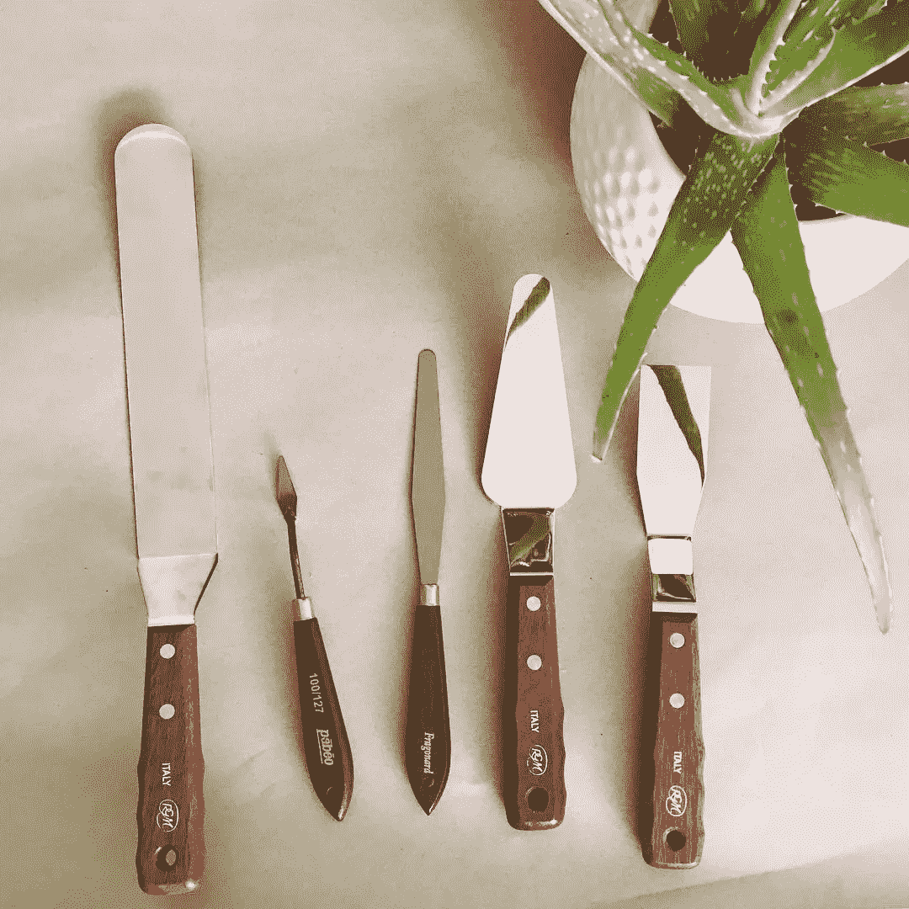
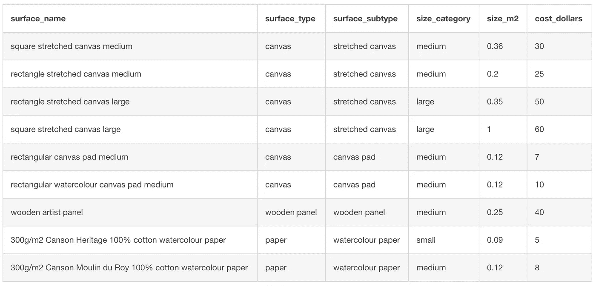
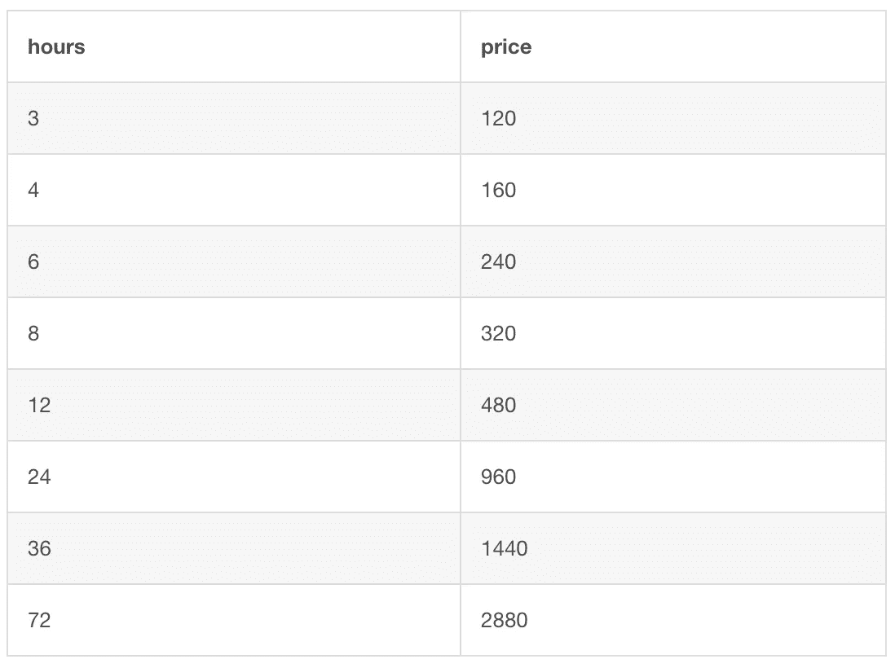

# 面向初学者的 SQL

> 原文：<https://towardsdatascience.com/sql-for-beginners-c60ea8bbe170?source=collection_archive---------43----------------------->

## [在保持社交距离的同时学习数据科学](https://towardsdatascience.com/tagged/ldswsd)

## 让我们回顾一下 SQL，让它真正扎根于你的大脑


我的数据例子都是关于我的艺术品定价

# 介绍

在过去的五周里，我一直在 Medium 上发布 SQL 课程。我的几个朋友表达了在社交距离中学习数据科学的兴趣，所以我认为帮助他们会很有趣。我认为从学习 SQL 开始是一个好主意，因为这是我希望在我接受培训成为数据科学家时就已经学会的一件事。

这是一个很好的起点，因为你首先需要能够访问数据，以便能够分析它。SQL 也是一种非常简单的逻辑编程语言，所以我认为它是对数据科学世界的一个很好的渐进介绍。

我希望我的课程平易近人，这样人们入门的门槛就低了。这也是为什么我让我的例子变得有趣和有点傻的原因。在这个多灾多难的疫情时代，你不能把生活看得太严肃。

# 前一课

上周我们上了最后一课，介绍了一个新的 SQL 概念。我们学习了如何组合桌子。使用 UNION 和 UNION ALL 关键字，我们将数据集堆叠在一起。此外，我们还学习了使用内连接、左外连接和右外连接来根据匹配值组合表。

# 这一课

本周是复习周。我想回顾一下我们到目前为止学到的关键概念，让它们真正留在我们的脑海中。我想传达一个新概念，但它是我们在关于创建新表的[第一课](/learn-data-science-while-practicing-social-distancing-lesson-1-making-a-table-using-sql-13fb9678282b)中所讲内容的延伸。

希望到现在为止，你能够在你感兴趣的数据科学问题上更加独立地工作。因此，在学习了如何创建一个新表来保存选定的数据之后，我将设置练习。然后在那之后，我会经历我将如何完成它们。这样，万一你遇到困难，你就有了一个可以参考的例子。

# 主要学习内容

*   复习创建表格
*   查看使用 SELECT 和 SELECT DISTINCT 关键字从表中选择数据
*   使用 WHERE 关键字查看过滤数据
*   使用 GROUP BY 关键字查看基于列值的分组数据
*   使用关键字最小值、最大值、计数、AVG 和总和查看汇总数据
*   通过使用关键字 UNION 和 UNION ALL 堆叠数据集，或者使用关键字 INNER JOIN、LEFT OUTER JOIN 和 RIGHT OUTER JOIN 基于匹配值来查看数据集的组合
*   学习从选定的数据创建新的表格

# 使用选定数据创建新表的语法

在第 1 课中，我们已经学习了如何创建一个表格并用数据填充它。但是，除了写出每个单独的值之外，还有其他方法可以用数据填充新表。

另一种方法是从现有表中选择数据，并将其存储在新表中。它们的语法非常简单。我们只需要添加一个 CREATE TABLE 语句，然后使用 AS 将 select 语句返回的数据分配给我们创建的新表。你可以在下面看到如何做:

```
CREATE TABLE name_of_new_table
AS
SELECT 
    name_column_one, 
    name_column_five
FROM
    name_of_existing_table
WHERE
    name_column_three = value
;
```

# 复习练习:

**练习 1:** 创建至少两个表格，并用数据填充它们。数据可以是你自己选择的，但是每个表格至少应该有 3 列和 5 行。确保您的表中至少包含 3 种不同的数据类型。数据可以是真实的，也可以是编造的，由你决定。

**练习 2** :编写一个查询来过滤每个表。试着对每一个问题使用不同的方法。请记住，您可以使用关键字 BETWEEN、LIKE、AND、OR、NOT 等。

**练习 3:** 编写一个查询来对每个表进行分组和聚合。如果有意义的话，尝试在每种情况下使用不同的聚合器。

**练习 4:** 编写一个查询，将两个表组合在一起，并解释为什么选择以这种方式组合它们。

**练习 5:** 写出一个你可能想问你的数据的问题。然后编写一个或多个查询来尽可能回答这个问题。在回答您的问题时，使用我们的新语法将选定的数据保存到新表中至少一次。

确保你解释了你为什么那样回答你的问题。

**提示**:新建表格时，数据不会自动显示。如果您想查看数据，那么您需要从您创建的新表中选择数据。

# 我的解决方案:

## 数据

作为练习，我将创建两个我自己的数据集，在我作为视觉艺术家的其他工作中会派上用场。这些表格将包含我可以用来给我的艺术品定价的信息。需要注意的是，所有的价格都是估算出来的。主要是因为我不记得我以什么价格买了所有的东西😜

一个表格将详细列出我使用的不同材料和我的估计价格。另一个表将包含我的表面选项。第三个表包含关于我的时间收费的信息。



我绘画时使用的一些工具

如果你有兴趣看看我的作品，你可以在这里找到它[www.katemarielewis.com](http://www.katemarielewis.com)。

## 练习 1 答案:

我去了 https://www.db-fiddle.com/。在左边的列中，我将 CREATE TABLE 和 INSERT 放入查询中。

```
CREATE TABLE art_materials(
    material_name varchar(255),
    material_type varchar(255),
    material_subtype varchar(255),
    cost float
);INSERT INTO art_materials(
    material_name,
    material_type,
    material_subtype,
    cost
)
VALUES
    ('golden acrylic paint', 'paint', 'acrylic', 0.5),
    ('schmincke horadam watercolour paint', 'paint', 'watercolour', 0.2),
    ('resin', 'other', 'epoxy resin', 1)
; CREATE TABLE art_surfaces(
    surface_name varchar(255),
    surface_type varchar(255),
    surface_subtype varchar(255),
    size_category varchar(255),
    size_m2 float,
    cost_dollars int(255)
);INSERT INTO art_surfaces(
    surface_name,
    surface_type,
    surface_subtype,
    size_category,
    size_m2,
    cost_dollars
)
VALUES
    ('square stretched canvas medium', 'canvas', 'stretched canvas', 'medium', 0.36, 30),
    ('rectangle stretched canvas medium', 'canvas', 'stretched canvas', 'medium', 0.2, 25),
    ('rectangle stretched canvas large', 'canvas', 'stretched canvas', 'large', 0.35, 50),
    ('square stretched canvas large', 'canvas', 'stretched canvas', 'large', 1, 60),
    ('rectangular canvas pad medium', 'canvas', 'canvas pad', 'medium', 0.12, 7),
    ('rectangular watercolour canvas pad medium', 'canvas', 'canvas pad', 'medium', 0.12, 10),
    ('wooden artist panel', 'wooden panel', 'wooden panel', 'medium', 0.25, 40),
    ('300g/m2 Canson Heritage 100% cotton watercolour paper', 'paper', 'watercolour paper', 'small', 0.09, 5),
    ('300g/m2 Canson Moulin du Roy 100% cotton watercolour paper', 'paper', 'watercolour paper', 'medium', 0.12, 8)
; CREATE TABLE artist_time(
    hours int(255),
    price int
);INSERT INTO artist_time(
    hours,
    price
)
VALUES
    (3, 120),
    (4, 160),
    (6, 240),
    (8, 320),
    (12, 480),
    (24, 960),
    (36, 1440),
    (72, 2880)
;
```

然后我点击了“运行”按钮。

当我从每个表中选择所有数据时，我得到了以下结果:


艺术 _ 材料表



艺术 _ 表面表



艺术家 _ 时间表

## 练习 2 答案:

为了过滤我的表，我使用了以下查询:

```
SELECT
    material_name
FROM
    art_materials
WHERE 
    material_type != 'paint'
;SELECT DISTINCT 
    surface_subtype
FROM
    art_surfaces
WHERE 
    surface_type LIKE '%vas'
;SELECT DISTINCT 
    price
FROM
    artist_time
WHERE 
    hours BETWEEN 6 AND 24
;
```

## 练习 3 答案:

为了对我的表进行分组和聚合，我使用了以下查询:

```
SELECT
    material_type, 
    AVG(cost) AS 'mean_material_cost'
FROM
    art_materials
GROUP BY 
    material_type
;SELECT
    size_category, 
    COUNT(surface_name) AS 'number_of_different_surfaces'
FROM
    art_surfaces
GROUP BY 
    size_category
;SELECT DISTINCT
    price/hours AS 'price_per_hour'
FROM
    artist_time
;
```

**注意:**第三个表 artist_time 对 group 没有意义，因为在任一列中都没有重复的值。

## 练习 4 答案:

为了合并我的表，我使用了以下查询:

```
SELECT
        material_name AS 'name',
        material_type AS 'type', 
        material_subtype AS 'subtype'
    FROM
        art_materials
UNION
    SELECT
        surface_name AS 'name',
        surface_type AS 'type', 
        surface_subtype AS 'subtype'
    FROM
        art_surfaces
;
```

我选择使用关键字 UNION 将 art_materials 和 art_surfaces 表组合在一起，因为它们有三个相似的列，可以相互堆叠。通过将它们结合起来，结果显示了在创作我的作品时所有可能不同的材料成本。

## 练习 5 答案:

**问题:**一位客户找到我，让我在一张拉伸的画布上创作一幅中等尺寸的丙烯画。如果我估计我要花 8 个小时来绘画，这幅画要花客户多少钱？

**注意:**我不知道客户想要什么形状的画布，所以我将采用两种形状选项的平均成本。

以下是查找答案并将其存储在表中的查询:

```
CREATE TABLE materials_cost
AS
SELECT
    cost AS 'paint_cost'
FROM
    art_materials
WHERE 
    material_type = 'paint'
AND
    material_subtype = 'acrylic'
; CREATE TABLE surface_cost
AS
SELECT
    AVG(cost_dollars) AS 'surface_cost_estimate',
    AVG(size_m2) AS 'size_estimate_m2'
FROM
    art_surfaces
WHERE 
    size_category = 'medium'
AND
    surface_type = 'canvas'
AND
    surface_subtype = 'stretched canvas'
; CREATE TABLE time_cost
AS
SELECT 
    price as 'artist_time_cost'
FROM
    artist_time
WHERE
    hours = 8
;SELECT 
    (SELECT 
         artist_time_cost 
     FROM 
         time_cost)+
    (SELECT 
         surface_cost_estimate 
     FROM 
         surface_cost)+
    ((SELECT 
         paint_cost 
     FROM 
         materials_cost)*
     (SELECT
         size_estimate_m2*100
      FROM
         surface_cost))
;
```

**注意:**在我的最终查询中，我在 select 语句中使用了几个子查询，以便能够从我创建的每个新表中选择一个数据点。

为了给客户找到正确的报价，我需要考虑所用的材料，在中等拉伸画布的平均面积上。我还添加了拉伸画布的平均价格。我添加到报价中的最终成本是我估计持续时间为 8 小时的时间价格。

我从每个原始数据集中创建了一个单独的过滤表，以便为最终方程进行选择。

# 学习回顾

学完本课后，您应该能够:

*   独立创建表格
*   使用 select 和 SELECT DISTINCT 关键字从表中选择数据
*   使用 WHERE 关键字过滤数据
*   使用 GROUP BY 关键字根据列值对数据进行分组
*   使用关键字 MIN、MAX、COUNT、AVG 和 SUM 聚合数据
*   通过使用关键字 UNION 和 UNION ALL 堆叠数据集，或者使用关键字 INNER JOIN、LEFT OUTER JOIN 和 RIGHT OUTER JOIN 基于匹配值组合数据集
*   从所选数据创建新表

# 下一课

我认为这次审查可能会比以前的审查花费更多的时间。与前几周相比，本周的练习有所增加。所以下周的课更多的是理论课，而不是实践课。在下一课中，我将讲述一些我在解决任何数据科学问题之前思考的事情。

除了数据，我的另一个爱好是绘画。你可以在 www.katemarielewis.com 找到我的野生动物艺术

# 社交距离学习数据科学(LDSWSD)系列中的所有课程

[](https://towardsdatascience.com/tagged/ldswsd) [## Ldswsd -走向数据科学

### 阅读《走向数据科学》中关于 Ldswsd 的文章。共享概念、想法和代码的媒体出版物。

towardsdatascience.com](https://towardsdatascience.com/tagged/ldswsd)