# SQL HackerRank 解决方案

> 原文：<https://towardsdatascience.com/sql-hackerrank-solutions-516666f9eb8c?source=collection_archive---------0----------------------->

## HackerRank 上 SQL 问题的完整解决方案。


照片由 [Grzegorz Walczak](https://unsplash.com/@grzegorzwalczak?utm_source=medium&utm_medium=referral) 在 [Unsplash](https://unsplash.com?utm_source=medium&utm_medium=referral) 上拍摄

**结构化查询语言**是业界使用的最重要的语言之一。随着数据量的增加，这是最受雇主欢迎的语言之一，为了从各自的数据库中访问海量数据，了解这一技能很重要，它将帮助你**检索、更新和操作数据**。

在本帖中，我们将介绍 HackerRank 平台上的所有 **SQL 解决方案。 [**HackerRank**](http://hackerrank.com) 是一个竞技编码的平台。很重要的一点是，你们都要先试一试&在看解决方案之前，集思广益。让我们编码并找到给定问题的答案。**

[吉菲](https://giphy.com/gifs/programmer-p4NLw3I4U0idi)

**I .**修改选择查询 1

查询**城市**中人口大于`100000`的所有美国城市的所有列。美国的国家代码是`USA`。

**输入格式**

**城市**表描述如下:


```
**SELECT * FROM CITY WHERE COUNTRYCODE = ‘USA’ AND POPULATION > 100000;**
```

**二。** **修改选择查询 2**

在**城市**中查询所有人口大于`120000`的美国城市名称。美国的国家代码是`USA`。

**输入格式**

**城市**表描述如下:

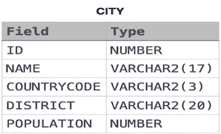

```
**SELECT NAME FROM CITY WHERE COUNTRYCODE = ‘USA’ AND POPULATION > 120000;**
```

**三世。** **全选**

查询**城市**表中每行的所有列(属性)。

**输入格式**

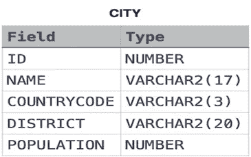

```
**SELECT * FROM CITY;**
```

**四。** **按 ID 选择**

查询**城市**中 ID 为*`1661`的城市的所有列。*

***输入格式***

*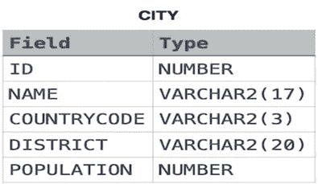*

```
***SELECT * FROM CITY WHERE ID = 1661;***
```

***五、** **日本城市的属性***

*查询**城市**表中每个日本城市的所有属性。日本的*国家代码*是`JPN`。*

***输入格式***

**

```
***SELECT * FROM CITY WHERE COUNTRYCODE = ‘JPN’;***
```

***六。** **日本城市名称***

*查询**城市**表中所有日本城市的名称。日本的国家代码是`JPN`。*

***输入格式***

**

```
***SELECT NAME FROM CITY WHERE COUNTRYCODE = ‘JPN’;***
```

***七。** **气象观测站 1***

*从**站**表中查询*城市*和*州*列表。*

***输入格式***

***工位**表描述如下:*

*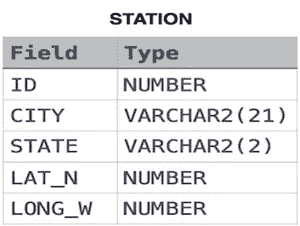*

*其中 *LAT_N* 为北纬 *LONG_W* 为西经。*

```
***SELECT CITY, STATE FROM STATION;***
```

***八世。** **气象观测站 3***

*从**站**查询*城市*名称列表，只有偶数 *ID* 编号。您可以按任何顺序打印结果，但必须排除重复的答案。*

***输入格式***

***工位**工作台描述如下:*

**

*其中 *LAT_N* 为北纬 *LONG_W* 为西经。*

```
***SELECT DISTINCT CITY FROM STATION WHERE MOD(ID, 2) = 0;***
```

***九。** **气象观测站 4***

*设 **N** 为**站**的*城市*条目数，设**N’**为**站**的*城市*名称数；从**站**查询**N-N’**的值。换句话说，找出表中*城市*条目总数与表中不同*城市*条目数之间的差异。*

***输入格式***

***工位**工作台描述如下:*

*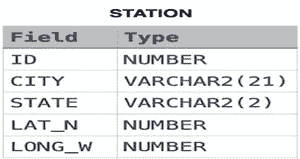*

*其中 *LAT_N* 为北纬 *LONG_W* 为西经。*

```
***SELECT COUNT(CITY) — COUNT(DISTINCT CITY) FROM STATION ;***
```

***x .**气象观测站 5*

*查询**站**中两个*城市*名称最短和最长的城市，以及各自的长度(即:名称中的字符数)。如果有多个最小或最大的城市，请选择按字母顺序排列的第一个。*

***输入格式***

***工位**工作台描述如下:*

*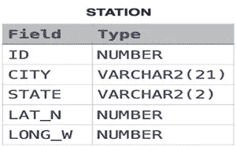*

*其中 *LAT_N* 为北纬 *LONG_W* 为西经。*

```
***SELECT * FROM (SELECT DISTINCT city, LENGTH(city) FROM station ORDER BY LENGTH(city) ASC, city ASC) WHERE ROWNUM = 1** **UNION****SELECT * FROM (SELECT DISTINCT city, LENGTH(city) FROM station ORDER BY LENGTH(city) DESC, city ASC) WHERE ROWNUM = 1;***
```

***XI。** **气象观测站 6***

*从**站**查询以元音开头的*城市*名称列表(即`a`、`e`、`i`、`o`或`u`)。您的结果*不能*包含重复项。*

***输入格式***

***站**表描述如下:*

*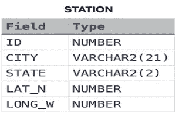*

*其中 *LAT_N* 为北纬 *LONG_W* 为西经。*

```
***SELECT DISTINCT city FROM station WHERE city LIKE ‘A%’ OR city LIKE ‘E%’ OR city LIKE ‘I%’ OR city LIKE ‘O%’ OR city LIKE ‘U%’;***
```

***十二。** **气象观测站 7***

*从**站**查询以元音字母(a，e，I，o，u)结尾的*城市*名称列表。您的结果*不能*包含重复项。*

***输入格式***

***工位**工作台描述如下:*

*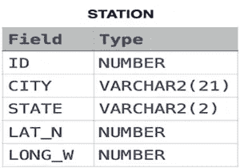*

*其中 *LAT_N* 为北纬 *LONG_W* 为西经。*

```
***SELECT DISTINCT city FROM station WHERE city LIKE ‘%a’ OR city LIKE ‘%e’ OR city LIKE ‘%i’ OR city LIKE ‘%o’ OR city LIKE ‘%u’;***
```

***十三。** **气象观测站 8***

*从**站**查询以元音字母(即 *a* 、 *e* 、 *i* 、 *o* 、 *u* )作为开头*和结尾*的*城市*名称列表。您的结果不能包含重复项。*

***输入格式***

***工位**工作台描述如下:*

**

*其中 *LAT_N* 为北纬 *LONG_W* 为西经。*

```
***SELECT DISTINCT city FROM (SELECT DISTINCT city FROM station WHERE city LIKE ‘A%’ OR city LIKE ‘E%’ OR city LIKE ‘I%’ OR city LIKE ‘O%’ OR city LIKE ‘U%’) WHERE city LIKE ‘%a’ OR city LIKE ‘%e’ OR city LIKE ‘%i’ OR city LIKE ‘%o’ OR city LIKE ‘%u’;***
```

***十四。**9**气象观测站***

*从**站**查询*城市*名称列表，其中*不以元音字母*开头。您的结果不能包含重复项。*

***输入格式***

***工位**工作台描述如下:*

**

*其中 *LAT_N* 为北纬 *LONG_W* 为西经。*

```
***SELECT DISTINCT city FROM station WHERE NOT (city LIKE ‘A%’ OR city LIKE ‘E%’ OR city LIKE ‘I%’ OR city LIKE ‘O%’ OR city LIKE ‘U%’);***
```

***十五。** **气象观测站 10***

*从**站**查询*不以元音字母*结尾的*城市*名称列表。您的结果不能包含重复项。*

***输入格式***

***站**表描述如下:*

*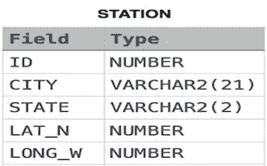*

*其中 *LAT_N* 为北纬 *LONG_W* 为西经。*

```
***SELECT DISTINCT city FROM station WHERE NOT (city LIKE ‘%a’ OR city LIKE ‘%e’ OR city LIKE ‘%i’ OR city LIKE ‘%o’ OR city LIKE ‘%u’);***
```

***十六。** **气象观测站 11***

*从**站**查询不是以元音开头就是不以元音结尾的*城市*名称列表。您的结果不能包含重复项。*

***输入格式***

***工位**表描述如下:*

*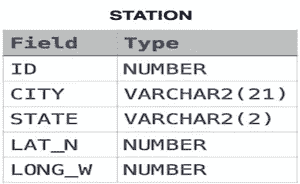*

*其中 *LAT_N* 为北纬 *LONG_W* 为西经。*

```
***SELECT DISTINCT city FROM station WHERE****(NOT (city LIKE ‘A%’ OR city LIKE ‘E%’ OR city LIKE ‘I%’ OR city LIKE ‘O%’ OR city LIKE ‘U%’)****OR NOT(city LIKE ‘%a’ OR city LIKE ‘%e’ OR city LIKE ‘%i’ OR city LIKE ‘%o’ OR city LIKE ‘%u’));***
```

***十七。** **气象观测站 12***

*从**站**查询*不以元音字母*开头、*不以元音字母*结尾的*城市*名称列表。您的结果不能包含重复项。*

***输入格式***

***工位**工作台描述如下:*

**

*其中 *LAT_N* 为北纬 *LONG_W* 为西经。*

```
***SELECT DISTINCT city FROM station WHERE NOT****((city LIKE ‘A%’ OR city LIKE ‘E%’ OR city LIKE ‘I%’ OR city LIKE ‘O%’ OR city LIKE ‘U%’)****OR (city LIKE ‘%a’ OR city LIKE ‘%e’ OR city LIKE ‘%i’ OR city LIKE ‘%o’ OR city LIKE ‘%u’));***
```

***十八。** **高于 75 分***

*查询**学生**中任何分数高于*分数*的学生的*姓名*。根据每个名称的最后三个字符*对输出进行排序。如果两个或更多学生的名字都以相同的最后三个字符结尾(例如:Bobby、Robby 等。)，通过升序 *ID* 对它们进行二次排序。**

***输入格式***

***学生**表描述如下:*

*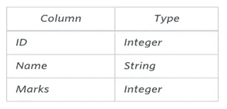*

**名称*列只包含大写(`A` - `Z`)和小写(`a` - `z`)字母。*

```
***SELECT name FROM students WHERE marks > 75 ORDER BY SUBSTR(name, LENGTH(name)-2, 3), id;***
```

***XIX。** **员工姓名***

*编写一个查询，按字母顺序打印来自**雇员**表的雇员姓名列表(即:*姓名*属性)。*

***输入格式***

*包含公司员工数据的**员工**表描述如下:*

*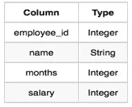*

*其中 *employee_id* 是员工的身份证号码，*姓名*是他们的姓名，*月数*是他们为公司工作的总月数，*工资*是他们的月工资。*

```
***SELECT name FROM employee ORDER BY name;***
```

***XX。** **员工属性***

*编写一个查询，打印**雇员**中月薪高于月工资且任职不到个月的雇员的姓名列表(即:*姓名*属性)。按照升序*雇员 id* 对您的结果进行排序。*

***输入格式***

*包含公司员工数据的**员工**表描述如下:*

**

*其中 *employee_id* 是员工的身份证号，*姓名*是他们的姓名，*月数*是他们为公司工作的总月数，*薪水*是他们的月薪。*

```
***SELECT name FROM employee WHERE salary > 2000 AND months < 10 ORDER BY employee_id;***
```

***二十一。** **三角形的类型***

*使用三条边的长度编写一个查询，标识**三角形**表中每条记录的*类型*。为表中的每条记录输出以下语句之一:*

*等边三角形:它是一个三条边等长的三角形。*

***等腰**:是两条边等长的三角形。*

*不规则三角形:它是一个有三条不同长度的边的三角形。*

***不是三角形**:给定值 *A* 、 *B* 、 *C* 不构成三角形。*

***输入格式***

***三角形**表描述如下:*

*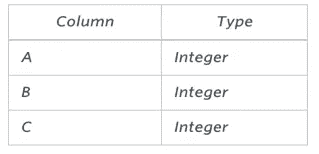*

*表格中的每一行表示三角形三条边的长度。*

```
***select if(A+B<=C or B+C<=A or A+C<=B,’Not A Triangle’,****if(A=B and B=C,’Equilateral’,****if(A=B or B=C or A=C,’Isosceles’,’Scalene’)))****from TRIANGLES as T;****VII.** **The PADS***
```

***XXII。** **护垫***

*生成以下两个结果集:*

*查询一个*按字母顺序排列的*列表，列出**职业**中的所有名字，紧接着每个职业的第一个字母作为括号(即:括在括号中)。例如:AnActorName(A)、ADoctorName(D)、aprofsorname(P)和 ASingerName(S)。*

*查询**职业**中每个职业出现的次数。按照*升序*对事件进行排序，并按照以下格式输出:*

*总共有[occupation _ count][occupation]个。*

*其中[occupation_count]是职业在**职业**中出现的次数，[occupation]是*小写*职业名称。如果多个*职业*具有相同的【occupation_count】，则应按字母顺序排列。*

***注:**表格中每种职业至少有两个条目。*

***输入格式***

***职业**表描述如下:*

*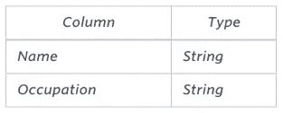*

**职业*只会包含以下值之一:**医生**、**教授**、**歌手、**或**演员**。*

```
***SELECT concat(NAME,concat(“(“,concat(substr(OCCUPATION,1,1),”)”))) FROM OCCUPATIONS ORDER BY NAME ASC;****SELECT “There are a total of “, count(OCCUPATION), concat(lower(occupation),”s.”) FROM OCCUPATIONS GROUP BY OCCUPATION ORDER BY count(OCCUPATION), OCCUPATION ASC***
```

***二十三。** **职业***

*旋转****职业**中的*职业*栏，使每个*姓名*按字母顺序排序，并显示在其对应的*职业*下方。输出的列头应该分别是*医生*、*教授*、*歌手*、*演员*。***

*****注意:**打印 **NULL** 当没有更多的名字对应一个职业时。***

*****输入格式*****

*****职业**表描述如下:***

***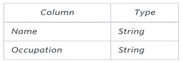***

****职业*只会包含以下值之一:**医生**、**教授**、**歌手、**或**演员**。***

```
*****set @r1=0, @r2=0, @r3=0, @r4=0;****select min(Doctor), min(Professor), min(Singer), min(Actor)****from(select case when Occupation=’Doctor’ then (@r1:=@r1+1) when Occupation=’Professor’ then (@r2:=@r2+1) when Occupation=’Singer’ then (@r3:=@r3+1) when Occupation=’Actor’ then (@r4:=@r4+1) end as RowNumber,****case when Occupation=’Doctor’ then Name end as Doctor,****case when Occupation=’Professor’ then Name end as Professor,****case when Occupation=’Singer’ then Name end as Singer,****case when Occupation=’Actor’ then Name end as Acto from OCCUPATIONS order by Name****) Temp group by RowNumber;*****
```

*****二十四。** **二叉树节点*****

***给你一个表， *BST* ，包含两列: *N* 和 *P，*其中 *N* 表示*二叉树*中一个节点的值， *P* 是 *N* 的父节点。***

***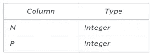***

***编写一个查询，查找按节点值排序的*二叉树*的节点类型。为每个节点输出以下内容之一:***

****根*:如果节点是根节点。***

****叶*:如果节点是叶节点。***

****内部*:如果节点既不是根节点也不是叶节点。***

```
*****SELECT N, IF(P IS NULL,’Root’,IF((SELECT COUNT(*) FROM BST WHERE P=B.N)>0,’Inner’,’Leaf’)) FROM BST AS B ORDER BY N;*****
```

*****XXV。** **新公司*****

***Amber 的集团公司刚刚收购了一些新公司。每家公司都遵循以下层级结构:***

******

***给定下面的表模式，编写一个查询来打印*公司代码*、*创始人*姓名、*主管*经理总数、*高级*经理总数、*经理总数*和*雇员总数*。通过升序 *company_code* 对您的输出进行排序。***

*****注:*****

***这些表可能包含重复的记录。***

****company_code* 是字符串，所以排序不应该是**数字**。例如，如果*公司 _ 编码*为*C1*、*C2*、*C10*，那么*公司 _ 编码*的升序将为*C1*、*C10*和*C2*。***

*****输入格式*****

***下表包含公司数据:***

****公司:**公司 _ 代码*是公司的代码，*创始人*是公司的创始人。***

***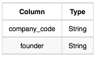***

****Lead _ Manager:**Lead _ Manager _ code*是主管的代码， *company_code* 是工作单位的代码。***

***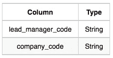***

****高级经理:**高级经理代码*是高级经理的代码，*主管经理代码*是其主管经理的代码，*公司代码*是工作单位的代码。***

***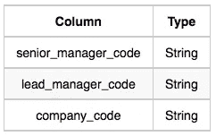***

****经理:**经理 _ 代码*是经理的代码，*高级 _ 经理 _ 代码*是其高级经理的代码，*主管 _ 经理 _ 代码*是其主管经理的代码，*公司 _ 代码*是工作单位的代码。***

***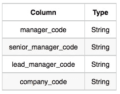***

****员工:**员工 _ 代码*是员工的代码，*经理 _ 代码*是其经理的代码，*高级 _ 经理 _ 代码*是其高级经理的代码，*主管 _ 经理 _ 代码*是其主管经理的代码，*公司 _ 代码*是工作单位的代码。***

***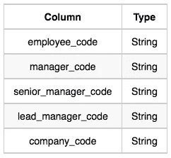***

```
*****select c.company_code, c.founder, count(distinct lm.lead_manager_code), count(distinct sm.senior_manager_code), count(distinct m.manager_code), count(distinct e.employee_code) from Company c, Lead_Manager lm, Senior_Manager sm, Manager m, Employee e****where c.company_code = lm.company_code and lm.lead_manager_code = sm.lead_manager_code and sm.senior_manager_code = m.senior_manager_code and m.manager_code = e.manager_code group by c.company_code, c.founder****order by c.company_code*****
```

*****XXVI。** **画三角形 2*****

****P(R)* 代表 Julia 在 *R* 行中绘制的图案。以下图案代表 *P(5)* :***

***`*`***

***`* *`***

***`* * *`***

***`* * * *`***

***`* * * * *`***

***编写一个查询来打印模式 *P(20)* 。***

```
*****set @row := 0;****select repeat(‘* ‘, @row := @row + 1) from information_schema.tables where @row < 20*****
```

***毛罗·加蒂在 [GIPHY](https://giphy.com/gifs/3oEdva9BUHPIs2SkGk) 上的 GIF***