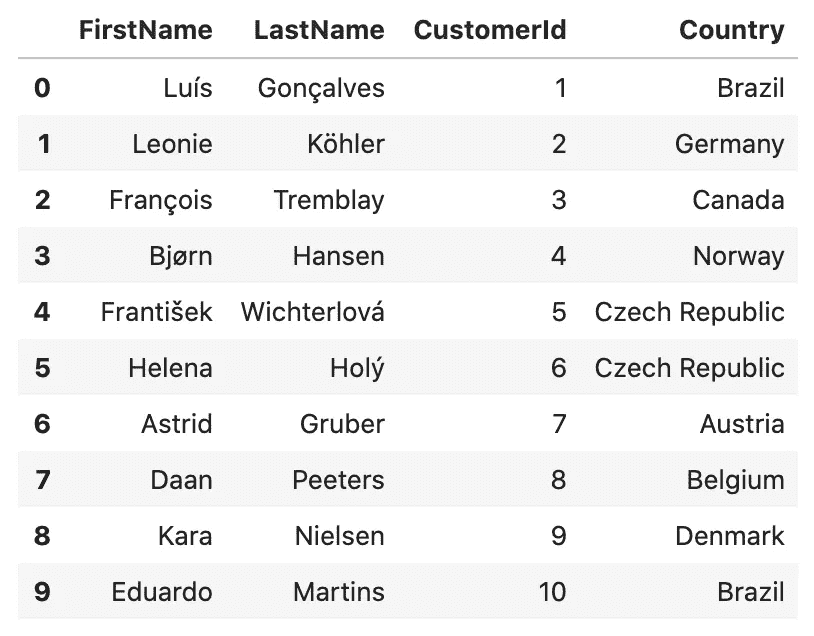

# 数据科学中的 SQL

> 原文：<https://towardsdatascience.com/sql-in-data-science-af0b4492bcd?source=collection_archive---------37----------------------->

## 使用 SQLite 和 Chinook 数据库的 SQL 教程


卡斯帕·卡米尔·鲁宾在 [Unsplash](https://unsplash.com/s/photos/query?utm_source=unsplash&utm_medium=referral&utm_content=creditCopyText) 上的照片

这篇文章将作为使用 SQL(结构化查询语言)查询数据的教程。出于本教程的目的，我将使用 SQLite3 库，它提供了一个关系数据库管理系统。例如，我将使用 Chinook 数据库，这是一个表示数字媒体商店的示例数据库，包括艺术家、专辑等的表。更多细节，请看文档 [*这里*](https://github.com/lerocha/chinook-database) 。

今天，SQL 是处理和查询数据的标准。一个重要的好处是 SQL 允许用户快速有效地从关系数据库中输入和检索信息。关系数据库是一种存储和访问彼此相关的数据点的数据库 *(Oracle，*)T5 什么是关系数据库？)，把这个想象成一个有列和行的 excel 电子表格。它们可以由一个或多个这样的表组成，每一行由一个唯一的键(主键)标识。这些数据库对象的集合被称为模式。模式是一种有用的机制，可以为不同的应用程序、访问权限和管理数据库的安全管理隔离数据库对象 *(Rajendra GuptaRajendra，2019)* 。使用 SQL 时，我最喜欢的一个优点是能够只检索特定于任务的数据。通常，我使用 Pandas 库进行大部分数据操作和分析。然而，当试图用多个条件来划分数据帧的子集时，语法变得相当复杂。使用 SQL 语句，如`SELECT`、`DISTINCT`和`LIKE`，我们可以通过只检索服务于我们目标的数据来节省计算时间。下图是关系数据库模式的一个示例。每个矩形都是一个表格，表格名称列在顶部。在每个表名的下面是与每个表相关联的列名列表。带有星号(*)的列名(在本例中为金键)表示它是表的**主键**(唯一标识符)。如您所见，一个表中的主键也可能在另一个表中。这就是所谓的**外键**(来自不同表的主键)，在本例中为蓝色菱形。


图片来自 [pixabay](https://pixabay.com/vectors/database-schema-data-tables-schema-1895779/) 的[麦克默里朱莉](https://pixabay.com/users/mcmurryjulie-2375405/?tab=about)

SQLite 库有一个非常有效的关系数据库管理系统(RDBMS)。SQLite3 为用户提供了许多有益的特性，最引人注目的是它是自包含的、无服务器的、零配置的(*什么是 SQLite？你应该知道的 SQLite 顶级特性* 2020)。

## SQLite3 在运行

对于本教程，我将安装并加载必要的库，连接到数据库，然后开始发送查询。下面使用的几个例子摘自[*Lucas MCL/15-SQL _ queries _ 02-chinook*](https://github.com/LucasMcL/15-sql_queries_02-chinook)。如果您使用的是 Python 版本 3，则可能不需要安装。

*   安装 SQLite3
*   导入 SQLite3

```
pip install pysqlite3import sqlite3
```

*   连接到数据库

```
conn = sqlite3.connect('data/Chinook_Sqlite.sqlite')
```

*   实例化游标对象以获取查询结果

```
cur = conn.cursor()
```

现在我们已经连接到数据库，我们可以查询其中的数据。使用 cursor 对象执行查询只会返回 cursor 对象。为了看到结果，我们需要在事后使用`fetchall()`方法。

*   使用`SELECT`语句和`WHERE`子句执行查询，查看数据库中有多少个表。`WHERE`子句通常根据某种条件过滤查询结果。在下面的例子中，我用它来返回数据库中类型为“table”的对象的名称。每个 SQLite 数据库都有一个包含模式信息的 sqlite_master 表。以分号结束查询表示语句结束。如果我们希望查询返回表中的所有记录，请使用星号(*)代替`name`。

```
cur.execute("SELECT name FROM sqlite_master WHERE type='table';")
print(cur.fetchall())**#Output:**
[('Album',), ('Artist',), ('Customer',), ('Employee',), ('Genre',), ('Invoice',), ('InvoiceLine',), ('MediaType',), ('Playlist',), ('PlaylistTrack',), ('Track',)]***The output of this query statement returned all of the tables in the database.***
```

假设我们想要关于数据库中每个表的更详细的信息，那么`PRAGMA`命令将会给我们提供这些信息。

```
cur.execute("PRAGMA table_info(Employee)")
info = cur.fetchall()
print(*info, sep = "\n")**#Output:**
(0, 'EmployeeId', 'INTEGER', 1, None, 1)
(1, 'LastName', 'NVARCHAR(20)', 1, None, 0)
(2, 'FirstName', 'NVARCHAR(20)', 1, None, 0)
(3, 'Title', 'NVARCHAR(30)', 0, None, 0)
(4, 'ReportsTo', 'INTEGER', 0, None, 0)
(5, 'BirthDate', 'DATETIME', 0, None, 0)
(6, 'HireDate', 'DATETIME', 0, None, 0)
(7, 'Address', 'NVARCHAR(70)', 0, None, 0)
(8, 'City', 'NVARCHAR(40)', 0, None, 0)
(9, 'State', 'NVARCHAR(40)', 0, None, 0)
(10, 'Country', 'NVARCHAR(40)', 0, None, 0)
(11, 'PostalCode', 'NVARCHAR(10)', 0, None, 0)
(12, 'Phone', 'NVARCHAR(24)', 0, None, 0)
(13, 'Fax', 'NVARCHAR(24)', 0, None, 0)
(14, 'Email', 'NVARCHAR(60)', 0, None, 0)***The output of this query statement returned the Employee table's Column ID, Column Name, Column Type, Not Null Values, Default Value, and Primary Key.***
```

如果您希望输出的格式能够操作或处理数据，那么使用 Pandas 将查询结果包装到 dataframe 中可以节省时间。 **cursor.description** 属性返回包含以下内容的列描述:

```
1\. name
2\. type_code
3\. display_size
4\. internal_size
5\. precision
6\. scale
7\. null_ok
```

使用 description 属性，我们可以使用 list comprehension 获取每一列的名称。下面是一个查询语句，选择不在美国的客户的全名、id 和国家，结果封装在一个数据帧中。

```
**#Importing Pandas**import pandas as pdcur.execute("""
    SELECT FirstName, LastName, CustomerId, Country
    FROM customer
    WHERE country != 'USA'
""")
df = pd.DataFrame(cur.fetchall())
df.columns = [x[0] for x in cur.description]
df.head(10)**#Output:**
```



## 使用 SQL 进行过滤和排序

回到 SQL 查询只允许您检索与您的任务相关的数据的地方。我将介绍一些查询修饰符，`ORDER BY`是第一个。这个修饰符允许我们按照特定的特性对`SELECT`语句的结果进行排序。

`LIMIT`子句就像它听起来的那样，它将输出限制为一定数量的结果。这类似于使用`df.head(10)`属性查看熊猫数据帧的输出。

`BETWEEN`运算符允许我们通过过滤设置值之间的结果来进一步选择特定数据。这在查询特定的年龄组、时间范围等时非常有用。

下面我将执行一个查询，从 track 表中选择数据，其中 track 的长度以毫秒为单位，介于 205205 和 300000 之间。结果按曲目的毫秒数降序排列，因此曲目较长的曲目将排在最前面。我还将这个查询限制为只输出 10 个结果。

```
cur.execute("""
    SELECT Name, AlbumId, TrackId, Milliseconds
    FROM track
    WHERE Milliseconds BETWEEN 205205 AND 300000
    ORDER BY Milliseconds Desc
    LIMIT 10
""")
info = cur.fetchall()
print(*info, sep = "\n")**#Output:** ('Breathe', 212, 2613, 299781)
('Queixa', 23, 524, 299676)
('Getaway Car', 10, 97, 299598)
('Winterlong', 201, 2485, 299389)
('Cherub Rock', 202, 2491, 299389)
('Sonata for Solo Violin: IV: Presto', 325, 3480, 299350)
('Linha Do Equador', 21, 218, 299337)
('Who Are You (Single Edit Version)', 221, 2749, 299232)
('Garden', 181, 2201, 299154)
('The Spirit Of Radio', 196, 2406, 299154)
```

## 聚合函数

这些 SQL 函数在执行统计分析时非常有用。我们可以得到一列中的平均值、最小值和最大值以及值的总和。`COUNT`函数返回满足特定条件的记录数。

`GROUP BY`函数将返回按设定列分组的结果。例如，按性别、品种或国籍对结果进行分组。

下面是每个国家总销售额的查询示例，结果按每个国家分组。我还将总和别名为“TotalSales ”,以便按每个国家的总销售额对结果进行分组。

```
cur.execute('''
    SELECT i.billingcountry, sum(total) as 'TotalSales'
    FROM invoice AS i
    GROUP BY billingcountry
    ORDER BY totalsales DESC
    '''
)

info = cur.fetchall()
print(*info, sep = "**\n**")**#Output:**
('USA', 523.0600000000003)
('Canada', 303.9599999999999)
('France', 195.09999999999994)
('Brazil', 190.09999999999997)
('Germany', 156.48)
('United Kingdom', 112.85999999999999)
('Czech Republic', 90.24000000000001)
('Portugal', 77.23999999999998)
('India', 75.25999999999999)
('Chile', 46.62)
('Ireland', 45.62)
('Hungary', 45.62)
('Austria', 42.62)
('Finland', 41.620000000000005)
('Netherlands', 40.62)
('Norway', 39.62)
('Sweden', 38.620000000000005)
('Poland', 37.620000000000005)
('Italy', 37.620000000000005)
('Denmark', 37.620000000000005)
('Australia', 37.620000000000005)
('Argentina', 37.620000000000005)
('Spain', 37.62)
('Belgium', 37.62)
```

如果您想进一步了解 SQL 聚合器和 select 语句，[**SQL clauses**](http://www.sqlclauses.com/sql+aggregate+functions)**和**[**zetcode**](http://zetcode.com/db/sqlite/select/)**提供了一些非常有用的示例。******

## ******结论******

******当在数据库中查找特定信息时，SQL 是一个非常有用的工具。我相信 SQL 和 Pandas 可以让你查询和操作数据到任何你需要的格式。本教程只是触及了使用 SQL 的可能性的表面。如果您正在寻找一些后续步骤，我建议您查看带有`USING`和`ON`语句的 join 语句。******

## ******参考资料:******

*   *******SQL:运算符中的&之间。(2018 年 3 月 21 日)。检索自*【https://www.geeksforgeeks.org/sql-between-in-operator/】******
*   ********(未注明)。检索自*[*https://www.sqlite.org/index.html*](https://www.sqlite.org/index.html)*******
*   ********LucasMcL。(未注明)。Lucas MCL/15-SQL _ queries _ 02-chinook。检索自*[](https://github.com/LucasMcL/15-sql_queries_02-chinook)*******
*   *********SQL 教程。(未注明)。检索自*[*https://www.tutorialspoint.com/sql/index.htm*](https://www.tutorialspoint.com/sql/index.htm)********