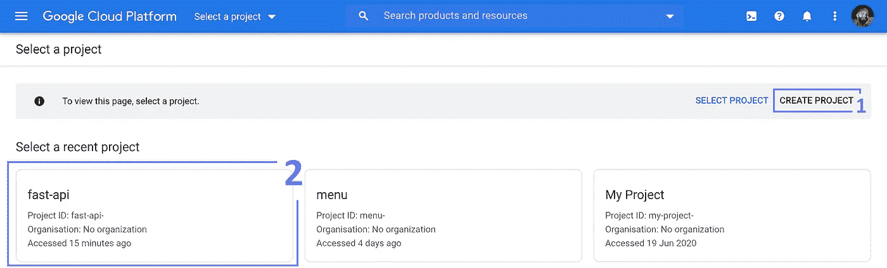
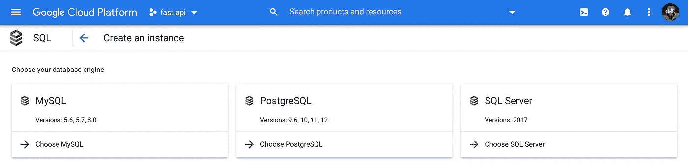
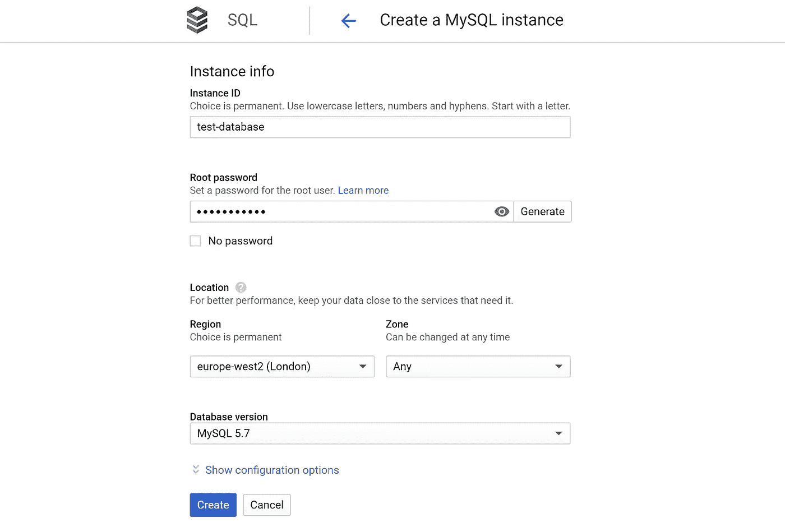
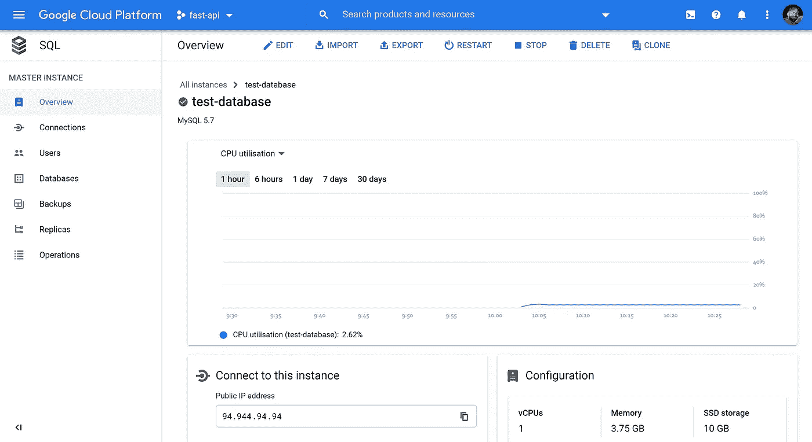
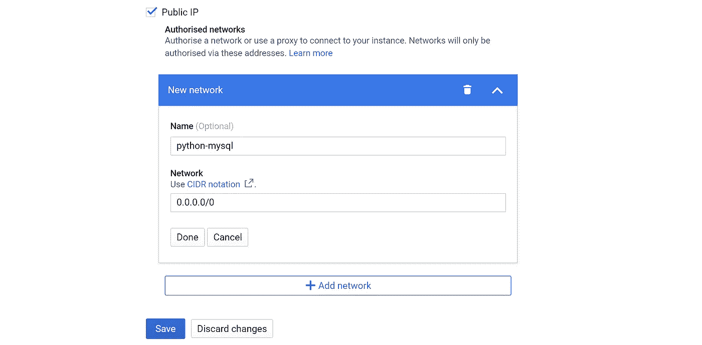
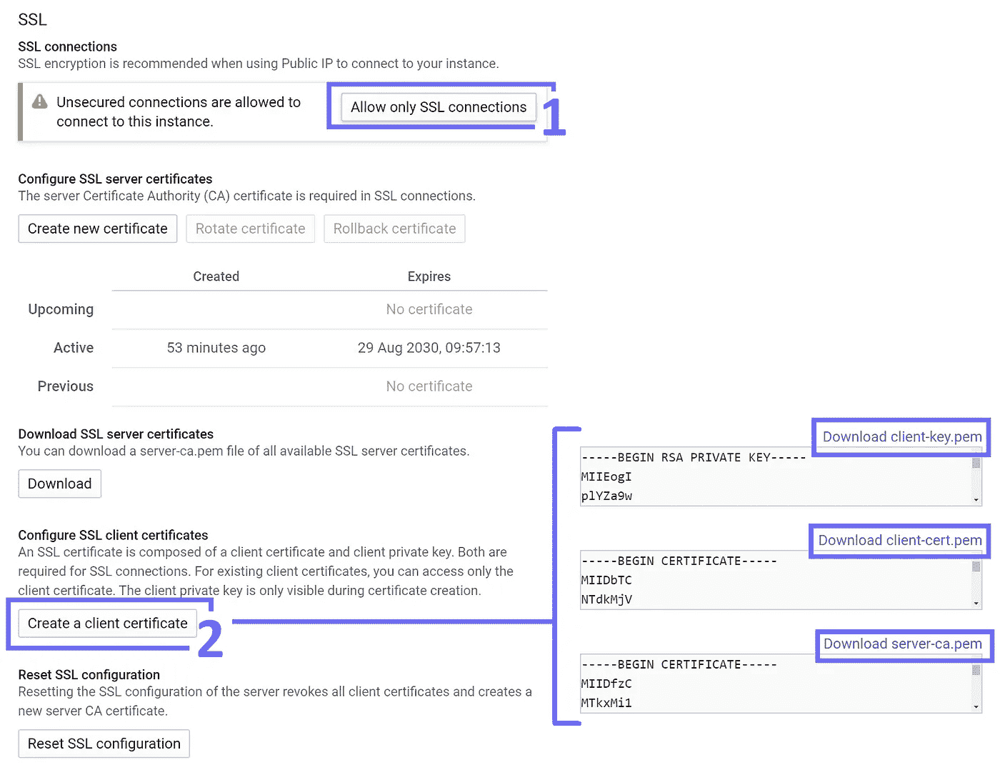
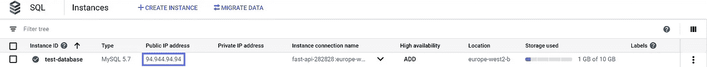
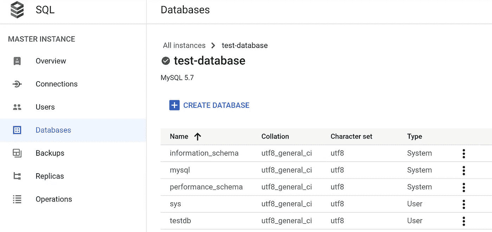
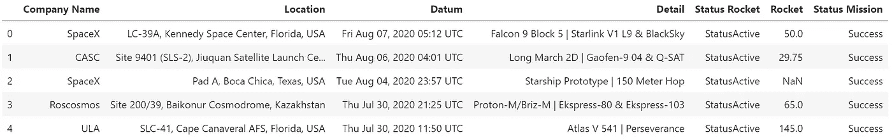
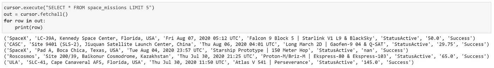

# 使用 Python 在云上运行 SQL

> 原文：<https://towardsdatascience.com/sql-on-the-cloud-with-python-c08a30807661?source=collection_archive---------4----------------------->

## Google 云和 Python 上的 SQL 简明指南


蒂姆·波格丹诺夫在 [Unsplash](https://unsplash.com?utm_source=medium&utm_medium=referral) 上的照片

如今，每个人和他们的狗都在使用云——而且理由充分。它把过去棘手的任务变得像从木头上掉下来一样简单。

在互联网上开发、配置和托管任何东西从来都不简单。现在，假设您需要担心每天都在发生的安全威胁、全球范围的延迟、基础架构扩展、服务中断等等。

但现在，我们可以拥有数据库、网络应用、物联网中心，以及比我煮咖啡还快得多的东西——这一切都要感谢云。

这些新的云服务能够在世界上几乎任何地方托管，具有顶级的安全性、自动扩展和 99.999%的可用性保证。云改变了技术。

我们将介绍使用谷歌云平台(GCP)建立 MySQL 数据库所需的步骤，以及如何使用 Python 查询该数据库。

# 创建云 SQL 实例

我们需要做的第一件事是创建我们的数据库。为此，我们前往[云 SQL 实例页面](https://console.cloud.google.com/projectselector2/projectselector/sql)。



我们可以(1)创建一个新项目，或者(2)使用现有项目。

这里，我们有两个选择—使用现有项目或创建一个新项目。如果您还没有项目设置，现在就用**创建项目**创建一个。



我们可以选择不同的 SQL 版本。

在下一页，我们将单击**创建实例，**，这将带我们选择 MySQL、PostgreSQL 和 SQL Server，我们将使用 **MySQL** 。如果您愿意，可以随意使用其他选项。



创建一个 MySQL 实例。

接下来，我们设置实例信息；这非常简单——选择您或您的客户最近的地区，并记住您的密码(我们在稍后连接 Python 时需要它)。



实例详细信息区域。

现在，我们应该了解一下我们的数据库概况。实例创建通常需要几分钟时间。

# 连接设置

## 启用 IP 访问

返回我们的实例详细信息页面(您可以通过点击实例 ID [这里的](https://console.cloud.google.com/sql)来访问它)。



实例详细信息区域的连接选项卡中的 IP 授权设置。

我们单击**连接**选项卡(在左侧任务栏上)，然后单击公共 IP 下的 **+添加网络**。为网络命名，并输入您希望允许的 IP 地址范围— `0.0.0.0/0`允许输入所有 IP 地址。

当然，这是一个相当大的安全问题，这就是为什么我们使用 SSL 加密来限制对我们实例的访问。



实例详细信息区域的连接选项卡中的 SSL 设置。

仍然在 Connections 选项卡上，我们向下滚动到 **SSL** 部分。点击**只允许 SSL 连接**，然后**创建一个客户端证书** —下载所有三个`.pem`文件—我们将在与 Python 连接时使用它们。

## 建立联系

接下来，我们用 Python 连接到我们的实例。

首先，我们需要安装 MySQL 连接器库:

```
pip install mysql-connector-python
```

我们需要一些东西来建立我们的连接:

*   用户名——应该是`root`。
*   密码—我们之前已经设置好了。



*   Host —我们的 SQL 实例的公共 IP 地址，我们可以在我们的[云 SQL 实例](https://console.cloud.google.com/sql)页面上找到它。
*   SSL 认证——三个文件，`server-ca.pem`、`client-cert.pem`和`client-key.pem`。

所有这些都在我们的`config`变量中使用，我们用它来建立我们的连接，如下所示:

我们现在用 Python 连接到了我们的云 MySQL 实例！

# 查询云

现在我们已经设置好了一切，让我们上传一些数据并运行一些快速查询。

## 创建数据库

首先，我们需要一个数据库来保存我们的数据——我们使用之前设置的连接`cnxn`:

现在，我们通过将`database: **testdb**`添加到我们的`config`字典中来连接到`testdb`，就像我们之前做的那样:



实例详细信息区域中的数据库选项卡。

回到我们的实例细节窗口，我们可以在 Databases 选项卡中看到新的`testdb`数据库。我们也可以在这里通过点击**创建数据库**来创建新的数据库。

## 上传数据

我们将在 Kaggle 上使用 1957 年的所有太空任务数据集。你可以从[这里](https://drive.google.com/file/d/1LyaYBPJD7kJNE-_1uZkmRNIcZvq-9BpQ/view?usp=sharing)下载一个干净的 CSV 格式的数据。



前五排的[都来自 1957 年](https://www.kaggle.com/agirlcoding/all-space-missions-from-1957)的太空任务数据。展示了 [SpaceX Starship hop 测试](https://www.youtube.com/watch?v=s1HA9LlFNM0)和[坚忍号火星车发射](https://www.youtube.com/watch?v=JIB3JbIIbPU)。

我们使用`cursor.execute`创建一个名为`space_missions`的新表，并使用正确的列标题:

接下来，我们插入数据:

现在我们的数据库应该包含完整的`space_missions`表。我们可以通过查询表中的前五行来测试这一点，这应该与我们前面看到的前五行相匹配:



我们的云 MySQL 数据库中的前五行。再次展示了 [SpaceX Starship hop 测试](https://www.youtube.com/watch?v=s1HA9LlFNM0)和[坚忍号火星车发射](https://www.youtube.com/watch?v=JIB3JbIIbPU)。

输出与我们之前看到的一样，这意味着我们现在已经成功地将数据存储在云中。

可以像我们通常对 MySQL 所做的那样执行任何进一步的查询或转换。

# 就是这样！

现在我们有了一个带 SSL 加密的全功能 MySQL 数据库。从世界任何地方连接到我们的数据库只需要不超过四行 Python 代码。

从那时起，我们可以像查询任何其他数据库一样查询我们的数据库——它非常容易获取和使用。

如果您有任何问题、反馈或想法，请在 Twitter 上或下面的评论中告诉我。感谢阅读！

有兴趣了解更多关于谷歌云的信息吗？您可能会喜欢我以前的一篇文章，其中介绍了 Docker 和 GCP 的 API 部署:

[](/deploy-apis-with-python-and-docker-4ec5e7986224) [## 用 Python 和 Docker 部署 API

### 使用 Flask、Docker 和 Google Cloud 部署 API 的权威指南

towardsdatascience.com](/deploy-apis-with-python-and-docker-4ec5e7986224)