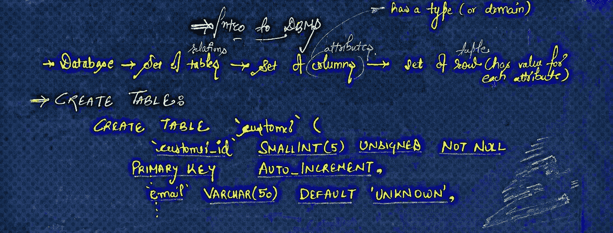
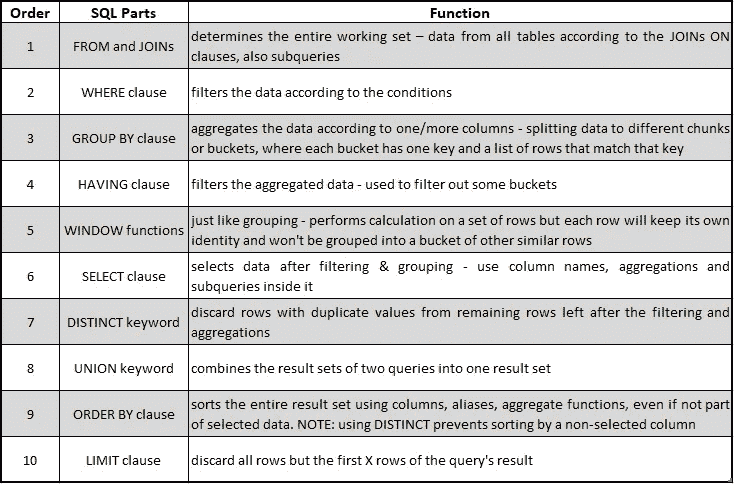
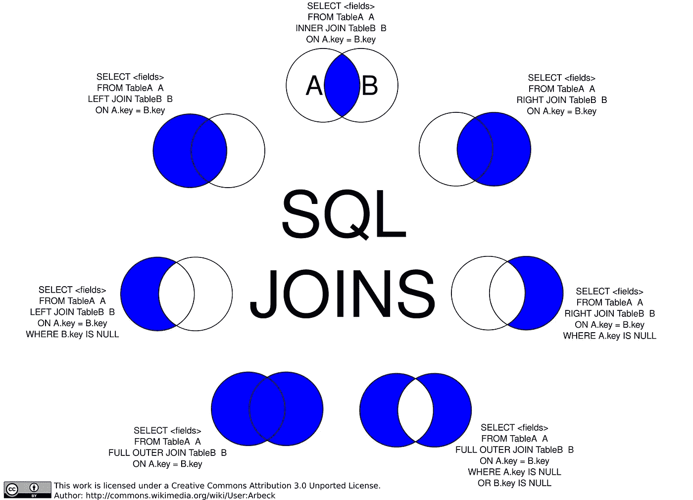
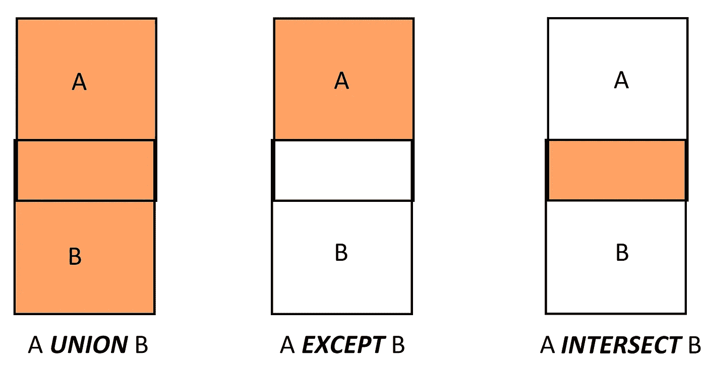

# SQL —用于数据分析的实用细节备忘单

> 原文：<https://towardsdatascience.com/sql-practical-details-cheat-sheet-for-data-analysis-f98406a71a09?source=collection_archive---------9----------------------->

## 所有语言中最被忽视却又最重要的一种



D 数据被认为比石油更有价值，因为可以从中提取洞察力和知识，因此数据分析非常重要。而这一切都是从查询数据库开始的，以 SQL 为核心。有大量的 SQL 教程和备忘单。因此，我将避免讨论基础知识，而将更多地关注我从自己的经验中学到的最重要的方面或实际细节。

1.  SELECT 语句语法—数据查询语言
2.  SELECT 语句的逻辑处理顺序
3.  连接与集合—区分的实际类比
4.  子查询—查询中的查询

# 1.SELECT 语句语法— **数据查询语言**

在本节中，将介绍 SELECT 语句的 MySQL 语法以及最常用的子句及其实用细节。

```
**SELECT** [select_option]
{select_expression}
[
  **FROM**
    **JOIN
    ON
    WHERE
    GROUP BY
    HAVING
    ORDER BY
    LIMIT
    INTO**
]
```

## 其中—不能使用别名和聚合函数

不允许在 WHERE 子句中引用 [**列别名**](https://dev.mysql.com/doc/refman/8.0/en/problems-with-alias.html) ，因为在执行 WHERE 子句时可能还没有确定列值(下一节将对此进行解释)。

不允许在 WHERE 子句中引用**聚合函数**，因为 WHERE 子句不能访问整个集合，而是在提交给 db 引擎时应用于每一行。而**聚合函数**(例如 SUM())处理数据集。

WHERE 子句至少需要一个条件。如果有多个条件，使用 And 或 or 逻辑运算符将它们连接起来。

> **良好实践** :
> 在生产环境中，始终使用 WHERE 子句来补充更新和删除查询**，以避免意外的更新和/或删除**。

## 有—工作原理类似，但要谨慎使用

与 WHERE 子句相比，HAVING 子句的一个优点是它过滤聚合数据，而后者过滤基本数据。换句话说，WHERE 子句充当**前置过滤器**，而 HAVING 子句充当**后置过滤器**。因此，**聚合函数**可以与 HAVING 子句一起使用。

**注意**:HAVING 子句中的别名:令人惊讶的是，对于“列别名”查询成功执行，而对于“聚合函数”别名查询失败。
最佳实践是**避免**在 HAVING 子句中也使用**别名**。

不要对应该在 WHERE 子句中的项目使用 HAVING，因为 WHERE 比**更优化**。

## 分组依据—应包括聚合函数

选择列表应包括汇总数据的函数(如 SUM()、COUNT())。 [WITH ROLLUP](https://dev.mysql.com/doc/refman/8.0/en/group-by-modifiers.html) 修饰符可用于包含表示更高级(即超级聚合)汇总操作的额外行。
`**SELECT** cat, **COUNT**(*) **AS** total ... **GROUP BY** category **WITH ROLLUP**;`

## 排序依据和限制

ORDER BY 子句应至少包含一个列名或别名。如果包含多个列，用逗号分隔，则这些列按它们被提及的顺序排序。

利用 LIMIT 子句的**【offset，】**修饰符(缺省值= 0)来指示从哪一行之后开始行计数。例如，`LIMIT 10, 5`从第 10 行开始计数，返回 5 行—第 11 行、第 12 行、第 15 行。

## INTO —使选择作为 DML(数据操作语言)工作

[SELECT … INTO](https://dev.mysql.com/doc/refman/8.0/en/select-into.html) 表单被认为是 DML，因为它操纵(即修改)数据。例如，您有一个空表``table``，并想从表``backup``中插入数据。那么下面的查询将作为 DML:
`**SELECT** * **INTO** backup **FROM** table;`

## 变量—在客户端会话持续之前一直可用

在给变量赋值时，如果 WHERE 子句返回多个值，那么只有 WHERE 子句返回的最后一个**值会被赋给变量。例如，如果以下查询中的 WHERE 子句返回(恐怖、喜剧、浪漫)，则将“浪漫”赋给变量:
`**SELECT** @category := category **FROM** films **WHERE** rating > 3;`**

# 2.SELECT 语句的逻辑处理顺序

这一部分是根据博客“ [SQL 操作的顺序 MySQL 以什么顺序执行查询？](https://www.eversql.com/sql-order-of-operations-sql-query-order-of-execution/)”作者 Tomer Shay @ EverSQL。
我希望这将使你能够用很少的点击和尝试来编写优化的查询。

注意:语句的实际物理执行由**查询处理器**决定，顺序可能与下表不同。尽管如此，它给出的结果与查询以低于(默认)执行顺序运行时的结果是一样的。



## 顺序 1-从和连接

> 确定整个工作集，即根据子句和子查询的连接来自所有表的数据

## 订单 2 — WHERE 子句

> 根据条件过滤数据

## 顺序 3-GROUP BY 子句

> 根据一列或多列聚合数据。将数据拆分到不同的块或桶中，其中每个桶有一个键和一个与该键匹配的行列表

## 订单 4 — HAVING 子句

> 过滤聚集的数据，即用于过滤掉由 GROUP BY 子句创建的一些存储桶

## 订单 5 — [窗口功能](https://mysqlserverteam.com/mysql-8-0-2-introducing-window-functions/)

> 就像分组一样:对一组行执行计算，但每一行都保持自己的身份，不会被分组到其他类似行的桶中

## 顺序 6 —选择子句

> 筛选和分组后选择数据。在其中使用列名、聚合和子查询

## 顺序 7 —独特的关键字

> 从筛选和聚合后剩下的行中丢弃具有重复值的行

## 顺序 8 — UNION 关键字

> 将两个查询的结果集合并成一个结果集

## Order 9 — ORDER BY 子句

> 使用列、别名、聚合函数对整个结果集进行排序，即使它们不是所选数据的一部分。
> 注意:使用 DISTINCT 可以防止按未选择的列排序

## 订单 10 —限制条款

> 丢弃查询结果中除前 X 行之外的所有行

# 3.连接与集合—区分的实际类比

希望您熟悉各种连接语句，我想就如何区分连接和集合设置一个非常实用的类比。

## 连接-将表可视化为圆形

圆只有一维——半径。
也就是说，在执行 JOIN 语句时，我们只需要*一个公共字段*(半径)来组合来自*两个或多个表*(圆)的数据或行。



阿贝克/抄送人([https://creativecommons.org/licenses/by/3.0](https://creativecommons.org/licenses/by/3.0))

[注意:不要将 SQL 连接视觉模拟与维恩图混淆](https://blog.jooq.org/2016/07/05/say-no-to-venn-diagrams-when-explaining-joins/)

## 集合—将表格(来自 select 语句)可视化为矩形

矩形有两个维度——长和宽。
也就是说，在执行 SET 语句时， *select 语句*(矩形)中使用的*字段*(长度和宽度)必须具有相同的顺序、相同的编号和相同的数据类型，以便组合并生成结果集，作为单独 select 语句的 UNION、UNION ALL、EXCEPT 或 INTERSECT。



*   注意上面表格的图示方向确保*字段*具有相同的顺序、相同的数字和相同的数据类型。
*   UNION 子句在结果集中产生不同的值。若要获取重复值，请使用 UNION ALL。

# 4.子查询—查询中的查询

## 标量子查询—必须只返回一条记录

选择列表中的子查询:

```
**SELECT**
    Category.CategoryName,
    ( **SELECT MAX**(DVDPrice) **FROM** Films
            **WHERE** Films.CategoryID = *Category*.CategoryID ),
    Category.CategoryID
**FROM** *Category*
```

*   理解内部查询(`*Category*.CategoryID`)与外部查询(`**FROM** *Category*`)之间的**链接非常重要**
*   **而且因为这个**链接** —聚合函数`**MAX**(DVDPrice)` — **只返回一个值**，那就是 max。`Category`表中每个类别的价格**

## **子查询-返回多个值**

**当在 WHERE 子句中使用和/或与 in、NOT IN、ANY / SOME、ALL、EXISTS、NOT EXISTS 比较条件结合使用时，子查询非常强大。**

****任何或某些****

```
**SELECT** s1 **FROM** t1 **WHERE** s1 > **ANY** (**SELECT** s1 **FROM** t2);
```

*   **如果子查询返回的列或**值列表中的`ANY`的`***s1***`比较结果为`TRUE`，则返回`TRUE`****
*   **任何一个比较运算符都必须跟在**后面** ( =，>，<，> =，< =，<，>，！=)，即在列名`s1`和比较条件`ANY`之间**

**例如:假设`t1`中有一行包含`(10)`，则表达式为:**

*   **`TRUE`如果`t2`包含`(21,14,7)`**
*   **`FALSE`如果`t2`包含`(20,10)`或者`t2`为空**
*   ***未知*(即`NULL`)如果`t2`包含`(NULL,NULL,NULL)`**

****全部****

```
**SELECT** s1 **FROM** t1 **WHERE** s1 > **ALL** (**SELECT** s1 **FROM** t2);
```

*   **如果子查询返回的列或**值列表**中的值`ALL`的比较`***s1***`为`TRUE`，则返回`TRUE`**
*   **所有还必须跟随着**一个比较运算符** ( =，>，<，> =，< =，<，>，！=)，即在列名`s1`和比较条件`SOME`之间**

**例如:假设`t1`中有一行包含`(10)` ，则表达式为:**

*   **`TRUE`如果`t2`包含`(-5,0,5)`或者如果表格`t2`为空**
*   **`FALSE`如果`t2`包含`(12,6,NULL,-100)`，则为 12 > 10**
*   ***未知*(即`NULL`)如果`t2`包含`(0,NULL,1)`**

****在和不在****

```
**SELECT** s1 **FROM** t1 **WHERE** s1 **IN** (**SELECT** s1 **FROM** t2);
```

*   **如果`***s1***`等于子查询返回的`IN()` **列表**中值的任意一个，则返回`1` (true)，否则返回`0` (false)。不要颠倒逻辑**
*   **`IN`比较条件的执行是不是听起来有点耳熟——没错，关键字`IN`就是`= ANY`的别名。但是，`NOT IN`不是`<> ANY`的别名，而是`<> ALL`的别名**
*   ****没有比较运算符** ( =，>，<，> =，< =，< >，！列名`s1`和比较条件`IN`之间允许有=)**

****存在与不存在****

```
**SELECT** column1 **FROM** t1 **WHERE EXISTS** (**SELECT** * **FROM** t2);
```

*   **如果 a `***subquery***` (SELECT * FROM t2)返回任何行，则条件`EXISTS ***subquery***`为`TRUE`，条件`NOT EXISTS ***subquery***`为`FALSE`**
*   **也就是说，如果`t2`包含任何行，甚至只包含`NULL`值的行，则`EXISTS`条件为`TRUE`**

**因为`[NOT] EXISTS`子查询几乎总是**包含相关性**。一个现实的例子是下面的查询回答“在一个或多个城市有什么样的商店？”具有相关性`cities_stores.store_type = stores.store_type`**

```
**SELECT DISTINCT** store_type **FROM** stores 
  **WHERE EXISTS** (**SELECT** * **FROM** cities_stores
    **WHERE** cities_stores.store_type = stores.store_type);
```

**[更多例子](https://dev.mysql.com/doc/refman/8.0/en/exists-and-not-exists-subqueries.html)**

# **参考**

*   **[MySQL 8.0 参考手册](https://dev.mysql.com/doc/refman/8.0/en/)**
*   **Tomer Shay @ EverSQL 写的博客**
*   **[加入 https://creativecommons.org/licenses/by/3.0 的图片 ar beck/CC](https://commons.wikimedia.org/wiki/File:SQL_Joins.svg)**

**感谢您的阅读！如果你觉得这有帮助或者没有帮助，请在评论中告诉我。如果这篇文章有帮助，*分享一下*。**

****领英****

**[](https://www.linkedin.com/in/eklavyasaxena/) [## Eklavya Saxena -大纽约市地区|职业简介| LinkedIn

### 精通数据的分析师和有抱负的数据科学家，拥有 2 年以上的销售或客户行业经验…

www.linkedin.com/in/EklavyaSaxena](https://www.linkedin.com/in/eklavyasaxena/)**