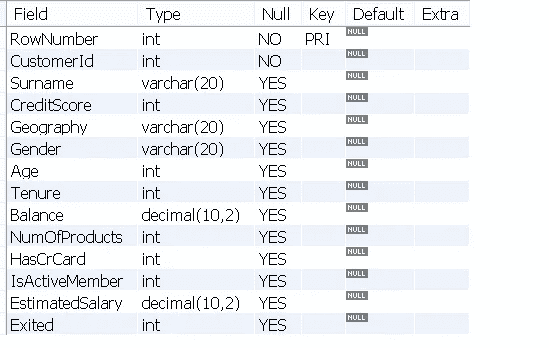
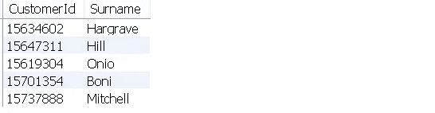
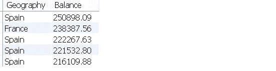
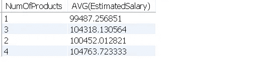
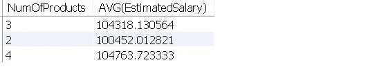
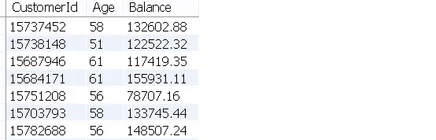
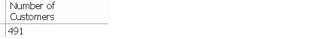

# 数据科学家的 SQL 查询

> 原文：<https://towardsdatascience.com/sql-queries-for-data-scientists-5260737fc442?source=collection_archive---------23----------------------->

## 举例说明。


Miguel A. Amutio 在 [Unsplash](https://unsplash.com/s/photos/overview?utm_source=unsplash&utm_medium=referral&utm_content=creditCopyText) 上拍摄的照片

SQL 是一种编程语言，大多数关系数据库管理系统(RDBMS)使用它来管理以表格形式存储的数据。

SQL 是数据科学家应该具备的基本技能。你可能会说这是数据工程师的工作，但数据科学家的角色更倾向于全栈。此外，作为一名数据科学家，你不会希望依赖数据工程师从数据库中检索数据。

在本文中，我们将编写复杂的查询来检索存储在表中的数据。我已经将[的客户流失数据集](https://www.kaggle.com/shubh0799/churn-modelling)上传到 MySQL 数据库的一个表中。

我们将从简单的查询开始，逐步增加复杂性。我将描述所需的数据，然后编写查询从表中检索数据。

让我们首先来看看表中的列。



(图片由作者提供)

银行的客户及其账户有一些特征。“已离开”栏显示客户是否离开银行。

我们现在可以开始查询了。

## “客户 Id”和“姓氏”列的前 5 行

```
SELECT CustomerId, Surname 
FROM CHURN
LIMIT 5;
```



(图片由作者提供)

## 具有最高余额的客户的 ID

```
SELECT CustomerId, MAX(Balance)
FROM CHURN;
```


(图片由作者提供)

我们没有检索整个“Balance”列，而是使用 MAX aggregate 函数只选择该列中的最大值。

## 最高余额的前 5 名客户的位置

我们无法使用最大值进行此查询，因为我们需要前 5 名客户。我们可以做的是根据余额对客户进行排序，然后使用限额选择前 5 名。

```
SELECT Geography, Balance
FROM CHURN
ORDER BY Balance DESC
LIMIT 5;
```



(图片由作者提供)

## 没有信用卡的顾客的平均年龄

有一个条件要求我们使用 WHERE 语句。

```
SELECT AVG(Age)
FROM CHURN
WHERE HasCrCard = 0;39.1121
```

如果你想知道，拥有信用卡的顾客的平均年龄是 38.8424 岁。

## 每个国家拥有 2 种以上产品的顾客数量

我们将使用另一个聚合函数来计算客户数量。为了根据属性对客户进行分组，使用了 GROUP BY 语句。

```
SELECT Geography, COUNT(CustomerId)
FROM CHURN
WHERE NumOfProducts > 2
GROUP BY Geography;
```


(图片由作者提供)

## **基于产品数量的平均预计工资**

我们可以将 AVG 函数应用于工资，并根据产品数量进行分组。

```
SELECT NumOfProducts, AVG(EstimatedSalary)
FROM CHURN
GROUP BY NumOfProducts;
```



(图片由作者提供)

我想介绍另一个与条件有关的陈述。WHERE 语句允许我们选择符合一个或多个条件的条目。但是，它不能与聚合函数一起使用。

对于上面的查询，假设我们只对平均高于 100000 的产品类别的数量感兴趣。因此，我们需要对平均值应用一个条件，这可以使用 HAVING 语句来完成。

```
SELECT NumOfProducts, AVG(EstimatedSalary)
FROM CHURN
GROUP BY NumOfProducts
HAVING AVG(EstimatedSalary) > 100000;
```



(图片由作者提供)

## 年龄超过 50 岁且余额高于平均水平的客户

我们在这里介绍两个新的话题。一种是使用多个条件(年龄和余额)，另一种是嵌套的 SELECT 语句。

我们可以使用逻辑运算符(如 AND 和 OR)在 WHERE 语句中组合多个条件。一个条件是显式给出的(年龄> 50)，但另一个条件需要使用另一个 SELECT 语句在表上计算。这就是我们需要嵌套 SELECT 语句的地方。

```
SELECT CustomerId, Age, Balance 
FROM CHURN
WHERE Age > 50 AND Balance > (
    SELECT AVG(Balance)
    FROM CHURN );
```



结果集的前 7 行(作者图片)

余额上的条件是另一个 SELECT 语句。

## 留在银行的女性客户数量超过平均水平(任期)并受到影响

它类似于前一个示例，但有一个附加条件。我们将根据三个条件来计算客户数量:

*   性别
*   搅动(退出=1)
*   成为客户的持续时间(任期)

```
SELECT COUNT(CustomerId) AS 'Number of Customers'
FROM CHURN
WHERE Gender = 'Female' AND Exited=1 AND Tenure > (
 SELECT AVG(Tenure)
    FROM CHURN);
```

我们还可以使用“AS”关键字调整结果集中的列名。



(图片由作者提供)

# 结论

我们已经讨论了一些基本和复杂的查询。我们通过查询实现的是，一些计算和过滤是在数据库级别完成的。因此，我们只能检索我们需要的数据，而不是获取所有数据，然后进行过滤和计算。

因为现实生活中的数据库包含更多的数据和许多关系表，所以能够使用 SQL 查询所需的数据非常重要。

感谢您的阅读。如果您有任何反馈，请告诉我。