# Postgres 的 SQL 查询清单

> 原文：<https://towardsdatascience.com/sql-query-cheatsheet-for-postgres-96eba6e9e419?source=collection_archive---------9----------------------->

## 我作为数据科学家和软件工程师使用的 SQL 查询


马库斯·斯皮斯克在 [Unsplash](https://unsplash.com/s/photos/database?utm_source=unsplash&utm_medium=referral&utm_content=creditCopyText) 上拍摄的照片

无论是在应用程序中加载数据，还是查询数据来训练机器学习模型，我都会编写大量的原始 SQL。

作为编写大量代码的工程师，有些命令会留在我们的记忆中，但有些命令我们必须查阅。我听过一次，也喜欢重复一遍——优秀的工程师就像索引，他们可以快速查找信息。

这是我个人的 SQL 备忘单，是用 Postgres 编写的，但也大致适用于其他关系数据库。这仅包括查询。没有插入，删除，索引或其他 Postgres 功能。我们将从简单的开始，朝着更有趣的查询努力。

首先，我们将创建一个数据库并插入一些数据，然后我们将对这些数据执行每个 SQL 查询并研究输出。

**内容:**
1)设置
2)通过
选择并计算
3)限制、偏移和顺序 4)连接
5)相交、联合和除
6)别名
7)聚集数据
8)修改选定值
9) Where 子句

# 设置

创建几个具有不同数据类型的相关表。我想象了一个虚构公司的 CRM(客户关系管理)系统的数据，这样你就可以把它和现实生活联系起来。

创建数据库后。打开您最喜欢的 SQL 编辑器，运行以下命令为`users`、`mailing_lists`、`products`和`sales`创建表。

```
-- users whose information the company has
create table users (
 id serial primary key,
 first_name varchar (50),
 location varchar (50),
 created_at TIMESTAMP
);-- users who are on the company mailing list
create table mailing_lists (
 id serial primary key,
 first_name varchar (50),
 email varchar (50),
 created_at TIMESTAMP
);-- products the company sells
create table products (
 id serial primary key,
 name varchar(50),
 manufacturing_cost int,
 data jsonb,
 created_at TIMESTAMP
)-- sales transactions of products by users
create table sales (
 id serial primary key,
 user_id int,
 product_id int,
 sale_price int,
 created_at TIMESTAMP 
);
```

让我们填充这些表。

```
insert into users (first_name, location, created_at)
values
 ('Liam', 'Toronto', '2010-01-01'),
 ('Ava', 'New York', '2011-01-01'),
 ('Emma', 'London', '2012-01-01'),
 ('Noah', 'Singapore', '2012-01-01'),
 ('William', 'Tokyo', '2014-01-01'),
 ('Oliver', 'Beijing', '2015-01-01'),
 ('Olivia', 'Moscow', '2014-01-01'),
 ('Mia', 'Toronto', '2015-01-01');insert into mailing_lists (first_name, email, created_at)
values
 ('Liam', '[liam@fake.com](mailto:liam@fake.com)', '2010-01-01'),
 ('Ava', '[ava@fake.com](mailto:ava@fake.com)', '2011-01-01');insert into products (name, manufacturing_cost, data, created_at)
values 
 ('laptop', 500, '{"in_stock":1}', '2010-01-01'),
 ('smart phone', 200, '{"in_stock":10}', '2010-01-01'),
 ('TV', 1000, '{}', '2010-01-01');insert into sales (user_id, product_id, sale_price, created_at)
values
 (1, 1, 900, '2015-01-01'),
 (1, 2, 450, '2016-01-01'),
 (1, 3, 2500, '2017-01-01'),
 (2, 1, 800, '2017-01-01'),
 (2, 2, 600, '2017-01-01'),
 (3, 3, 2500, '2018-01-01'),
 (4, 3, 2400, '2018-01-01'),
 (null, 3, 2500, '2018-01-01');
```

# 选择和计数

## 挑选

这是基本的查询，以后的一切都将基于它。

获取所有销售数据，无需过滤或处理。简单。

```
select * from sales;
```

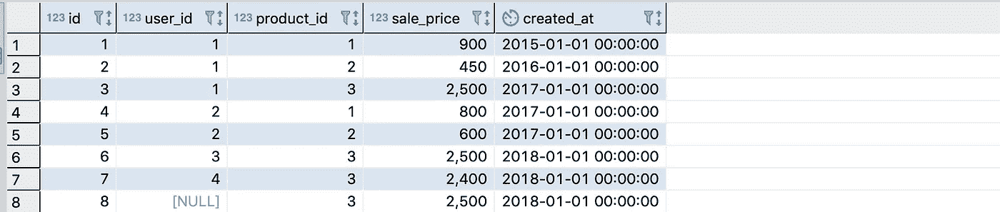

## 选择特定列

仅检索用户的姓名和位置，不包括其他信息，如记录的创建时间。

如果您与不太关心元数据和外键的非技术人员共享，这将非常有用。

```
select 
  first_name, 
  location 
from users;
```


## 选择不同

从查询中删除特定列中的重复项。

如果您想要查找曾经购买过某样东西的所有用户，而不是 sales 表中的每笔交易的列表，这将非常有用。

```
select distinct user_id from sales;
```

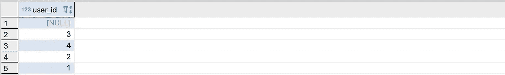

## 数数

统计表格中的记录。

在编写任何其他查询之前，我一直使用这个来了解表的大小。

```
select count(*) from products;
```

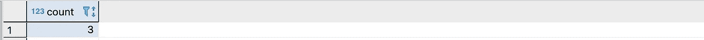

## 计算子查询

如果您想查看包含一个`join`或`where`子句的记录数量，您也可以在`count()`中包装整个查询。

有用，因为有时记录的数量会在连接后改变一个数量级。

```
select count(*) from (
  select * from products
  left join sales on sales.product_id = products.id
) subquery;
```

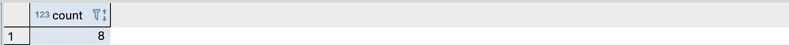

# 限制、偏移和排序依据

## 限制

将返回的记录数限制为特定的计数。

当我在 jupyter 笔记本上加载大量数据记录时，我发现这很有用，因为加载太多记录会导致我的电脑崩溃。在这种情况下，我可以添加`limit 100`。

我们会从销售部拿到前三张唱片。

```
select * from sales limit 3;
```

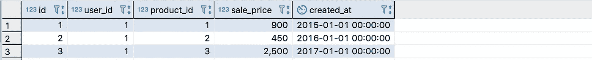

## 以...排序

按列而不是表的主键对记录进行排序。

如果您希望用户名按字母顺序排列，或者希望表按外键排序，这很有用。

通过`user_id`获得销售订单。注意，我们这里仍然有`limit`。

```
select 
  * 
from sales 
order by user_id asc
limit 3;
```

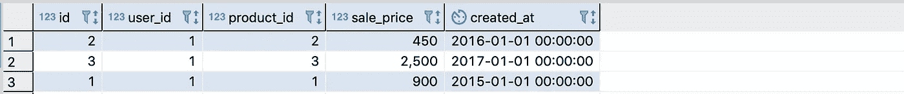

我们也可以在相反的方向订购销售，递减。

```
select 
  * 
from sales 
order by user_id desc
limit 3;
```

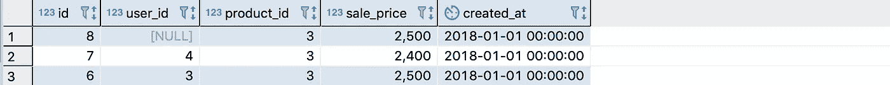

## 抵消

在一个`select`中，从顶部跳过 N 条记录。

我发现当一次加载太多记录会使我的 jupyter 笔记本崩溃，并且我想一次迭代有限数量的记录时，这非常有用。

从销售部门获取前 3 条记录。

```
select * from sales 
order by user_id asc
limit 3 offset 0;
```

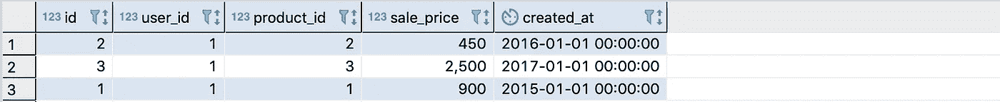

从销售部门获取接下来的 3 条记录。

```
select * from sales 
order by user_id asc
limit 3 offset 3;
```


请注意，我们在第一个查询中有记录 1–3，在第二个查询中有记录 4–6。

# 连接

## 左连接

从一个基表(在左边)开始，尝试根据一个键连接另一个表(在右边)中的记录。

在加入之前，我们先检查一下左边的表。

```
select * from users
```

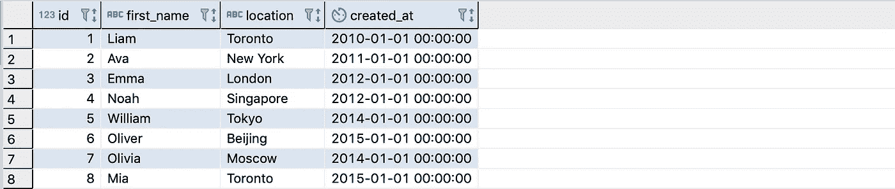

现在就选对桌子。

```
select * from sales
```

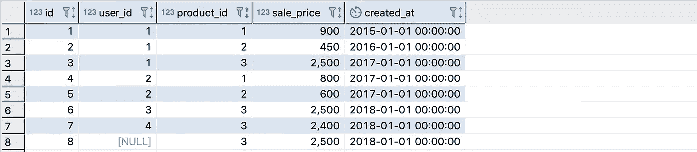

现在我们做一个左连接。加入销售(右)用户(左)。

请注意，无论左边的记录是否与右边的记录匹配，总是会返回左边的记录。并且如果左边的记录与右边的多个记录匹配，则左边的记录是重复的。

```
select 
  * 
from users 
left join sales on sales.user_id = users.id;
```

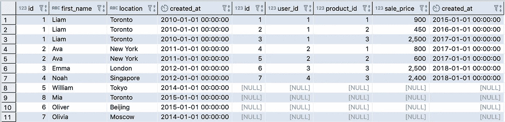

`Left join`可能是开发人员查询数据库时使用最多的连接。

## 向右加入。

与`left join`相同，但方向不同。从右边的表(销售)开始，连接左边的记录(用户),如果它们存在的话。

```
select 
  * 
from users 
right join sales on sales.user_id = users.id;
```

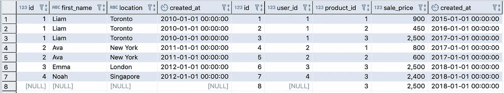

## 内部连接

仅当双方都匹配时才返回记录。请注意，我们没有空数据。

```
select 
  * 
from users
inner join sales on sales.user_id = users.id;
```

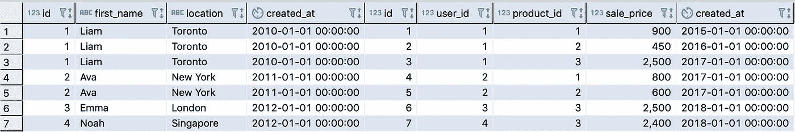

## 外部连接

返回左侧和右侧的所有记录，不管它们是否可以在一个键上匹配。左边的一些记录在右边没有匹配的记录，反之亦然。但无论如何都要退回去。

```
select 
 * 
from users
full outer join sales on sales.user_id = users.id;
```

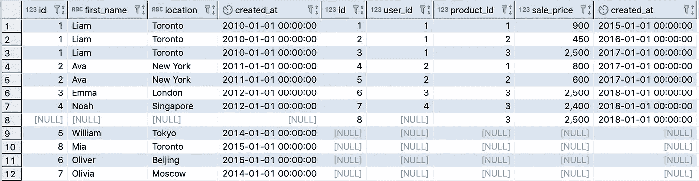

# 交集、并集和例外集

## 横断

不是真正的连接，但可以像连接一样使用。它的好处是能够匹配`null`值，这是内部连接无法做到的。

这里我们将把`users`和`mailing_lists`中的名字交叉起来。只返回两个表中都存在的名称。

```
select 
  first_name
from users
intersect
select 
  first_name
from mailing_lists;
```

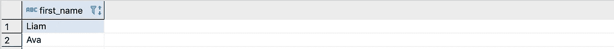

## 联盟

允许您返回同一列中不同列的数据。注意`first_name`是如何混合了用户名和位置的。

```
select first_name from users 
union
select location from users;
```

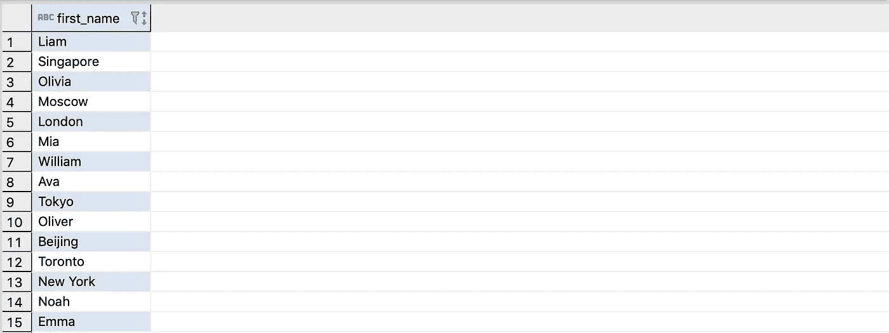

我们还可以从同一个表中堆叠两列。这里我们有用户位置和产品名称。

```
select location from users
union
select name from products;
```

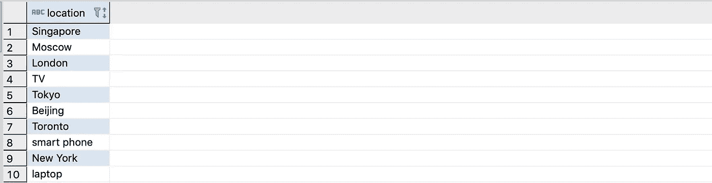

## 联合所有

如果不想自动删除重复项，请使用`union all`。

```
select name from products
union all
select name from products
```

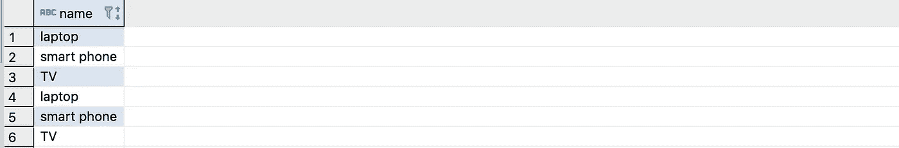

## 除...之外

我们可以排除存在于两个表中的行，同时返回其他行。返回除了在`users`和`mailing_lists`中的名字之外的所有名字。

```
select 
  first_name
from users
except
select 
  first_name
from mailing_lists;
```

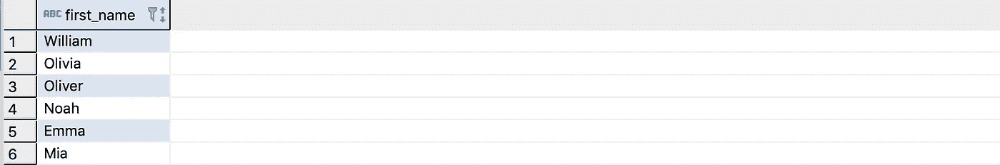

# 错认假频伪信号

给列一个别名会改变返回列顶部的标题。注意第一列的名称现在是`name`而不是`first_name`。这里我们重命名了两列。

```
select 
  first_name as name,
  location as city
from users;
```

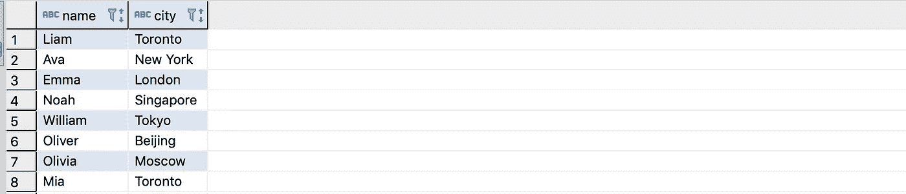

我们也可以给表起别名。然后，在选择列时，我们需要引用别名。我们已经将`users`更名为`u`。

```
select 
  u.first_name,
  u.location
from users as u;
```

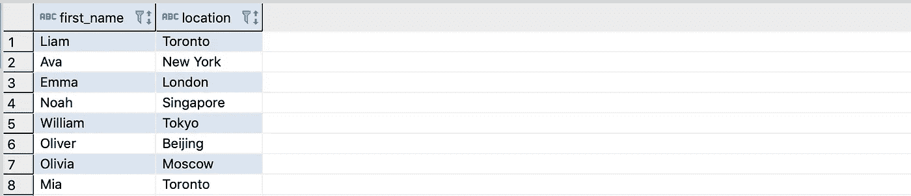

# 汇总数据

分组和聚合数据是一个非常强大的功能。Postgres 提供的标准函数有:`sum()`、`avg()`、`min()`、`max()`和`count()`。

在这里，我们将计算每个产品的销售价格的总和、平均值、最小值和最大值。

```
select 
  product_id, 
  sum(sale_price),
  avg(sale_price),
  min(sale_price),
  max(sale_price),
  count(id)
from sales group by product_id;
```

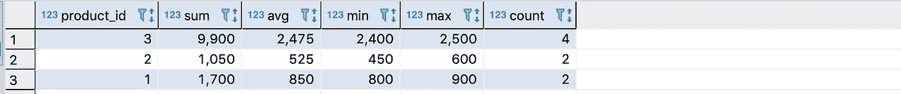

我们可以通过联接另一个表来显示名称而不是 product _ ids，从而修改上面的查询。

```
select 
  products.name, 
  sum(sale_price),
  avg(sale_price),
  min(sale_price),
  max(sale_price),
  count(sales.id)
from sales
left join products on products.id = sales.product_id
group by products.name;
```


## 按拥有分组

这允许对分组和聚合的数据进行过滤。常规的 where 子句在这里不起作用，但是我们可以使用`having`来代替。

只返回销售超过 2 件商品的产品的汇总数据。

```
select 
  products.name, 
  sum(sale_price),
  avg(sale_price),
  min(sale_price),
  max(sale_price),
  count(sales.id)
from sales
left join products on products.id = sales.product_id
group by products.name
having count(sales.id) > 2;
```

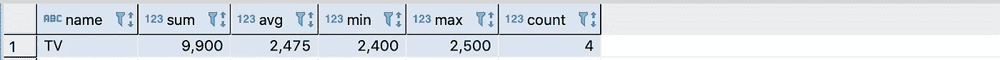

## 字符串 _ 聚集

也可以结合使用`_agg`函数(如`string_agg`)和`group by`来构建一个逗号分隔的购买每种产品的人的字符串。

```
select 
 products.name,
 string_agg(users.first_name, ‘, ‘)
from products
left join sales on sales.product_id = products.id
left join users on users.id = sales.user_id
group by products.name;
```

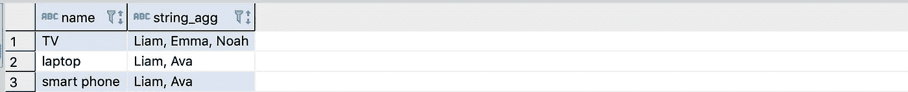

# 修改选定的值

## 铸造

转换意味着转换列中的数据类型。并非所有数据都可以转换为所有数据类型。例如，试图将一个字符串转换为一个整数会抛出一个错误。

但是将整数转换成小数是可行的。我们在下面这样做，这样我们可以看到制造成本除以 3(任意决定)后的小数。注意当我们除一个整数时，我们没有得到小数的位置，但是当我们除一个小数时，我们得到了。

```
select 
  name, 
  manufacturing_cost / 3 cost_int,
  manufacturing_cost::decimal / 3 as cost2_dec,
  '2020–01–01'::text,
  '2020–01–01'::date
from products;
```

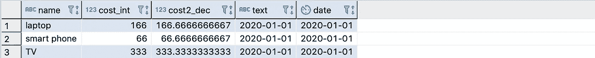

## 轮次

我们也可以四舍五入到指定的小数位数。有时我们不想要小数点后 10 位。

这是上述查询的修改版本，增加了`round()`。

```
select 
  name, 
  round(
    manufacturing_cost::decimal / 3, 2 
  )
from products;
```


## 情况

Case 允许根据单元格的值有条件地应用逻辑或返回不同的值。它相当于 SQL 的`if/else`。这里我们为 user_id 为`null`的单元格返回值`100`。

```
select 
  id,
  case
    when user_id is null then 100
    else user_id
  end
from sales;
```

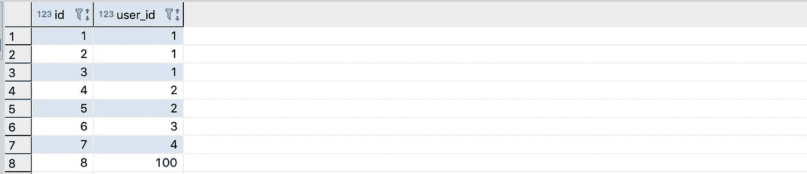

## 联合

如果第一列的值为 null，则 Coalesce 允许从不同的列返回值。

有用的是数据非常稀疏或者分布在多个列中。

```
select 
  id,
  coalesce(user_id, product_id)
from sales;
```

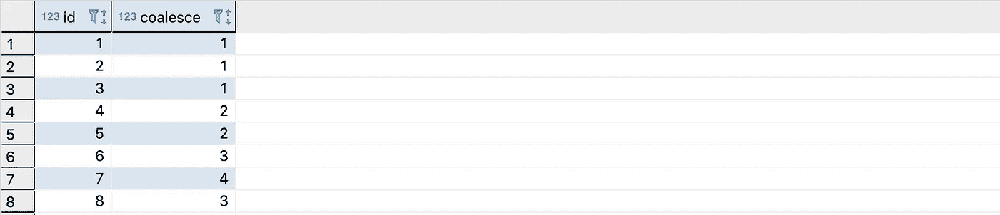

## 串联

Concat 只是连接字符串。这里我们将名称和位置连接起来。

```
select 
 concat(first_name, ‘ ‘, location)
from users;
```

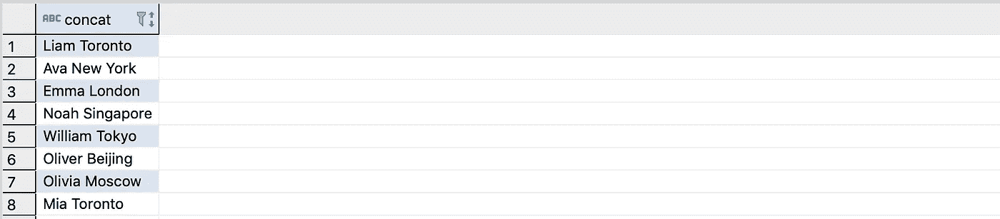

## 上和下

更改字符串的大小写。

如果这需要在数据处理管道中的某个地方完成，那么在 SQL 级别完成要比在 python/app 级别快得多。

```
select 
  upper(first_name),
  lower(first_name)
from users;
```

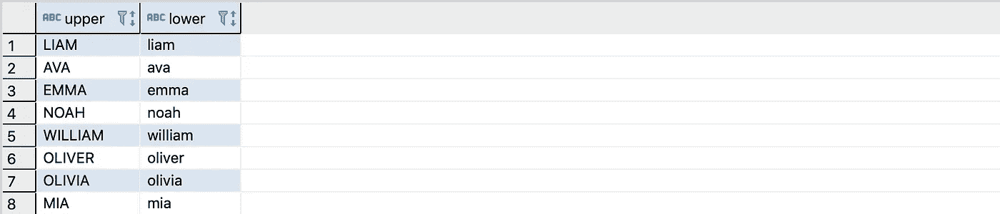

# Where 子句

大部分。

## 经营者

我们可以在 where 子句中使用所有的等式运算符:`=`、`<>`、`!=`、`<,`、`<=`、`>=`、`>`。

找到所有名字完全是"利亚姆"的记录。

```
select * from users where first_name = 'Liam'
```

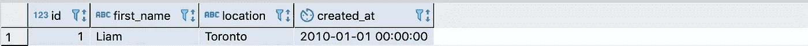

找到所有名字不是"利亚姆"的记录。

```
select * from users where first_name != 'Liam'
```

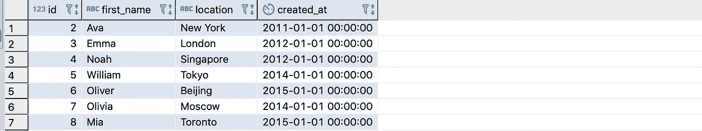

查找所有`id`大于或等于 5 的记录。

```
select * from users where id >= 5
```

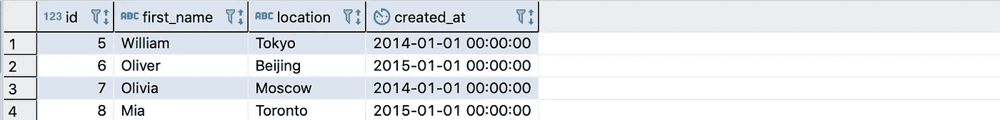

## 和，或者，不是

将多个 where 子句与`and`、`or`和`not`链接在一起。但是注意我们只写了一次`where`这个词。

选择名称完全为“Liam”或“Olivia”的所有记录。

```
select * from users where first_name = 'Liam' or first_name = 'Olivia';
```

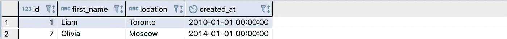

选择姓名完全为“Liam”且 id 为 5 的所有记录。这将返回 none，因为 Liam 的 id 不是 5。

```
select * from users where first_name = 'Liam' and id = 5;
```

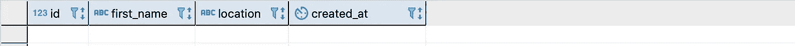

选择名称为“Liam”且 id 不是 5 的所有记录。现在利亚姆回来了。

```
select * from users where first_name = 'Liam' and not id = 5;
```

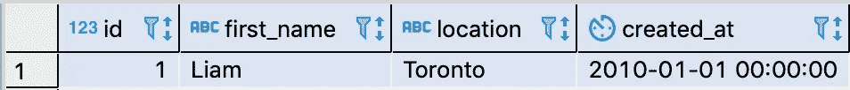

## 在…里

您可以在给定的数组中查找值所在的记录，而不是用 or、or、or…来链接子句。

```
select * from users where first_name in ('Liam', 'Olivia');
```

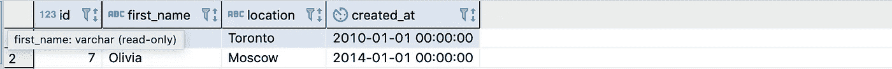

## 空

我们还可以加载值为(或不为)null 的记录。

```
select * from sales where user_id is null;
select * from sales where user_id is not null;
```

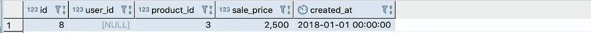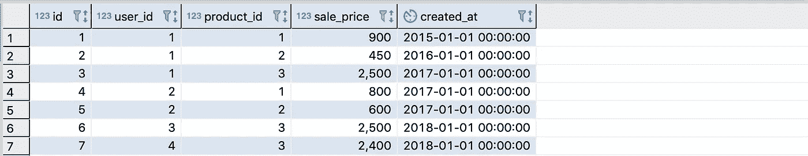

## 模糊匹配

有时我们希望找到与查询大致匹配的值。为此，我们可以搜索部分字符串或忽略大小写。

加载名称中包含字符“ia”的任何记录。

```
select * from users where first_name like '%ia%';
```

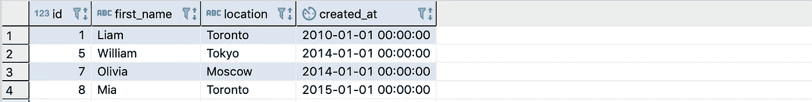

加载名称中带有字符“IA”的记录。这不会返回任何内容，因为没有名称中包含大写的“IA”。

```
select * from users where first_name like '%IA%';
```

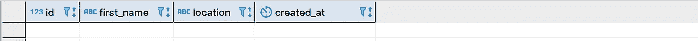

所以让我们忽略案例进行搜索。

```
select * from users where first_name ilike ‘%IA%’;
```

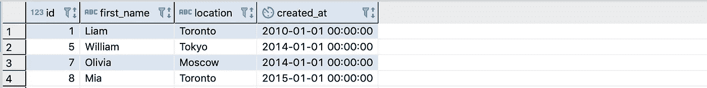

## 子查询中的位置

我们已经知道我们能做到。

```
select * from users where id > 5;
```

但是我们也可以从这个查询中选择！注意您需要为子查询提供别名，否则将会引发错误。

```
select 
  first_name 
from (
  select * from users where id > 5
) subquery;
```

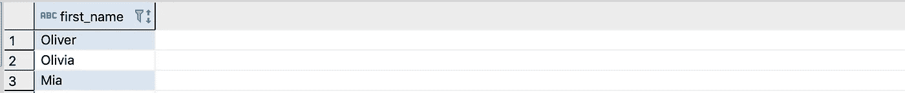

## 随着

虽然我们可以从另一个查询进行查询，但我更喜欢这种方法。预先定义子查询感觉更干净。

```
with cte as (
  select * from users where id > 5
)
select 
  first_name
from cte
```

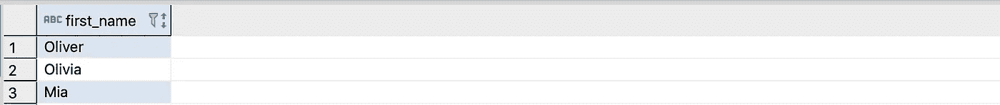

## 日期过滤

我们可以按日期过滤。

如果您想要查找特定日期之后发生的所有交易，这很有用。

```
select * from sales where created_at > '2016–01–01';
```

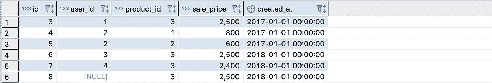

我们还可以找到两个日期之间的交易。

```
select 
  * 
from sales 
where created_at between '2016–01–01' and '2017–01–01';
```

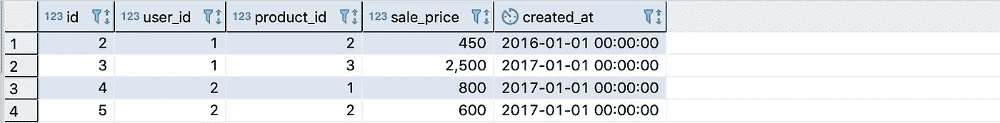

## JSON(B)s

Postgres 有一些非常棒的功能来处理 JSON。

在`data`列中查找具有关键字`in_stock`的记录。

```
select * from products where data -> 'in_stock' is not null;
```

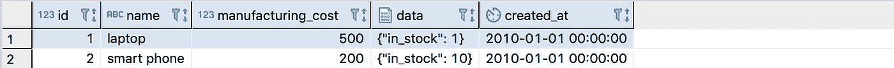

查找`in_stock`值大于 5 的记录。注意，我们需要将 JSONB 转换为整数来进行比较。

```
 select * from products where (data -> 'in_stock')::int > 5;
```

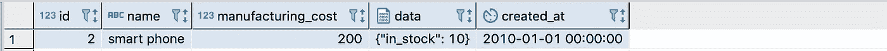

从 JSONB 中选择出数据，作为 JSONB。

```
select name, data -> 'in_stock' as stock from products;
```

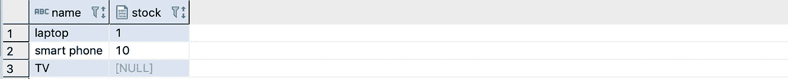

选择它作为文本。数据类型会对更复杂的查询产生影响，在这种查询中，该值会运行其他函数。

```
select name, data ->> 'in_stock' as stock from products;
```

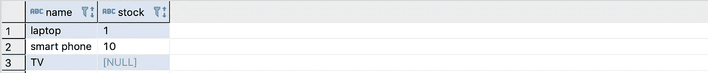

## 落后

在表中获取一条记录，并将其紧接在前面。

在查看一段时间内的事件时非常有用，因为以前的事件会影响将来的事件。您可以使用像这样查询的数据来训练 ML 模型，以便在给定当前状态的情况下预测未来状态。

我们将使用它来查找紧接在其他用户之前添加的用户。

```
select 
 first_name as joined_user,
 lag(first_name) over (order by created_at) as prev_joined_user
from users;
```

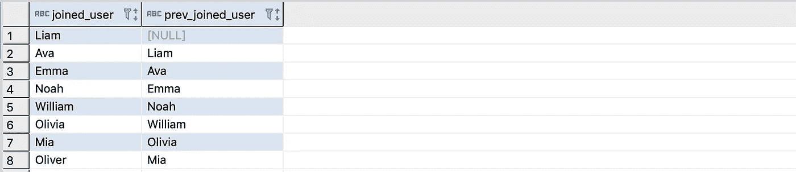

我们将`null`作为 Liam 的前一个用户，因为他是第一个被添加到数据库中的用户。

## 铅

与上面相反。加载紧随其他用户之后加入的用户。

```
select 
 first_name as joined_user,
 lead(first_name) over (order by created_at) as next_joined_user
from users;
```


# 结论

Postgres 可以做很多事情。因此，尽管这里有很多命令，但我们只涉及基本的内容。

虽然没有必要记住这些才能有效，但是理解它们是如何工作的几乎是构建高级查询和知道什么是可能的必不可少的。

有没有哪个 Postgres 命令改变了你的游戏规则？