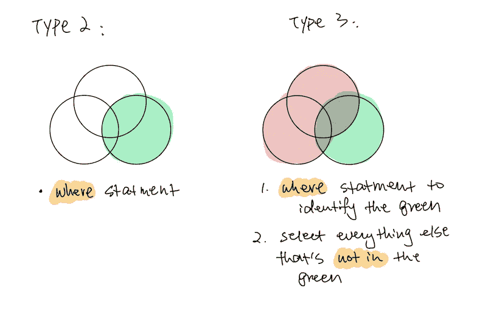
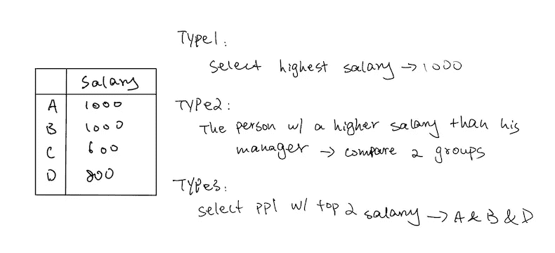
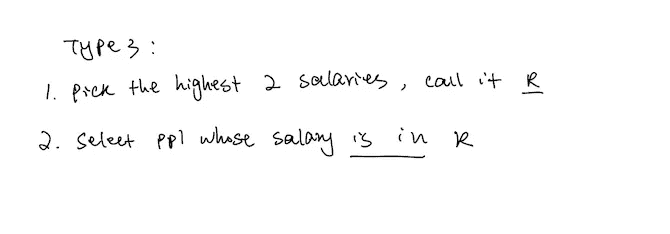

# 解决 100 个 leetcode SQL 问题后的感悟…

> 原文：<https://towardsdatascience.com/sql-questions-summary-df90bfe4c9c?source=collection_archive---------3----------------------->

## 艰难的教训，真正的秘诀

## 只有三种问题。他们是…


塞巴斯蒂安·科曼摄影在 [Unsplash](https://unsplash.com?utm_source=medium&utm_medium=referral) 上拍摄的照片

## 简介:

有很多文章教你如何编写查询。知道如何编写一个查询并不是真正困难的部分。难的是总是有多种方法可供选择，并且所有这些方法都需要查询的组合。将问题分类，有助于我们识别模式，并对我们可以使用的查询类型建立更好的直觉。

基本上有 3 种类型的 SQL 问题。这三类问题的原始形式非常简单。然而，它们可以通过混合搭配 3 样东西来升级。分别是*时间约束*、*计算要求*、*比较/排序要求*。我将用例子向你说明我的意思。先说清楚最基本的形态。

## 所有 SQL 问题都可以归结为以下三种类型:

> 类型 1:全选
> 
> 类型 2:选择做了 X 的组
> 
> 类型 3:选择没有做 X 的组

正如您将看到的，类型 1 问题基本上是测试我们使用不同类型连接的能力。第二类和第三类问题都在测试我们准确识别满足特定约束的特殊群体的能力。



区分类型 2 和类型 3 是很重要的。类型 2 只需要一个带有 **where** 语句的步骤。类型 3 需要两个步骤的方法。首先，我们需要用 **where** 语句来标识特殊组。其次，我们需要使用中的 **not 来排除 **where** 语句中的那个组。**

原因是，如果我们直接选择所有不是绿色的，那么红色和绿色的样本仍然会被选择。我将在下面提供例子，这将变得更加清楚。正如您将看到的，第三类问题可能会比第二类问题复杂得多。

类型 1:全选

*   简易版:1 种联接
*   硬版本:多种不同类型的连接

类型 2:选择做了 X/met X 描述的组

*   简单版本:“在哪里”语句
*   更难的版本:查找重复，查找唯一，查找连续

```
Several friends at a cinema ticket office would like to reserve consecutive available seats.Can you help to query all the consecutive available seats order by the seat_id?| seat_id | free |  
|---------|------|
| 1       | 1    |
| 2       | 0    |
| 3       | 1    |
| 4       | 1    | 
| 5       | 1    |
```

类型 3:选择没有做 X/met X 描述的组

```
Write an SQL query that reports the **buyers** who have bought *S8* but not *iPhone*. Product table:
+------------+--------------+------------+
| product_id | product_name | unit_price |
+------------+--------------+------------+
| 1          | S8           | 1000       |
| 2          | G4           | 800        |
| 3          | iPhone       | 1400       |
+------------+--------------+------------+

Sales table:
+------------+----------+------------+----------+-------+
| product_id | buyer_id | sale_date  | quantity | price |
+------------+----------+------------+----------+-------+
| 1          | 1        | 2019-01-21 | 2        | 2000  |
| 1          | 2        | 2019-02-17 | 1        | 800   |
| 2          | 3        | 2019-06-02 | 1        | 800   |
| 3          | 2        | 2019-05-13 | 2        | 2800  |
+------------+----------+------------+----------+-------+
```

请注意，买家 2 同时购买了 *S8* 和 *iPhone* ，它们是两个独立的样品*。*因此，这个问题必须分两步解决。首先确定购买了 *iPhone* 的买家，然后选择不在购买了 *iPhone* 的买家中的 buyer_id。

## 级别 1:时间限制

处理时间格式要求我们熟悉处理时间的查询。然而，在这个阶段，逻辑是大同小异的。当它和其他两个东西结合在一起的时候就变得很难了。它经常与一些计算要求结合在一起。

*   简单版:选择一个特殊的时间框架

因为我们选择了一个特殊的时间框架，我们正在创建一个特殊的群体。所以这些问题要么是 2 型，要么是 3 型。

```
Write an SQL query that reports the **products** that were **only** sold in spring 2019\. That is, between **2019-01-01** and **2019-03-31** inclusive.
```

*   硬版:选择某件事的第一次或最晚时间。

当谈到选择第一个或最新的东西时，我把它们归类为第一类问题。原因是我们需要不重复地考虑所有的信息，然后从中选择最好的。

难的是日期信息通常不是主键。因此，需要花费一些努力来确保我们想要的日期与相应的项目相匹配。请参见下面的示例。

```
Write a SQL query that reports the **device** that is first logged in for each player.

+-----------+-----------+------------+--------------+
| player_id | device_id | event_date | games_played |
+-----------+-----------+------------+--------------+
| 1         | 2         | 2016-05-28 | 5            |
| 1         | 5         | 2016-05-02 | 6            |
| 2         | 3         | 2017-06-25 | 1            |
| 3         | 1         | 2016-03-02 | 0            |
| 3         | 4         | 2018-07-03 | 5            |
+-----------+-----------+------------+--------------+
```

当我们选择 **min(event_date)** 时，该日期是最早的日期，但它不会匹配相应的设备 id，因为 nor event_date 或 device_id 都不是主键。

## 第二级:计算要求

最常见的计算是计数/总和/平均值/ctr。当第二类或第三类问题涉及计算时，我们经常需要在标记一些样本时使用 **case。对于 1 型题中的计算，多是代入公式。**

期望的输出可以分为两类。第一个类别的输出是一个数字。第二个类别以表格的形式输出。计算是按用户/日期/会话进行的。

1.  以数字表示的结果

*   简易版:

```
Type 2: Write an SQL query to find the average for daily percentage of posts that got removed after being reported as spam, **rounded to 2 decimal places**.Actions table:
+---------+---------+-------------+--------+--------+
| user_id | post_id | action_date | action | extra  |
+---------+---------+-------------+--------+--------+
| 1       | 1       | 2019-07-01  | view   | null   |
| 1       | 1       | 2019-07-01  | like   | null   |
| 1       | 1       | 2019-07-01  | share  | null   |
| 2       | 2       | 2019-07-04  | view   | null   |
| 2       | 2       | 2019-07-04  | report | spam   |
| 3       | 4       | 2019-07-04  | view   | null   |
| 3       | 4       | 2019-07-04  | report | spam   |
| 4       | 3       | 2019-07-02  | view   | null   |
| 4       | 3       | 2019-07-02  | report | spam   |
| 5       | 2       | 2019-07-03  | view   | null   |
| 5       | 2       | 2019-07-03  | report | racism |
| 5       | 5       | 2019-07-03  | view   | null   |
| 5       | 5       | 2019-07-03  | report | racism |
+---------+---------+-------------+--------+--------+

Removals table:
+---------+-------------+
| post_id | remove_date |
+---------+-------------+
| 2       | 2019-07-20  |
| 3       | 2019-07-18  |
+---------+-------------+

Result table:
+-----------------------+
| average_daily_percent |
+-----------------------+
| 75.00                 |
+-----------------------+
```

因为这是一个类型 2 的问题，我们首先需要确定一个特殊的组——被删除的帖子。然后，我们将一个组标记为“1 ”,另一个组标记为“0 ”,以执行计算。

*   更难的版本:结合*时间限制。*

```
Type 1: Write an SQL query to find the average number of sessions per user for a period of 30 days ending **2019-07-27** inclusively, **rounded to 2 decimal places**. The sessions we want to count for a user are those with at least one activity in that time period.Activity table:
+---------+------------+---------------+---------------+
| user_id | session_id | activity_date | activity_type |
+---------+------------+---------------+---------------+
| 1       | 1          | 2019-07-20    | open_session  |
| 1       | 1          | 2019-07-20    | scroll_down   |
| 1       | 1          | 2019-07-20    | end_session   |
| 2       | 4          | 2019-07-20    | open_session  |
| 2       | 4          | 2019-07-21    | send_message  |
| 2       | 4          | 2019-07-21    | end_session   |
| 3       | 2          | 2019-07-21    | open_session  |
| 3       | 2          | 2019-07-21    | send_message  |
| 3       | 2          | 2019-07-21    | end_session   |
| 3       | 5          | 2019-07-21    | open_session  |
| 3       | 5          | 2019-07-21    | scroll_down   |
| 3       | 5          | 2019-07-21    | end_session   |
| 4       | 3          | 2019-06-25    | open_session  |
| 4       | 3          | 2019-06-25    | end_session   |
+---------+------------+---------------+---------------+

Result table:
+---------------------------+ 
| average_sessions_per_user |
+---------------------------+ 
| 1.33                      |
+---------------------------+
```

这是一个类型 2 *时间约束*问题*和计算要求*。我们需要选择正确的时间段，然后执行计算

2.以表格形式输出

*   更简单的版本:

```
Type 2: Write an SQL query to find the ctr of each Ad.**Round** ctr to 2 decimal points. **Order** the result table by ctr in descending order and by ad_id in ascending order in case of a tie.Ads table:
+-------+---------+---------+
| ad_id | user_id | action  |
+-------+---------+---------+
| 1     | 1       | Clicked |
| 2     | 2       | Clicked |
| 3     | 3       | Viewed  |
| 5     | 5       | Ignored |
| 1     | 7       | Ignored |
| 2     | 7       | Viewed  |
| 3     | 5       | Clicked |
| 1     | 4       | Viewed  |
| 2     | 11      | Viewed  |
| 1     | 2       | Clicked |
+-------+---------+---------+
Result table:
+-------+-------+
| ad_id | ctr   |
+-------+-------+
| 1     | 66.67 |
| 3     | 50.00 |
| 2     | 33.33 |
| 5     | 0.00  |
+-------+-------+
```

这是一个 2 型问题，因为要计算 CTR。CTR 要求我们在执行任何计算之前，将“点击”作为一组，将“浏览”作为另一组。逻辑上没有什么新东西。我们首先选择这些特殊的组，然后应用计算。

然而，对于这个特殊的问题，它强调了一个事实，即我们需要小心将 0 作为计算中的分母。当这种情况发生时，我们通常需要分别处理那个样本，然后再与其他样本结合。

*   更难的版本:多个表或有*时间限制*。

```
Type 1: Write an SQL query to find the number of times each student attended each exams. Order the result table by student_id and subject_name.Students table:
+------------+--------------+
| student_id | student_name |
+------------+--------------+
| 1          | Alice        |
| 2          | Bob          |
| 13         | John         |
| 6          | Alex         |
+------------+--------------+
Subjects table:
+--------------+
| subject_name |
+--------------+
| Math         |
| Physics      |
| Programming  |
+--------------+
Examinations table:
+------------+--------------+
| student_id | subject_name |
+------------+--------------+
| 1          | Math         |
| 1          | Physics      |
| 1          | Programming  |
| 2          | Programming  |
| 1          | Physics      |
| 1          | Math         |
| 13         | Math         |
| 13         | Programming  |
| 13         | Physics      |
| 2          | Math         |
| 1          | Math         |
+------------+--------------+
Result table:
+------------+--------------+--------------+----------------+
| student_id | student_name | subject_name | attended_exams |
+------------+--------------+--------------+----------------+
| 1          | Alice        | Math         | 3              |
| 1          | Alice        | Physics      | 2              |
| 1          | Alice        | Programming  | 1              |
| 2          | Bob          | Math         | 1              |
| 2          | Bob          | Physics      | 0              |
| 2          | Bob          | Programming  | 1              |
| 6          | Alex         | Math         | 0              |
| 6          | Alex         | Physics      | 0              |
| 6          | Alex         | Programming  | 0              |
| 13         | John         | Math         | 1              |
| 13         | John         | Physics      | 1              |
| 13         | John         | Programming  | 1              |
+------------+--------------+--------------+----------------+
```

这是一个 1 型问题。因此，本质上，它是在测试我们对不同类型的连接的理解。对于上面的问题，我用**交叉连接**和**左连接**来解决。这是一个更难的问题，因为信息分散在 3 个表中。当我们将多个表连接在一起时，很难避免重复并包含所有信息。

```
Type 2: Write an SQL query to compute moving average of how much customer paid in a 7 days window (current day + 6 days before).Customer table:
+-------------+--------------+--------------+-------------+
| customer_id | name         | visited_on   | amount      |
+-------------+--------------+--------------+-------------+
| 1           | Jhon         | 2019-01-01   | 100         |
| 2           | Daniel       | 2019-01-02   | 110         |
| 3           | Jade         | 2019-01-03   | 120         |
| 4           | Khaled       | 2019-01-04   | 130         |
| 5           | Winston      | 2019-01-05   | 110         | 
| 6           | Elvis        | 2019-01-06   | 140         | 
| 7           | Anna         | 2019-01-07   | 150         |
| 8           | Maria        | 2019-01-08   | 80          |
| 9           | Jaze         | 2019-01-09   | 110         | 
| 1           | Jhon         | 2019-01-10   | 130         | 
| 3           | Jade         | 2019-01-10   | 150         | 
+-------------+--------------+--------------+-------------+

Result table:
+--------------+--------------+----------------+
| visited_on   | amount       | average_amount |
+--------------+--------------+----------------+
| 2019-01-07   | 860          | 122.86         |
| 2019-01-08   | 840          | 120            |
| 2019-01-09   | 840          | 120            |
| 2019-01-10   | 1000         | 142.86         |
+--------------+--------------+----------------+
```

这是一个有*时间限制*的类型 2 问题。因此，我们首先需要根据时间限制来组织表格。然后我们应用函数来计算。困难的部分是我们需要熟悉处理时间的查询。对于这个问题，我使用了 **lag() over(order by)** 和**sum(s _ amount)over(order by)**

## 第 3 级:比较/排名要求

说到比较/排名，往往是建立在*计算要求*之上的。对于类型 1 的问题，通常是考虑所有的样本，对它们进行排序，并选择最好的一个。对于第二类问题，通常是将样本分组并比较两组。对于 Type-3 的问题，往往是先做一个特殊的组，这就需要排位来这么做。然后我们选择所有具有或不具有该群体特征的东西。



类型 1:查找最高值、第 n 个最高值、第二个最高值

```
Write a SQL query to get the *n*th highest salary from the Employee table. If there is no *n*th highest salary, then the query should return null.+----+--------+
| Id | Salary |
+----+--------+
| 1  | 100    |
| 2  | 200    |
| 3  | 300    |
+----+--------++------------------------+
| getNthHighestSalary(2) |
+------------------------+
| 200                    |
+------------------------+
```

这是一个棘手的问题，因为它是一个函数，这在 SQL 中并不常见。然而，基本方法是相同的。这是一个类型 1 的问题，所以我们需要确保没有重复的样本。首先选择 **distinct(salary)** ，使用 **order_by** 进行排序，然后使用 **offset** 和 **fetch** 得到第二行。

第 2 类问题:一组的得分高于/高于/至少…

```
Write a SQL query for a report that provides the pairs (actor_id, director_id) where the actor have cooperated with the director at least 3 times.ActorDirector table:
+-------------+-------------+-------------+
| actor_id    | director_id | timestamp   |
+-------------+-------------+-------------+
| 1           | 1           | 0           |
| 1           | 1           | 1           |
| 1           | 1           | 2           |
| 1           | 2           | 3           |
| 1           | 2           | 4           |
| 2           | 1           | 5           |
| 2           | 1           | 6           |
+-------------+-------------+-------------+

Result table:
+-------------+-------------+
| actor_id    | director_id |
+-------------+-------------+
| 1           | 1           |
+-------------+-------------+
```

我们首先使用**精确地选择我们想要的组，其中**或者有时**首先使用**。然后我们进行比较或者整理。

类型 3:选择前 3/n 个最高薪金

*   简易版:

```
Write a SQL query to find employees who have the highest salary in **each of the departments**. For the above tables, your SQL query should return the following rows (order of rows does not matter) +----+-------+--------+--------------+
| Id | Name  | Salary | DepartmentId |
+----+-------+--------+--------------+
| 1  | Joe   | 70000  | 1            |
| 2  | Jim   | 90000  | 1            |
| 3  | Henry | 80000  | 2            |
| 4  | Sam   | 60000  | 2            |
| 5  | Max   | 90000  | 1            |
+----+-------+--------+--------------++----+----------+
| Id | Name     |
+----+----------+
| 1  | IT       |
| 2  | Sales    |
+----+----------++------------+----------+--------+
| Department | Employee | Salary |
+------------+----------+--------+
| IT         | Max      | 90000  |
| IT         | Jim      | 90000  |
| Sales      | Henry    | 80000  |
+------------+----------+--------+Write a SQL query to rank scores. If there is a tie between two scores, both should have the same ranking. Note that after a tie, the next ranking number should be the next consecutive integer value. In other words, there should be no "holes" between ranks.+----+-------+
| Id | Score |
+----+-------+
| 1  | 3.50  |
| 2  | 3.65  |
| 3  | 4.00  |
| 4  | 3.85  |
| 5  | 4.00  |
| 6  | 3.65  |
+----+-------+Result:+-------+---------+
| score | Rank    |
+-------+---------+
| 4.00  | 1       |
| 4.00  | 1       |
| 3.85  | 2       |
| 3.65  | 3       |
| 3.65  | 3       |
| 3.50  | 4       |
+-------+---------+
```

这两个问题有一个共同的特点:你可以有两个或更多的样本共享一个等级。这两个问题很简单，因为你可以使用 **dense_rank()** 。它允许相同的排名，从而节省了我们两步走的努力。

*   更硬的版本:

```
Write a SQL query to find employees who earn the top three salaries in each of the department. For the above tables, your SQL query should return the following rows (order of rows does not matter).+----+-------+--------+--------------+
| Id | Name  | Salary | DepartmentId |
+----+-------+--------+--------------+
| 1  | Joe   | 85000  | 1            |
| 2  | Henry | 80000  | 2            |
| 3  | Sam   | 60000  | 2            |
| 4  | Max   | 90000  | 1            |
| 5  | Janet | 69000  | 1            |
| 6  | Randy | 85000  | 1            |
| 7  | Will  | 70000  | 1            |
+----+-------+--------+--------------++----+----------+
| Id | Name     |
+----+----------+
| 1  | IT       |
| 2  | Sales    |
+----+----------+Result:
+------------+----------+--------+
| Department | Employee | Salary |
+------------+----------+--------+
| IT         | Max      | 90000  |
| IT         | Randy    | 85000  |
| IT         | Joe      | 85000  |
| IT         | Will     | 70000  |
| Sales      | Henry    | 80000  |
| Sales      | Sam      | 60000  |
+------------+----------+--------+
```

这是一个困难的问题，因为我们有一个嵌套的逻辑。这就是我的意思。这是一个类型 3 的问题，所以我们需要使用两步法。首先，我们将每个部门的前 3 名员工组成一个小组。分别是 IT 部门 90000，85000，75000，销售部门 80000，60000。其次，我们选择所有具有其中一种薪水的样本。

为了选择一组我们想要的薪水，我们需要使用第二类逻辑:将两组分开并比较。在这个例子中，我们复制了一个表，这样我们就有两个相同的表并排在一起。从表 1 中，我们选择一个薪水，并将其与表 2 中的所有薪水进行比较。如果有 3 个以上的薪水比我们选择的薪水大，那么那个薪水一定不是前 3 名。

## 级别 4:将所有需求和约束混合在一起

这里有两个问题的例子，这三个元素都在一起:*时间约束*、*计算要求*和*比较*。看看能不能分解组件解决！

```
Average Calculation + Type-3 Comparision + Time: Find the movie name with the ***highest average*** rating in **February 2020**.In case of a tie, return lexicographically smaller movie name.Movies table:
+-------------+--------------+
| movie_id    |  title       |
+-------------+--------------+
| 1           | Avengers     |
| 2           | Frozen 2     |
| 3           | Joker        |
+-------------+--------------+

Users table:
+-------------+--------------+
| user_id     |  name        |
+-------------+--------------+
| 1           | Daniel       |
| 2           | Monica       |
| 3           | Maria        |
| 4           | James        |
+-------------+--------------+

Movie_Rating table:
+-------------+--------------+--------------+-------------+
| movie_id    | user_id      | rating       | created_at  |
+-------------+--------------+--------------+-------------+
| 1           | 1            | 3            | 2020-01-12  |
| 1           | 2            | 4            | 2020-02-11  |
| 1           | 3            | 2            | 2020-02-12  |
| 1           | 4            | 1            | 2020-01-01  |
| 2           | 1            | 5            | 2020-02-17  | 
| 2           | 2            | 2            | 2020-02-01  | 
| 2           | 3            | 2            | 2020-03-01  |
| 3           | 1            | 3            | 2020-02-22  | 
| 3           | 2            | 4            | 2020-02-25  | 
+-------------+--------------+--------------+-------------+

Result table:
+--------------+
| results      |
+--------------+
| Daniel       |
| Frozen 2     |
+--------------+Sum Calculation + Type-2 Comparison + Time: Write an SQL query that reports the **books** that have sold **less than 10** copies in the last year, excluding books that have been available for less than 1 month from today. **Assume today is 2019-06-23**.Books table:
+---------+--------------------+----------------+
| book_id | name               | available_from |
+---------+--------------------+----------------+
| 1       | "Kalila And Demna" | 2010-01-01     |
| 2       | "28 Letters"       | 2012-05-12     |
| 3       | "The Hobbit"       | 2019-06-10     |
| 4       | "13 Reasons Why"   | 2019-06-01     |
| 5       | "The Hunger Games" | 2008-09-21     |
+---------+--------------------+----------------+

Orders table:
+----------+---------+----------+---------------+
| order_id | book_id | quantity | dispatch_date |
+----------+---------+----------+---------------+
| 1        | 1       | 2        | 2018-07-26    |
| 2        | 1       | 1        | 2018-11-05    |
| 3        | 3       | 8        | 2019-06-11    |
| 4        | 4       | 6        | 2019-06-05    |
| 5        | 4       | 5        | 2019-06-20    |
| 6        | 5       | 9        | 2009-02-02    |
| 7        | 5       | 8        | 2010-04-13    |
+----------+---------+----------+---------------+

Result table:
+-----------+--------------------+
| book_id   | name               |
+-----------+--------------------+
| 1         | "Kalila And Demna" |
| 2         | "28 Letters"       |
| 5         | "The Hunger Games" |
+-----------+--------------------+
```

这就是我如何把复杂的问题分解成组件。希望我的策略有帮助！