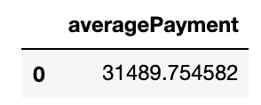

# 更智能的查询，而不是更难

> 原文：<https://towardsdatascience.com/sql-subqueries-f2c490bf772c?source=collection_archive---------65----------------------->

## 用子查询实现子查询

无论在哪个行业，关系数据库都是最常见的数据存储类型之一。使用 SQL(以任何形式)创建查询是访问数据的一种非常有效和容易的方法，但有时会有点混乱。查询可能会变得非常复杂，需要多种方法来正确获取正确的数据。当查询开始变长并变得复杂时，子查询是一种非常有用的方法，可以用更容易理解的方式对查询进行分段。


我们上面的表模式显示了一个有点复杂，但绝对不罕见的数据库。

# **标准连接**

我们将从一个常规查询开始，该查询将返回在该公司美国办公室工作的所有雇员。

```
# Establish an sqlite3 connection to our database
conn = sqlite3.Connection('data.sqlite')# Establish a connection cursor for building our query
cur = conn.cursor()# Use the cursor's execute method to execute the query
cur.execute("""SELECT lastName, firstName, officeCode
               FROM employees e
               JOIN offices o
               USING(officeCode)
               WHERE country = "USA";
             """)# Wrap our cursor in a pandas DataFrame
df = pd.DataFrame(cur.fetchall())# Utilize the cursor's description attribute to add corresponding
# column titles to our DataFrame
df.columns = [x[0] for x in cur.description]
```


我们的数据帧返回到上面的样子。我们使用简单的多对多连接，使用 officeCode 作为我们的键。这是一个非常简单的查询，但是有时在大型表模式中使用连接和主键/外键会造成混乱。现在让我们来看看如何使用子查询以一种不同且更简单的方式编写这个查询。

# 使用子查询

子查询本质上只是查询中的一个查询。我们将执行一个查询语句，该语句的条件依赖于一个完全独立的查询。听起来有点混乱，所以让我们看看我们在谈论什么。

```
cur.execute("""SELECT lastName, firstName, officeCode
               FROM employees
               WHERE officeCode IN (SELECT officeCode
                                    FROM offices 
                                    WHERE country = "USA");
                                    """)df = pd.DataFrame(cur.fetchall())
df.columns = [x[0] for x in cur.description]
df
```

哒哒！该查询将输出与前面代码中相同的数据帧。我们只是从子查询中创建的初始表中选择要素，而不是连接到新表。让我们尝试一个稍微复杂一点的问题。

**编写一个查询，返回雇员超过 5 人的办公室的所有雇员。**

这是一个特别困难的查询，因为它要求我们返回一个基于聚合条件的查询**，但是我们实际上并不返回聚合本身。我们需要创建一个条件，只选择符合该条件的员工。通常，我们使用“HAVING”或“GROUP BY”语句来检索聚合数据，但在这种情况下，我们希望对聚合进行过滤。这种情况正是子查询真正发挥作用的地方。**

```
cur.execute("""SELECT lastName, firstName, officeCode
               FROM employees
               WHERE officeCode IN (SELECT officeCode 
                                    FROM offices 
                                    JOIN employees
                                    USING(officeCode)
                                    GROUP BY 1
                                    HAVING COUNT(employeeNumber)>5);
                                    """)
df = pd.DataFrame(cur.fetchall())
df.columns = [x[0] for x in cur.description]
df.head(10)
```


在本例中，我们首先嵌套了一个包含条件语句的初始查询:“HAVING COUNT(employeeNumber) > 5”。光标暂时使这个新执行的内部查询成为新表，然后我们可以为我们的答案选择必要的特性。当我开始使用 SQL 时，帮助我理解这个过程的一个小技巧是首先从内部查询开始，包含我们的条件，然后从那里开始。

# **汇总数据的子查询**

在上一个查询中，我们选择了基于 **的**聚合条件，但是如果我们想要返回一个聚合函数结果呢？****

编写一个查询，返回所有客户的平均付款额。

```
cur.execute("""SELECT AVG(customerAvgPayment) AS averagePayment
               FROM (SELECT AVG(amount) AS customerAvgPayment
                     FROM payments
                     JOIN customers USING(customerNumber)
                     GROUP BY customerNumber);""")
df = pd.DataFrame(cur.fetchall())
df.columns = [x[0] for x in cur.description]
df
```



在这种情况下，我们实际上使用子查询来定义数学聚合函数。聚合函数“AVG(amount)AS customerAvgPayment”有别名，最初在嵌套语句中执行。剩下要做的就是选择聚合函数作为它自己的变量，瞧！

# **收尾**

对于编码和 SQL 来说，从来没有一种单一的方式来获得输出。编写查询和子查询的方法有很多，对于我来说，这是掌握 SQL 事件流的一个很好的方法。