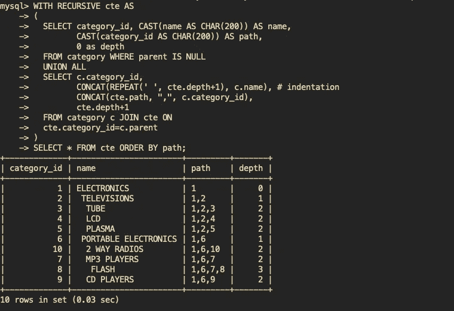
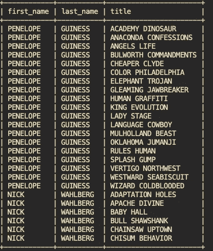
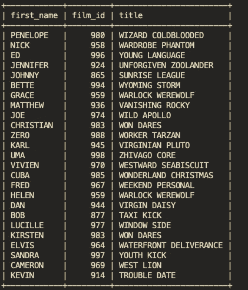
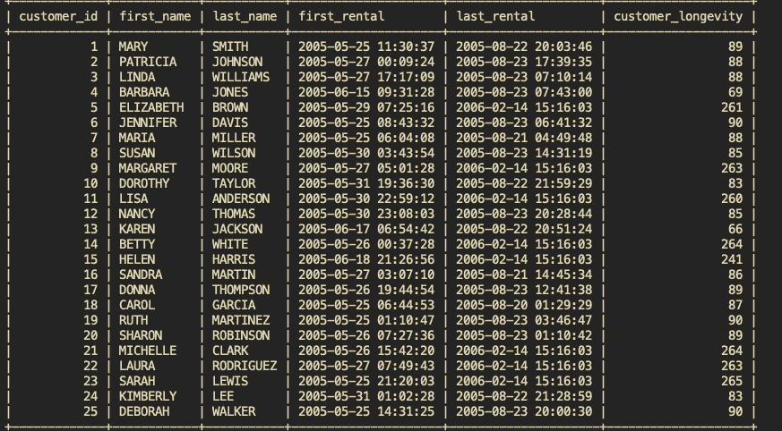
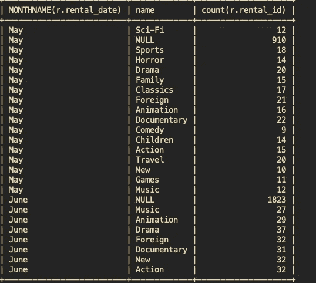
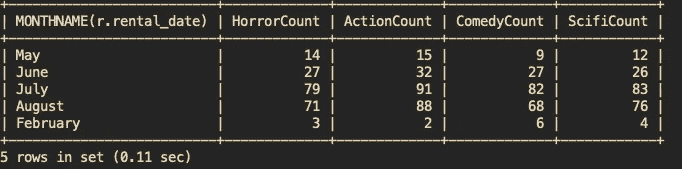
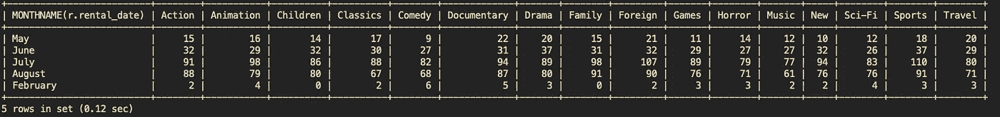
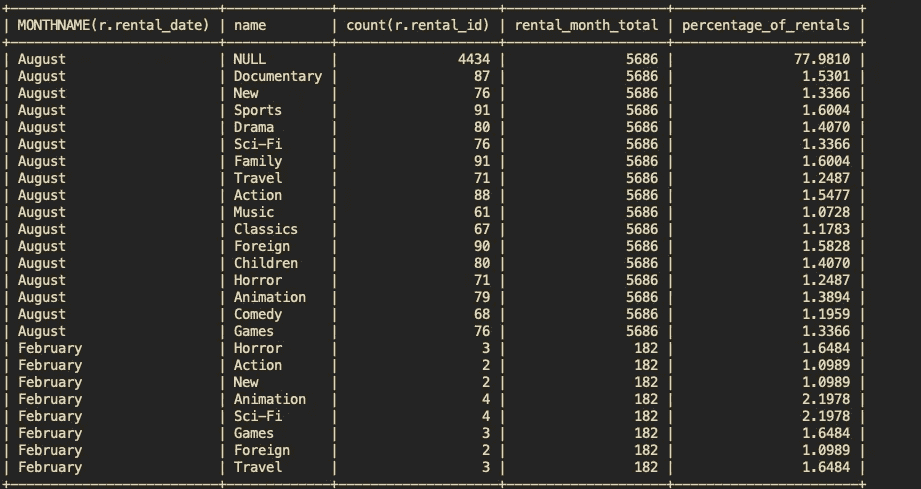
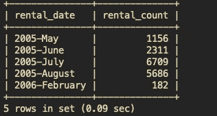
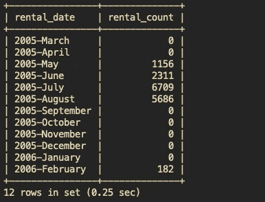

# 数据科学家的 SQL 技巧

> 原文：<https://towardsdatascience.com/sql-tricks-for-data-scientists-53298467dd5?source=collection_archive---------14----------------------->

## 利用 SQL 赢得胜利



递归 CTE

我发现自己被公司内部各个团队要求的 cron jobs 和 CSV 文件淹没了。不断有人要求导出新数据或更新这些导出数据。任何时候任何人想要添加一个字段，我都是这个任务的失败点。我必须首先记住哪个服务生成了该报告，以及该报告的要点。然后，我必须调查所需的新字段是否可用，是否可以从其他列派生，或者是否需要新的数据库连接。

我需要找到一个应用程序，它可以帮助我跟踪所有的报告，管理所有不同的数据库连接，并允许某人自己维护通知。最后一个重要的功能是卸载我的一些报告生成，并允许人们自助服务所有数据。

我选择了[元数据库](https://www.metabase.com/),因为它符合我一直在寻找的所有标准。它是开源的，支持各种不同的数据源，具有用户/权限管理、许多图表/仪表板选项和各种不同类型的通知。

只有一个问题—元数据库完全基于 SQL。我使用简单的选择来查询数据库并将数据转换成 CSV 的工作流将不可用。我不得不使用原始 SQL。我怎样才能在 SQL 中插入逻辑呢？我如何循环结果？如何生成日期范围？我如何使用滚动窗口？这些类型的问题听起来好像只有 SQL 的工作流不能解决问题。

但是，如果这些手术实际上是可能的呢？如果 SQL 实际上是一种[图灵](https://simple.wikipedia.org/wiki/Turing_complete#:~:text=Turing%20complete%20is%20a%20term,programming%20languages%20are%20Turing%2Dcomplete.)-带有递归的完整语言会怎样？如果有一种透视数据或使用窗口的方法会怎么样？下面我将介绍一些我在旅途中发现的技巧，以充分利用 SQL 的强大功能。

# 设置

*如果你想自己执行这些例子，你可以遵循下面的指令。如果你只是想阅读，跳到下一节。*

我使用 MySQL 8 和 sample [Sakila](https://dev.mysql.com/doc/sakila/en/) 数据库作为示例。如果你安装了 Docker，我已经提供了几行代码来运行 MySQL 8 服务器。

下面启动 docker 容器。

```
docker run -d --publish=3307:3306 --name=mysql_test -e MYSQL_ROOT_PASSWORD=root mysql/mysql-server:latest
```

数据库示例数据库可以通过下载示例文件并提取它们来加载。

```
#enter the shell
docker exec -it mysql_test bin/bash#install wget
yum install wget#get file
wget [https://downloads.mysql.com/docs/sakila-db.tar.gz](https://downloads.mysql.com/docs/sakila-db.tar.gz)#install tar
yum install tar#extract files
tar xvzf sakila-db.tar.gz#start the mysql console, the password was set in the docker run cmd
mysql -u root -p#import the schema
SOURCE sakila-db/sakila-schema.sql#import the data
SOURCE sakila-db/sakila-data.sql#use the newly created database
use sakila;#if all went well, the following cmd should show all the tables
show tables;
```

设置完成后，您可以自己尝试这些示例。

# 查找重复事件

我将从一个更简单但仍然强大的例子开始。如果一个表与另一个表具有一对多或多对多的关系，则该表与该表的联接会导致交叉(或笛卡尔)联接。我们可以使用子查询将结果集缩小到每个表中的一行。

例如，假设我们想按字母顺序查找每个演员和他们出现的最后一部电影。

```
SELECT a.first_name, a.last_name, f.title 
FROM actor a 
JOIN film_actor fa ON fa.actor_id = a.actor_id 
JOIN film f ON f.film_id = fa.film_id;
```



上一个查询的输出示例

上面的查询将列出所有演员和所有电影。但是如果您只想列出一部电影——最后一部——我们需要添加一个子查询，以便只使用我们想要的电影。

```
SELECT a.first_name, fa.film_id, f.title 
FROM actor a 
LEFT JOIN (
  SELECT actor_id, MAX(film_id) as film_id 
  FROM film_actor group by actor_id
) fa ON fa.actor_id = a.actor_id 
LEFT JOIN film f ON f.film_id = fa.film_id ;
```



仅列出一部电影时的示例响应

对于具有重复事件(如登录和创建对象)的表格，您可以查找第一个或最后一个事件，或者第一个和最后一个事件之间的差异。下面是查找客户寿命的 SQL 语句，其中寿命定义为他们第一次和最后一次租赁日期之间的差异(天数)。

```
SELECT c.customer_id,c.first_name, c.last_name, r.first_rental, r.last_rental, DATEDIFF(r.last_rental, r.first_rental) as customer_longevity 
FROM customer c 
LEFT JOIN (
  SELECT customer_id, MIN(rental_date) as first_rental, MAX(rental_date) AS last_rental 
  FROM rental GROUP BY customer_id
) r ON r.customer_id = c.customer_id;
```



租金差异的样本响应

# 绕轴旋转

您希望将行转换为列以用于演示和/或图表制作的数据可以根据需要进行透视和汇总。以下面的查询和示例输出为例。

```
SELECT MONTHNAME(r.rental_date), c.name, count(r.rental_id) 
FROM rental r 
LEFT JOIN film f ON f.film_id = r.inventory_id 
LEFT JOIN film_category fc ON fc.film_id = f.film_id 
LEFT JOIN category c ON c.category_id = fc.category_id 
GROUP BY MONTHNAME(r.rental_date),c.name;
```



按月份和类型分组的示例响应

当我们可以将每月细分移动到每月一行，而不是每个类别每月一行时的用例。

```
SELECT MONTHNAME(r.rental_date), 
COUNT(CASE WHEN c.name = ‘Horror’ THEN r.rental_id ELSE NULL END) AS HorrorCount, 
COUNT(CASE WHEN c.name = ‘Action’ THEN r.rental_id ELSE NULL END) AS ActionCount, 
COUNT(CASE WHEN c.name = ‘Comedy’ THEN r.rental_id ELSE NULL END) AS ComedyCount, 
COUNT(CASE WHEN c.name = ‘Sci-Fi’ THEN r.rental_id ELSE NULL END) AS ScifiCount 
FROM rental r 
LEFT JOIN film f ON f.film_id = r.inventory_id 
LEFT JOIN film_category fc ON fc.film_id = f.film_id 
LEFT JOIN category c ON c.category_id = fc.category_id 
GROUP BY MONTHNAME(r.rental_date);
```



将行旋转到列

我没有使用所有类别来避免一页 SQL 语句，但是您可以添加其他列来完成查询。MySQL 没有一种内置的方法来动态创建每一列，但是有能力使用一个准备好的语句来避免必须拼出每一列。

```
SET [@sql](http://twitter.com/sql) = NULL;
SELECT
 GROUP_CONCAT(DISTINCT
 CONCAT(
 ‘COUNT(CASE WHEN c.name = ‘’’,
 name,
 ‘’’ THEN r.rental_id ELSE NULL END) AS `’,
 name,
 ‘`’
 )
 ) INTO [@sql](http://twitter.com/sql)
FROM category;
SET [@sql](http://twitter.com/sql) = CONCAT(‘SELECT MONTHNAME(r.rental_date), ‘, [@sql](http://twitter.com/sql) ,’ FROM rental r LEFT JOIN film f ON f.film_id = r.inventory_id LEFT JOIN film_category fc ON fc.film_id = f.film_id LEFT JOIN category c ON c.category_id = fc.category_id GROUP BY MONTHNAME(r.rental_date)’);PREPARE stmt FROM [@sql](http://twitter.com/sql);
EXECUTE stmt;
DEALLOCATE PREPARE stmt;
```



所有的流派列

**注意**:group _ concat _ max _ len 变量需要足够长，足以容纳所有可能的类别。默认值为 1024，但是如果您在尝试运行上述 SQL 语句时遇到任何错误，则可以根据会话进行更改。

```
SET SESSION group_concat_max_len = 1000000;
```

# 滚动窗户

继续聚合数据的主题，我们还可以使用窗口函数来创建滚动聚合。前面我们使用了一个查询来按类型和月份列出所有的租赁。我们如何添加另一列来显示每月的运行总数，以及该月每种类型的租赁百分比？

```
SELECT MONTHNAME(r.rental_date), c.name, count(r.rental_id),     SUM(count(r.rental_id)) over(PARTITION BY MONTHNAME(r.rental_date)) as rental_month_total, count(rental_id) / SUM(count(r.rental_id)) over(PARTITION BY MONTHNAME(r.rental_date)) * 100 as percentage_of_rentals 
FROM rental r 
LEFT JOIN film f ON f.film_id = r.inventory_id 
LEFT JOIN film_category fc ON fc.film_id = f.film_id 
LEFT JOIN category c ON c.category_id = fc.category_id 
GROUP BY MONTHNAME(r.rental_date),c.name;
```



租赁类型百分比的示例结果

`Over`关键字允许您定义如何对数据进行分区。在这种情况下，我们使用租赁日期月份。

# 生成数据

我经常会遇到我想要长期跟踪的数据。问题是有些情况下数据很稀疏，可能没有我想要显示的每个时间单位的值。例如，以下面的查询为例:

```
SELECT DATE_FORMAT(r.rental_date,"%Y-%M") as rental_date, count(r.rental_id) as rental_count FROM rental r  
LEFT JOIN film f ON f.film_id = r.inventory_id  
LEFT JOIN film_category fc ON fc.film_id = f.film_id  
LEFT JOIN category c ON c.category_id = fc.category_id  
GROUP BY DATE_FORMAT(r.rental_date,"%Y-%M");
```



现有数据的年份和月份

前面的查询按月显示了计数，但是如果我想看到其他列的计数为 0，该怎么办呢？

```
WITH RECURSIVE t(v) as (   
  SELECT  DATE('2005-03-01')   
  UNION ALL   
  SELECT v + INTERVAL 1 MONTH   
  FROM t    
  LIMIT 12 
) 
SELECT DATE_FORMAT(t.v,"%Y-%M") as rental_date, count(r.rental_id) as rental_count FROM rental r  
LEFT JOIN film f ON f.film_id = r.inventory_id   
LEFT JOIN film_category fc ON fc.film_id = f.film_id   
LEFT JOIN category c ON c.category_id = fc.category_id   
RIGHT JOIN t on DATE_FORMAT(t.v,"%Y-%M")  = DATE_FORMAT(r.rental_date,"%Y-%M") 
GROUP BY DATE_FORMAT(t.v,"%Y-%M");
```



12 个月零灌装

递归 cte 看起来比实际情况更吓人。在这个问题上，一个比我能提供的更好的解释可以在这里找到。

# 结论

SQL 提供了一种强大的语言来提取数据。我介绍了一些技巧，关于如何使用 SQL 来处理更复杂的过滤和聚合，而不需要在数据库之外执行这些操作。

*我向那些希望为组织添加商业智能报告引擎的人推荐* [*元数据库*](https://www.metabase.com/) *。唯一需要满足的标准是让我的同事自助生成报告。但这可能是我对所有报告请求说“是”的一个功能。*