# SQL Server 的 SQL 单元测试存储过程

> 原文：<https://towardsdatascience.com/sql-unit-testing-stored-procedure-for-sql-server-9565d86ac458?source=collection_archive---------46----------------------->

## 在本文中，我们将对招聘服务的 SQL Server 数据库的存储过程进行 SQL 单元测试。


图片来自 [Piqsels](https://www.piqsels.com/en/public-domain-photo-zkulb) (CC0)

单元测试是数据库开发过程的重要组成部分。它的主要目标是测试数据库对象的组成部分，以便在项目早期识别任何故障或缺陷。这种方法允许数据库开发人员确保他们所做的更改得到验证，并且项目将正常工作。在本文中，我们将主要关注对 SQL Server 数据库中的存储过程进行单元测试，并举例说明使用 dbForge 单元测试工具进行单元测试是多么简单。

之前，我们讨论了[为招聘服务创建 SQL Server 数据库的过程。](/sql-database-design-basics-with-example-8dcce4b0c687)


Img.1 .招聘服务的数据库模式

如上所示，数据库包含以下实体:

*   雇员
*   公司
*   位置
*   项目
*   技能

尽管如此，在这一系列文章中，我们不知何故忽略了单元测试的一个重要方面。所以现在，我建议我们更仔细地研究一下这种方法，并通过实现 SearchEmployee 存储过程来举例说明这种方法，该存储过程用于基于特定技能的员工搜索。为了确保数据的完整性，我们应该在技能表上添加一个唯一的约束，如下所示:

```
ALTER TABLE [dbo].[Skill] ADD CONSTRAINT UniqueSkillName UNIQUE(SkillName);
```

但是，在此之前，请使用以下查询确保 SkillName 字段中的数据不包含任何重复条目:

```
SELECT 
      [SkillName] 
FROM [JobEmpl].[dbo].[Skill] 
GROUP BY [SkillName] 
HAVING COUNT(*) > 1;
```

假设您有重复的条目，那么您需要将所有记录规范化为 SkillName 字段中彼此相关的唯一值。

好了，完成了一点:我们在技能名称中创建了一个惟一性约束。

现在，该实现 SearchEmployee 存储过程了，如下所示:

为什么不更详细地研究一下 SearchEmployee 存储过程的工作呢？

首先，它有两个输入参数:

1.  @SkillList 是技能列表，用分号分隔。
2.  @CountNotSkill 表示可以缺席的技能数(默认为 1)。

现在让我们转到 SearchEmployee 存储过程的主体:

1.  首先，我们定义了一个变量@count_skills，它用于计算数据库中与输入参数@SkillList 中报告的数量相对应的技能数量。
2.  接下来，用内置函数 [STRING_SPLIT](https://docs.microsoft.com/en-us/sql/t-sql/functions/string-split-transact-sql?view=sql-server-2017) 将@SkillList 字符串转换成临时表#tbl_skill_tmp。
3.  然后，从技能表中找到所有合适的技能，并放入一个名为#tbl_skill_tmp 的新临时表中。
4.  之后@算技能按照 par.1 算。
5.  随后，基于设定的技能收集关于项目(项目表)和作业历史(作业历史表)的必要信息；结果会进入一个名为#tbl_skill_tmp 的临时表。
6.  接下来，在 par 中获得的信息。5 根据 skill 和 employee 的标识符进行分组，结果放入临时表#tbl_res。
7.  此外，在段落中获得的信息。6 与 Employee 表相结合，以获得雇员的详细信息(名和姓)，并且结果被存储到临时表#tbl_res2 中。该查询还统计每项技能在年、月和天中应用了多长时间，以使后续分析更加方便。
8.  之后，从 par.7 的结果中检索雇员的信息，并将最终结果放入临时表#tbl_empl 中。
9.  然后，对表#tbl_skill 和#tbl_empl 进行笛卡尔积运算，结果放入临时表#tbl_skill_empl。
10.  接下来，创建一个名为#tbl_res3 的临时表，它包括两个临时表#tbl_skill_empl 和#tbl_res2 的乘积，其中每对 employee 和 skill 都具有在第 7 段中获得的匹配信息
11.  然后，将符合输入参数的员工标识符收集到临时表#tbl_empl_res 中。此时，如果技能已经使用了至少 6 个月，则该技能被视为有效。
12.  接下来，跟踪员工的结果输出和他们的技能，使用时间以年、月和天来衡量，以及他们的应用程序的开始和结束日期。
13.  然后，您将看到关于我们感兴趣的技能的员工历史的详细总结。
14.  最后，我们删除在这个存储过程中创建的所有临时表。

经过上述步骤，我们可以提取出在 C#和 T-SQL 语言以及 ASP.NET 技术方面有能力的员工的名字，条件是最多有一个人缺乏技能，如下所示:

```
EXEC [dbo].[SearchEmployee] @SkillList = N'C#;T-SQL;ASP.NET'
                                                ,@CountNotSkill = 1;
```

# 创建并运行存储过程的 SQL Server 单元测试

为了简化单元测试，这个存储过程应该分成两部分:第一部分输出主要信息，第二部分输出找到的雇员的详细历史记录。然而，为了便于理解，我们将展示如何对存储过程应用单元测试。

至于我们要应用的工具:它是[单元测试](https://www.devart.com/dbforge/sql/unit-test/)工具，内置于 SSMS，也是[db forge Studio for SQL Server](https://www.devart.com/dbforge/sql/studio/)的一部分。

让我们来看看这个工具在 [SSMS](https://docs.microsoft.com/en-us/sql/ssms/download-sql-server-management-studio-ssms?view=sql-server-2017) 中的功能。

右键单击 JobEmpl 数据库，并在下拉列表中选择单元测试“安装测试框架…”:

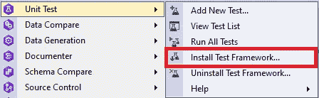

Img.2 .开始安装测试框架

类似地，右键单击 JobEmpl 数据库中的任何节点都可以调用该菜单。

接下来，确保服务器和数据库正确无误，然后单击“安装”:

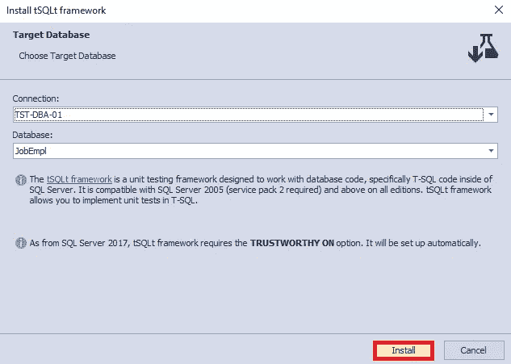

Img.3 .安装测试框架

安装过程如下:

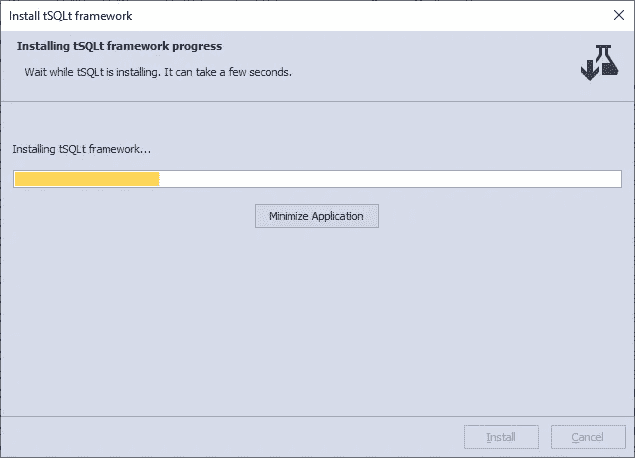

Img.4 .测试框架安装流程

安装过程结束时，您将收到一条完成消息。单击“完成”按钮:

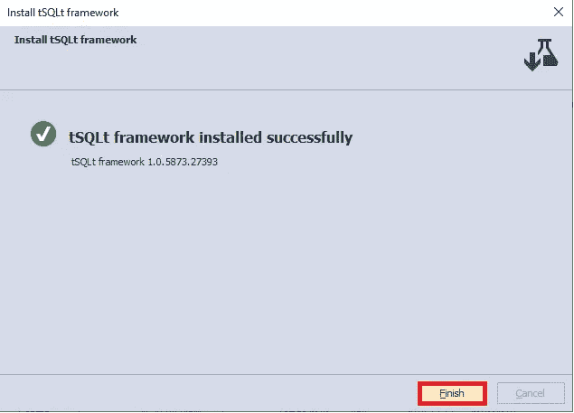

Img.5 .测试框架安装的成功完成

请注意 JobEmpl 数据库。在下面，您可以看到 tSQLt 对象(表、视图、函数和存储过程)已经创建:

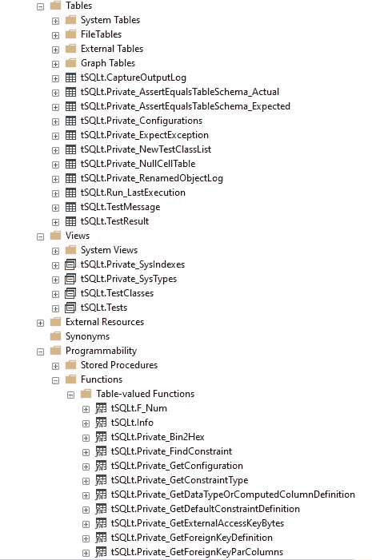

目标 5–1 创建的 tSQLt 对象(第 1 部分)

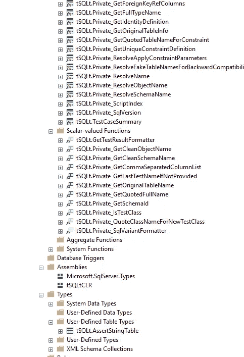

img . 5–2 创建 tSQLt 对象(第 2 部分)

接下来，要创建一个测试，右键单击 JobEmpl 数据库并选择单元测试“添加新测试…”命令:

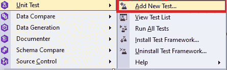

Img.6 .新单元测试的创建

我们现在需要为名为 UT_SearchEmployee_Exception 的新测试定制设置，并单击“Add Test”:

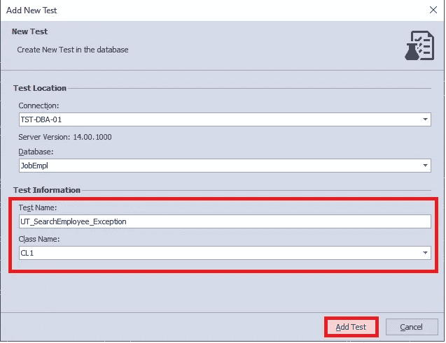

Img.7 .自定义已创建测试的设置

测试创建结束时，会出现一个信息窗口。单击“完成”按钮:

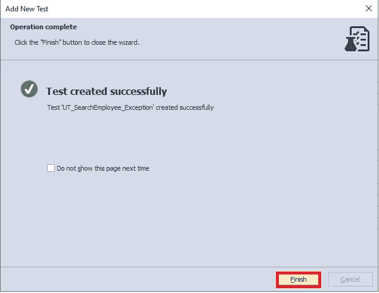

Img.8 .测试创建的成功完成

然后，您将在 SSMS 看到一个新选项卡，代码如下:

```
-- Comments here are associated with the test. 
-- For test case examples, see: http://tsqlt.org/user-guide/tsqlt-tutorial/ ALTER PROCEDURE CL1.[test UT_SearchEmployee_Exception] 
AS 
BEGIN 
--Assemble 
-- This section is for code that sets up the environment. It often 
-- contains calls to methods such as tSQLt.FakeTable and tSQLt.SpyProcedure 
-- along with INSERTs of relevant data. 
-- For more information, see http://tsqlt.org/user-guide/isolating-dependencies/ --Act 
-- Execute the code under test like a stored procedure, function or view 
-- and capture the results in variables or tables. --Assert 
-- Compare the expected and actual values, or call tSQLt.Fail in an IF statement. 
-- Available Asserts: tSQLt.AssertEquals, tSQLt.AssertEqualsString, tSQLt.AssertEqualsTable 
-- For a complete list, see: http://tsqlt.org/user-guide/assertions/ EXEC tSQLt.Fail 'TODO:Implement this test.' END;
```

从链接来看，该工具有几个内置函数(tSQLt 框架),这些函数有很多功能:在它们的帮助下，您可以针对不同的条件测试不同的数据库对象。让我们考虑一些例子:
1)你可以检查两个表中的数据是否匹配。
2)您可以检查某个对象是否在数据库中(如果在，则测试运行成功，如果不在，则测试失败)，等等。

唉，在 T-SQL 中不可能捕获多个输出(几个集合)。通常，这在中执行。NET，这是一个创建复杂测试的安全地方。最近，有一种倾向，主要是进行测试。MS SQL Server 的. NET 级别。

无论如何，让我们回到 T-SQL。

为了简单起见，我们在存储过程中注释掉详细信息的输出，也就是说，我们在 SearchEmployee:

在我们的例子中，测试相当简单，它将检查以下规则:必须有数据，否则，它将输出一条消息，说明技能可能不正确，并且存储过程没有正常工作。

未能实现该规则表明，要么数据不存在，必须基于不同的标准进行搜索，要么标准定义不正确，必须进行修正。这也可能意味着存储过程本身无法正常运行。

因此，我们返回到之前生成的代码，并将其更改如下:

```
-- Comments here are associated with the test. 
-- For test case examples, see: http://tsqlt.org/user-guide/tsqlt-tutorial/ 
ALTER PROCEDURE CL1.[test UT_SearchEmployee_Exception] 
AS 
BEGIN 
  CREATE TABLE #tbl ([EmployeeID] INT, [LastName] NVARCHAR(255),  [FirstName] NVARCHAR(255), 
  [SkillID] INT, [SkillName] NVARCHAR(255), [StartDate] DATETIME, [FinishDate] DATETIME, 
  [Years] INT, [Months] INT, [Days] INT);   INSERT INTO #tbl 
  EXEC [dbo].[SearchEmployee] @SkillList = N'programming'
                                             ,@CountNotSkill = 1;   IF(NOT EXISTS(SELECT TOP(1) 1 FROM #tbl)) 
    EXEC tSQLt.Fail 'Nothing found. Check input parameters and stored procedure code';   DROP TABLE #tbl; 
END;
```

现在，让我们在 JobEmpl 数据库上再单击一次右键，并在下拉菜单中选择单元测试“查看测试列表”命令:

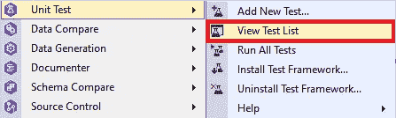

Img.9 .调用查看测试列表命令

之后，我们选择我们需要的测试并运行它:

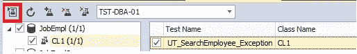

Img.10 .运行给定的测试

正如我们在下面看到的，测试并不成功:

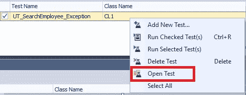

Img.11 .运行单元测试导致错误

需要强调的是，您可以选择多个单元测试并启动它们，或者只启动其中的几个。如有必要，您可以创建和删除测试。在这里，我们将通过点击“打开测试”命令来打开所选择的测试:


Img.12 .选择打开单元测试的命令

我们希望将代码更改如下:

```
-- Comments here are associated with the test. 
-- For test case examples, see: http://tsqlt.org/user-guide/tsqlt-tutorial/ 
ALTER PROCEDURE CL1.[test UT_SearchEmployee_Exception] 
AS 
BEGIN 
    CREATE TABLE #tbl ([EmployeeID] INT, [LastName] NVARCHAR(255), [FirstName] NVARCHAR(255), 
    [SkillID] INT, [SkillName] NVARCHAR(255), [StartDate] DATETIME, [FinishDate] DATETIME, 
    [Years] INT, [Months] INT, [Days] INT);     INSERT INTO #tbl 
    EXEC [dbo].[SearchEmployee] @SkillList = N'C#;T-SQL;ASP.NET'
                                               ,@CountNotSkill = 1;    IF(NOT EXISTS(SELECT TOP(1) 1 FROM #tbl)) 
         EXEC tSQLt.Fail 'Nothing found. Check input parameters and stored procedure code';    DROP TABLE #tbl; 
END;
```

接下来，让我们再次运行测试:

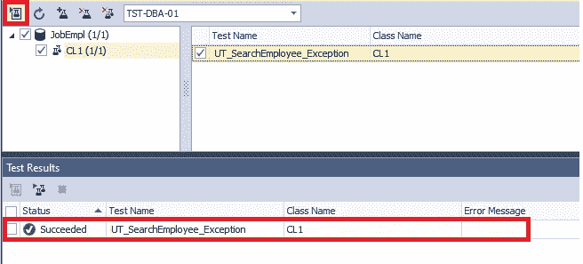

Img.13 .单元测试的成功完成

结果，测试成功运行。错误的发生仅仅是因为“编程”技能不在数据库中，我们必须进一步详细描述该技能。

除此之外，我们可以重命名测试类和测试本身，并更新测试信息:

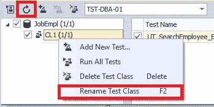

Img.14 .重命名和更新测试类信息的可能性

您也可以运行测试并在窗口底部的测试结果中打开更改:

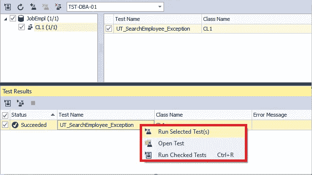

Img.15 .测试结果功能

最终，在单元测试的帮助下，您可以覆盖所创建的解决方案的大部分甚至全部功能。底线是单元测试是 DevOps 基本原则的一部分，因为它们在这个自动化过程中扮演着关键角色之一。如果您努力加快和保护数据库发布，您可以应用 DevOps automation 的几个解决方案之一，例如[devo PS Automation for SQL Server](https://www.devart.com/dbforge/sql/database-devops/)。

*原载于 2020 年 8 月 31 日*[*【https://blog.devart.com】*](https://blog.devart.com/sql-unit-testing-stored-procedure-with-dbforge-unit-test-for-sql-server.html)*。*