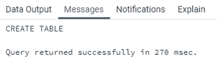
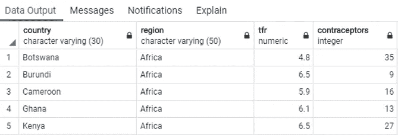
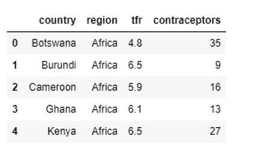
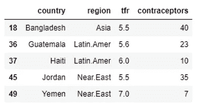
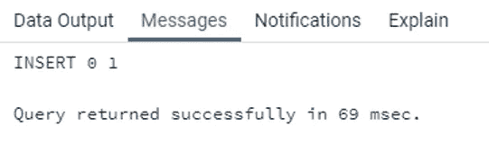
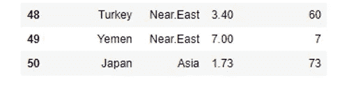
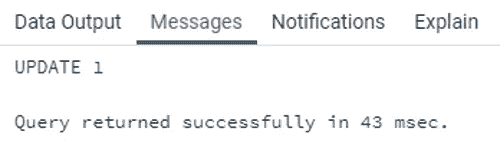
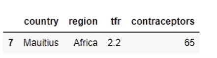

# SQL vs 熊猫——2020 年选哪个？

> 原文：<https://towardsdatascience.com/sql-vs-pandas-which-one-to-choose-in-2020-a98f236829ef?source=collection_archive---------7----------------------->

## 最流行的数据分析选项之间的详细比较—第 1/2 部分

*SQL* 已经存在了几十年，是一个非常受欢迎的选项，因为几乎每个人都知道它，而且它很容易学习和理解。很久以后，熊猫*——我们大多数人从此坠入爱河。今天，我们将开始比较这两者，从基础到更高级的东西—分析方面。*

**

*瑞安·赫顿在 [Unsplash](https://unsplash.com?utm_source=medium&utm_medium=referral) 上的照片*

**SQL* 和 *Python* 是当前时代数据分析师和数据科学家几乎不可或缺的两种语言。当任何人开始他们的数据分析之旅时，他们通常首先从 *SQL* 开始，然后慢慢转向 *R* 和 *Python* 。*

*为了使这种转换更加容易，我们将尝试比较一下 *SQL* 和 *Pandas* 中的一些非常重要的命令。对于外行来说， *SQL* 是一种用于在关系数据库中存储、操作和检索数据的语言。Pandas 是 python 中的一个库，用于数据分析和操作。*

*这是该系列的第一部分，包括:*

*   *导入数据*
*   *挑选*
*   *在哪里*
*   *插入*
*   *更新*

*两种语言的选项。下一部分涵盖了更高级的主题，比如连接、联合和分组。*

*出于本文的目的，我们使用了 [*生育和避孕*](http://www-eio.upc.edu/~pau/cms/rdata/csv/car/Robey.csv) 数据集。一旦我们下载了数据集，让我们开始在 *SQL* 和 *Pandas* 中导入数据集文件。*

# *导入数据*

*个人感觉相比*熊猫*在 *SQL* 中导入数据文件有点繁琐。在 *Pandas* 中，我们可以简单地使用`pandas.read_csv()` 然后瞧——我们的文件被导入，一个数据框已经准备好，我们只需一个命令就可以浏览。这不是很好吗？*

## *结构化查询语言*

*但是在 *SQL* 中，事情就有点不一样了。我们必须首先使用`CREATE TABLE` 语句创建一个表，其字段类似于文件中提到的字段，然后从文件中复制数据。你可以参考下面给出的代码。*

```
*CREATE TABLE fert_data (
    country character varying(30),
    region character varying(50),
    tfr numeric,
    contraceptors integer
);*
```

**

*查询成功返回，并创建了一个名为 *fert_data* 的新表。现在，为了从 CSV 文件导入记录，我们必须使用如下所示的`COPY`命令。*

```
*copy fert_data from ‘Path\to\file’ with delimiter ‘,’ csv header encoding ‘windows-1251’;*
```

**

## *熊猫*

*现在将上面的工作与*熊猫*中的这段代码进行比较，用于导入文件。*

```
*df = pd.read_csv(’Path\to\your\dataset’)*
```

*这就是你要做的。*

# *挑选*

*一旦我们导入了数据集，我们可能希望浏览一下其中的记录，以便更好地理解数据集。在 *SQL* 中，我们使用一个`SELECT`语句从表中获取记录。该语句将如下所示:*

```
*SELECT column_name1, column_name2,…
FROM table_name;*
```

*如果你不想看到所有的记录呢？是的，您可以使用`TOP`或`LIMIT`关键字来限制行数。*

*在熊猫中，我们用`head()` 和`tail()` 分别取前 5 行和后 5 行。这相当于 *SQL* 中的`SELECT * FROM table LIMIT 5`。如果必须从数据框中选择特定的列，那么语法应该如下所示:*

```
*df[[‘column_name1’, ‘column_name2’]]*
```

*这里有一个例子可以更好地说明这一点。我们将遵循这里的示例程序，首先编写 *SQL* 代码，然后编写相应的 *Pandas* 代码。*

## *结构化查询语言*

```
*SELECT *
FROM fert_data
LIMIT 5;*
```

**

## *熊猫*

```
*df.head()*
```

**

# *在哪里*

*在 *SQL* 中，`WHERE`子句用于根据条件过滤记录。子句通常与条件和逻辑运算符结合使用，以形成过滤条件。`WHERE`子句的语法如下所示:*

```
*SELECT *
FROM table_name
WHERE condition_expression;*
```

*在 *Pandas* 中，没有像 *SQL* 那样的过滤记录的单一命令。我们可以使用布尔索引和位置索引。在*熊猫*索引中，通过逻辑条件计算布尔掩码来过滤数据。以下各项的语法如下:*

*布尔索引:*

```
*df[df[‘column_name’] == value]*
```

*位置索引:*

```
*df[df.loc[‘column_name’] == value]*
```

*在 *SQL* 和*熊猫*中，我们都可以使用比较(>、<、> =、< =、！=、==)和逻辑运算符(' and '、' or '、' not '或“|”、'&'、' ~ ')等符号)。*

*这里有一个简单的例子，我们希望找到不是来自非洲地区，但 TFR 在 5.5 和 7 之间的记录:*

## *结构化查询语言*

```
*SELECT country, tfr
FROM fert_data
WHERE tfr BETWEEN 5.5 AND 7 AND region != ‘Africa’;*
```

**

## *熊猫*

```
*df.loc[((df.tfr >= 5.5) & (df.tfr <= 7)) & (df.region !=’Africa’)]*
```

**

# *插入*

*`INSERT`语句在 *SQL* 中使用，用于在数据库表中插入行。插入新记录的语法如下所示:*

```
*INSERT INTO table_name(column_name_1, column_name_2,…) VALUES (value1, value2,…);*
```

*在*熊猫*中，没有在数据框中插入新行的特定功能。我们可以使用`concat()`或`append()`等工具来执行这个任务。但是最常用的是`append()`。*

```
*df = df.append(new_row_to_be_inserted, ignore_index=True)*
```

*为了更加清楚，让我们插入一个新行，其中包含有关日本的详细信息。*

## *结构化查询语言*

```
*INSERT INTO fert_data(country, region, tfr, contraceptors)
VALUES (‘Japan’,’Asia’,1.73,73);*
```

**

## *熊猫*

```
*data = {
    ‘country’: ‘Japan’, 
    ‘region’: ‘Asia’, 
    ‘tfr’:1.73, 
    ‘contraceptors’ : 73
}df = df.append(data, ignore_index=True)*
```

**

*从上图中可以看到，在第 50 个索引处创建了一个新行。*

# *更新*

*在 *SQL* ，`UPDATE`语句用于更新或修改现有记录的值。update 语句的语法如下:*

```
*UPDATE table_name
SET column_name = ‘modified_value’
WHERE condition;*
```

*在 *Pandas* 中，没有更新现有行的特定函数。一个常见的程序是使用位置索引(如过滤部分所述)来定位修改的位置，然后给它分配一个新值。这几乎就像一个变量赋值。*

*让我们尝试一个例子来详细理解它——将 Mauitius 的逆变桥数量更新为‘65’。*

## *结构化查询语言*

```
*UPDATE fert_data
SET contraceptors = ‘65’
WHERE country = ‘Mauitius’;*
```

**

*查询成功返回，您可以看到值已经更新。*

## *熊猫*

```
*df.loc[df[‘country’] == ‘Mauitius’, ‘contraceptors’] = 65*
```

*首先，我们找到了国家为“Mauitius”的行，然后将“contraceptors”字段的值设置为 65。*

**

# *在你走之前*

*如你所见，SQL*和 *Pandas* 在某些方面都更好，而且没有明显的赢家。对于一些任务，比如插入和更新， *SQL* 是明显的赢家——另一方面，由于代码可读性更强、更易于理解， *Pandas* 不需要您事先为数据创建数据结构，这可以节省大量时间。**

*想象一下创建一个包含 100 多列的表，或者将数据组织到多个表中并使用连接。屁股疼。*

*我们将在下一篇文章中讨论更高级的主题，比如分组、联合和连接，所以请保持关注。*

*感谢阅读。*

**喜欢这篇文章吗？成为* [*中等会员*](https://medium.com/@radecicdario/membership) *继续无限制学习。如果你使用下面的链接，我会收到你的一部分会员费，不需要你额外付费。**

*[](https://medium.com/@radecicdario/membership) [## 通过我的推荐链接加入 Medium-Dario rade ci

### 作为一个媒体会员，你的会员费的一部分会给你阅读的作家，你可以完全接触到每一个故事…

medium.com](https://medium.com/@radecicdario/membership)* 

*加入我的私人邮件列表，获得更多有用的见解。*