# SQL vs 熊猫——2020 年选哪个？第二部分

> 原文：<https://towardsdatascience.com/sql-vs-pandas-which-one-to-choose-in-2020-part-2-9268d4a69984?source=collection_archive---------35----------------------->

## 最流行的数据分析选项之间的详细比较—第 2/2 部分

SQL 和熊猫并不是新技术。尽管如此，为这两种技术找到对应的功能并不是一件容易的事情。这就是这篇文章和上一篇文章发挥作用的地方——为你提供两者之间的详细比较。


本杰明·沃罗斯在 [Unsplash](https://unsplash.com?utm_source=medium&utm_medium=referral) 上拍摄的照片

几天前，我已经讨论了这个由两部分组成的系列的第一部分，讨论了这两种技术之间更简单的比较:

[](/sql-vs-pandas-which-one-to-choose-in-2020-a98f236829ef) [## SQL vs 熊猫——2020 年选哪个？

### 最流行的数据分析选项之间的详细比较—第 1/2 部分

towardsdatascience.com](/sql-vs-pandas-which-one-to-choose-in-2020-a98f236829ef) 

首先阅读那篇文章不是先决条件，但肯定会帮助你更好地理解这两者。这些技术不是为同样的工作设计的，但是很高兴看到两者之间对应的功能。如前所述，今天我们将讨论更高级的主题:

*   连接
*   联合
*   分组

在我们这样做之前，让我们从简单的删除语句开始。

# 删除

`DELETE`语句在 *SQL* 中用于从表中删除或移除一行。在 *SQL* 中删除行的语法如下:

```
DELETE FROM table_name
WHERE condition;
```

在*熊猫*中删除一行略有不同。在 *Pandas* 中，我们不删除一行，我们只是选择我们需要的部分，然后丢弃其余的部分。如果你觉得这是个谜，不要担心，这个例子会进一步说明它。

假设我们想删除亚洲地区的所有记录。

## 结构化查询语言

```
DELETE FROM fert_data
WHERE region = ‘Asia’;
```

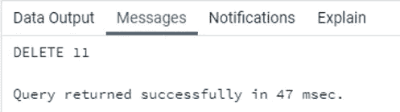

已成功删除行。现在让我们看看如何在*熊猫*中执行这个任务。

## 熊猫

```
df = df.loc[df[‘region’] != ‘Asia’]
```

这里，我们选择了区域不是“亚洲”的所有行，然后将结果集分配给我们当前的数据框。这意味着我们已经排除了区域为“亚洲”的所有行。

# 连接

`JOINS`用于 *SQL* 中，根据特定条件将两个或多个表连接或合并在一起。在 *SQL 中主要有四种类型的连接:* `LEFT`、`RIGHT`、`INNER`、`FULL`。以下是 JOIN 的语法:

```
SELECT *
FROM table_name_1 as t1 JOIN table_name_2 as t2
ON t1.column_name_1 = t2.column_name_2;
```

在 *Pandas* 中，我们可以使用`merge()` **来连接两个或多个数据帧。**默认情况下，它会执行内部连接。但是您可以使用`how`参数定制它来执行其他连接。`pd.merge()`的基本语法如下:

```
merge(left_df, right_df, how=’inner’, on=condition)
```

这里有一个例子来说明连接。

## 结构化查询语言

下面给出了一个名为 *country_sub_region* 的表格。我们必须使用内部连接将这个表与 *fert_data* 连接起来。

```
SELECT country, sub_region
FROM country_sub_region;
```

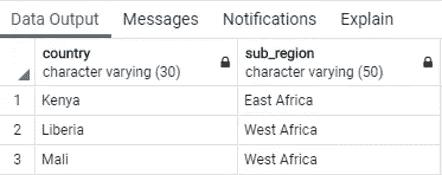

```
SELECT * FROM
fert_data as f INNER JOIN country_sub_region as c
ON f.country = c.country;
```

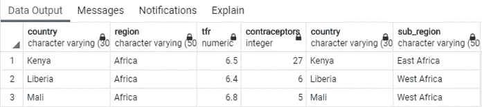

这些表已成功联接。让我们看看如何在*熊猫*中加入他们。

## 熊猫

这里，我们创建了一个类似于 *country_sub_region* 表的数据框:

```
country_sub_reg = data = [
    [‘country’, ’subregion’],
    [‘Kenya’, ’East Africa’],
    [‘Liberia’, ’West Africa’],
    [‘Mali’, ’West Africa’]
]df_sr = pd.DataFrame(country_sub_reg[1:],columns=country_sub_reg[0])
```

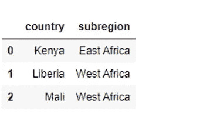

我们将使用内部连接将`df_sr`与*国家*字段上的`df`合并:

```
pd.merge(df, df_sr, on=’country’, how=’inner’)
```

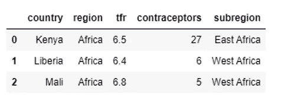

# 联盟

`UNION`运算符用于将 *SQL* 中两个或多个`SELECT`语句的结果组合在一起。有一个同志给工会操作员叫`UNION ALL`。它们的区别在于前者从组合结果中删除了重复值。

在*熊猫*中`UNION ALL`操作员的任务可以使用`pd.concat()`来执行。而`UNION`操作符的功能可以通过首先使用`pd.concat()`连接数据帧，然后对其应用`pd.drop_duplicates()` 来执行。

## 结构化查询语言

为了说明 *SQL* 中的`UNION/UNION ALL`操作符，我们创建了一个名为 *fert_data_1* 的附加表。该表中的数据如下所示:

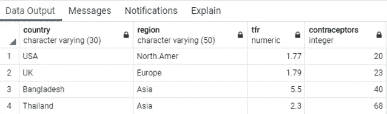

我们的任务如下—从 *fert_data* 和 *fert_data_1* 表中找到行的并集:

```
SELECT * FROM fert_data_1
UNION ALL
SELECT * FROM fert_data
ORDER BY country;
```

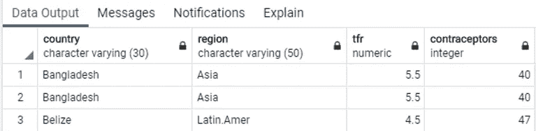

您会发现有一些重复的值。是的，你猜对了。您可以使用`UNION`操作器来移除它们。你自己试试。

## 熊猫

在 Pandas 中，我们创建了一个类似于 *SQL* 中的 *fert_data_1* 表的数据帧。

```
data = [
    [‘country’, ’region’, ’tfr’, ’contraceptors’],    
    [‘USA’, ’North.Amer’, 1.77, 20],
    [‘UK’, ’Europe’, 1.79, 23],
    [‘Bangladesh’, ’Asia’, 5.5, 40],
    [‘Thailand’, ’Asia’, 2.3, 68]
]df1 = pd.DataFrame(data[1:], columns=data[0])
```

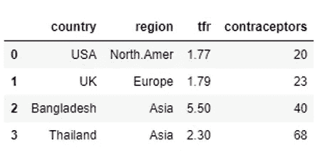

`df`和`df1`的联合:

```
df_dupli = pd.concat([df1, df])
```

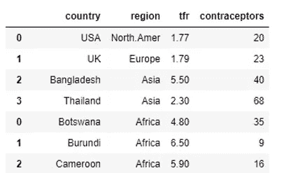

来自数据框的数据已被合并。但是，在这种情况下，我们也会得到重复的行。例如，我们的目标是让“孟加拉国”只出现一次:

```
df_dupli[df_dupli[‘country’] == ’Bangladesh’]
```

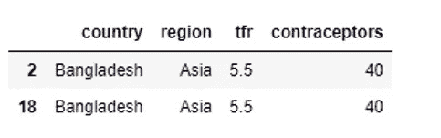

我们可以使用`drop_duplicates()`删除重复记录，如下所示:

```
df_wo_dupli = pd.concat([df1, df]).drop_duplicates()
```

让我们运行同样的查询，看看我们是否仍然得到两行。

```
df_wo_dupli[df_wo_dupli[‘country’] == ‘Bangladesh’]
```

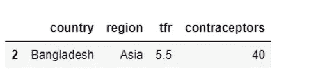

问题解决了。不再有重复的行。

# 分组依据

*SQL* 中的`GROUP BY`子句用于通过将记录分组在一起来准备汇总行。子句通常与 AVG、SUM、COUNT、MIN、MAX 等集合函数连用。下面是`GROUP BY`子句的基本语法:

```
SELECT column_name_1, agg_func(column_name_2)
FROM table_name
GROUP BY column_name_1;
```

在 *Pandas* 中，我们有一个`groupby()`函数，帮助我们汇总特定列的数据。通用语法如下:

```
df.groupby([‘column_name_1’]).agg_function()
```

让我们尝试一个例子来更好地理解它—找到每个区域的平均 *tfr* 和计数*逆变*场。

## 结构化查询语言

```
SELECT region, round(avg(tfr),2), count(contraceptors)
FROM fert_data
GROUP BY region;
```

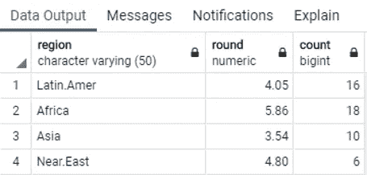

## 熊猫

```
df.groupby(‘region’).agg({‘tfr’: np.mean, ‘contraceptors’: np.size}).round(2)
```

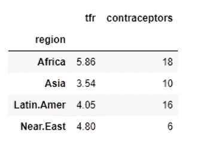

我们从两个查询中得到相同的结果。你一定想知道熊猫的那个`agg()`是干什么用的。它用于聚合指定轴上的一个或多个操作。

# 在你走之前

这就做到了——你现在应该对这两种技术有了一个很好的了解，至少在数据分析方面。很难推荐哪一个，因为这取决于你以前的经验、偏见和你工作的公司的选择。

好的一面是——在 *SQL* 中完成的所有事情都可以在 *Pandas* 中完成——至少在这个层面上。随便选一个你更喜欢的，不会出错的。

感谢阅读。

*喜欢这篇文章吗？成为* [*中等会员*](https://medium.com/@radecicdario/membership) *继续无限制的学习。如果你使用下面的链接，我会收到你的一部分会员费，不需要你额外付费。*

[](https://medium.com/@radecicdario/membership) [## 通过我的推荐链接加入 Medium-Dario rade ci

### 作为一个媒体会员，你的会员费的一部分会给你阅读的作家，你可以完全接触到每一个故事…

medium.com](https://medium.com/@radecicdario/membership) 

加入我的私人邮件列表，获得更多有用的见解。