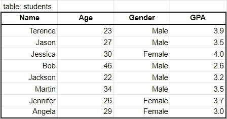
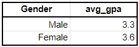
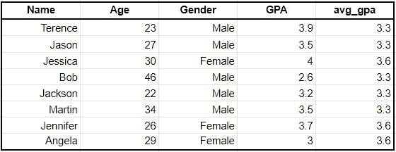

# 在 4 分钟内解释 SQL 窗口(分析)功能

> 原文：<https://towardsdatascience.com/sql-window-analytic-functions-explained-in-4-minutes-6171c6983263?source=collection_archive---------20----------------------->

## 用这个简单的解释来提升你的 SQL 技能


塞巴斯蒂安·斯坦尼斯在 [Unsplash](https://unsplash.com/s/photos/window?utm_source=unsplash&utm_medium=referral&utm_content=creditCopyText) 上的照片

# 目录

1.  介绍
2.  什么是窗口(分析)函数？
3.  窗口函数的剖析
4.  聚合函数与窗口函数的示例
5.  窗口功能的优势

# 介绍

您习惯于简单的查询(从 WHERE GROUP BY 中选择)，并且希望将您的技能提升到一个新的水平。接下来应该学什么？

**窗口函数**，也称为**分析函数**，是强大的 SQL 函数，将带你从初级 SQL 用户到中级 SQL 用户。在本文中，我们将简要介绍什么是窗口函数，然后提供一个简单的例子来说明这一点。

# 什么是窗口(分析)函数？

窗口函数类似于聚合函数，它返回聚合值(如 SUM()、COUNT()、MAX())。

窗口函数的不同之处在于它不对结果集进行分组。输出中的行数与输入中的行数相同。

如果这对你来说还没有意义，**不要担心**。坚持到例子，它会更有意义。:)

# 窗口函数的剖析

窗口功能的基本结构如下:

```
SELECT SUM() OVER(PARTITION BY ___ ORDER BY ___) FROM Table
```

为了更容易理解，需要记住三个主要部分:

1.  **聚合函数**:在上面的例子中，我使用了 SUM()，但是你也可以使用 COUNT()、AVG()等等
2.  **PARTITION BY:** 简单地把它想成一个 GROUP BY 子句，但实际上，它被称为 PARTITION BY。
3.  **ORDER BY:** ORDER BY 与您预期的一样。当输出的顺序很重要时，考虑这一点很重要。

# 聚合函数与窗口函数的示例

为了更清楚起见，假设我们有下表:



如果我们想获得按性别划分的平均 GPA，我们可以使用一个**聚合函数**并运行以下查询来获得以下结果:

```
SELECT Gender, AVG(GPA) as avg_gpa
FROM students
GROUP BY Gender
```



结果

下一部分是关键。

现在假设我们想要获得以下输出:



我们**可以**使用一个聚合函数(就像上面的那个),然后将结果加入到初始表中，但是这需要两步。

**改为**，我们可以用一个窗口函数来实现同样的输出:

```
SELECT *,
    AVG(GPA) OVER (PARTITION BY Gender) as avg_gpa
FROM table
```

通过上面的查询，我们按性别划分(分割)数据，并计算每个性别的平均 GPA。然后，它创建一个名为 avg_gpa 的新列，并为每一行追加相关的平均 gpa。

# 窗口功能的优势

使用窗口函数有三个主要优点:

## 简单

一旦你掌握了它，窗口函数使用起来就简单多了。注意，在上面的例子中，只需要一行额外的代码就可以使用窗口函数得到想要的输出，而不是使用聚合函数然后连接结果。

## 速度

与上述观点相关，使用窗口函数比使用替代方法要快得多。当您处理数百或数千千兆字节的数据时，这将派上用场。

## 多才多艺

最重要的是，窗口函数有大量的通用性，这超出了本文的范围。一些例子包括添加移动平均值、添加行号和滞后数据。

# 感谢阅读！

读到这里，你应该对什么是窗口函数，如何写窗口函数，窗口函数的优点有所了解。

希望这些例子能让你更容易理解窗口函数是如何工作的。一如既往，我祝你在学习中好运！

## 特伦斯·申

*   *查看* [*我的免费数据科学资源*](https://docs.google.com/document/d/1UV6pvCi9du37cYAcKNtuj-2rkCfbt7kBJieYhSRuwHw/edit#heading=h.m63uwvt9w358) *每周都有新素材！*
*   *如果你喜欢这个，* [*关注我的 Medium*](https://medium.com/@terenceshin) *了解更多*
*   *我们连线上*[*LinkedIn*](https://www.linkedin.com/in/terenceshin/)