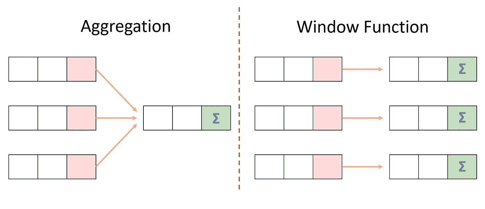
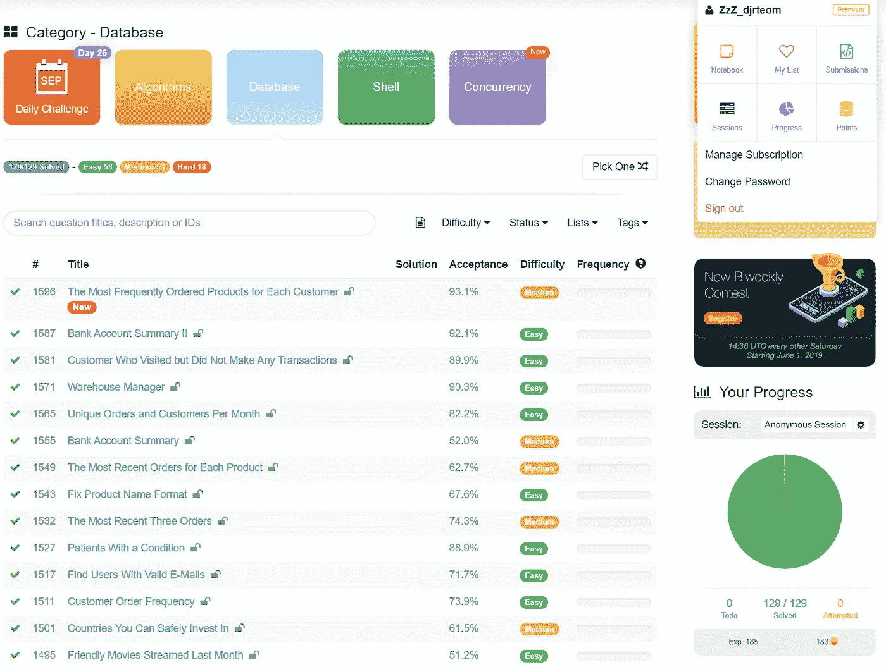
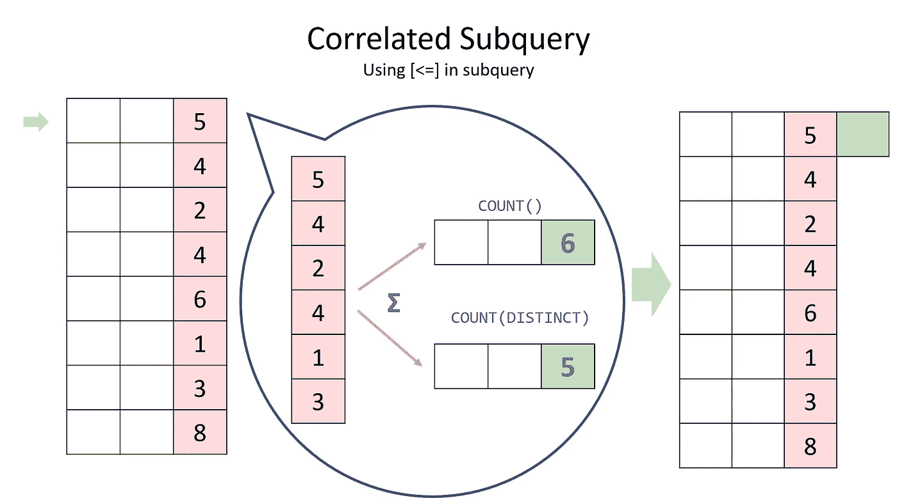
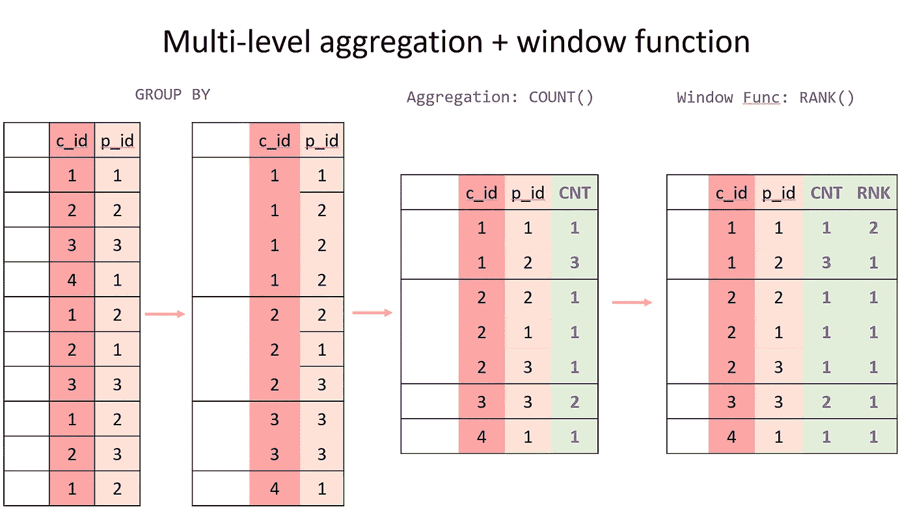
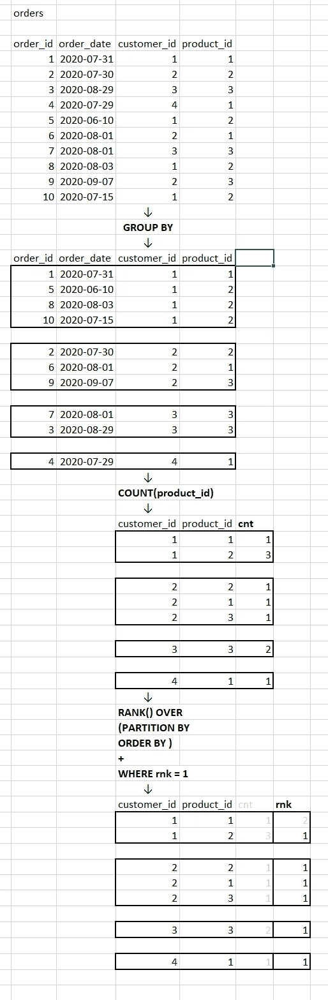

# SQL 窗口函数—用 Leetcode 中的真实面试问题演示

> 原文：<https://towardsdatascience.com/sql-window-function-demonstrated-with-real-interview-questions-from-leetcode-e83e28edaabc?source=collection_archive---------6----------------------->

*作者 Sherwin 郑*

窗口功能现在是 SQL 访谈中必不可少的内容，尽管它只是在 2018 年 4 月 19 日在**发布后才在 MySQL 8.0 上可用。**



作者图片

# 一张便条

本文假定读者除了基本的 SQL 语法之外，还知道 SQL 窗口函数。如果不熟悉，想了解更多，可以参考我学习用的这个[ [链接](https://www.sqlite.org/windowfunctions.html)。请注意，在不同的 SQL 平台上，语法可能会有所不同。

本文将向您介绍几个常见的 it 应用程序，并在面试中使用 Leetcode.com 的例子进行测试

最近的 Leetcode 问题 [1596。每个客户最常订购的产品](https://leetcode.com/problems/the-most-frequently-ordered-products-for-each-customer/)启发我写这个主题是因为它把一堆知识点链接在了一起，包括窗口函数及其从易到中的应用，自连接及其与窗口函数的关系，以及 SQL 语句的执行顺序。



我的 Leetcode 数据库从 09242020 开始更新

# 问题类型一—具有两级粒度的数据

## 每个部门的最高工资

首先，我们先从一个简单的问题开始:各部门工资最高是多少？我想答案很快就在你脑海里弹出来:`SELECT MAX(salary)`跟`GROUP BY department`。

## 每个部门及其相应员工的最高工资

然而，如果面试官想夸大其词，说公司不仅想知道最高工资，还想知道与该工资相对应的员工姓名，该怎么办？如何编写查询？在这个意义上，它类似于 Tableau 中的细节层次(LOD)操作。这是 leet code[【184。部门最高工资]](https://leetcode.com/problems/department-highest-salary/)

有两种方法可以解决这个问题:**窗口函数**或**自连接/相关子查询**，任何一种都可以。你会发现它们是等价的，而窗口函数更简洁，更容易编写。

使用窗口函数，很简单，只需编写下面的代码

而使用相关子查询时，代码需要花费更多时间来运行

对于外部表中的每一行，相关子查询将在`WHERE`子句中查找内部表，并将外部表中的行与子查询中对应的行进行比较。如果使用自连接，它不限于顶部记录，还可以通过将`COUNT()`与`WHERE`语句一起使用来给出`RANK()`。

关于 Leetcode 的其他良好实践问题包括:

*   178。等级分数 ](硬编码 DESNE_RANK)
*   177。第 n 高工资
*   185。部门前三名薪资

我对 178 的解决方案在这里。这可能不是最佳实践，但它很好地说明了该机制是如何工作的。

简短说明:

*   Self-join + COUNT() = RANK()，平局时给出缺口
*   自连接+ COUNT(DISTINCT ) = DENSE_RANK()，这消除了平局时差距



作者图片

为什么它们的等价性值得一提？好吧，如果您非常幸运，您的 SQL 平台不支持窗口函数，您将不得不使用自连接设计一个等效的窗口函数来实现相同的效果。所以知道还是好的。

以上两个例子的总结:

**我们可以使用** `**GROUP BY**` **+** `**MIN()**` **找到每组中的最小值，但是如果我们想知道它在其他字段下的对应值，就需要使用 window 函数给出一个排名，相当于旧版 SQL 中的一个过滤自连接或者 Tableau 中的 LOD。**

# 问题类型二—具有三级粒度的数据

## 当排名字段是聚合值时

让我们再来一次。

如果我们想知道“年薪”的级别，但在汇总他们的“月薪”之前，我们还不能在我们的窗口函数中使用`ORDER BY`该怎么办？

例如，编写一个 SQL 查询来查找每个客户最常订购的产品。

```
orders table
+----------+------------+-------------+------------+
| order_id | order_date | customer_id | product_id |
+----------+------------+-------------+------------+
| 1        | 2020-07-31 | 1           | 1          |
| 2        | 2020-07-30 | 2           | 2          |
| 3        | 2020-08-29 | 3           | 3          |
| 4        | 2020-07-29 | 4           | 1          |
| 5        | 2020-06-10 | 1           | 2          |
| 6        | 2020-08-01 | 2           | 1          |
| 7        | 2020-08-01 | 3           | 3          |
| 8        | 2020-08-03 | 1           | 2          |
| 9        | 2020-08-07 | 2           | 3          |
| 10       | 2020-07-15 | 1           | 2          |
+----------+------------+-------------+------------+
```

上一节中的问题很简单，因为显示了排名字段`salary`。但是在上表中，每一行都记录了一个客户购买的“产品”,并且是重复的。

如果我们**采用前面的推理**，我们需要(1)写一个子查询:`GROUP BY customer_id, product_id`和`COUNT(product_id) AS cnt`，然后(2)使用`cnt`作为窗口函数的排序字段，(3)在`WHERE`子句中过滤结果，比如在第三个查询中使用`rnk = 1`，因为我们不能在`WHERE`语句中使用窗口函数。

## 通过了解 SQL 语句的执行顺序来简化查询

然而，我们实际上可以将 t1 和 t2 合并到一个查询中，如下所示

一开始，当把`PARTITION BY`和`GROUP BY`结合起来时，我并不是本能的:查询基于哪个分区/组？但是在我查看了查询的执行顺序之后，这个问题就迎刃而解了:

1.  从并加入 s。
2.  哪里…
3.  分组依据…
4.  拥有…
5.  选择…
6.  独特的…
7.  排序依据…
8.  极限/偏移。

要知道窗口函数与`SELECT`是在同一个阶段执行的，所有的东西也是如此，包括`PARTITION BY`。因此，实际的执行步骤如下所示(注意:前面代码块中的代码不会在结果中显示`CNT`，但是它会按照图示进行计算)。



作者图片

这是 1596 年的 Leetcode。每位顾客最常订购的产品



作者图片

# 扩展到更多的细节层次

## 如果我们想知道购买第二多的产品呢

我进一步的想法是，如果我们想知道第二多，甚至第 n 多购买的产品，因为我们比较这个问题[ [177。第 n 高工资](https://leetcode.com/problems/nth-highest-salary/)。你如何修改最后一部分的代码？

*   将`rnk = 1`改为`rnk = 2`，或者
*   将`rnk = 1`改为`rnk = 2`，同时将`RANK()`改为`DENSE_RANK()`？

应该由你来思考。看完这篇文章，你应该熟悉其中的关系。

# 结论

掌握这类数据粒度问题在很多方面都有帮助。我们首先介绍了窗口函数的价值和用法，并将其与简单的`GROUP BY`进行了比较。然后，我们对窗口函数和自连接/相关子查询有了更深入的了解。最后，我们学习了如何用更高粒度的数据对任何级别的细节进行排序。

读完本文后，无论是在面试还是在生产中，您都应该能够处理这种类型的问题，并且通过使用窗口函数练习您的 SQL 专业知识，从任何级别的细节中挖掘见解。

*关于我*

*Sherwin 是维克森林大学的商业分析理学硕士，本科专业是中山大学的管理科学，辅修的是伊拉斯谟大学鹿特丹管理学院(RSM)的大数据。查看我的* [*LinkedIn*](https://www.linkedin.com/in/sherwinzhengsysu/) *或*[*Github*](https://www.github.com/SherwinZ)*了解更多。*