# SQL 窗口函数—第 2 部分

> 原文：<https://towardsdatascience.com/sql-window-functions-part-2-bbdcd16c1ff7?source=collection_archive---------30----------------------->

## 不同类型的 SQL 窗口函数。


图片作者:[弗兰奇](https://unsplash.com/@franki)|【Unsplash.com】T2

**简介:**

窗口函数跨一组与当前行有某种关系的表行执行数据分析计算。地址可比较类型的计算可以用一个聚合函数来完成，该函数给出一行或按条件分组(参见图 1)。

Window 函数不会导致行组合成一个输出行。保留其单独标识的行也能够访问查询结果的当前行以外的内容。(参见图 1)。

```
**Window Function Syntax:**
Window_Function([All] expression) 
OVER( [PARTITION BY expression_list] [ORDER BY order_list Row_or_ Range clause] )
```

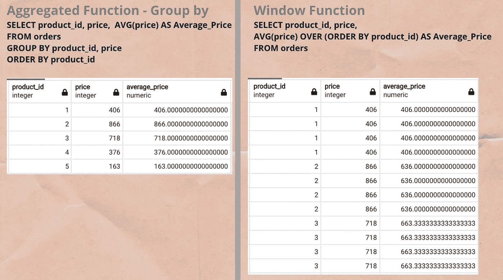

图 1 —聚合函数和窗口函数的区别

更多信息请访问我的上一篇博客，我在第一部分介绍了 SQL 窗口函数，并概述了不同类型的 SQL 窗口函数。

在这篇博客中，我将解释所有三种主要类型的 SQL 窗口函数以及例子。

用来解释以下概念的数据库。

数据集:可从 Github 获得: [Retails.csv](https://github.com/GDhasade/Medium.com_Contents/blob/master/SQL/Retails.csv)

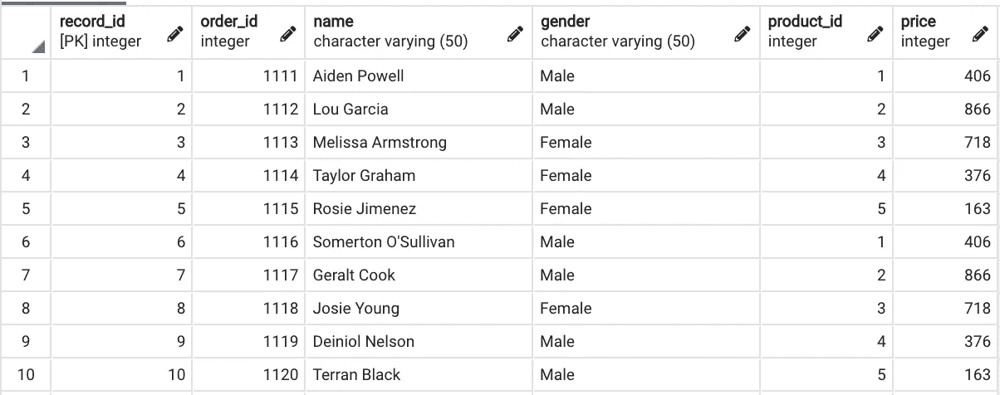

零售表截图。

**SQL 窗口函数的类型:**

1.  **窗口聚合函数**
2.  **窗口排名聚合函数**
3.  **窗口分析功能**

# **1。窗口聚合函数**

包含一个支持聚合函数，即 AVG()、计数()、最小值()、最大值()、总和()。

**AVG():**

*   返回输入表达式值的平均值。
*   该函数处理数值，并忽略空值。

**例如:**

编写一个查询来计算平均订单价格。

```
**Query:** SELECT order_id, product_id, price, AVG(price) OVER (PARTITION BY order_id) AS Average_Order_Price 
FROM retails
```

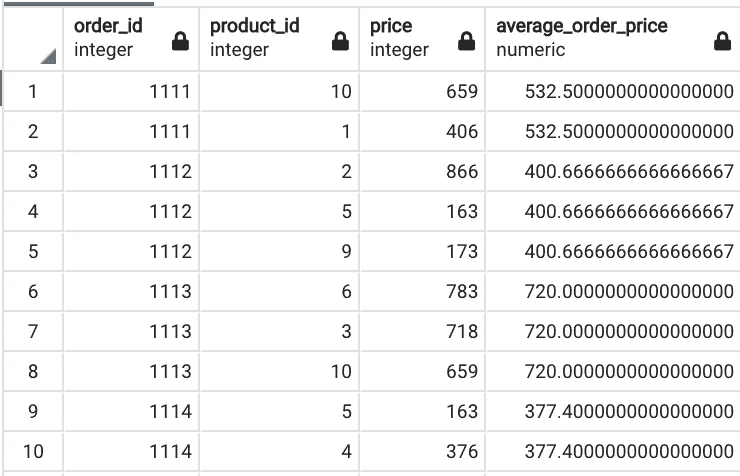

输出-查询-AVG()

**解释:**

*   为了计算平均订单价格，window 函数对价格列使用了 AVG()，对 order_id 使用了分区依据
*   考虑订单 id: 1112 —包含 3 种产品(即 1、2、5)。这三个乘积的平均值为(866 + 163 +173) / 3 = 400.667

b. COUNT():

*   如果列或表达式中有空值，也计算空值的行数。
*   在数据集中创建新要素时，此窗口函数非常有用。像计数属于每个客户的条目数。

**例如:**

**查询 1:** 计算客户在订单中购买的产品数量。

```
SELECT order_id, name, product_id, COUNT(*) OVER (Partition BY order_id) AS Number_of_Products 
FROM retails
```

**查询 2:** 计算客户购买的产品销售数量(累计)。

```
SELECT order_id, name, product_id, COUNT(*) OVER (Order BY order_id) AS Number_of_Products 
FROM retails
```

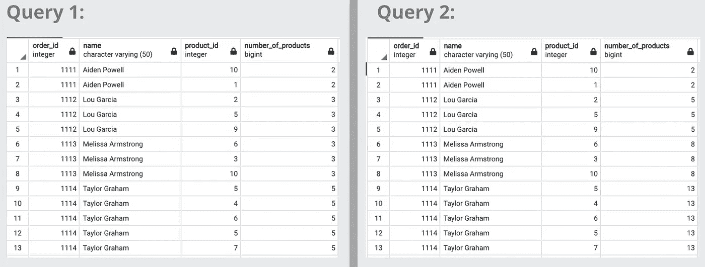

输出—查询 1 和 2 —计数()

**说明:**

**查询 1:**

*   按 order_id 划分计数属于特定 order_id 的记录数。
*   在输出中，我们可以看到每个订单显示了几个产品。

**查询二:**

*   Order by order_id 计算记录数和特定的 order_id，然后将连续顺序的记录数相加。
*   输出:我们可以看到计数随着与特定 order_id 相关的记录数量的增加而增加。

**c. Min()或 Max():**

*   Min()或 Max()分别返回输入值中表达式的最小值或最大值。
*   两个窗口函数都处理数值，并忽略空值。

**举例:**

下面的查询向结果集添加了一个新特性，即在各自的订单中购买的产品的最低和最高价格。

```
**Query:**
SELECT order_id, name, product_id, price, 
MIN(price) OVER (Partition BY order_id) AS Minimum_Price_Product,
MAX(price) OVER (Partition BY order_id) AS Maximum_Price_Product 
FROM retails
```

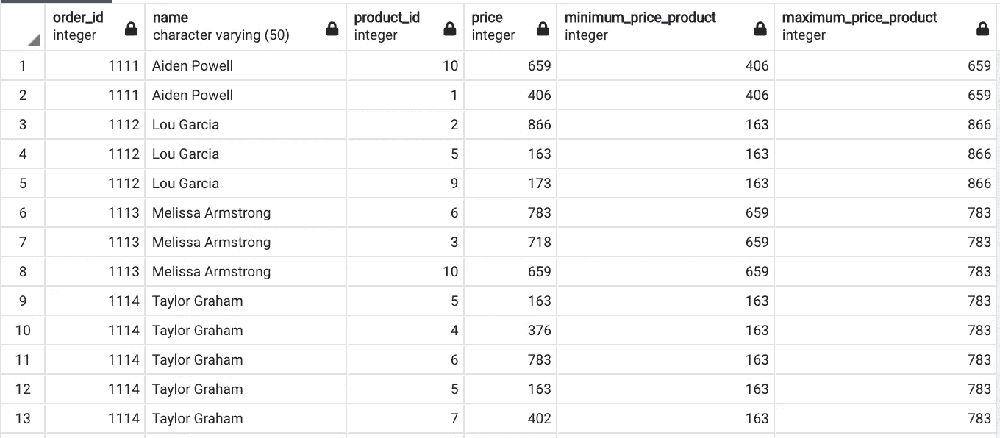

Output- Query- MIN()或 MAX()

**说明:**

*   对于每个 order_id 记录，已经添加了产品的最低和最高价格。
*   我们也可以单独使用每个功能。

**d. Sum():**

*   返回所有输入值的总和/合计表达式。
*   该函数处理数值，并忽略空值。

**示例:**

下面的查询返回每个 order_id 的总价。

```
**Query:**
SELECT order_id, name, product_id, price, 
SUM(price) OVER (PARTITION BY order_id) AS Average_Order_Price 
FROM retails
```

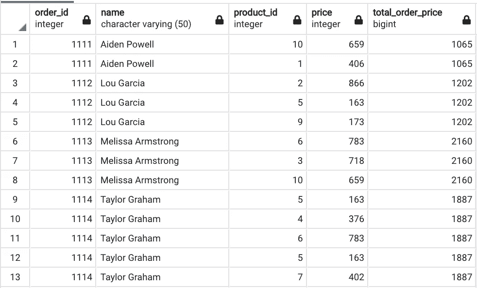

输出-查询-总和()

**说明:**

*   为每个 order_id 添加了带有 total_order_price 的新列。
*   有助于分析数据，我们有许多记录，属于每个订单 id。

# 2.**窗口排名聚合函数:**

包括支持排名函数之一，即 RANK()、DENSE_RANK()、ROW_NUMBER()。

排名():

*   基于 OVER 子句中的 **ORDER BY** 表达式的值在一组值中的排名(请参考查询 1)。
*   每个值在其**分区内由**表达式进行排序(参考查询 2)。
*   等级标准值相等的行将获得相同的等级。
*   并列或相同的排名跳过连续的排名，如排名():1，1，3，4，5。

**例如:**

**查询 1:** 根据价格对产品进行排名。

```
SELECT order_id, name, product_id, price, 
RANK() OVER (ORDER BY price) AS Rank_Product_Price 
FROM retails
```

**查询 2:** 根据每个订单中的价格对产品进行排序(即按 order_id 进行划分)。

```
SELECT order_id, name, product_id, price, 
RANK() OVER (PARTITION BY order_id ORDER BY price) AS Rank_Product_Price 
FROM retails
```

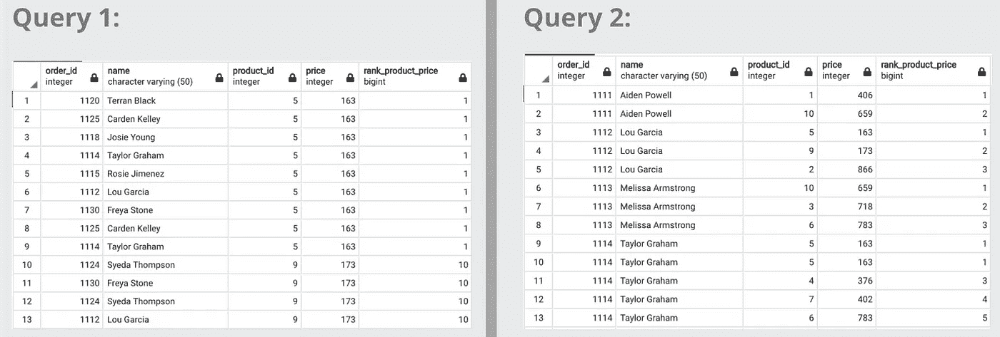

输出—查询 1 和 2 —排名()

**解释:**

正如我们在两个查询中所看到的，ORDER BY 表示用于对值进行排序的表达式。

**查询 1:**

*   排名是基于 product_price 完成的。
*   另请注意，具有相同值的 9 行的等级为 1。
*   所以下一个等级值从 10 开始。

**查询 2:**

*   已通过 ORDER BY 表达式(即价格列)完成排名。
*   检查 order_id 114，我们可以看到前两个产品价格的等级是相同的。因此分配给它等级是 1。
*   下一个产品价格在 order_id 中排名为 3。

**b. DENSE_RANK():**

*   与 Rank()函数类似，根据由表达式和 OVER 子句确定的**顺序，对一组值中的值进行排序，每个值在其由**表达式确定的**分区内进行排序。**
*   不同之处在于，具有相等值的行获得相同的等级和平局，或者相同的等级不跳过连续的等级。
*   *示例:* Dense_Rank(): 1，1，2，3，4

**举例:**

**查询:** Dense_Rank 根据每个订单中的价格对产品进行排序(即按 order_id 进行划分)。

```
SELECT order_id, name, product_id, price, 
DENSE_RANK() OVER (PARTITION BY order_id ORDER BY price) AS Dense_Rank_Product_Price 
FROM retails
```


输出-查询 Dense _ Rank()

**说明:**

*   我们可以看到，对每一行的排序是基于 ORDER BY 表达式完成的，即价格值也在每个 order_id 内，即(按 order_id 划分)。
*   order_id 1114 有 5 个产品，其中 2 个产品价格相同，因此排名相同，即 1。
*   下一个秩从 2 开始(这是 rank()和 Desne_Rank()函数的主要区别)。
*   Dense_Rank()不跳过连续的秩数。

**CUME DIST():**

*   根据下面的**公式:**计算当前行在窗口分区内的**相对等级**


**示例:**

**查询:** CUME_DIST，即根据每个订单中的价格对产品进行相对排名(即按 order_id 划分)。

```
SELECT order_id, name, product_id, price, 
CUME_DIST() OVER (PARTITION BY order_id ORDER BY price) AS Dense_Rank_Product_Price 
FROM retails
```

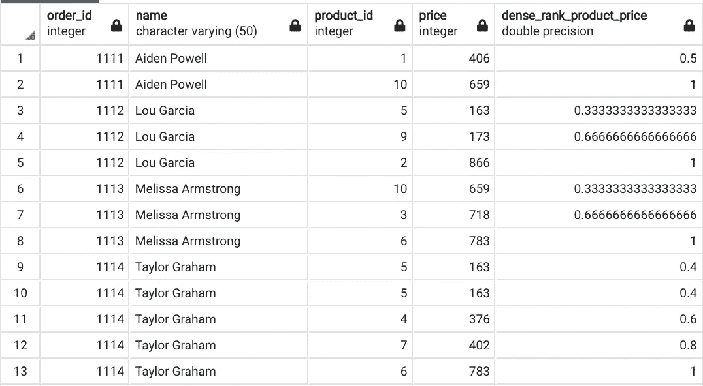

输出-查询-CUME _ DIST()即相对等级

**解释:**

让我们考虑具有 3 个产品的 order_id 1112，按照下面讨论的公式计算相对等级:


*   第 3 行—第一个产品:1/3 = 0.3333
*   第 4 行—第二个乘积:2/3 = 0.666
*   第 5 行—第三个产品:3/3 = 1

类似地，如果产品具有相同的价值或价格，则相对等级也与输出屏幕截图中的检查 order_id 1114 相同。

**d. ROW_NUMBER():**

*   基于 OVER 子句中的 **ORDER BY** 表达式的当前行在其分区内的序号。
*   每个值在其**分区内由**表达式排序。
*   ORDER BY 表达式的值相等的行会不确定地收到不同的行号。

**例如:**

**查询:**根据产品在每个订单中的价格将 Row_Number 分配给产品(即按 order_id 划分)。

```
SELECT order_id, name, product_id, price, 
ROW_NUMBER() OVER (PARTITION BY order_id ORDER BY price) AS Row_Number_Product_Price 
FROM retails
```

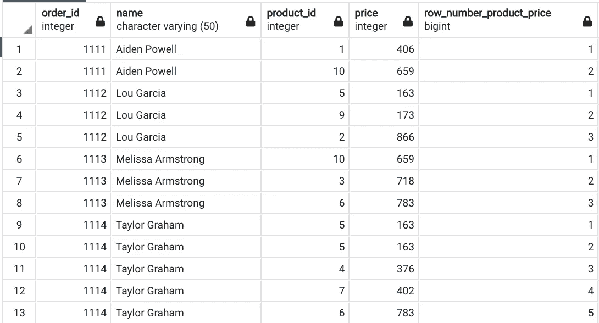

输出-查询-行编号()

**解释:**

*   正如我们在输出屏幕截图中看到的，行号是根据每个订单(按 order_id 划分)中的价格(ORDER BY expression)分配的。
*   不考虑值是否相同，只将 row_number 赋给表达式中的每一行。

e. NTILE():

*   将每个窗口分区的行尽可能平均地分成指定数量的分级组。
*   ***要求 OVER 子句中的*** ORDER BY 子句。
*   ORDER BY 子句中指定的列或表达式，首先所有值按升序排序，然后平均分配组号。

**举例:**

**查询:**根据产品价格将组/簇/桶编号分配给 10 个不同组的所有行。

```
SELECT order_id, name, product_id, price, 
NTILE(10) OVER (ORDER BY price) AS NTile_Product_Price 
FROM retails
```

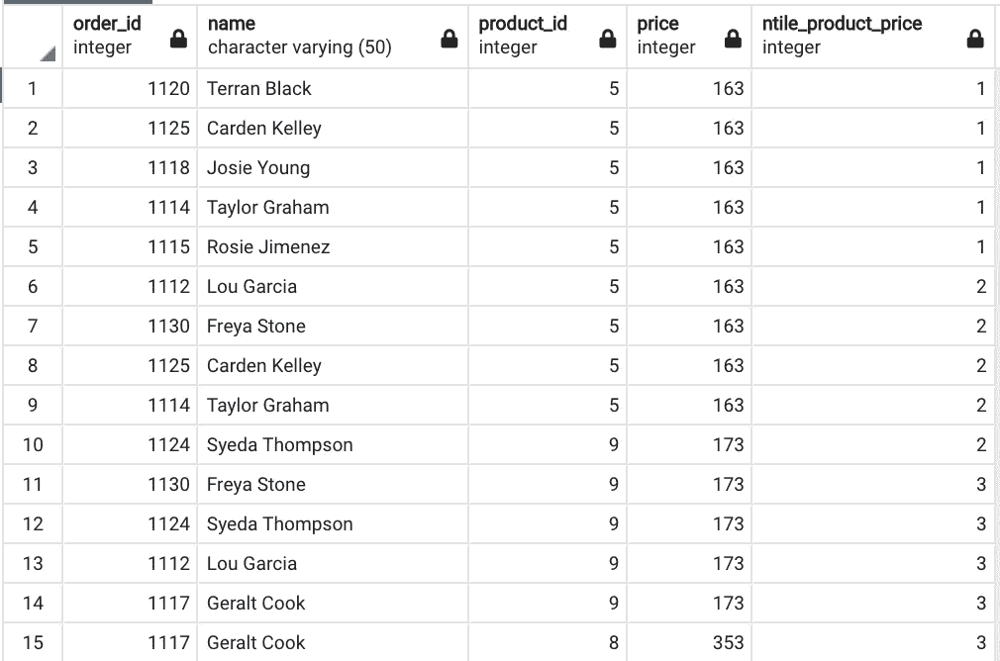

输出-查询 NTILE()

**解释:**

*   在这个数据集中，我们总共有 50 条记录。
*   因此，每个集群由 5 行组成，如输出屏幕截图所示。
*   首先，所有行都已按价格排序，然后给每一行分配一个组号。

**f. PERCENT_RANK()**

*   使用以下公式计算当前行的百分比排名:

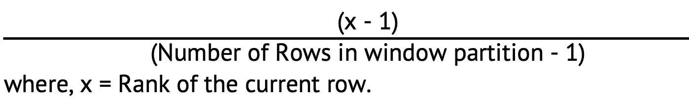

**示例:**

**查询:**根据产品价格计算或分配所有行的百分比排名。

```
SELECT order_id, name, product_id, price, 
PERCENT_RANK() OVER (PARTITION BY order_id ORDER BY price) AS Row_Number_Product_Price 
FROM retails
```

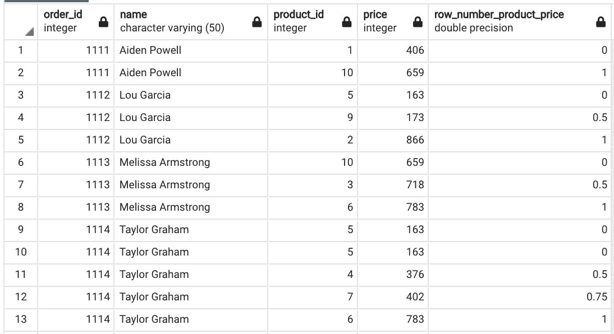

输出-查询-百分比排名()

**说明:**

让我们考虑具有 5 个产品的 order_id 1114，按照下面讨论的公式计算相对等级:


*   第 9 行—第一个产品:(1–1)/(5–1)= 0
*   第 10 行—第二个乘积:(1–1)/(5–1)= 0
*   第 11 行—第三个产品:(3–1)/(5–1)= 0.5
*   第 12 行—第四个产品:(4–1)/(5–1)= 0.75
*   第 13 行—第五个产品:(5–1)/(5–1)= 1

# **3。窗口分析功能:**

包括一个支持排名函数，即 LAG()、LEAD()、FIRST_VALUE()、LAST_VALUE()。

**a .滞后()或超前():**

**语法:**

```
LAG | LEAD (expression)
    OVER ([ PARTITION BY expression_list] [ORDER BY order_list] )
```

*   滞后或超前返回时，值为当前行的值*前或**后分别在一个分区中。***
*   ***如果不存在任何行，则返回 null。***

*****例如:*****

*****查询:**添加新功能 1 步滞后或超前每个订单内的产品价格(即按 order_id 划分)***

```
***SELECT order_id, name, product_id, price, 
LAG(price,1) OVER (PARTITION BY order_id ORDER BY price) AS LAG_Product_Price,
LEAD(price,1) OVER (PARTITION BY order_id ORDER BY price) AS LEAD_Product_Price
FROM retails***
```

***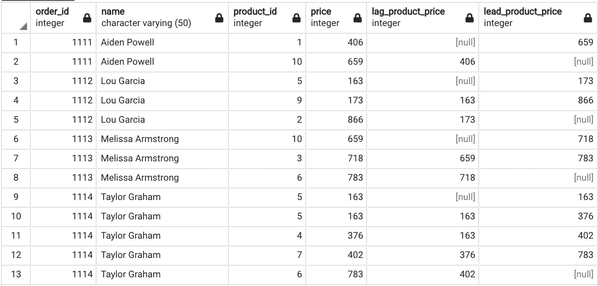***

***输出-查询-滞后()或超前()***

*****解释:*****

*   ***正如我们可以看到的，在 order_id 的分区中，lag 和 lead 列分别给出 1 个步长值。***
*   ***当它在 LAG()中的第一行被估算为 NULL 时。***
*   ***类似地，在 LEAD()中，最后一行用 NULL 进行估算。***

*****b. FIRST_VALUE()或 LAST_VALUE():*****

*****语法:*****

```
***FIRST_VALUE | LAST_VALUE ( expression ) 
      OVER ( [PARTITION BY expression_list ] [ ORDER BY order_list ][ row_or_range_clause ] )***
```

*   ***FIRST_VALUE 或 LAST_VALUE 分别返回指定表达式相对于窗口框架(分区)的第一行或最后一行值。***

*****举例:*****

*****查询:**在每个订单内添加新功能 FIRST_VALUE 或 LAST_VALUE 产品价格(即按 order_id 划分)。***

```
***SELECT order_id, name, product_id, price, 
FIRST_VALUE(price) OVER (PARTITION BY order_id) AS FIRST_VALUE_Product_Price,
LAST_VALUE(price) OVER (PARTITION BY order_id) AS LAST_VALUE_Product_Price
FROM retails***
```

***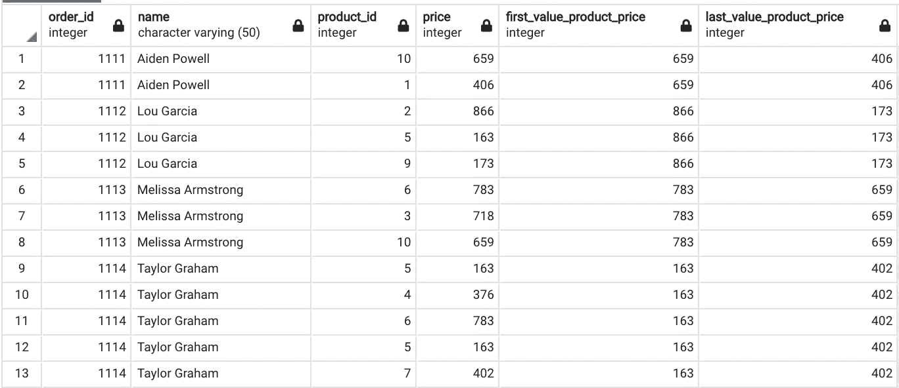***

***输出-查询-第一个值()或最后一个值()***

*****解释:*****

*   ***正如我们所看到的，First_Value()和 Last_Value()列分别给出第一行值和最后一行值。***

*****c .第 n 个值():*****

*****语法:*****

```
***NTH_VALUE (expression, nth_value ) 
      OVER ( [PARTITION BY expression_list ] [ ORDER BY order_list ][ row_or_range_clause ] )***
```

*   ***NTH_VALUE 返回分别用表达式分配给窗框(分区)的第 n 个值。***
*   ***如果 nth_value 不可用，则使用 NULL 对其进行估算。***

*****举例:*****

*****查询:**在每个订单内增加新功能 n _ VALUE 产品价格(即按 order_id 划分)。***

```
***SELECT order_id, name, product_id, price, 
NTH_VALUE(price,3) OVER (PARTITION BY order_id) AS NTH_VALUE_Product_Price
FROM retails***
```

***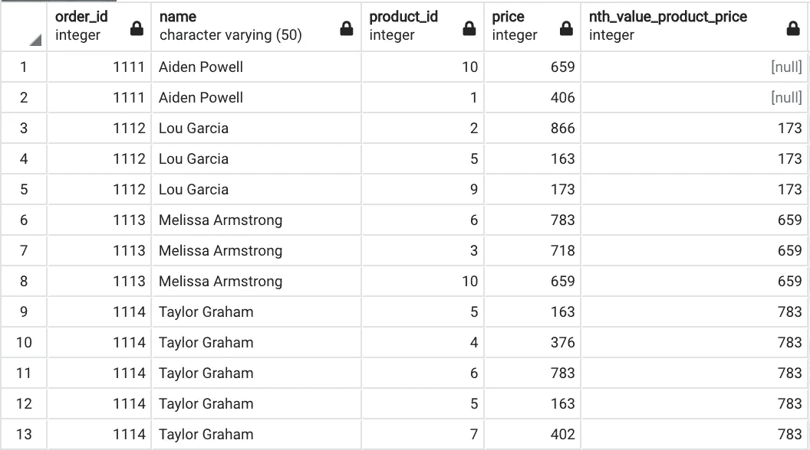***

***输出-查询-第 n 个值()***

*****解说:*****

*   ***在查询中，我们将第 n 个值指定为 3，它返回第 3 行值，该值按 order_id 进行分区。***
*   ***对于 order_id 1111，只有 2 种产品，因此该列被估算为空值。***

*****结论:*****

***在这篇博客中，我试图解释 SQL 中窗口函数的主要类型。***

***窗口函数在使用 SQL 进行数据分析时非常有用，并且易于使用。***

***窗口函数围绕 OVER、PARTITION BY 和 ROW 或 RANGE 子句。***

***我希望你喜欢这个博客，欢迎随时加入我的 LinkedIn。我很想知道你对这篇文章的想法和反馈。***

***感谢您的阅读。***

*****资源:*****

***数据集和 SQL 脚本可从 [GITHUB](https://github.com/GDhasade/Medium.com_Contents/tree/master/SQL) 获得。***

*****参考文献:*****

1.  ***postgresql.org(2019 年)。 *PostgreSQL:文档:9.1:窗口函数*。[在线]Postgresql.org。可在:[https://www.postgresql.org/docs/9.1/tutorial-window.html.](https://www.postgresql.org/docs/9.1/tutorial-window.html.)***
2.  **drill.apache.org(未标出)。 *SQL 窗口函数介绍— Apache Drill* 。[在线]drill.apache.org。可在:[https://drill . Apache . org/docs/SQL-window-functions-introduction/](https://drill.apache.org/docs/sql-window-functions-introduction/)获取。**