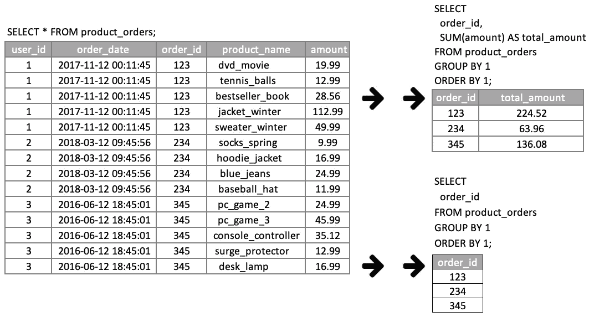
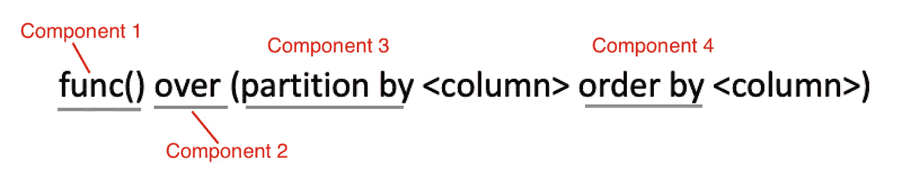
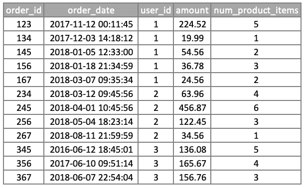
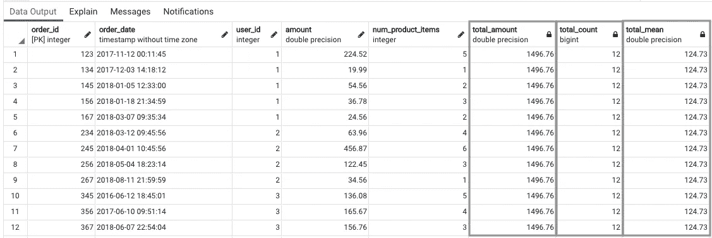
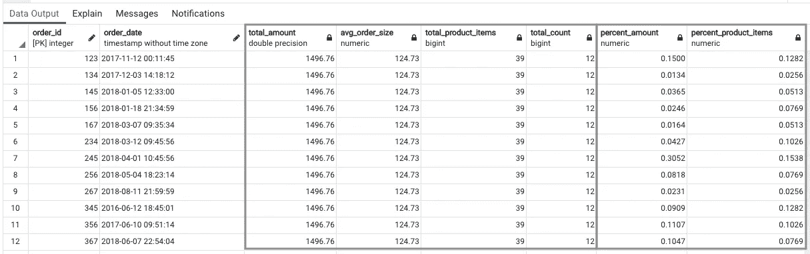
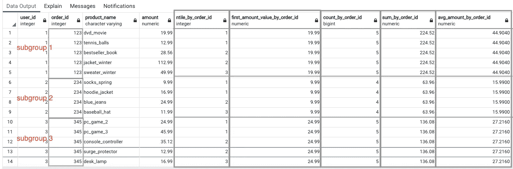
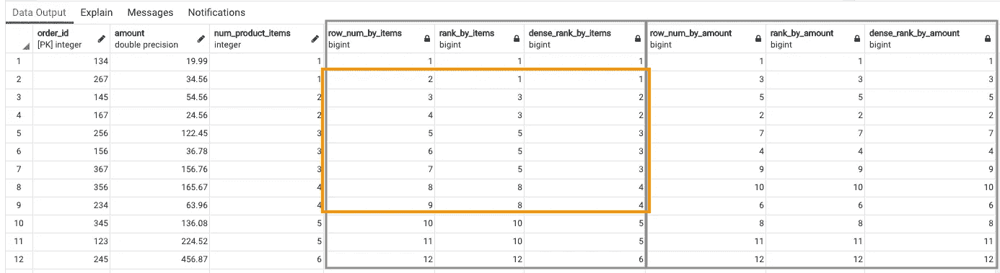
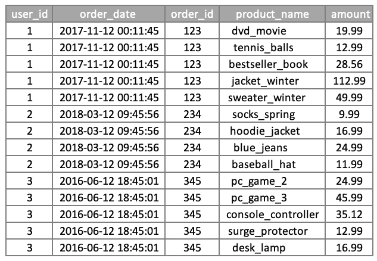
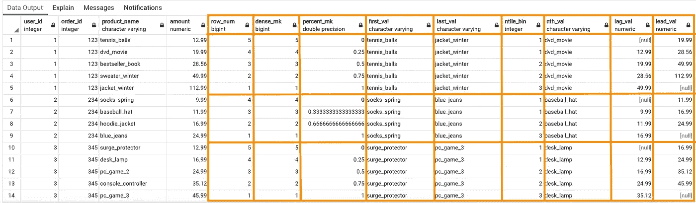

# SQL 窗口函数:直观指南

> 原文：<https://towardsdatascience.com/sql-window-functions-the-intuitive-guide-5b56d7f437cb?source=collection_archive---------15----------------------->

## 使用 Postgres 直观地了解窗口函数的不同组成部分，并在您的数据工作流中实现它们

巴勃罗·菲耶罗在 [Unsplash](https://unsplash.com?utm_source=medium&utm_medium=referral) 拍摄的照片

# 介绍

主要目标是理解窗口函数的基本概念，并将它们应用到 SQL 工作流中。窗口函数只不过是 FOPO(函数在分区上的作用)。下面是这篇文章将涉及的内容的简要概述。

*   分组依据
*   窗口功能— 4 个主要组件(FOPO)
*   ()上的 func()
*   该分区由
*   订单依据
*   分区依据和排序依据
*   摘要
*   附录

# 分组依据

如果您对 GROUP BY 子句有很好的理解，那么您已经开始理解窗口函数了。简而言之，GROUP BY 子句将表压缩成较少的行或输出唯一的行。当按列分组时，SQL 查询为该列下找到的每个不同值输出一行。在对多个列进行分组时，输出将由指定列的唯一组合组成，这些列有或没有一些聚合函数。这里有一个例子。

GROUP BY 1 中的 1 表示分组列在 SELECT 下的位置。SELECT 下面列出的列就像一个从索引位置 1 开始的数组。

在这个 product_orders 表中，每个 order_id 都附加到客户购买的所有产品项目(product_name)。

*   首先，order_id 被指定为 GROUP BY 列。
*   其次，使用 SUM 聚合函数将对应于 order_id 的金额求和为一个值(total_amount)。

现在，让我们更深入地研究一下窗口函数的机制。

# 窗口功能— 4 个主要组件(FOPO)

*   首先，函数组件决定数据的处理。例如，我们可以基于列进行分级(例如，DENSE_RANK)或创建大小相等的箱(例如，NTILE)。点击查看 Postgres [中可用的窗口函数。聚合函数(例如，求和、计数、AVG 等。)也可以用作窗口函数—这里列出了](https://www.postgresql.org/docs/9.3/functions-window.html)[和](https://www.postgresql.org/docs/9.3/functions-aggregate.html)。
*   其次，OVER 子句是将所有内容粘合在一起的粘合剂。使用 OVER 子句调用或启用上面的函数来创建窗口函数。
*   第三，与 GROUP BY 类似，PARTITION BY 类似于 subgroup-by 子句。PARTITION BY 不是折叠数据集，而是基于指定的一列或多列创建子组/块/分区。
*   最后，ORDER BY 子句再次根据指定的一列或多列对数据进行排序。

根据转换数据所需的处理级别，除了 OVER 子句之外，并不是所有组件都需要使用。(**记住:**OVER 子句调用窗口函数，使聚合函数成为窗口函数。)下面是使用案例。

*   func() OVER()
*   func( <column integer="" value="">) OVER()</column>
*   func() OVER(由<column>划分)</column>
*   func( <column integer="" value="">) OVER(由<column>划分)</column></column>
*   func() OVER(按<column>划分，按<column>排序)</column></column>
*   func( <column integer="" value="">) OVER(分区按<column>排序按<column>)</column></column></column>

# ()上的 func()

未定义 PARTITION BY 和/或 ORDER BY 的 OVER()方法将函数应用于整个数据集。这种方法与聚合函数配合得很好。当应用函数使用所有行计算值时，表或数据集的完整性得到维护。

在 orders 表中，每一行都是唯一的 order_id(主键)。出于演示的目的，我在这个表中又添加了几个订单。

在此示例中，三个聚合函数与 OVER 子句成对出现，以创建三个窗口函数，分别由 total_amount、total_count 和 total_mean 表示。例如，total_amount 对“金额”列下的所有值求和，新的总计出现在每一行中。同样的逻辑也适用于 total_count 和 total_mean。此设置有助于计算总量的百分比，并根据总量或平均值等统计数据创建比率。

因此，窗口函数的值有助于创建标准化的指标，以便在数据集之间进行比较。第一个灰色突出显示的块显示了下面提供的示例中的聚合值，而第二个块包含描述数据的指标。

# 该分区由

正如我前面提到的，PARTITION BY 类似于 GROUP BY。考虑划分的最佳方式是分组(组中的组)。与 GROUP BY 类似，首先通过一列或多列来定义分区。一旦定义了子组，OVER 子句将调用或启用函数在每个子组上执行其逻辑。与 GROUP BY 不同，PARTITION BY 子句不压缩表；相反，它维护表的完整性，同时将输出作为列添加。

例如，使用 product_orders 表，分区依据列是 order_id。此外，子组的数量由 order_id 的唯一数量定义。在这种情况下，这个数字是三。

*   NTILE:NTILE(3)等于 bin 的数量，PARTITION BY 确定子组(或分区)，其中每个子组将被分成三个 bin。
*   FIRST_VALUE:该函数输出定义的子组中的第一个值或第一行。
*   计数:计算每个定义的子组中的行数。
*   SUM:对每个子组中的值(如金额)求和。
*   AVG:计算每个定义的子组的平均值。

在输出中，下面突出显示的灰色块表示由 PARTITION BY 子句定义的子组和由窗口函数创建的新列。

# 订单依据

ORDER BY 子句在对数据进行排序时使用。它可以是窗口函数中的独立子句，也可以与 PARTITION BY 子句成对出现。有时，只使用 ORDER BY 子句会更合适，这样可以对整个数据集进行排序。这里有一个例子。

在排名函数中使用 ORDER BY 子句会根据 num_product_items 和 amount 列中的值生成一个有序视图。排名功能之间的差异显示在下面橙色突出显示的区域中。只是提醒一下，ORDER BY 子句设置为 order by ascending (ASC)。对于降序，必须用 DESC 表示(例如，ORDER BY amount DESC)。

*   ROW_NUMBER():该函数按升序或降序顺序排列，而不考虑列中的重复值。
*   RANK():该函数按升序或降序顺序排列，但当有重复值时会有间隙。例如，在 num_product_items 下，数字 1 出现了两次；因此，该函数将两者的等级都定为 1(在 rank_by_items 下)。接下来，num_product_items 下出现了两次 2，该函数将这些列为 3。该函数跳过了第 2 级，因为第二次出现的 1 已经捕获了第 2 级位置。此外，因为第二次出现的 3 已经占据了第 4 个等级位置，所以下一个等级从 5 开始。
*   DENSE_RANK():这个函数类似于 RANK()函数，但是不跳过或创建间隙。与 ROW_NUMBER()不同，在 ROW _ NUMBER()中，每一行都被指定了一个唯一的排名，而不考虑重复值，DENSE_RANK()将对没有间隔的重复值应用相同的排名。

# 分区依据和排序依据

在分别研究了 PARTITION BY 和 ORDER BY 的机制之后，下一步是将这两个组件配对。PARTITION BY 基于所选的一列或一组列创建子组(或分区)。ORDER BY 按升序或降序组织数据。我将使用 product_orders 表来说明这些组件的配对。

SELECT * FROM 产品订单；这个表由三个 order _ ids 和一个购买产品的列表组成。

在这个例子中，我使用九个窗口函数来演示 PARTITION BY 和 ORDER BY pairing。在这个阶段，如果您对每个组件都有很好的理解，那么这应该很简单。Postgres 的每个窗口函数的描述可在[这里](https://www.postgresql.org/docs/9.3/functions-window.html)找到。

在这个 SQL 查询中，所有窗口函数都在 PARTITION BY 子句中使用 order_id。唯一 order_id 的数量等于子组的数量，ORDER BY 列对每个子组的数据进行排序。

前面没有讨论的一个项目是在 FIRST_VALUE()、LAST_VALUE()和 NTH_VALUE()函数中使用“无界前导和无界跟随之间的范围”子句。需要此子句来定义子组的第一行和最后一行。这个子句没有什么特别的，除了必须包含它来设置窗口函数的框架。

# 摘要

关键的一点是，窗口函数是现有 SQL 概念的融合，捆绑在一起以创建一种不同的方式来分割数据。使用窗口函数有明显的好处，与花时间创建自己的自定义函数相比，它允许您快速输出转换后的数据。

我认为窗口函数是 FOPO(函数在分区上的排序)。

*   首先，选择一个最适合你的用例的函数。
*   其次，记住 OVER 子句调用窗口函数(例如 DENSE_RANK()、LAG()等)。)并使聚合函数成为窗口函数。
*   第三，PARTITION BY 子句定义了子组(或分区)，即一个组中的一个组，其中所选函数贯穿每个分区。
*   最后，ORDER BY 子句根据一列或一组列对每个分区中的数据进行排序。

在附录中，我分享了用于创建表和数据的 SQL 语句。最好的学习方法是练习，所以你可以自己深入学习。您已经掌握了基础知识，接下来就是根据您的用例将这些知识组合起来。感谢您的阅读，祝您查询愉快！

 [## PostgreSQL:文档:9.3:窗口函数

### 本文档适用于不受支持的 PostgreSQL 版本。您可能希望查看当前的同一页面…

www.postgresql.org](https://www.postgresql.org/docs/9.3/functions-window.html) 

# 附录

如果您的计算机上已经安装了 Postgres，请运行这些 CREATE TABLE 和 INSERT 语句，并运行我之前分享的 SQL 查询。如需下载，请前往此[页面](https://www.postgresql.org/download/)。

使用 INSERT 语句为 orders 和 product_orders 创建表语句。