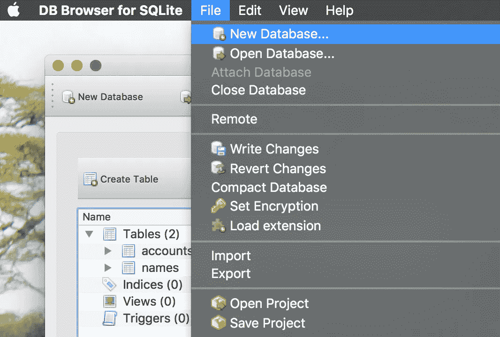
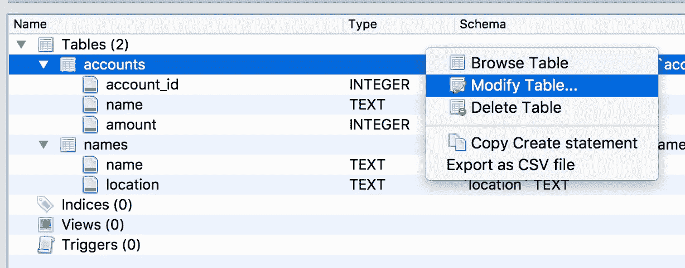
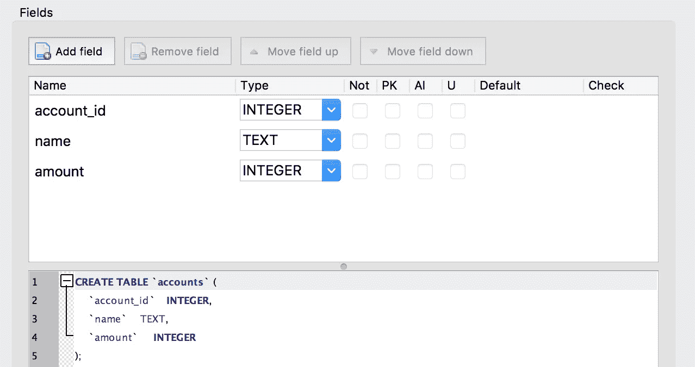
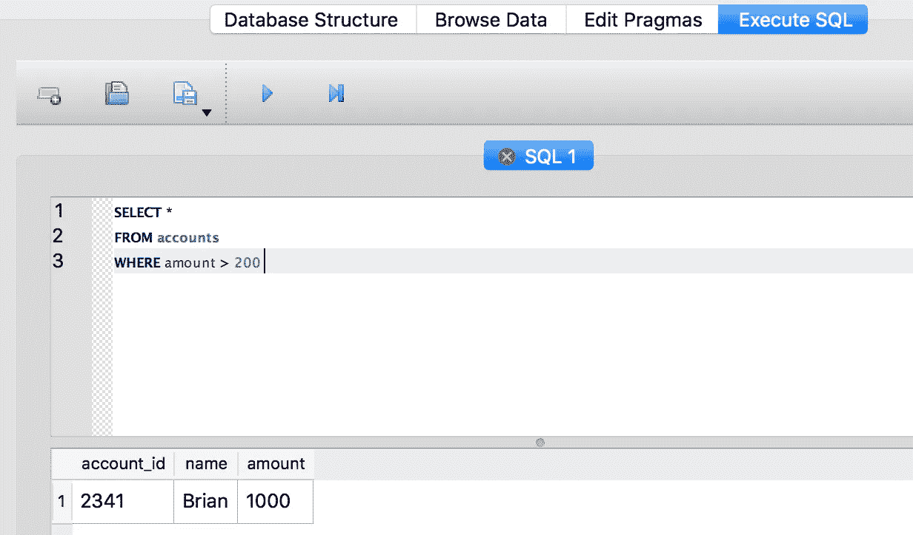
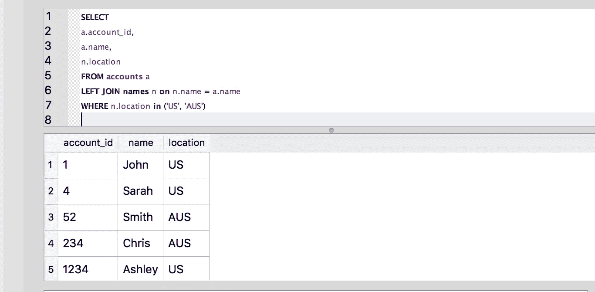

# SQLite 数据库设置和查询

> 原文：<https://towardsdatascience.com/sqlite-database-setup-and-querying-cea0520272c?source=collection_archive---------36----------------------->

## SQLite 数据库浏览器。以下是如何从您自己的本地数据库中进行查询。

Grzegorz Walczak 在[Unsplash](/s/photos/programming?utm_source=unsplash&utm_medium=referral&utm_content=creditCopyText)【1】上拍摄的照片。

# 目录

1.  介绍
2.  SQLite
3.  设置
4.  例子
5.  摘要
6.  参考

# 介绍

你有没有想过建立一个本地数据库并进行查询？如果答案是肯定的，那就继续读下去。无论您是想为即将到来的面试练习您的 SQL 技能，还是想为您当前的职位研究不同的查询技术，或者可能开办自己的公司并存放您的测试数据，DB Browser for SQLite 都适合您。

一旦建立了包含表的数据库。然后，您可以运行查询，这些查询最终将作为您的机器学习模型的数据集。除了在你的 Jupyter 笔记本中使用 Python 和 pandas，你还可以使用这个工具进行探索性的数据分析。此外，您可以获得可作为模型特征的度量。

下面，我将讨论 DB Browser for SQLite、设置和示例，这样到本文结束时，您就可以使用自己的本地数据库了。

# SQLite

[DB Browser for SQLite](https://sqlitebrowser.org/)【2】是一个工具，您可以在其中可视化您创建、编辑和查询的数据库和表格。它是开源的，被一些人用来开始他们的 SQL 之旅。虽然其他公司有几个平台，但是这个界面很容易使用和设置。下面，我将展示如何设置您的第一个数据库及其相应的表。

# 设置

文件—用于安装的新数据库。作者截图[3]。

一旦你下载了这个工具，你可以很容易地创建一个新的数据库，如上面的截图所示。根据我的经验，我创建了两个名为 ***accounts*** 和 ***names*** 的测试表，作为示例。为了设置特定的表格，可以从 CSV 文件中提取数据。在上面的同一个屏幕截图中，您可以点击*导入*选项，然后点击来自 CSV 文件… 的“*表格”——您也可以选择使用来自 SQL 文件…* 的“*数据库”。导入 CSV 文件很容易，只需几秒钟就可以加载—我建议您第一次使用该工具时使用该选项。*

修改表格。作者截图[4]。

一旦将数据导入表中，就可以修改表，从而轻松地更改字段或列的类型。该部分将在*数据库结构*菜单中。这些选项包括:

*   整数
*   文本
*   一滴
*   真实的
*   数字的

字段。作者截图[5]。

在上面的屏幕截图中，您将看到您可以编辑的字段—另一个短语是'*编辑表定义*'。最上面的部分(*类型*)本质上是可视化您也可以用 SQL 代码(*模式*)做什么——对大多数人来说更容易，但是两个选项都是可用的。

现在令人兴奋的部分实际上是查询您先前创建的那些表。下一节将展示并描述如何使用 SQL 返回探索性数据分析和数据科学模型数据集的结果。

# 例子

执行 SQL。作者截图[6]。

整个过程中令人满意的部分是能够使用 SQL 进行查询。在上面的屏幕截图中，您可以看到这个简单的查询，它选择了 ***accounts*** 表中 *amount* 大于 200 的所有字段。只返回了一行，这意味着只有 *account_id* 满足这个条件。这种类型的查询类似于 SQL 的其他子类型，只是有一些小的不同。

连接查询。作者截图[7]。

就像在其他 SQL 平台中一样，您可以执行更复杂的查询，比如连接和 where 子句。上面的截图可视化的选择了三个字段: *a.account_id* 、 *a.name* 和 *n.location* 。单个字母表示相应表的全名，也称为别名。然后，我在*表上执行了一个*左连接*，以检索在 ***账户*** 表上有匹配的结果。接下来，我想只查看位置在美国(US)或澳大利亚(AUS)的结果。总的来说，我能够将两个表合并在一起，以便通过建立特定的条件来检索我想要的信息。*

# *摘要*

*虽然这些查询并不特别复杂，但是它们是为了直观地描述使用这个有用的工具可以执行的查询类型。我在设置本教程的过程中得到了很多乐趣，同时提供了一些关于该平台常见部分的有用说明。虽然我已经介绍了一些，但是还有很多其他的技巧和窍门可以使用。原始参考资料中有更多关于 DB Browser for SQLite 的示例和文档。*

> *总之，使用此工具，您可以为探索性数据分析或数据科学模型数据集创建本地数据库、导入数据、修改表和执行查询。*

*我希望你觉得这篇文章有趣而且有用。感谢您的阅读！*

# *参考*

*[1]照片由 [Grzegorz Walczak](https://unsplash.com/@grzegorzwalczak?utm_source=unsplash&utm_medium=referral&utm_content=creditCopyText) 在[Unsplash](/s/photos/programming?utm_source=unsplash&utm_medium=referral&utm_content=creditCopyText)(2017)上拍摄*

*[2] SQLite，[用于 SQLite](https://sqlitebrowser.org/) 的 DB 浏览器，(2020)*

*[3] M.Przybyla，SQLite 设置的数据库浏览器的屏幕截图，(2020 年)*

*[4] M.Przybyla，修改表截屏，(2020 年)*

*[5] M.Przybyla，编辑表格定义的屏幕截图，(2020)*

*[6] M.Przybyla，执行 SQL 的截图，(2020)*

*[7] M.Przybyla，左连接截图，(2020)*