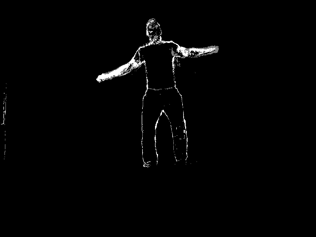
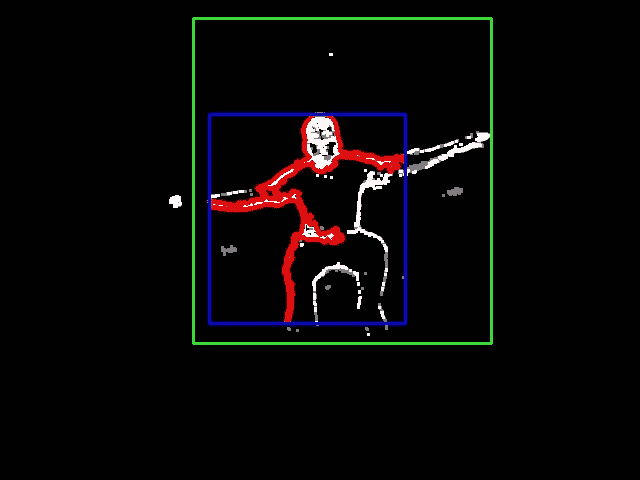
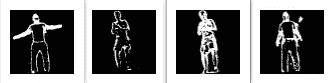
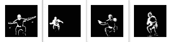
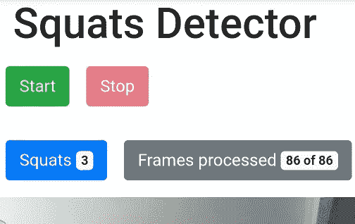

# 使用 OpenCV 和 Tensorflow 的深蹲检测器

> 原文：<https://towardsdatascience.com/squats-detector-with-opencv-and-tensorflow-ce934f19aeb9?source=collection_archive---------35----------------------->

## 体育技术中的人工智能

在隔离期间，我们的身体活动有限，这并不好，尤其是对孩子们来说。

但当我让我的孩子锻炼时，我遇到了阻力，不得不全神贯注地控制整个过程。

这很有趣，而且我有了一个自动化这个过程的想法。虽然在这种情况下有点矫枉过正，但灵感却是不可抗拒的。

考虑到起点，我选择了蹲起。一个具有明确阶段和大幅度的基本动作看起来是最好的竞争者。

## 数据收集

带相机的 Raspberry Pi 非常方便，可以轻松地将照片带回家。

OpenCV 获取图像并将它们写入文件系统。

## 动作识别

最初，我打算用图像分割在图片上找到一个人。但是分割是一个相当繁重的操作，尤其是在资源有限的情况下。

此外，分割忽略了一个事实，我们有一系列的帧，而不是一个单一的图片。该序列具有明显的特征，我们需要使用它。

所以我继续使用 OpenCV 的[背景去除算法](https://docs.opencv.org/master/de/de1/group__video__motion.html)。将这种方法与一些试探法结合起来最终提供了一个可靠的结果。

## 背景减法

首先，创建一个背景减法器:

```
backSub = cv.createBackgroundSubtractorMOG2()
```

用框架来填充它:

```
mask = backSub.apply(frame)
```

最后得到一张有身体轮廓的图:



然后放大图像以突出轮廓。

```
mask = cv.dilate(mask, None, 3)
```

将这种算法应用到所有的帧中会产生姿态遮罩。然后我们要把它们归类为站着，蹲着，或者什么都不做。

下一步是从图片上剪下一个图形。OpenCV 可以找到轮廓:

```
cnts, _ = cv.findContours(img, cv.RETR_CCOMP, cv.CHAIN_APPROX_SIMPLE)
```

这个想法是最大的轮廓或多或少符合身材。

不幸的是，结果是不稳定的，最大的轮廓可能只包裹身体，但错过了腿。

无论如何，有一系列的图像很有帮助。蹲起发生在同一个地方，所以我们可以假设，所有的动作都在某个区域内进行，而这个区域是稳定的。

然后，可以迭代地构建边界矩形，如果需要的话，随着最大轮廓而增加。

有一个例子:

*   最大的轮廓是红色的
*   包围矩形的轮廓是蓝色的
*   包围矩形的图形是绿色的



使用这种方法，我们可以得到一个姿态进行进一步的处理。

## 分类

然后，从图像中剪切出包围矩形，制成正方形，并统一为 64×64 的大小。

分类器输入有多个掩码:

对于展台:



对于深蹲:



我使用 Keras + Tensorflow 进行分类。

最初，我从经典的 [Lenet-5 型号](http://yann.lecun.com/exdb/publis/pdf/lecun-01a.pdf)开始。它工作得很好，在读了[一篇关于 Lenet-5 变体的文章](https://medium.com/@sh.tsang/paper-brief-review-of-lenet-1-lenet-4-lenet-5-boosted-lenet-4-image-classification-1f5f809dbf17)后，我决定尝试简化架构。

结果，一个非常简单的 CNN 显示了几乎相同的准确性:

```
model = Sequential([
        Convolution2D(8,(5,5), activation='relu', input_shape=input_shape),
        MaxPooling2D(),
        Flatten(),
        Dense(512, activation='relu'),
        Dense(3, activation='softmax')
      ])model.compile(loss="categorical_crossentropy", optimizer=SGD(lr=0.01), metrics=["accuracy"])
```

10 个时期的准确率为 86%，20 个时期的准确率为 94%，30 个时期的准确率为 96%。
长时间的训练可能会导致过度适应，所以是时候在现实生活中尝试这种模式了。

## 树莓派

我是 [OpenCV-DNN 模块](https://docs.opencv.org/master/d2/d58/tutorial_table_of_content_dnn.html)的忠实粉丝，为了避免 Tensorflow 繁重的设置，我打算使用它。

不幸的是，当我将 Keras 模型转换为 TF 并在 Raspberry 上运行时:

```
cv2.error: OpenCV(4.2.0) C:\projects\opencv-python\opencv\modules\dnn\src\dnn.cpp:562: error: (-2:Unspecified error) Can't create layer "flatten_1/Shape" of type "Shape" in function 'cv::dnn::dnn4_v20191202::LayerData::getLayerInstance'
```

这是一个关于堆栈溢出的已知问题，但是补丁还没有发布。

所以除了张量流别无选择。

Google 已经为 Raspberry 支持 TF 好几年了，所以没有任何技巧可以让它工作。

TF 包含适用于 Keras 型号的适配器，无需转换。

加载模型:

```
with  open(MODEL_JSON, 'r') as f:
  model_data = f.read()
  model = tf.keras.models.model_from_json(model_data)
  model.load_weights(MODEL_H5)
  graph = tf.get_default_graph()
```

并对蹲式面罩进行分类:

```
img = cv.imread(path + f, cv.IMREAD_GRAYSCALE)
img = np.reshape(img,[1,64,64,1])
with graph.as_default():
  c = model.predict_classes(img)
  return c[0] if c else None
```

在 Raspberry 上，输入为 64x64 的分类调用大约需要 60–70 毫秒，接近实时。

## 树莓 app

将上述所有部分整合成一个[单一应用](https://github.com/tprlab/squats/tree/master/rasp):

让我们使用 Flask 创建一个具有以下条目的服务:

*   **获取/** —一个应用程序页面(更多信息见下文)
*   **获取/状态** —获取当前状态、深蹲和帧数
*   **发布/开始** —开始一项练习
*   **POST /stop** —完成练习
*   **获取/传输** —来自摄像机的视频流

我在服务启动时初始化了 Tensorflow。这通常是一个坏主意，尤其是在 Raspberry 上——TF 将消耗大量资源，服务将响应缓慢，并可能在达到极限时死亡。

所以通常我会在一个单独的进程中启动 TF，并为进程间通信提供一个通道，但是我为这个原型使用了一个简单的方法。

已经有提到的网络应用程序来控制蹲起活动。该应用程序可以:

*   显示来自摄像机的实时视频
*   开始/停止练习
*   计算深蹲和框架



当一个练习开始时，服务将图片写入文件系统。

让它们训练神经网络是很方便的，但通常不需要它们。

该服务处理一系列图片，用 TF 对它们进行分类，当符合站立-蹲-站立模式时，蹲计数器增加。

## 标签工具

有一个简单的[贴标工具](https://github.com/tprlab/squats/tree/master/pretrain)用于人工分类。这是一个用 python + OpenCV 的 GUI 应用程序。

该工具显示带有主要轮廓和边界矩形的图片，并需要键:S(站立)，Q(蹲下)，N(无)，然后自动将图片移动到目标子文件夹中。

然后，应该将带标签的子文件夹复制到 Keras 模型输入文件夹中，并且需要重复训练过程。

## 平台

我在 Raspberry 上运行这个应用程序，但没有什么能阻止我使用任何带有 python、OpenCV 和摄像头的 Linux 环境。

## 问题

事实上，它可以被接受为 MVP，但是还有很多需要改进的地方。

*   细化背景去除。阴影会产生嘈杂的斑点，使分类器变得模糊不清。
*   为神经网络收集更多数据。
*   回顾分类器架构。最简单的方法现在显示出令人满意的结果，但是有它自己的局限性。

## 链接

*   【Yann LeCun 关于卷积网络的一篇原创文章。
*   [OpenCV 中的背景去除](https://docs.opencv.org/master/de/de1/group__video__motion.html)。
*   [蹲点 GitHub 上的探测器源代码](https://github.com/tprlab/squats)。