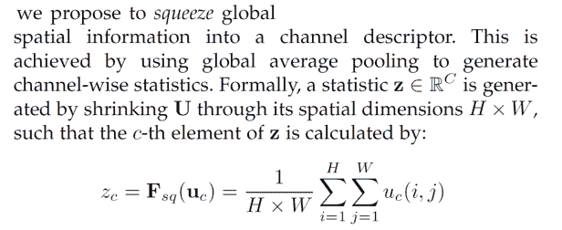

# 压缩和激励网络

> 原文：<https://towardsdatascience.com/squeeze-and-excitation-networks-fb91e7f64096?source=collection_archive---------36----------------------->

## 提高 CNN 性能的频道自我关注


悉尼港上空的烟火[(维基百科，CC by 2.0)](https://en.wikipedia.org/wiki/Fireworks#/media/File:OperaSydney-Fuegos2006-342289398.jpg)

这篇文章描述了挤压和激励模块，这是一种可以插入卷积神经网络以提高性能的架构单元，只需增加少量的参数。挤压和激励模块明确地对渠道关系和渠道相互依赖性进行建模，并包括一种对渠道的自我关注形式。

这篇文章的主要参考是原始论文，它被引用了 2500 多次:

[、、萨缪尔·阿尔巴尼、和吴。"挤压和激励网络."CVPR 2018。](https://arxiv.org/abs/1709.01507)

# **概述**

挤压和激励(SE)模块旨在提高卷积神经网络表示的质量。卷积神经网络(CNN)的回顾可在[这里](https://glassboxmedicine.com/2019/05/05/how-computers-see-intro-to-convolutional-neural-networks/)获得。

对于卷积神经网络的任何层，我们可以构建相应的 SE 块来重新校准特征映射:

*   在“挤压”步骤中，我们使用全局平均池来聚合跨越其空间维度 H x W 的特征地图，以产生通道描述符。
*   在“激励”步骤中，我们将完全连接的层应用于“挤压”步骤的输出，以产生每通道权重(“激活”)的集合，该集合被应用于特征映射，以生成 SE 块的最终输出。

论文中的图 1 描述了一个 SE 模块:


# **论文批注&多通道 2D 卷积复习**

我们的输入是一个图像 **X** ，它有 *s* 个通道:


我们定义一个卷积层 **F** _ *tr* ，它由滤波器 **V** 组成:


我们将由滤波器 **V** 组成的卷积层 **F** _ *tr* 应用于我们的输入图像 **X** 。

为了阐明符号以及输入图像 **X** 和学习的卷积滤波器组 **V** 之间的关系，这里快速回顾一下多通道输入图像的 2D 卷积，在这种情况下是 3 通道 RGB 输入图像。

变换 **F** _ *tr* 包括多个卷积滤波器**V**=【**V _**1、 **v_** 2、…、 **v** _C】。3 通道图像的“2D 卷积”的一个过滤器实际上是三维的，正如我们从这个动画中可以看到的，其中滑动的白色轮廓表示单个过滤器，*例如* **v** _1:


马丁·戈尔纳创作的动画。[原文链接](https://sites.google.com/site/nttrungmtwiki/home/it/data-science---python/tensorflow/tensorflow-and-deep-learning-part-3?tmpl=%2Fsystem%2Fapp%2Ftemplates%2Fprint%2F&showPrintDialog=1)。此处也可用[。](https://stackoverflow.com/questions/42883547/intuitive-understanding-of-1d-2d-and-3d-convolutions-in-convolutional-neural-n)

考虑 RGB 图像 **X** ，在下图中显示了两次——一次在顶部覆盖了淡橙色滤镜 **v** _1，一次在底部覆盖了紫色滤镜 **v** _2:


从上图中我们可以看到，单个滤镜是三维的，为 x 的 3 个通道测量 k x k x 3，在这个例子中， **V** 包括两个滤镜，淡橙色滤镜 **v** _1 和紫色滤镜 **v** _2。

在本文的符号中，上标 s 用于跟踪输入 X 的通道(本例中 s=1，2，3)，而下标 c 用于跟踪 **V** 中的滤波器(本例中 c=1，2):


以下是详细标注的过滤器:


通过将滤波器 **V** 应用于输入图像 **X** ，我们获得输出滤波器图 **U** :


单一输出滤波器映射，例如 **u** _1(下标 c=1)，通过所有通道(即通过上标 s=1、s=2 和 s=3)求和产生。以这种方式只能捕获隐含的渠道关系。引用作者的话，

> *由于输出是通过所有通道求和产生的，通道相关性隐含在****v****_ c 中，但是与滤波器捕获的局部空间相关性纠缠在一起。由卷积建模的信道关系固有地是隐含的和局部的(除了在最顶层的那些)。我们期望卷积特征的学习通过显式建模信道相互依赖性[即，使用 SE 块]来增强。*

(注:在本文之后，为了简化符号，省略了偏差术语。)

现在，我们已经回顾了论文的符号和 2D 多通道卷积，这里有一个挤压和激发块如何工作的解释。它们出奇的简单，只需要全局平均池和完全连接的层。

# **挤压:全局信息嵌入**

SE 块中的“挤压”步骤将全局空间信息挤压到通道描述符中。挤压步骤包括跨空间维度 H x W 的全局平均汇集，以产生逐通道统计。以下是这篇论文的摘录，其中包含挤压步骤的描述和等式:



下图说明了压缩操作，该操作将每个不同的 H x W 特征图 **u** _c 缩减为标量通道描述符 *z* _c:


标量[ *z* _1、 *z* _2、…、 *z* _C]一起形成一个长度为 *C* 的向量 **z** ，该向量将在激励步骤中使用。请注意， **z** 捕获全局信息，因为 **z** 的每个元素是由全特征图高度 *H* 和全特征图宽度 *W* 的集合产生的。

# **激励:自适应重新校准**

激励操作旨在完全捕捉通道间的相关性。激励操作处理挤压步骤的输出(矢量 **z** )以产生激活矢量 **s，**，然后用于重新缩放特征图。(此激活向量 **s** 不要与之前用于跟踪输入 **X** 通道的 *s* 相混淆)。

向量 **s** 是从挤压输出 **z** 中计算出来的，使用两个完全连接的层，瓶颈将表示缩小到大小 *C/r:*


超参数 *r* 被称为“减速比”如果 *r* 越大，则中间表示越小。将表示的大小减小到 *C/r* 然后将其扩展回 *C* 的目标是(a)限制模型的复杂性和(b)帮助一般化。正如作者所说，缩减率 *r* “允许我们改变网络中 SE 块的容量和计算成本。”

以下是激励步骤第一部分的草图，其中从挤压输出 **z** 计算出 **s** 中的激活:


一旦 **s** 被计算，则 **s** 的元素被用于重新缩放 **U** 的特征图，以获得 SE 块的最终输出，称为**X**-波浪号:


这是最后一步的草图:


从草图中可以看出，激活 *s* _1 必须平铺在*H*x*W*map**u**_ 1 上，以便 *s* _1 元素乘上 **u** _1 中的所有值，生成 **x** -tilde_1。

重新校准的特征地图[**x**-波浪号 _1、**x**-波浪号 _2、…、**x**-波浪号 _C]的堆栈然后继续通过 CNN 的其余部分，因为它们与原始特征地图[ **u** _1、 **u** _2、…、 **u** _C]的维度完全相同。

因此，SE 块给 CNN 增加了一种自我关注的形式:

> *SE 模块本质上引入了以输入为条件的动态，这可被视为通道上的自关注功能，其关系不限于卷积滤波器所响应的局部感受野。*

# **实施**

挤压和激励模块可以插入任何 CNN 架构。文章中的图 3 说明了如何在 ResNet 中使用 se 块:


SE 块不会增加模型的计算复杂度太多。在以下比较中，“SE-ResNet-50”是指添加了 SE 模块的 ResNet-50 型号，而“vanilla ResNet-50”是指没有任何 SE 模块的基准 ResNet-50:

*   SE-ResNet-50 需要约 3.87 GFLOPs，而 vanilla ResNet-50 需要约 3.86 GFLOPs，相对增加了 0.26%(对于 224 x 224 像素输入图像的单次向前传递)；
*   SE-ResNet-50 来回一次需要 209 毫秒，而 vanilla ResNet-50 需要 190 毫秒，相对增加了 10%(在具有 8 个 NVIDIA Titan X GPUs 的服务器上，256 个图像的训练小批量的时间)；
*   SE-ResNet-50 需要大约 2750 万个参数，而 vanilla ResNet-50 需要大约 2500 万个参数，相对增加了 10%。实际上，这些参数中的大部分来自网络的最后一级，在那里激励操作在最大数量的通道上执行。[……]这种相对昂贵的 SE 模块的最后一级可以以很小的性能成本去除(<0.1% top-5 error on ImageNet) reducing the relative parameter increase to ~4%”

Here’s an example implementation of an SE block ([来源](/squeeze-and-excitation-networks-9ef5e71eacd7)):

```
*def se_block(in_block, ch, ratio=16):
     x = GlobalAveragePooling2D()(in_block)
     x = Dense(ch//ratio, activation=’relu’)(x)
     x = Dense(ch, activation=’sigmoid’)(x)
     return multiply()([in_block, x])*
```

# **结果**

作者将 SE 块添加到 ResNet 架构、ResNeXt 架构、VGG-16 和 Inception 架构，并表明 SE 块的添加提高了 ImageNet 分类的性能。性能改进显示在表 2 中 SENet 列中每个条目旁边的括号中:


结果部分的其他要点:

*   SE 块还提高了 CIFAR-10 和 CIFAR-100 数据集、用于场景分类的 Places365-Challenge 数据集以及用于对象检测的 COCO 数据集的模型性能。
*   对于减速比 *r* 的不同值的范围，性能是稳定的。“增加的复杂性不会单调地提高性能，而较小的比率会显著增加模型的参数大小。设置 *r=* 16 在准确性和复杂性之间取得了很好的平衡。”
*   对于 squeeze 操作符，全局平均池的性能略好于全局最大池。
*   激励算子内部有一个 ReLU，最终的非线性是一个 s 形。用 ReLU 或 Tanh(而不是 sigmoid)代替激励算子的最终非线性会降低性能。

# **总结**

*   挤压和激励模块明确模拟渠道关系和渠道相互依赖性，并包括一种渠道自我关注的形式；
*   挤压和激励块使用全局平均池的“挤压”操作，继之以使用两个完全连接的层的“激励”操作，来重新校准特征图；
*   挤压和激励模块可以插入到任何 CNN 架构中，并且需要最小的计算开销；
*   挤压和激励模块可以提高分类和目标检测任务的性能。

*原载于 2020 年 4 月 4 日 http://glassboxmedicine.com**[*。*](https://glassboxmedicine.com/2020/04/04/squeeze-and-excitation-networks/)*