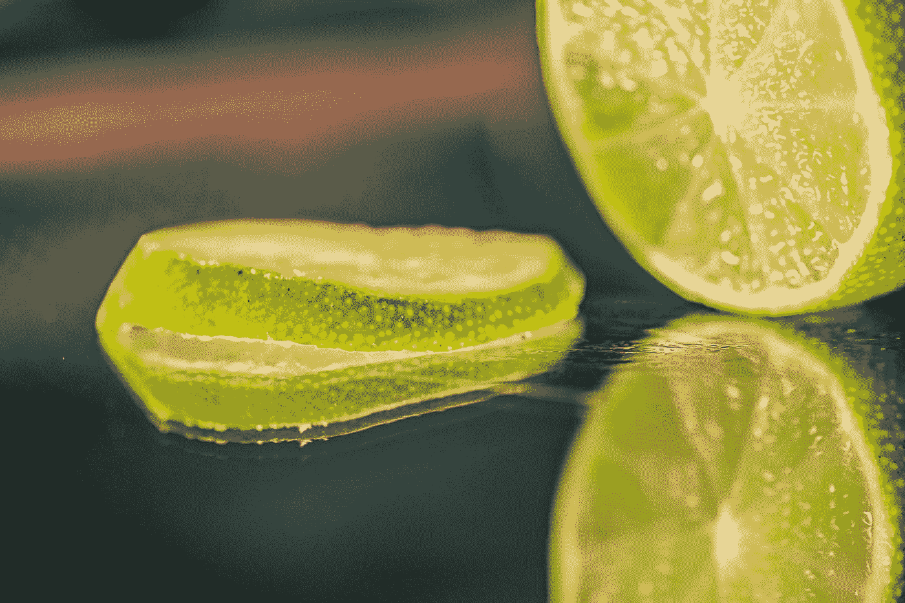

# 挤压这些神经网络

> 原文：<https://towardsdatascience.com/squeeze-that-neural-network-juice-3ce28a2cca75?source=collection_archive---------42----------------------->

## 制作神经网络(和更有效的网络)的技巧

杰西卡·路易斯在 [Unsplash](https://unsplash.com?utm_source=medium&utm_medium=referral) 上的照片

我们都知道神经网络有多贵。训练是一项乏味的任务，需要多次迭代(每次迭代需要几个时期(每个时期需要几个步骤)(您调整过超参数吗？(也许还有一层？(和…)))))((())))))))))))))

…如果您已经开始部署任何东西，那么您也知道云推理不是免费的。模型越大，神经网络从你身上榨取的 A̶m̶a̶z̶o̶n 就越多。

在这篇文章中，i̶̶t̶e̶a̶c̶h̶̶h̶o̶w̶̶t̶o̶̶m̶a̶k̶e̶̶c̶a̶i̶p̶i̶r̶i̶n̶h̶a̶s 我概述了一套技术，你可以探索，使训练更快，生产更小的模型，并最终节省金钱和时间。所有的技巧都是实用的，是你今天可以应用，最多明天就能得到结果的东西。

不要让神经网络压榨你的钱包。把那些重物挤出来。

照片由 [Maria das Dores](https://unsplash.com/@mariadasdores?utm_source=medium&utm_medium=referral) 在 [Unsplash](https://unsplash.com?utm_source=medium&utm_medium=referral) 上拍摄

顺便说一句，如果你是为了 caipirinhas 来的，我很抱歉。它需要一个切成八个半月形的酸橙和一汤匙(或三汤匙)糖，放在一个大玻璃杯里碾碎。不多也不少。倒入一杯*cachaa*，剩下的装满冰块。伏特加也行，但用 caipivodka 代替。

神经网络。聚焦聚焦

# 你能抽出 2%吗？

假设你有一家公司，它有一个 92%准确的神经网络产品。然而，它使用了大约一亿个参数，并需要两天时间在多 GPU 基础设施上进行训练。进一步改进模型的成本特别高，因为大多数改变要么使它变得更糟，要么根本没有提供任何改进。

**如果您可以拥有一个 90%准确的模型，并且占用的资源减少 20-50 倍，这会扼杀您的业务还是让它蓬勃发展？**

达到 94%是很难的。这需要大量资源、更大的网络、时间…

达到 90%很容易。如果能做到 92%，做的少就是小事。

**目标是:在不低于 90%的情况下，您能简化多少？**

当前的文献和实践表明，在保持大部分原始精度不变的情况下，降级模型是相当容易的。有些技术是纯技术性的，而其他技术需要对网络架构稍加改动。在下文中，我首先概述了可以应用于预训练模型的技术，以便您今天就可以获得结果，然后是需要一些再训练的技术，这可能明天就可以完成。

# 适用于预训练模型的技术

## 使用半精度:

通常，使用浮点数来训练模型。大多数编码人员都知道“double”类型，这是一种更精确的浮点数，但是知道“half”类型(16 位浮点数)的人却不多。

使用“半”类型可以将内存消耗和计算时间减半。使用半精度训练的神经网络可以用两倍于普通网络的批量来训练，基本上每个时期的时间减半。在推理过程中，半精度模型更容易转移，执行速度更快。此外，许多公司为半精确模型提供特殊的云硬件。

**好消息是:**你可以将一个预先训练好的模型量化到半精度，它确实有效。 [TensorFlow Lite 包可以帮你做这件事](https://www.tensorflow.org/lite/performance/post_training_float16_quant)。如果您正在从头开始训练您的模型，您可以通过[启用半精度模式](https://www.tensorflow.org/guide/keras/mixed_precision)来从中受益(不要忘记将批量加倍！).

## 权重修剪

在数百万个参数中，有些很大，有些很小。有许多技术可以发现这些“微小”的权重，并将其从网络中移除。仅修剪就可以去除 10%到 90%的权重，而对总准确度的影响不到 2%。

修剪过的网络压缩得更好，推理时间也更短。你可能会感到惊讶，甚至 MobileNet 可以缩小到原来的一半大小。大型非优化模型，如 InceptionNet，可能会去除高达 85%的原始重量。

**好消息是:** TensorFlow 有几项权重修剪技术[易于使用](https://www.tensorflow.org/model_optimization/guide/pruning)，也与 [Keras 后端](https://www.tensorflow.org/model_optimization/guide/pruning/pruning_with_keras)兼容。一个社区解决方案是 [Keras Surgeon](https://github.com/BenWhetton/keras-surgeon) ，它作为一个[很好的例子](https://github.com/BenWhetton/keras-surgeon/blob/master/src/kerassurgeon/examples/lenet_mnist.py)展示了如何在修剪和调整之间交替。

**更进一步:**大多数修剪工具都去掉了权重，但保持了架构的完整性。更先进的技术可以从卷积中去除整个过滤器，从密集层中去除神经元，从而提高训练速度。Keras 外科医生可以做到这一点。两个有趣的阅读是[这个关于修剪过滤器的工作](https://arxiv.org/abs/1608.08710)和[彩票假设](https://arxiv.org/abs/1803.03635)。

## 考虑使用优化的“现成”模型

许多公司在他们的管道中使用预先训练的模型，不仅仅是作为主干架构。通常，他们使用“大型”模型，如 VGG-19、InceptionNet 和 ResNet。请考虑改用优化模型。

**例如，**如果您正在使用 ResNet-151，您可以考虑迁移到 ResNet-50，或者向下迁移到 MobileNetV3 架构。如果你依赖于更快的 R-CNN 架构来进行物体检测，考虑切换它的主干(或者整个东西)。YOLO 和 YOLO 快速是伟大的优化替代品。这可能会为你节省数千美元的推理时间。

明智一点:这些选择中的一些会让你对我们 2%的协议不满。有些会让你下跌 3%，或者 10%。他们会省下多少钱？你会失去多少顾客？改变可能还是有利可图的。

## 服无期徒刑

快速提醒一下，你可以用 YOLO 或 MobileNet，修剪它，量化到半精度。这些技术并不相互排斥。

# 需要再培训的技术

## 改变脊柱

继续最后一个技巧，如果您使用现成的模型作为主干，这是一个时髦的做法，请考虑切换到较小的 ResNet 主干或 MobileNetV3。这对迁移学习很有帮助。

摆脱腰痛。 [Keras](https://keras.io/applications/) / [Tensorflow](https://www.tensorflow.org/api_docs/python/tf/keras/applications) 捆绑了很多预先训练好的模型，可以很方便的作为骨干使用。

## 像 MobileNet 一样

阅读论文[的好处是](https://arxiv.org/abs/1704.04861)知道其他作者是如何做出惊人之举的。MobileNet 性能的关键是**深度方向可分离卷积**。

简而言之，这个想法是将具有 128 个滤波器的 3 乘 3 卷积分成两个连续的步骤:“空间”卷积，完成“3 乘 3”部分，以及“深度”卷积，完成“128 个滤波器”部分。**平均而言，这要快 9 倍，并且使用的参数数量级更少。**

**好消息是:**这和修改一行代码一样简单。对于 Keras 用户，只需将“Conv2D”改为“[depthwisecov2d](https://www.tensorflow.org/api_docs/python/tf/keras/layers/DepthwiseConv2D)”。所有参数都一样。以我的经验来看，这并没有训练得更快，但是推理和模型大小都得到了极大的改进。

## 知识蒸馏

如果你已经有了一个工作模型，一个非常有效的修剪技术就是知识提炼。也被称为**师生模式。**

对整个数据集运行良好的旧模型并保存其预测。这些是“软标签”它们不是典型的一次性编码标签；他们有一些不确定性。现在，在软标签上训练较小的模型，而不是地面事实。这将教会“学生”复制“老师”，而不是试图自己学习。

**这看起来很复杂，但其实很简单:**你只需要像平常一样运行旧模型，然后处理结果。然后，使用您拥有的相同代码，丢弃数据集并从 pickle 文件中读取基本事实标签。为了避免将“数据集”和“教师”作为两个独立的事物，您也可以将数据集剥离。原来的老师。

**多做一点:**更全面的方法可能会将真实标签与教师标签进行插值，或者创建一个混合损失函数。除了输出层之外，您还可以“教授”内部层的输出。然而，这让事情变得有点复杂。

## 对输入进行缩减采样

大多数成功的网络使用 224x224 或 256x256 输入。如果您使用的数量超过这个数量，您可能会浪费资源。*少往往就是多*。

图像是高度相关的。在像素(23，23)处发现的数据与在(24，23)或(23，22)处发现的数据几乎相同。随着分辨率的提高，相关性占主导地位。一张 4K 的脸并不比一张 256x256 的脸更有面子。它的所有毛孔都清晰可见。

除非您正在处理大海捞针的问题，否则请考虑将输入降采样到较低的分辨率。只要你，人类，还能认识到有什么要认识的，模型就没问题。

**下采样可以无需训练:**如果你的模型是完全卷积的，或者在变成完全连接的网络之前使用全局平均池，你可能会获得下采样的好处，而不必重新训练它。

## 对输出进行缩减采样

如果您正在处理图像到图像的问题，尤其是图像分割，分割很可能在较低的分辨率下完成。

假设您正在制作 256x256 分割图。如果你重新训练你的模型做 128x128，它的性能可能会上升。然后，你只需要将其放大到 256x256，并重新评估实际的影响。除了保留初始卷积和最终反卷积，您很有可能保持大约 2%的原始精度。

这里要注意的是，尽管整体形状是正确的，但分割边界通常是嘈杂和错误的。以较低的分辨率+传统的放大是获得更平滑结果的简单方法，同时也节省了计算时间。

照片由[改善 Nguyễn](https://unsplash.com/@kaizennguyen?utm_source=medium&utm_medium=referral) 在 [Unsplash](https://unsplash.com?utm_source=medium&utm_medium=referral) 上拍摄

这篇文章的关键要点是我们都在浪费资源。神经网络不需要很大。如果你用力挤压，所有的低效都会消失。你所需要的就是剩下的多汁的网络。

抛开其他一切。

感谢阅读:)