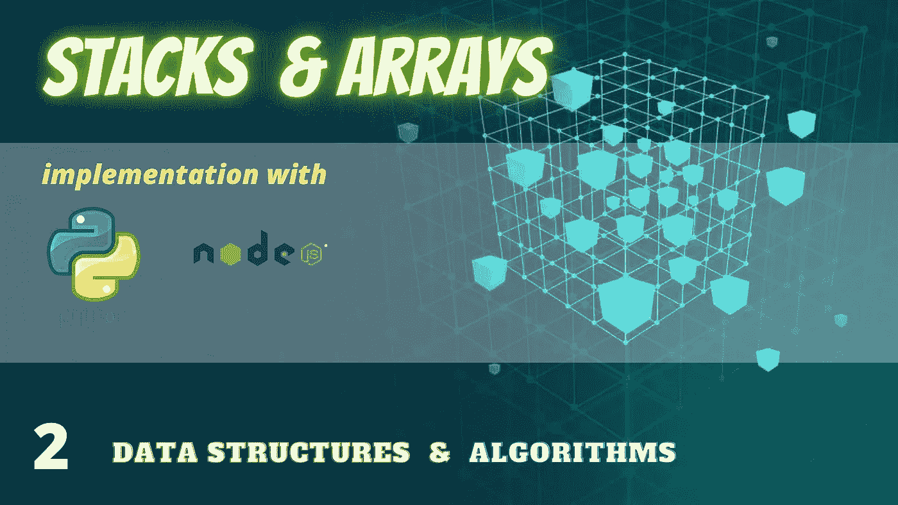
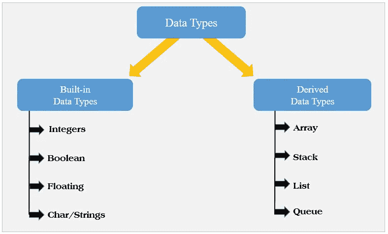
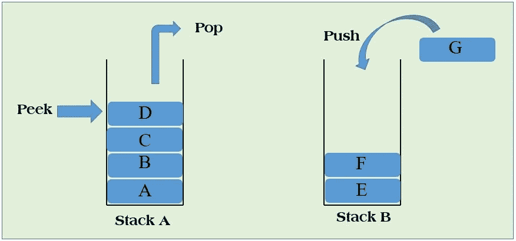
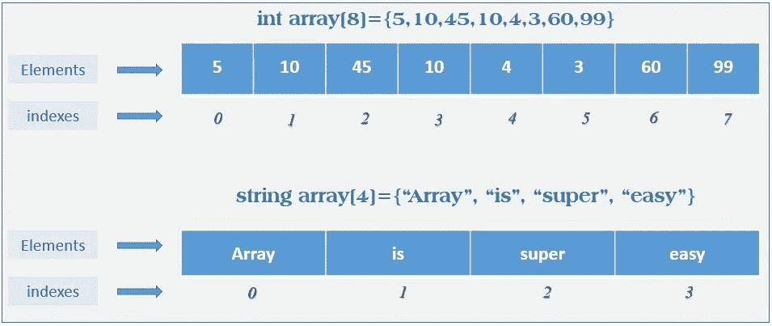

# 用 Python 和 NodeJs 实现堆栈和数组

> 原文：<https://towardsdatascience.com/stack-and-array-implementation-with-python-and-nodejs-b8b260229e3a?source=collection_archive---------28----------------------->



作者图片

在[的上一篇文章](https://medium.com/@pradeephbac/data-structures-and-algorithms-journey-80d225cfbbd8?source=friends_link&sk=0eda1ea06843aa973538150dd9826c22)中，我们讨论了数据结构和算法的基本定义。在这篇文章中，让我们更深入地挖掘数据结构的世界，特别是，让我们也为编码做一点尝试。

**本文目标:**

1.  讨论数据类型、内置数据类型和派生数据类型。
2.  介绍**栈**派生的数据结构
3.  在 Python *{* [*代码*](https://github.com/pradeephbac/DataStructures_and_Algorithms/tree/master/Stack/python) *}和* NodeJs *{* [*代码*](https://github.com/pradeephbac/DataStructures_and_Algorithms/tree/master/Stack/nodejs) *}* 中实现和使用栈
4.  介绍**数组**派生的数据结构
5.  在 Python *{code}和* NodeJs *{code}* 中实现和使用栈

## 数据类型简介

数据结构由一个或多个数据对象组成。数据对象代表我们将要使用精心设计的数据结构存储的数据。数据类型被认为是对数据结构中的几种数据类型进行分类的主要方式，如字符串、字符、整数等。在编程领域有两种主要的数据类型，即内置数据类型和派生数据类型。



常用的数据类型(图片由作者提供)

## 内置数据类型

这些是编程语言支持的基本数据类型。在特定的编程语言中主要称为**主要数据类型**。

## 派生数据类型

这些数据类型是使用一个或多个内置(主)数据类型实现的。所有的数据结构都是基于这种派生的数据类型开发的。在这篇文章中，我们将讨论栈的数组的数据结构和实现的例子。

# 堆栈数据结构

**栈**是一种**抽象数据类型** (ADT 是一种**类型**，用于其行为由一组值和一组操作定义的对象)是编程语言中的主要数据结构之一，对于初学者来说，这是一种容易理解的结构。**LIFO(L**ast**I**n**F**first**O**ut)**是一个栈的主要特长**。****

像大多数数据结构一样，堆栈也表示真实世界的对象。例如，一堆硬币、一堆盒子等。


真实世界的堆栈(图片由作者提供)

可以使用数组、列表、指针等来实现堆栈。说到堆栈，有一组函数被定义为在编程上下文中有效地使用堆栈。



堆栈操作(图片由作者提供)

**Python 实现**

在 python 中，我们可以使用列表数据类型作为内置数据类型来实现堆栈数据结构。

{ code }请在 Github [链接](https://github.com/pradeephbac/DataStructures_and_Algorithms/tree/master/Stack/python)中找到附件代码库。

**NodeJs 实现**

在 NodeJs 中，我们可以使用数组数据类型实现堆栈数据结构。

*{code}* 请在此 Github [链接](https://github.com/pradeephbac/DataStructures_and_Algorithms/tree/master/Stack/nodejs)中找到附件代码库。

# 推送操作

一旦你定义了栈类，其中一个主要的功能就是 push 函数。这里你将输入一个**条目**到数组的顶部。

***算法实现***

我们可以在 stack 类中定义一个算法来实现 push 操作。

```
**Step 1** − Checks if the stack is full(assume that the list is implemented based on a  dynamic array) for the given size or not.**Step 2** − If the stack is full, print an error**Step 3** − If the stack is not full for the given maximum size, increase the top by one and point the pointer to the next empty space.**Step 4** − Add a new element to the new empty space which is in the top of the stack**Step 5** − Return success.
```

# 弹出操作

**pop** 函数将从堆栈中移除最顶端的元素，堆栈项目计数将减一。*尽管看起来像是从堆栈中移除了最顶端的元素，但是那个* ***元素并不会被完全移除*** *，只有指针会移动到下面的位置。*

***算法实现***

我们可以在 stack 类中定义一个算法来实现 pop 操作。

```
**Step 1** − Checks if the stack is empty by looking at the array length**Step 2** − If the stack is empty, print an error, exit**Step 3** − If the stack is not empty, get the element which is pointing at the top of the stack.**Step 4** − Decreases the size of the stack by 1, automatically the pointer of the top most item  will changed to the below item.**Step 5** − Returns success.
```

# 窥视操作

**peek** 函数将显示堆栈中最顶端的元素，该操作不会像 **pop** 操作那样从堆栈中移除该项。

***算法实现***

我们可以在 stack 类中定义一个算法来实现 peek 操作。peek 操作只返回堆栈顶部的值。

```
**Step 1** − Checks if the stack is empty by looking at the array length**Step 2** − If the stack is empty, print an error, exit**Step 3** − If the stack is not empty, get the element which is pointing at the top of the stack.**Step 4** −  Returns success.
```

还有其他类似 **isEmpty()** ， **isFull()，**和 **printStackItems()** 的函数可以作为支持函数，帮助你高效地使用堆栈。

栈实现和所有支持的功能实现都可以在这个代码库中找到。 [*堆栈数据结构*](https://github.com/pradeephbac/DataStructures_and_Algorithms/tree/master/Stack)

使用堆栈数据结构，因为我们将来在算法部分解决实际问题时会用到这些数据结构。

# 数组数据结构

当程序员实现他们的算法时，数组是最常用的数据结构之一。数组的一个特点是数组容器应该是固定大小的**，所有元素应该是相同类型的**。****

********

****数组表示(图片由作者提供)****

****除了数组中的所有元素应该是相同的数据类型之外，数组总是从第 0 个元素开始(**零索引**)，数组的大小意味着，它本身可以存储多少个元素。****

****在许多数据类型中，有一些主要的操作(功能)是为了有效地使用该数据类型而存在的。在数组数据类型中，有五种主要的操作。****

## ****数组插入****

****向给定的索引中添加一个新元素称为数组插入。我们能够通过 python 和 nodejs 编程语言实现向给定索引插入元素。****

****在 **nodejs** 中实现数组插入操作****

****在 **python** 中实现数组插入操作****

## ****数组搜索****

****我们可以基于**值**或**索引**对数组元素执行搜索操作。****

****按索引搜索意味着将相应的数组元素返回给定的索引，按值搜索意味着将相应的值返回给定的数组中的索引。****

****在 **nodejs** 中实现数组插入操作****

****在 **python** 中实现数组插入操作****

## ****数组删除****

****由于数组是固定大小的数据结构，从数组的给定位置删除一个元素有点棘手。在删除给定元素时，应该通过减小数组的大小来调整新数组。请参考下面的代码示例，它解释了如何用基本的编程技术从数组中删除给定的元素。****

****在 **python** 中实现数组插入操作****

****在 **Nodejs** 中实现数组插入操作****

## ****数组更新****

****数组更新是一个非常简单的操作，只需要遍历给定的数组，直到找到需要更新的元素。请遵循以下代码示例，以便更熟悉阵列更新功能。****

****在 **nodejs —** [***代码***](https://github.com/pradeephbac/DataStructures_and_Algorithms/blob/master/Array/nodejs/array_update.js) 中实现数组更新操作****

****在 **python —** [***代码***](https://github.com/pradeephbac/DataStructures_and_Algorithms/blob/master/Array/python/array_update.py) 中实现数组更新操作****

## ****数组遍历****

****数组遍历就是打印一个序列中的所有数组元素。由于数组是零索引的数据类型，我们可以从零位置开始遍历数组结构来打印数组元素。****

****在 **nodejs —** [***代码***](https://github.com/pradeephbac/DataStructures_and_Algorithms/blob/master/Array/nodejs/array_traversal.js) 中实现数组遍历操作****

****在 **python —** [***代码***](https://github.com/pradeephbac/DataStructures_and_Algorithms/blob/master/Array/python/array_traversal.py) 中实现数组遍历操作****

******总之，**我们已经学会了如何高效地使用 [**栈**](https://github.com/pradeephbac/DataStructures_and_Algorithms/tree/master/Stack) 和 [**数组**](https://github.com/pradeephbac/DataStructures_and_Algorithms/tree/master/Array) 。请找到下面的代码段，看看我们如何用 python 和 nodejs 实现堆栈和数组。****

****您只需要在您的机器上安装节点，就可以开始了。(节点安装 [*链接*](https://nodejs.org/en/download/) )****

****开始编写代码，为接下来的课程做准备。****

```
****FYI:**  when you trying to implement data structure operations, always remember on “***Algorithm to implement***” and think in that direction. This approach will help you to get a deep understanding of the entire workflow of data structure usage.**
```

****在下一课中，我们将实现其他派生的数据结构，如**队列、链表、双向链表、**和**循环链表**，它们被认为是非常重要的数据结构，在开始使用算法之前需要先了解一下。****

****对于 Git 库克隆，请点击 [*这里*](https://github.com/pradeephbac/DataStructures_and_Algorithms.git)****

****更多课程见，编码快乐！****