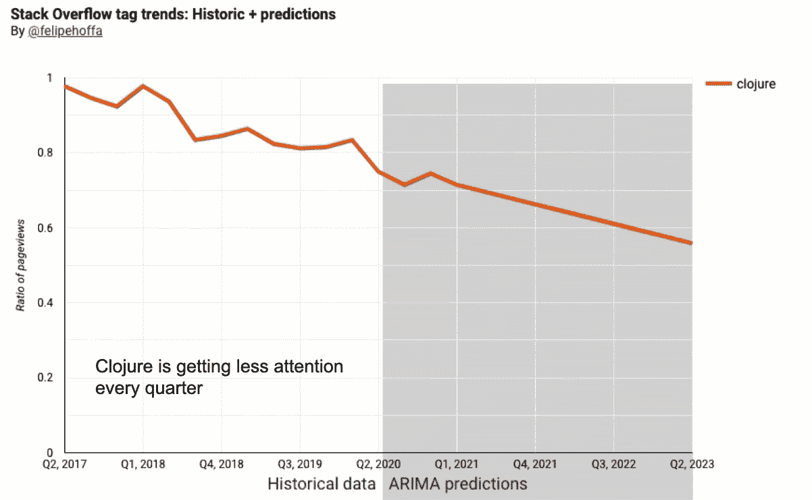
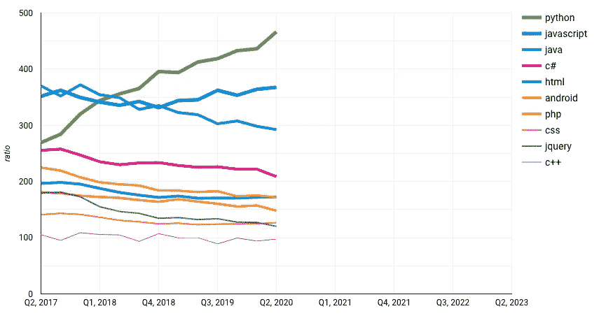
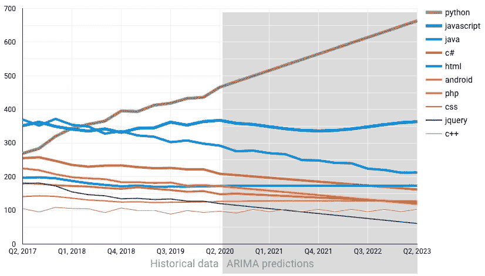
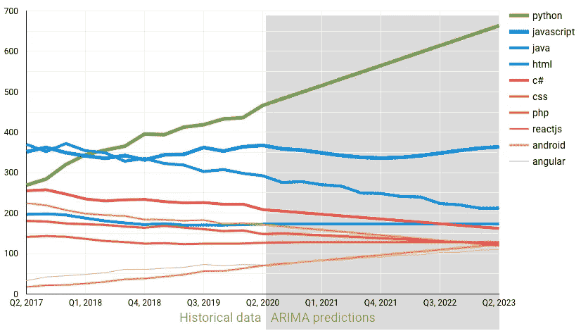
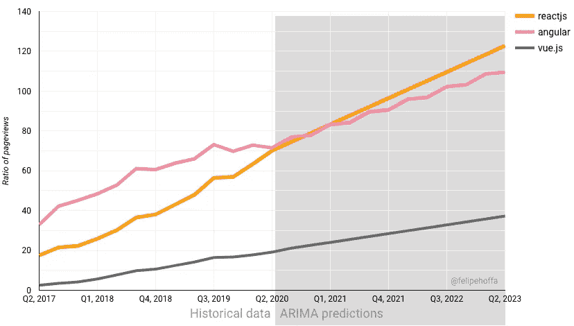
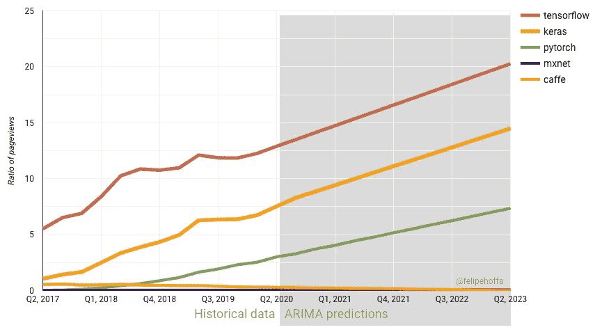
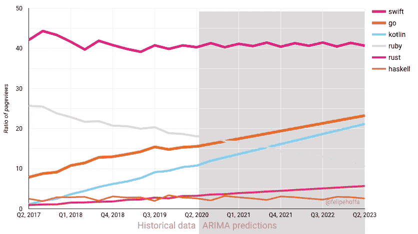
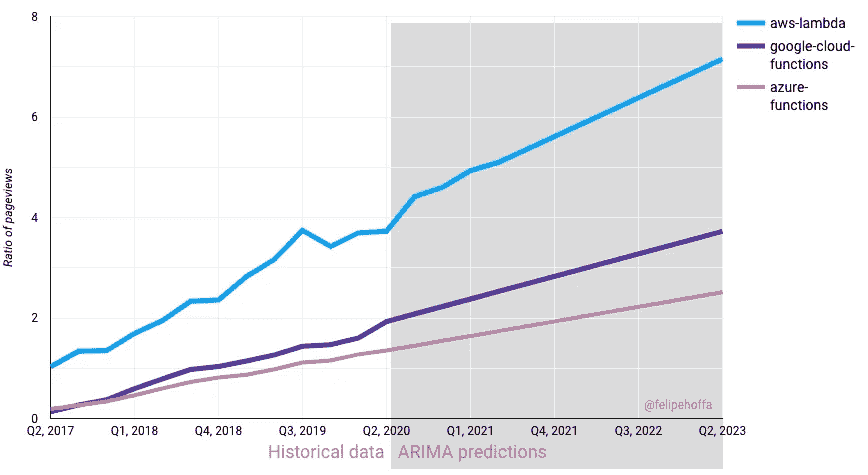
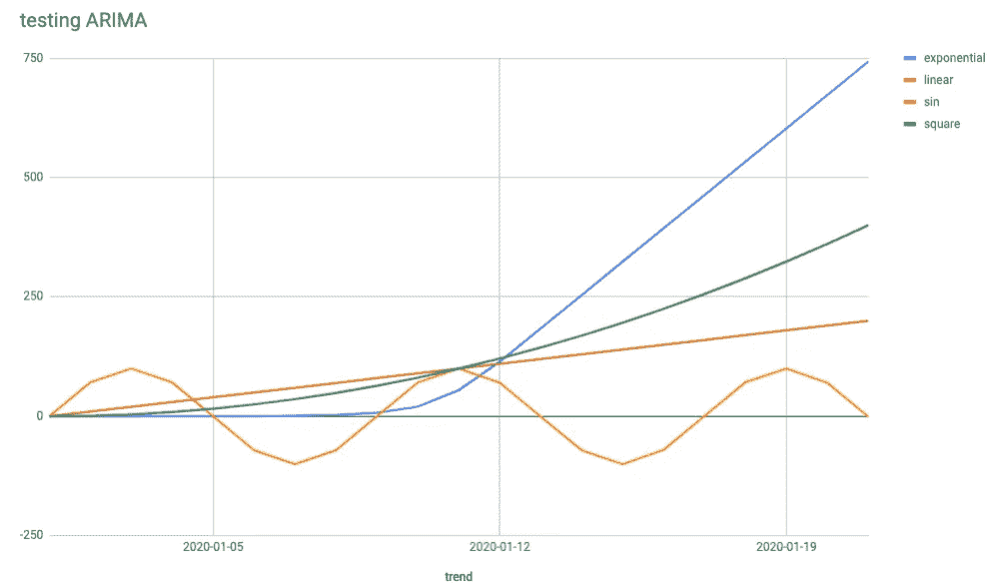
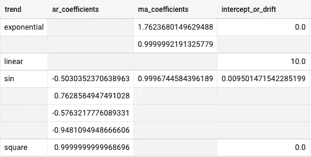

# 2023 年堆栈溢出:用 ARIMA 和 BigQuery 预测

> 原文：<https://towardsdatascience.com/stack-overflow-future-trends-predicting-with-arima-and-bigquery-77d330833329?source=collection_archive---------29----------------------->



## 你能预测 2023 年的顶级堆栈溢出标签吗？BigQuery 为 ARIMA 训练时序分析模型提供了新的支持，让这一切变得简单。

***重要更新*** : *我在 2020 年离开了谷歌，加入了雪花——所以我无法保持更新我的旧帖子。如果你想尝尝雪花啤酒，加入我们吧——我在❄️.玩得很开心*

# 查找 2023 年的顶级堆栈溢出标签

让我们从 2020 年 6 月的顶级堆栈溢出标签开始:



2020 年 6 月十大堆栈溢出标签

正如您在图表中看到的，根据上一季度的页面浏览量，当前的顶级堆栈溢出标签为:

1.  计算机编程语言
2.  Java Script 语言
3.  Java 语言(一种计算机语言，尤用于创建网站)
4.  C#
5.  超文本标记语言
6.  机器人
7.  服务器端编程语言（Professional Hypertext Preprocessor 的缩写）
8.  半铸钢ˌ钢性铸铁(Cast Semi-Steel)
9.  jQuery
10.  C++

当你回头看图表时，你可以看到很多变化。两年前 Python 排名第三，现在它是前十名中唯一显示增长的标签。

仅看上面的图表，你会如何将这些线延伸到未来 3 年？借助 BigQuery 和一些 SQL 魔法，我们可以轻松做到这一点:



十大堆栈溢出标签，2020 年 6 月—与 ARIMA 一起展望未来

ARIMA 模型的预测很有道理:Python 继续上升，JavaScript 保持稳定，Java 继续下降……现在，我们能利用这些趋势找到 2023 年的顶级堆栈溢出标签吗？当然可以:



十大堆栈溢出标签，2023 年 6 月—由 ARIMA 预测

这很有趣！C++和 jQuery 消失了——两个新的前 10 名标签是 ReactJS 和 Angular。

如果我们想确定未来的顶级趋势，这真的很酷。我们可以使用所有当前可用的信息，将其投射到未来，并根据可见的趋势做出决策。

## 其他有趣的趋势

现在我们有了这些预测和一个仪表板，我们可以重新访问我的 2018 年帖子“[真正的堆栈溢出趋势:使用浏览量](/these-are-the-real-stack-overflow-trends-use-the-pageviews-c439903cd1a)”。

## **反应 vs 角度 vs Vue.js**

*   现在，反应和角度都获得了同样多的关注
*   React 预计将在未来获得微弱优势。



## 机器学习

*   TensorFlow、Keras 和 PyTorch 表现出强劲增长。
*   回到 2018 年，Pytorch 和 MxNet 同样被忽视。然而 PyTorch 趋势上升，MxNet 仍然被忽视。
*   Caffe 在 2017 年有过一些关注，但后来就淡出了。
*   TensorFlow 预计将在 2023 年保持头把交椅。



## 即将推出的语言:Swift，Go，Haskell，Kotlin，Rust

*   Swift 获得了周期性关注，但没有增长。
*   Go 和 Kotlin 的受欢迎程度每个季度都在增长，但不足以在短期内赶上 Swift。
*   Haskell 和 Rust 并没有表现出太多的动作，但至少 Rust 在上升，而 Haskell 保持稳定。
*   在向下的斜坡上，为了比较:红宝石。Go 和 Kotlin 仍然受到更多关注，但可能不会太久。



## AWS Lambda vs GCP 函数 vs Azure 函数

*   AWS 有优势，但 GCP 和 Azure 一直在向右上方移动。



## 找到自己的趋势

玩玩 [Data Studio 交互式仪表盘](https://datastudio.google.com/reporting/86b19d4c-3942-4dd7-9704-6a28d4f58d68/page/OGaUB)，分享你的发现。

# 操作方法

## BigQuery 中的 ARIMA

要使用 BigQuery 生成时间序列预测，您只需用几行 SQL 语句创建一个模型:

```
CREATE OR REPLACE MODEL `temp.merged202006_arima_dailyquarter`
OPTIONS(model_type='ARIMA',
        time_series_id_col='id_col',
        time_series_data_col='data_col',    
        time_series_timestamp_col='date_col'
) 
```

就是这样。只要你有时间序列，BigQuery 可以尽力找到一个合适的 ARIMA 模型。

为了快速检查，让我们生成 4 个基本时间序列:线性、二次增长、指数增长和周期性:

```
CREATE OR REPLACE MODEL `temp.test_arima`
OPTIONS(model_type='ARIMA',
        time_series_id_col='trend',
        time_series_data_col='i',    
        time_series_timestamp_col='date'
) ASSELECT DATE_ADD('2020-01-01', INTERVAL i DAY) date
  , **10*i** i, **'linear'** trend
FROM UNNEST(GENERATE_ARRAY(0,10)) i
UNION ALL
SELECT DATE_ADD('2020-01-01', INTERVAL i DAY)
  , **i*i**, **'square'**
FROM UNNEST(GENERATE_ARRAY(0,10)) i
UNION ALL
SELECT DATE_ADD('2020-01-01', INTERVAL i DAY)
  , **EXP(i)/400**, **'exponential'**
FROM UNNEST(GENERATE_ARRAY(0,10)) i
UNION ALL
SELECT DATE_ADD('2020-01-01', INTERVAL i DAY)
  , 100***SIN(i*ACOS(-1)/4)**, **'sin'**
FROM UNNEST(GENERATE_ARRAY(0,10)) i
```

然后，我们可以要求该模型预测每个时间序列的未来值:

```
SELECT DATE(forecast_timestamp) date, forecast_value i, trend 
FROM **ML.FORECAST**(MODEL `temp.test_arima` 
  , STRUCT(10 AS horizon, 0.1 AS confidence_level))
```

一旦进入图表，结果看起来相当不错:



测试 ARIMA。这些数值中有一半是由模型预测的。

请注意，即使所有这些预测看起来都很好——没有人“*读懂了我的心思*”:ARIMA 预测了指数增长曲线和线性增长。

特别有趣的是，BigQuery ML 时间序列如何处理 sin 循环“正弦”序列中的季节性。BQML 时间序列中的 ARIMA 要多得多，来自[的官方文件](https://cloud.google.com/bigquery-ml/docs/reference/standard-sql/bigqueryml-syntax-create-time-series#whats_inside_a_time_series_model):

> [**big query ML 时间序列模型**](https://cloud.google.com/bigquery-ml/docs/reference/standard-sql/bigqueryml-syntax-create-time-series#whats_inside_a_time_series_model)
> 
> ARIMA 被认为是 BigQuery ML 时间序列中使用的核心算法。然而，它不是模型创建管道中使用的唯一模型。管道由以下组件组成，大致按步骤运行的顺序列出:
> 
> -对输入时间序列的自动清理调整，包括缺失值、重复时间戳、尖峰异常，以及说明时间序列历史中的突然水平变化。
> 
> -假日效应调整。
> 
> -使用[季节性和趋势分解使用黄土(STL)](https://otexts.com/fpp2/stl.html) 算法的季节性和趋势分解。
> 
> -使用[双指数平滑(ETS)](https://en.wikipedia.org/wiki/Exponential_smoothing#Double_exponential_smoothing) 算法进行季节性外推。
> 
> -使用 [ARIMA](https://en.wikipedia.org/wiki/Autoregressive_integrated_moving_average) 模型和[汽车进行趋势建模。自动超参数调整的 ARIMA](https://otexts.com/fpp2/arima-r.html) 算法。在自动模式下。ARIMA，几十个候选模型被平行训练和评估。最佳模型带有最低的[赤池信息标准(AIC)](https://en.wikipedia.org/wiki/Akaike_information_criterion) 。

您还可以要求 BigQuery 显示它为每个系列找到的最佳系数:

```
SELECT  *
FROM  ML.ARIMA_COEFFICIENTS(MODEL `temp.test_arima`)
```



ML。每个 ARIMA 趋势的 ARIMA 系数

## 堆栈溢出趋势

查看我以前的帖子“[真正的堆栈溢出趋势:使用浏览量](/these-are-the-real-stack-overflow-trends-use-the-pageviews-c439903cd1a)”。

[](/these-are-the-real-stack-overflow-trends-use-the-pageviews-c439903cd1a) [## 这些是真正的堆栈溢出趋势:使用页面视图

### 直到今天，获得 Stack Overflow 的季度浏览量并不容易。了解如何获得这些…

towardsdatascience.com](/these-are-the-real-stack-overflow-trends-use-the-pageviews-c439903cd1a) 

## 将所有这些与 dbt 放在一起

我在 GitHub 上分享了生成堆栈溢出预测的完整代码:

*   [https://github.com/fhoffa/…/stack_overflow_dbt](https://github.com/fhoffa/code_snippets/tree/master/stack_overflow_dbt)

并确保检查我的两个视频与[Yufeng](https://medium.com/u/2a2ae028a675?source=post_page-----77d330833329--------------------------------)我们建立这些预测:

## 黑客 ARIMA

*   请注意，BigQuery 中的 ARIMA 目前处于测试阶段。
*   它确实做得很好！在这种情况下，我能够在 20 分钟内为 15，000 个不同的标签建立模型和预测。
*   我希望团队能很快解决的一个问题是:ARIMA 没有很好地处理季度数据，但这是我对这个例子的全部了解。因此，我必须将日期从季度节奏转换为每日节奏，然后再转换回来。

# 后续步骤

## 异常检测

不要预测未来 3 年，而是预测今天，并将预测结果与实际结果进行比较。

对于来自 ARIMA 的任何超出置信区间的东西，你可以认为这是一个值得更仔细检查的异常现象。

## 相关职位

查看 [Lak Lakshmanan](https://medium.com/u/247b0630b5d6?source=post_page-----77d330833329--------------------------------) 的帖子:

[](/how-to-do-time-series-forecasting-in-bigquery-af9eb6be8159) [## 如何在 BigQuery 中进行时间序列预测

### 使用 BigQuery ML 中的 ARIMA 模型进行需求预测

towardsdatascience.com](/how-to-do-time-series-forecasting-in-bigquery-af9eb6be8159) 

# 想要更多吗？

我是 Felipe Hoffa，谷歌云的开发者倡导者。在 [@felipehoffa](https://twitter.com/felipehoffa) 上关注我，在【medium.com/@hoffa】的[上找到我之前的帖子](https://medium.com/@hoffa)，在[的【reddit.com/r/bigquery】上找到所有关于 BigQuery 的帖子](https://reddit.com/r/bigquery)。