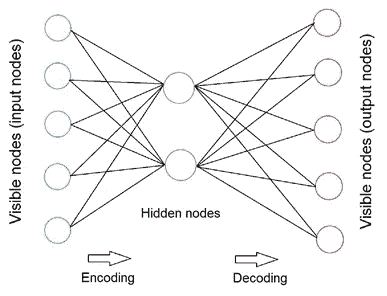
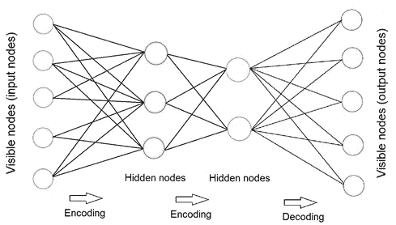
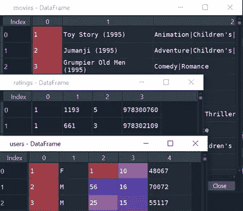
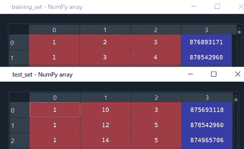

# 对堆叠式自动编码器的直观介绍和作为电影分级系统的创建

> 原文：<https://towardsdatascience.com/stacked-auto-encoder-as-a-recommendation-system-for-movie-rating-prediction-33842386338?source=collection_archive---------40----------------------->

## 堆叠式自动编码器简介和使用 Pytorch 创建模型的技术演练


通过[链接](https://unsplash.com/photos/CiUR8zISX60)改编自 unsplash 的 Img

在之前的[文章](https://medium.com/@vistaxjtu/restricted-boltzmann-machine-how-to-create-a-recommendation-system-for-movie-review-45599a406deb)中，我们为电影评论预测创建了一个受限的波尔兹曼机器模型:喜欢还是不喜欢。现在，我将介绍如何构建一个自动编码器模型，用于从 0 到 5 的电影分级预测。它分为 6 个部分。

1.  自动编码器简介
2.  商业挑战
3.  数据处理
4.  模型结构
5.  模特培训
6.  模型检验

📣📣这是一篇技术驱动的文章。现在让我们开始旅程🏃‍♀️🏃‍♂️.

1.  **自动编码器介绍**

> 自动编码器是一种定向神经网络，旨在生成与输入相同的输出。如图 1 所示，输入通过隐藏层进行编码和解码，产生输出，然后与输入进行比较。之后，执行反向传播来更新权重。出于训练目的，重复这个迭代。



图 1 自动编码器模型图(作者创建的 Img)

有不同类型的自动编码器，包括堆叠自动编码器、稀疏自动编码器、去噪自动编码器和深度自动编码器。对于这里将要构建的堆叠式自动编码器，它在中间包含多个编码或解码层，如图 2 所示，而基本的自动编码器框架只有一个隐藏层。



图 2 堆叠式自动编码器模型图(作者创建的 Img)

2.**商业挑战**

一家知名视频流媒体公司委托我们预测其用户对电影的喜好，评分从 0 到 5。

3.**数据处理**

数据 *MovieLens 100K 电影评分*来自 *GroupLens Research* [这里](https://grouplens.org/datasets/movielens/)。简单看一下图 3 中的数据，**电影**数据包含电影的名称和类型，**评级**数据包含用户 ID、电影 ID、从 0 到 5 的用户评级和时间戳，**用户**数据包含用户 ID、性别、年龄、工作代码和邮政编码。



图 3 源数据片段

3.1 导入数据

数据集包含 80，000 行训练集和 20，000 行测试集。让我们读一读。具体来说，

```
training_set = pd.read_csv(‘ml-100k/u1.base’, delimiter = ‘\t’)
training_set = np.array(training_set, dtype = ‘int’)
test_set = pd.read_csv(‘ml-100k/u1.test’, delimiter = ‘\t’)
test_set = np.array(test_set, dtype = ‘int’)
```

**注意，我们将 Dataframe 转换为 Numpy 数组，因为我们将使用 Pytorch 张量，它需要数组作为输入。**图 4 显示了训练/测试集，包括用户 ID、电影 ID、评级和时间戳(对于模型训练是不可逆的)。



图 4 训练集和测试集的片段

3.2 数据结构创建

> 为了准备训练/测试数据，我们需要以数组格式创建训练/测试集，每行代表一个用户，行中的每个单元格代表每部电影的评级。这是自动编码器的预期输入。

为此，我们需要将用户总数作为行号，将电影总数作为列号。

```
nb_users = int(max(max(training_set[:, 0]), max(test_set[:, 0])))
nb_movies = int(max(max(training_set[:, 1]), max(test_set[:, 1])))
```

我们创建了一个数据转换函数，它返回一个列表列表。每个子列表代表一个用户对所有电影的评级。如果用户没有对电影进行分级，则将分级初始化为 0。这在训练模型时非常重要。

```
def convert(data):
    new_data = []
    for id_users in range(1, nb_users + 1):
        id_movies = data[:,1][data[:,0] == id_users]
        id_ratings = data[:,2][data[:,0] == id_users]
        ratings = np.zeros(nb_movies)
        ratings[id_movies — 1] = id_ratings
        new_data.append(list(ratings))
    return new_data
```

利用上面的转换函数，我们对训练集和测试集进行转换。

```
training_set = convert(training_set)
test_set = convert(test_set)
```

图 5 显示了最终的训练集。同样，每行包含用户对所有电影的评级。


图 5 最终训练集片段

最后，我们将 list 类型的**列表转换为**张量**，因为我们将使用 Pytorch 来构建自动编码器。**

```
training_set = torch.FloatTensor(training_set)
test_set = torch.FloatTensor(test_set)
```

4.**模型建筑**

如何构建自动编码器的体系结构🤔？一个简单的解决方案是创建一个包含自动编码器的变量和方法的类。

这里我们将从 Pytorch 继承一个名为*模块*的父类。好处是继承允许我们创建一个子类来轻松构建我们的堆栈式自动编码器。

现在让我们在类中创建函数。

4.1 *__init__* 函数

> **首先，从父类*模块*继承所有的类和函数。**
> 
> **接下来，**使用继承类 *nn 创建第一个全连接层 *fc1* 。线性()*，连接第一个输入矢量特征和第一个编码矢量。

第一个论点为 *nn。Linear()* 是特征数，也就是电影数， *nb_movies* 。第二个参数是第一个隐藏层中的节点数。基于实验，我们选择 20，这意味着第一个编码向量是 20 个元素的向量。这 20 个特征代表了相似用户喜欢的电影的特征。

> 第三，添加第二个隐藏层 *fc2* ，20 个特征作为输入，10 个编码特征作为输出。

以上是编码部分。现在让我们添加解码层 *fc3* 和 *fc4* ，它们将与编码对称。请记住，自动编码器旨在重建输入向量，因此输出向量需要与输入向量具有相同的维数。

> 最后，指定模型的激活函数，这里使用的是 Sigmoid 函数。这是可调的，您可以随意尝试其他功能。

```
def __init__(self, ):
    super(SAE, self).__init__()
    self.fc1 = nn.Linear(nb_movies, 20)
    self.fc2 = nn.Linear(20, 10)
    self.fc3 = nn.Linear(10, 20)
    self.fc4 = nn.Linear(20, nb_movies)
    self.activation = nn.Sigmoid()
```

4.2 前进功能

> **在这个函数中，我们使用 *__init__* 函数内建的架构来应用编码和解码。**这是通过对编码和解码层应用激活函数来实现的。最后，它返回一个预测收视率的向量，该向量将与实际收视率进行比较。

具体来说，我们添加一个自变量，输入向量 *x* ，它将被连续编码两次和解码两次，产生重构向量。第一个激活函数激活接受输入向量 *x* 的第一个隐藏层 *fc1* 的 20 个神经元。接下来，使用相同的方法，激活 *fc2* 和 *fc3* 。注意 *fc4* 在输出层重构解码矢量时不需要应用激活函数。最后，返回预测评级的向量。

```
def forward(self, x):
    x = self.activation(self.fc1(x))
    x = self.activation(self.fc2(x))
    x = self.activation(self.fc3(x))
    x = self.fc4(x)
    return x
```

5.**模特培训**

祝贺你通过了第 4 部分，因为这是最难的部分👍👍。现在我们来训练 SAE 模型。

首先，我们从 *nn 中选择**均方误差**。ms loss()*对于损失函数，RMSprop 来自 *optim。RMSprop()* 分别为优化器。基于实验，我们选择学习率为 0.01，权重衰减为 0.5。注意，权重衰减用于在每几个时期后降低学习速率，以调节收敛。我们在 200 个历元上训练模型。这些参数是可调的，您可以随意尝试。

```
sae = SAE()
criterion = nn.MSELoss()
nb_epoch = 200
optimizer = optim.RMSprop(sae.parameters(), lr = 0.01, 
                          weight_decay = 0.5)
```

接下来，我们为循环创建 2 个，一个用于历元迭代，一个用于观测迭代。在 epoch 循环中，我们初始化 *train_loss* 和至少评价一部电影的用户数量。为了优化计算，该模型不会在没有对任何电影进行评级的用户身上进行训练。

在观察迭代中，每个观察被一个接一个地反馈，以使用 SAE 类和 *sae* 对象来预测每个用户的评级。计算每个观察的损失，并且应用优化器来优化损失。同时，损失在每个时期之后累积，因此我们可以回顾训练损失如何在每个时期上演变。

具体来说，为 Pytorch 网络训练集中的输入向量添加了一个批次维度。我们使用*变量()*和 *unsqueeze()* 函数将批处理维度放在索引 0 处。然后，使用 *clone()* 函数克隆输入以创建目标。如上所述，该模型是对没有对任何电影进行评级的用户进行训练的，这是通过一个 *if* 条件来实现的。在 *if* 条件里面，我们先做预测。注意，我们使用 *sae(input)* 进行预测，而不是 *sae.forward(input)* 。这是因为 *forward* 函数是从 *nn* 类创建的任何对象的基本函数。这里，我们的 SAE 类已经覆盖了父 *forward* 函数。更多信息可以在这里找到。

接下来，我们设置 *target.require_grad False，*，因为 *target* 从*输入*中复制了相同的 *require_grad* 字段。这是因为只需要计算相对于*输入*的梯度，而不是相对于*目标*的梯度。更多信息可在[这里](https://discuss.pytorch.org/t/clone-and-detach-in-v0-4-0/16861)找到。然后，在输入评级为 0 的索引处将预测重置为 0，因为 0 评级不会影响损失计算。完成后，我们可以使用*标准*对象有效地计算损失。我们必须对所有电影的损失进行平均，包括那些没有评级的电影，以使损失在数学上与所有观察相关。 *backward()* 方法用于决定向哪个方向更新权重，增加还是减少。最后，使用 *optimizer.step()* 更新权重。不同于*【向后()】的方法，这是决定要更新的权重的数量。*

```
*for epoch in range(1, nb_epoch + 1):
    train_loss = 0
    s = 0.
    for id_user in range(nb_users):
        input = Variable(training_set[id_user]).unsqueeze(0)
        target = input.clone()
        if torch.sum(target.data > 0) > 0:
            output = sae(input)
            target.require_grad = False
            output[target == 0] = 0
            loss = criterion(output, target)
            mean_corrector = nb_movies/float(torch.sum(target.data >
                                                       0) + 1e-10)
            loss.backward()
            train_loss += np.sqrt(loss.data*mean_corrector)
            s += 1.
            optimizer.step()
    print(‘epoch: ‘+str(epoch)+’ loss: ‘+str(train_loss/s))*
```

*有了以上这些，我们就可以进行模型训练了。最终，我们在第 1 个纪元时损失了 *1.77* ，在第 100 个纪元时损失了 *0.934* ，在第 200 个纪元时损失了 *0.914* 。*

*太好了。模型建立和训练到此为止。相当专业，希望我说清楚了😇😇。*

*6.**模型测试***

*与训练循环相比，我们去除了历元迭代。注意下面，我们使用*训练集*作为*输入*进行预测，使用*测试集*作为*目标*进行损失计算。然后，在目标评级为 0 的索引处将预测重置为 0，因为这些 0 意味着用户没有对电影进行评级，因此应该没有预测。我们只计算用户在 *test_set* 中评价的电影的测试损失。*

```
*test_loss = 0
s = 0.
for id_user in range(nb_users):
    input = Variable(training_set[id_user]).unsqueeze(0)
    target = Variable(test_set[id_user]).unsqueeze(0)
    if torch.sum(target.data > 0) > 0:
        output = sae(input)
        target.require_grad = False
        output[target == 0] = 0
        loss = criterion(output, target)
        mean_corrector = nb_movies/float(torch.sum(target.data > 0) + 1e-10)
        test_loss += np.sqrt(loss.data*mean_corrector)
        s += 1.
print('test loss: '+str(test_loss/s))*
```

*有了以上所有的，我们执行测试。最后我们得到了一个 *0.95* 的测试损耗。这表明模型有轻微的过度拟合。*

*最后一点，如果你想比较实际评分和预测评分，使用下面的代码。*

```
*user_id = 0
movie_title = movies.iloc[:nb_movies, 1:2]
user_rating = training_set.data.numpy()[user_id, :].reshape(-1,1)user_target = test_set.data.numpy()[user_id, :].reshape(-1,1)
user_input = Variable(training_set[user_id]).unsqueeze(0)predicted = sae(user_input)
predicted = predicted.data.numpy().reshape(-1,1)result_array = np.hstack([movie_title, user_target, predicted])
result_array = result_array[result_array[:, 1] > 0]result_df = pd.DataFrame(data=result_array, columns=[‘Movie’, ‘Target Rating’, ‘Predicted’])*
```

*现在，最后一个问题，如何用模型做出真实的预测？简单，只要试试:*

```
*prediction = sae(test_value)*
```

***太好了！这是所有的旅程。如果需要源代码，请访问我的**[**Github**](https://github.com/luke4u/Movie-Rating-Prediction)**页面💕💕。***