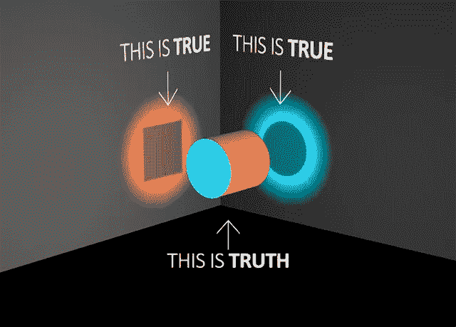

# 堆叠胶囊自动编码器

> 原文：<https://towardsdatascience.com/stacked-capsule-autoencoders-f632c44be496?source=collection_archive---------33----------------------->

## 使用无监督学习和有限数量的训练数据对图像和视频中的对象检测的未来进行展望。

照片由[将](https://unsplash.com/@willbro?utm_source=medium&utm_medium=referral)放在 [Unsplash](https://unsplash.com?utm_source=medium&utm_medium=referral) 上

# 介绍

在过去的几年里， [Geoffrey Hinton](https://en.wikipedia.org/wiki/Geoffrey_Hinton) 和一组研究人员开始研究一种基于胶囊的革命性的新型神经网络。

这项研究背后的一些主要动机是，当前的神经网络，如[卷积神经网络(CNN)](https://en.wikipedia.org/wiki/Convolutional_neural_network)，只有在提供大量数据的情况下，才能在[计算机视觉](/roadmap-to-computer-vision-79106beb8be4)任务(如对象检测)中实现最先进的精度。

像 CNN 这样的模型需要如此大量的数据的一个主要原因是它们无法捕捉组成图像的不同元素之间的方向和空间关系。事实上，用于改善 CNN 性能的主要技术之一是数据增强。当应用数据扩充时，我们通过从原始图像创建额外的数据，例如旋转、裁剪、翻转等，帮助我们的模型更深入、更全面地了解不同对象的特征。这样，即使从不同的角度看，我们的模型也更有可能识别同一物体(图 1)。

图 1:从不同的角度看同一个物体会引起误解[1]。

CNN 能够通过首先识别图像中的边缘和形状，然后将它们组合在一起来检测物体。尽管这种方法没有考虑构建整个图像的空间层次，因此导致需要创建大的数据集以便很好地执行(因此也增加了训练模型所需的计算成本)。

# 胶囊

杰弗里·辛顿使用胶囊的方法紧紧遵循相反的逆图形原理。事实上，根据 Hinton 的说法，我们的大脑每次处理一个新的物体时，它的表征都不依赖于视角。因此，为了创建能够像我们的大脑一样好地执行对象识别的模型，我们需要能够捕捉组成对象的不同部分的层次关系，并将它们与坐标框架相关联。

这可以通过将我们的网络建立在一种叫做胶囊的结构上来实现。胶囊是一种数据结构，它以矢量形式包含了我们正在检测的特征的所有主要信息。它的主要成分是:

1.  表示图像中是否存在形状的逻辑单位。
2.  代表形状的[姿态](http://homepages.inf.ed.ac.uk/rbf/CVonline/LOCAL_COPIES/MARBLE/high/pose/express.htm)的矩阵。
3.  嵌入颜色、变形等其他信息的向量…

在过去几年中，Hinton 研究小组提出了不同的方法来创建胶囊网络，例如:

*   2017: [动态路由](https://arxiv.org/abs/1710.09829)(判别学习和部分整体关系)。
*   2018: [期望-最大化算法](https://www.cs.toronto.edu/~hinton/absps/EMcapsules.pdf)(判别学习和部分-整体关系)。
*   2019: [堆叠胶囊网络](https://arxiv.org/abs/1906.06818)(无监督学习，整体部分关系)。

在胶囊网络中，不同的神经元相互竞争，以找到组成图像中对象的一致部分。可以使用三种不同的方法来测量不同胶囊之间的一致性:

*   使用余弦距离作为一致性的度量。
*   期望最大化。
*   混合模型。

如图 2 所示，将我们的系统建立在基于几何关系理解对象的基础上，我们可以使我们的模型能够可靠地检测对象(即使从不同的角度或在不同的光照条件下捕捉)，在训练期间只提供它的一个实例(不需要数据增强)。

图 2:不同视角的物体检测[2]

# 堆叠胶囊网络

2019 年创建胶囊网络的方法的一个新增功能是以无人监管的方式执行对象检测的能力，因此不需要标记我们的数据。

该模型架构可分为 3 个主要的不同阶段，例如:

*   Constellation Autoencoder (CCAE):在这个阶段，以无监督的方式训练自动编码器模型，以最大化零件胶囊可能性。
*   部分胶囊自动编码器(PCAE):我们的输入图像被分成组成部分，以推断物体的姿态。
*   对象胶囊自动编码器(OCAE):创建的部分按照它们相应的姿势组织在一起，以重新创建对象。

将这三个阶段结合在一起，我们就可以得到最终的堆叠胶囊网络。整个过程可以概括为图 3 中的工作流程。

图 3:堆叠胶囊网络一般工作流程[3]

如果你有兴趣了解更多关于堆叠胶囊网络的信息，Geoff Hinton 在 AAAI 2020 图灵奖上从第 3 分钟到第 34 分钟的视频演示中提供了关于该主题的更多信息。

视频 1: AAAI 2020 图灵奖

*我希望你喜欢这篇文章，谢谢你的阅读！*

# 联系人

如果你想了解我最新的文章和项目[，请通过媒体](https://medium.com/@pierpaoloippolito28?source=post_page---------------------------)关注我，并订阅我的[邮件列表](http://eepurl.com/gwO-Dr?source=post_page---------------------------)。以下是我的一些联系人详细信息:

*   [领英](https://uk.linkedin.com/in/pier-paolo-ippolito-202917146?source=post_page---------------------------)
*   [个人博客](https://pierpaolo28.github.io/blog/?source=post_page---------------------------)
*   [个人网站](https://pierpaolo28.github.io/?source=post_page---------------------------)
*   [中等轮廓](https://towardsdatascience.com/@pierpaoloippolito28?source=post_page---------------------------)
*   [GitHub](https://github.com/pierpaolo28?source=post_page---------------------------)
*   [卡格尔](https://www.kaggle.com/pierpaolo28?source=post_page---------------------------)

# 文献学

[1]关于真相的 10 个确定性，KOET，Lisa Beebe。访问网址:[https://www . kcet . org/arts-entertainment/10-真相的确定性](https://www.kcet.org/arts-entertainment/10-certainties-about-the-truth)

[2]带有 EM 路由的矩阵胶囊，Geoffrey Hinton，Sara Sabour，Nicholas Frosst-Google Brain。访问地点:[https://openreview.net/pdf?id=HJWLfGWRb](https://openreview.net/pdf?id=HJWLfGWRb)

[3]堆叠胶囊自动编码器，Adam Kosiorek。访问网址:[http://akosiorek . github . io/ml/2019/06/23/stacked _ capsule _ auto encoders . html](http://akosiorek.github.io/ml/2019/06/23/stacked_capsule_autoencoders.html)