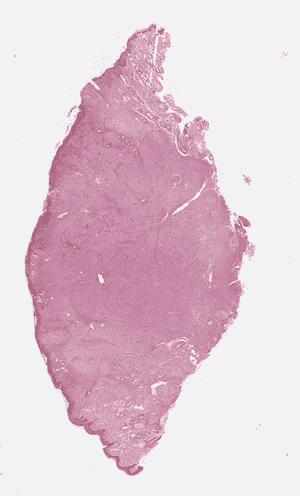
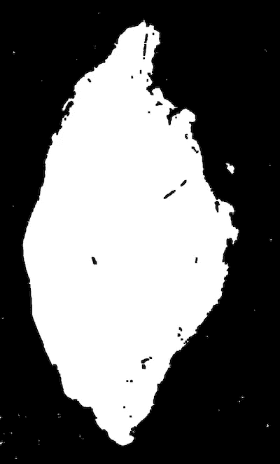
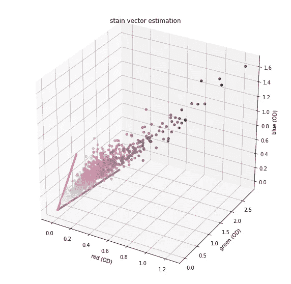

# 显微整片图像的应变估计

> 原文：<https://towardsdatascience.com/stain-estimation-on-microscopy-whole-slide-images-2b5a57062268?source=collection_archive---------54----------------------->

## [对整个载玻片图像进行显微图像处理](http://towardsdatascience.com/tagged/MicroscopyStainEstimation)

## 在千兆像素图像上获得稳定的污点估计。

这篇文章是系列文章的一部分。如果你不知道显微镜染色是什么，它的变化有多大以及为什么如此强烈，或者如何在小图像块上估计它，你可以在第一部分找到所有这些:[“显微镜染色变化以及如何估计它们”](https://medium.com/@marc.aubreville/microscopy-stain-variations-and-how-to-estimate-them-baca29f57ee9)。

这一次，我们想得到更多的实践机会，解决一个你在处理整片显微镜图像时可能会遇到的问题:那些图像真的很大。我的意思是，它们的宽度和高度可以轻松超过 100，000 像素。现在让我们考虑一个应用程序，其中我们希望一致地归一化完整的图像，例如作为基于深度学习的识别管道的预处理。

为此，对整个染色矩阵进行可靠的估计是非常有用的。然后，我们可以对每个图像块应用相同类型的颜色去卷积，并得到相同的结果。如果我们随后提取小块，这也真的很酷，因为这些有时不能满足有足够量的两种染料(在我们的例子中是苏木精和曙红)存在的前提条件，这导致了糟糕的统计特性。

我答应过你这次会更实际。所以我准备了一个完整的代码示例作为 Jupyter 笔记本，你可以在这里找到。现在我们一起过一遍。

该代码由四部分组成:

1.  下载整个幻灯片图像
2.  为有效区域寻找分段掩码以从中采样
3.  从这些区域随机采样图像碎片
4.  拼接图像块上的污点估计

例如，我从我们的公共肥大细胞肿瘤数据集[1]中挑选了一个完整的幻灯片图像，作为开放数据，很容易获得。可以使用 urllib 通过一个 HTTP get 下载它:

```
urllib.request.urlretrieve('[https://ndownloader.figshare.com/files/16261493?private_link=a82ddb634864c24f4aee'](https://ndownloader.figshare.com/files/16261493?private_link=a82ddb634864c24f4aee'), 
                               'f3741e764d39ccc4d114.svs')
```

现在让我们继续吧:

为了加载幻灯片，我们使用了 [openslide](https://openslide.org) 库。

```
slide = openslide.open_slide('f3741e764d39ccc4d114.svs')
overview = slide.read_region(location=[0,0], size=slide.level_dimensions[-1], level=3)
overview.show()
```



这是肿瘤切片图像的样子。图片来自[1]，CC-BY 4.0 许可证。

如你所见，图像显示的是中间的肿瘤横截面。它还包含许多几乎白色的背景，那里没有组织存在。“白色”颜色值在不同的载玻片扫描仪之间会有所不同，因此使用自适应阈值来生成组织存在的分割掩模是比较明智的。

为此，我们将使用 OpenCV，因为它方便地提供了我们需要的所有操作:

```
*# Convert to grayscale*
gray = cv2.cvtColor(np.array(overview)[:,:,0:3],cv2.COLOR_BGR2GRAY)

*# OTSU thresholding*
ret, thresh = cv2.threshold(gray,0,255,cv2.THRESH_BINARY_INV+cv2.THRESH_OTSU)

*# dilate*
dil = cv2.dilate(thresh, kernel = np.ones((7,7),np.uint8))

*# erode*
activeMap = cv2.erode(dil, kernel = np.ones((7,7),np.uint8))

*# and let's visualize it as well:*
**from** **PIL** **import** Image
Image.fromarray(activeMap)
```



上面的代码为肿瘤生成的分割遮罩。图片来自作者。

现在我们已经可以勾掉列表中的任务 1 和任务 2 了。现在是时候从至少 95%被组织覆盖的所有区域随机取样了。经验表明，30 幅图像会给我们一个很好的估计。

让我们简单地讨论一下使用非常大的补丁和使用大量补丁之间的权衡:如果我们过度使用，两者都会使评估过程变慢。然而，为了使我们的估计具有良好的统计稳定性，我们应该对相当多的图像进行采样。如果我们使用大的图像补片，我们将会失去一些我们想要达到的泛化能力——毕竟，统计应该覆盖整个图像。

```
k=0
patches = []
ds=32 *# downsample - we are using level 3 of the WSI which has a downsample of 32*
**while** (k<30):
    x_ds = np.random.randint(0, slide.level_dimensions[0][0]/ds)
    y_ds = np.random.randint(0, slide.level_dimensions[0][1]/ds)
    step_ds = int(1024/ds)

    canbeused = np.sum((activeMap[y_ds:y_ds+step_ds,x_ds:x_ds+step_ds])>1)>0.95*step_ds*step_ds
    **if** (canbeused):
        k=k+1
        x=int(x_ds*ds)
        y=int(y_ds*ds)
        img = slide.read_region(location=(x,y), size=(256,256), level=1)
        patch = np.uint8(np.array(img)[:,:,0:3])

        patches.append(patch[**None**,:,:,:])
```

你可以看到，在变量**中可以使用**我们计算了下采样图的每个随机选择的小块，如果它表示被组织覆盖至少 95%的图像区域。如果这是真的，我们从该区域采样图像块。

既然我们已经很好地选择了有代表性的小块，我们可以将它们全部堆叠起来，得到一大块图像像素，所有像素都代表了完整的整个载玻片图像的污点。

因此，我们现在可以将数据转换成光密度(OD)表示，并截掉所有非常亮的像素(OD 低于或等于 0.15):

```
**def** RGB2OD(image:np.ndarray) -> np.ndarray:
    mask = (image == 0)
    image[mask] = 1
    **return** np.maximum(-1 * np.log(image / 255), 1e-5)

OD = RGB2OD(np.stack(patches).reshape(-1,3))
OD = (OD[(OD > 0.15).any(axis=1), :])
```

接下来，我们计算矩阵的特征向量和值，并将 OD 像素值投影到前两个特征向量所跨越的平面上:

```
_, eigenVectors = np.linalg.eigh(np.cov(OD, rowvar=**False**))
eigenVectors = eigenVectors[:, [2, 1]] *# strip off residual stain component*

**if** eigenVectors[0, 0] < 0: eigenVectors[:, 0] *= -1
**if** eigenVectors[0, 1] < 0: eigenVectors[:, 1] *= -1T_hat = np.dot(OD, eigenVector)
```

我们无法知道向量的顺序，但我们可以假设它们需要为正，所以我们在相反的情况下乘以-1。

这两个应变向量由该点云的最大和最小角度表示。因此，我们计算角度，然后使用百分位数进行稳健估计:

```
phi = np.arctan2(T_hat[:, 1], T_hat[:, 0])
min_Phi = np.percentile(phi, 1)
max_Phi = np.percentile(phi, 99)
```

最后，我们必须将角度转换回 OD 空间中的 3D 坐标。为了获得更可预测的结果，我们希望在载体中首先有较大的成分(即苏木精染色)。

```
v1 = np.dot(eigenVector, np.array([np.cos(min_Phi), np.sin(min_Phi)]))
v2 = np.dot(eigenVector, np.array([np.cos(max_Phi), np.sin(max_Phi)]))
**if** v1[0] > v2[0]:
    stainVectors = np.array([v1, v2])
**else**:
    stainVectors = np.array([v2, v1])
```

瞧吧。这就是我们对污点的可靠估计。让我们最后想象一下:

```
**import** **random**
*# take random sample for plotting*
randsamp = np.array(random.sample(OD.tolist(),1000))

*# plot points*
**import** **matplotlib.pyplot** **as** **plt**
**from** **mpl_toolkits.mplot3d** **import** Axes3D  *# noqa: F401 unused import*
fig = plt.figure(figsize=(10,10))
ax = fig.gca(projection='3d')

*# color needs to be given as RGBA values in range 0..1 for matplotlib*
color=np.ones((1000,4),np.float32)
color[:,0:3] = OD2RGB(randsamp)/255.

ax.scatter(randsamp[:,0],randsamp[:,1],randsamp[:,2], c=color)

*# and plot stain vectors (with correct color)*
ax.plot([0, stainVectors[0,0]],[0, stainVectors[0,1]],[0, stainVectors[0,2]], linewidth=4, color=(OD2RGB(stainVectors[0,:])/255.).tolist()+[1.])
ax.plot([0, stainVectors[1,0]],[0, stainVectors[1,1]],[0, stainVectors[1,2]], linewidth=4, color=(OD2RGB(stainVectors[1,:])/255.).tolist()+[1.])

ax.set_xlabel('red (OD)')
ax.set_ylabel('green (OD)')
ax.set_zlabel('blue (OD)')
plt.title('stain vector estimation')
```



显微镜整体载玻片图像的染色评估结果。你可以清楚地看到原始图像中苏木精(粉色)和曙红(紫色)的染色矢量。图片来自作者。

就是这样。这只是我们在上一篇文章中讨论的 Macenko 等人[2]的算法的直接扩展，以适应大尺寸的图像。

既然我们知道了如何估计整个幻灯片图像上的污点，我们可以分析公共数据集中有多少变化。但那是下一篇文章的一部分，所以请继续关注。

[1] Bertram，C. A .等人(2019)。[犬皮肤肥大细胞肿瘤整片切片图像有丝分裂像评估的大规模数据集。](https://www.nature.com/articles/s41597-019-0290-4)科学数据，6 (274)，1–9。

[2]: Macenko，Marc 等[一种用于定量分析的组织学切片归一化方法](https://ieeexplore.ieee.org/document/5193250)(2009)*IEEE 生物医学成像国际研讨会:从纳米到宏观。*