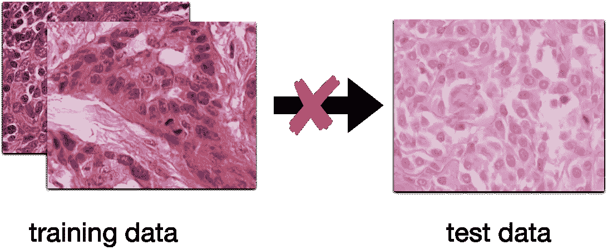
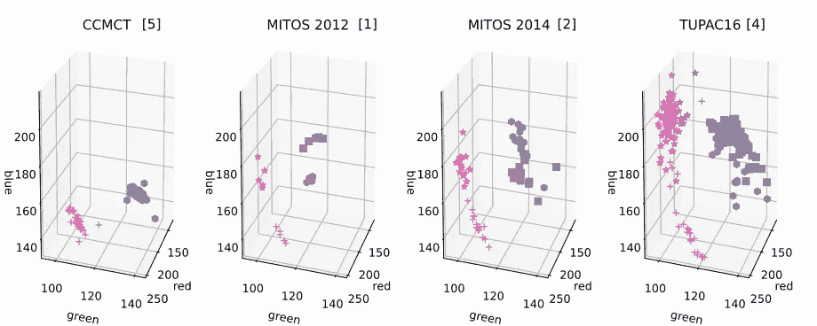

# 公共有丝分裂图组织病理学数据集中的染色差异

> 原文：<https://towardsdatascience.com/stain-variations-in-public-mitotic-figure-histopathology-data-sets-bf07a4ea35fc?source=collection_archive---------56----------------------->

## [对整个载玻片图像进行显微图像处理](http://towardsdatascience.com/tagged/MicroscopyStainEstimation)

## 数据的变化越少真的越好吗？

这篇文章是系列文章的第三部分。如果你不知道什么是显微镜染色，或者它们如何影响计算机化检测中图像的使用，你可以在[第一部分](/microscopy-stain-variations-and-how-to-estimate-them-baca29f57ee9)中找到。在那里，我们还讨论了一种流行的方法，如何估计显微镜图像的污点。如果你想获得一些如何使用 python 评估这些污点的实践经验，你可以在[的第二篇文章](/stain-estimation-on-microscopy-whole-slide-images-2b5a57062268)中找到所有相关内容。

既然我们现在知道了如何估计显微镜载玻片的染色，我们就有了完整的工具集来了解组织学数据集中染色的变化。

这有什么关系？在模式识别中，当我们想要训练一个系统来识别图像中的某些对象，或者估计它的某些属性时，数据代表我们的实际用例是非常重要的。换句话说:如果现实世界不是所有完全相同属性的图像，我们用于训练的数据也不应该是。

如果训练数据不代表测试数据，则纯数据驱动的方法(如深度网络)通常不能很好地概括。图片来自作者。

如果数据真的代表真实数据，它将解释完整的差异——我们可以继续训练一个健壮的系统。

因此，当决定用一个数据集来训练和评估我们刚刚发明的新的、非常有趣的算法时，我们应该考虑到，当数据集显示真实世界的真实画面时，我们的结果将更好地转化为真实世界。

组织病理学中一个非常具有挑战性的课题是自动或计算机辅助肿瘤分级。为此，一个非常相关的任务是检测经历细胞分裂的细胞(所谓的*有丝分裂图*，因为这些指示肿瘤的生长。你猜对了，生长更快的肿瘤通常不利于患者的预后。

在这个领域，我们已经看到了许多挑战和其他公开可用的数据集，研究人员现在都可以使用它们来比较他们的结果。虽然这确实有助于区分真正的地面制动新改进和那些只有小效果的改进，但我们无法区分针对数据(而不是问题)定制的解决方案和其他在整体任务中做得更好的解决方案。

所以，在这里，再一次，这一切都归结为一个问题:数据的代表性如何？数据集中真的有足够的多样性来解释你在现实中能找到的多样性吗？

在之前的文章中，我们已经讨论过染色的变化实际上是显微镜载玻片多样性的一大来源。抛开其他来源，如组织类型或物种，对于我们手边的数据集来说，评估这些是值得的。

对于人类乳腺癌，有几个值得注意的数据集:MITOS [2012](http://ludo17.free.fr/mitos_2012/index.html) [1]和 [2014](https://mitos-atypia-14.grand-challenge.org/) [2] ICPR 竞赛数据集来自法国和美国的一个团队，以及 AMIDA-13 [3]和 [TUPAC16](http://tupac.tue-image.nl/) [4]数据集，都来自荷兰。它们在许多因素上有很大不同，最显著的是肿瘤病例(即患者)的数量。现在让我们相互比较一下，并比较一下我们之前用于玩具示例的整个幻灯片图像(WSI)数据集[5]。

为此，我使用了与上一篇文章相同的方法，但是当然，我们有更多的案例要展示。为了使图不太拥挤，我用一个标记可视化了苏木精和伊红染色向量。这是我的发现:

所有数据集的曙红(+和 **⋆** )和苏木精(⬢和■)染色向量。用 Aperio 扫描仪扫描的载玻片的染色向量用+和■表示，而用其他扫描仪扫描的载玻片的染色向量用 **⋆和** ⬢标记表示。图片来自作者。

好吧，我同意上面这个情节信息量很大。让我来引导你:在左边，我们看到我们以前使用的 WSI 数据集的染色向量[5]。很明显，所有的污渍都很相似。这表明载玻片制备的工作流程是高度标准化的，这也是由仅使用一台扫描仪造成的。对于接下来两列中的 MITOS 2012 和 MITOS 2014 数据集，您可以看到扫描仪颜色校准的强烈影响，导致两组非常不同的染色向量。曙红的颜色似乎受此影响最大。

TUPAC16 数据集也是如此。在这里，我们另外有一个由大量病例引起的更广泛的污点传播。

下面是我的总结:在多样性方面，我们在 TUPAC16 数据集中有一个明显的赢家。虽然在这个数据集上工作很有挑战性，但在这个数据集上创建的结果可能会更好地反映现实情况。而这只是有丝分裂数字的辅助数据集。完整的数据集由 500 幅完整的幻灯片图像组成——在管道中使用如此大量的数据本身就是一个挑战。

我的感觉是，尽管 MITOS 2012 数据集提供了细分信息，但现在应该被认为是过时的。不仅污点的多样性很低，而且训练集和测试集也来自同一个 which 这使得数据集没有资格评估鲁棒性(正如 G. Litjens [在此](https://research.adfoucart.be/mitos12-learning-bad-challenge-design)正确指出的)。

[1]鲁等人(2014 年)。美图&非典型性。图像普及访问实验室(IPAL)，Sci 机构。，Technol。&资源研究所。新加坡科技资讯公司。代表，1，1–8。
[2]鲁等人(2013)。乳腺癌组织学图像中的有丝分裂检测:2012 年 ICPR 竞赛。病理学信息学杂志，第 4 期。
[3] Veta，m .等人(2015)。乳腺癌组织病理学图像中有丝分裂检测算法的评估。*医学图像分析*， *20* (1)，237–248。
[4] Veta，m .等人(2019)。从全切片图像预测乳腺肿瘤增殖:TUPAC16 挑战。医学图像分析，54，111–121。
[5] Bertram，C. A .等人(2019)。[用于在犬皮肤肥大细胞肿瘤的整个载玻片图像上进行有丝分裂图形评估的大规模数据集。](https://www.nature.com/articles/s41597-019-0290-4)科学数据，6 (274)，1–9。