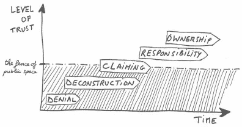

# 脱颖而出！分析师、数据科学家和其他所有人的领导力和沟通技巧

> 原文：<https://towardsdatascience.com/stand-out-leadership-and-communication-skills-for-analysts-data-scientists-and-everyone-else-960c13f3738d?source=collection_archive---------41----------------------->

## 被视为领导者的技巧和诀窍

由 [You X Ventures](https://unsplash.com/@youxventures?utm_source=medium&utm_medium=referral) 在 [Unsplash](https://unsplash.com?utm_source=medium&utm_medium=referral) 上拍摄的照片

# 这一切是怎么发生的？

当我反思过去几年的生活时，尽管我非常努力地进入数据科学领域，成为一名产品分析师，但有时我仍然会问自己这样一个问题，“*这一切是怎么发生的？* " [我不是数字奇才](/how-a-degree-in-writing-helped-me-get-a-job-in-data-science-801faef03b0c)，我也不是天才程序员，我也不是重新想象尖端的深度学习架构……帮助我在我做过的每份工作中取得成功的不是原始的技术能力，而是我的沟通和领导能力，我学习新事物的渴望，以及我不断进取和*完成工作的道德规范*。

如果你想快速赢得同事和老板的信任和尊重，磨练这些领导力和沟通技巧，用软技能平衡你的技术能力！**每一点都是我实现它的技巧和诀窍**。

> 了解领导
> 了解你的听众
> 拥有极端所有权
> 首先批评自己
> 建立关系

# 理解领导力

你不需要在管理岗位上才能成为领导者！领导力有点难以定义，但对我来说，领导力是一种方法，通过这种方法，灵感转化为追求共同目标的行动。[根据定义，它只是领导一个人、团体或组织的行为](https://www.google.com/search?q=Leadership)。回顾文献，共同的主题似乎是什么构成了一个好的领导者。经常被引用的特征有诚实、魅力、远见、同情心和果断。从历史上看，*优秀/强势*的领导者将人们团结在一起，倡导创新，并以社区利益为重而非个人利益。

[https://www.flickr.com/photos/53801255@N07/8737945758](https://www.flickr.com/photos/53801255@N07/8737945758)

变革型领导是人们所追求的一种有效的领导战略。领导力专家 Ronald E Riggio 博士就构成变革型领导者的四种不同特质撰写了大量文章。他说，最好的领导者是一个理想的榜样，激励追随者，对他人表现出真诚的关心，并激发创新和创造力。

## 遵循以下建议有助于理解领导力:

**关注大局** 如果你过于专注于一件事，就很容易忽视周围正在发生的事情。

参与进来向人们展示你是一名团队成员。参加团队建设活动，了解业务及其竞争。

要有战略眼光永远要寻找新的、高效的做事方法。

# 永远了解你的观众

*了解你的受众*是沟通 101。如果你想让你的交流更有说服力，你必须了解你的受众，这样你才能传递他们关心的信息！当我向培训师展示我们的新工具或功能时，我会详细介绍这些功能的工作原理。当我向利益相关者和首席执行官解释我们的项目进展时，我没有包括所有的实质性技术细节。如果我这么做了，他们的眼睛很可能会变得呆滞，他们会变得不感兴趣！用不同的细节层次接近不同的受众。

[https://www.flickr.com/photos/batmoo/3734837951](https://www.flickr.com/photos/batmoo/3734837951)

与管理层沟通，我有责任让他们对我的团队正在完成的工作保持兴奋，这样他们就会继续给我们提供资源，并相信我们正在推动业务向前发展。我知道他们想听大局更新，而不是细节。他们想要高层次的概述和关于我们是否完成工作的信息。

## **遵循这些建议来帮助你了解你的受众:**

**研究你的利益相关者/受众** 如果你是这个组织或团队的新成员，不要害怕做一些研究！如果可能的话，浏览一下员工名录，把你项目中所有利益相关者的名字写出来。在 LinkedIn 上查找或者找个方法闲聊(远程工作时闲聊可能更困难)。

观看会议记录
如果你的公司有会议记录，那就看看过去的股东会议，看看你的同事们表现如何。注意他们提供的详细程度和演示的整体基调。严重吗？是不是很轻松？

**寻求反馈** 听取批评可能会很艰难，但却大有裨益！与你的老板和同事谈论你的表现，并获得你需要的反馈来提高你的表达技巧。

# 拥有极大的自主权

不要抱怨任何事情，除非你脑子里已经有了解决方案。“极端所有权”的想法是由乔科·威林克推广开来的，他是一名退役的海豹突击队海军军官。他写了几本关于领导力和极端所有权的书，还运营着自己的播客。总结他的观点，好的领导，好的团队，在出现问题的时候，不会找借口，也不会责怪外界因素。他们负责解决问题，寻找解决方案，并实施能完成工作的方案。

[https://www.flickr.com/photos/lucgaloppin/5607950722/](https://www.flickr.com/photos/lucgaloppin/5607950722/)

当你开始对事情拥有极大的自主权时，你会意识到与你的团队进行“艰难的对话”会容易得多，因为你开始为自己的工作感到自豪。我的团队帮助开发了一个数据分析工具，供我们的客户在我们的软件平台上使用。尽管我在这个职位上是个新手，并在项目的最后阶段加入了项目，但在我的角色允许的情况下，我尽可能地拥有了所有权。通过尽可能多地拥有所有权，并与团队紧密合作，当我在测试中发现错误时，问题很容易向开发人员提出。我对批评感到不那么焦虑，因为我把确保我们的客户将得到一个有用的工具作为我的责任。

最后，承担所有权和责任可以在你的经理和队友之间建立信任，这让你看起来可靠。当我回想以前的工作时，那些从未获得成功的人总是那些为自己表现不佳找借口的人，而不是为自己的不足承担责任并努力改进的人。

## 遵循以下建议，获得终极所有权:

**拥抱项目/使命** 通过讨论和理解项目的目的和理想结果，激发团队的热情。

总是问“我还能做些什么？”
尽管过多承诺和不足兑现从来都不是好事，但你应该经常问自己和你的团队，“我还能做些什么？”

**保持积极** 事情总会上来的。硬件出现故障，人们生病，事情超出预算。每当一个障碍出现时，保持积极的态度，试着跳过它，而不是用它作为停止尝试的借口。

# 先批评你自己

任何和我一起工作过的人都知道我不害怕批评。我尽我所能接受它。在你职业生涯的某个时刻，无论你是否是一名领导者，你都可能会卷入一场“艰难的对话”，在这场对话中，你需要对队友或经理提出批评。当这些情况出现时，谦卑地站出来是很重要的。记住， *pobody 是不完整的*。

[https://pix abay . com/插图/批评-写-评-评-3083101/](https://pixabay.com/illustrations/criticism-write-a-review-review-3083101/)

根据自助经典， [*如何赢得朋友&影响人*](https://en.wikipedia.org/wiki/How_to_Win_Friends_and_Influence_People) ，如果你想让人们乐于接受你的批评，先说说你自己的错误吧！例如，我曾与一位高管会面，他让我用 1-5 的标准给我与直接上司每周 1:1 的会面打分，1 代表*没有价值*，5 代表*非常有价值*。在我说任何批评性的话之前，我以一个关于我是一个“严格的评分者”的轶事开始了谈话，并告诉他我对“特殊价值”的定义。我解释了每周达到这个定义对任何人来说都是一个真正的挑战，所以我只能给出 4/5！在这一切之后，当我确实改变了谈话的语气，变得更加挑剔时，这位高管理解了我的心情。他知道我的批评来自于在公司内成长和让事情变得更好的愿望，而不是抱怨我的团队。最终，我认为这让他更容易接受我要说的话。

## 遵循以下建议，从关键对话中获得最大收益:

**阐明意图** 确保参与者理解关键对话背后的意图。

批评之前先表扬如果你必须批评，从告诉这个人/团队他们做对了什么开始。

问问你自己你会得到什么不要为了你的自我而开始争论。你是对的没有完成任务重要。如果你从批判性对话中获益甚少或一无所获，考虑避免或推迟它，直到你的目标明确。

# 建立关系

建立关系对我来说从来都不容易，因为我总是很害羞。虽然这需要精神和情感上的努力，但我会尽最大努力与我的团队和经理建立关系。优秀的领导者和沟通者注重建立关系以建立信任。当然，个人凭自己的能力可以完成很多事情，但是大多数人都同意和一个好的团队一起工作会让你走得更远更快。

[https://www.flickr.com/photos/wickenden/3259826856](https://www.flickr.com/photos/wickenden/3259826856)

通过建立关系和敞开心扉，你让你的队友和老板更容易信任你。例如，当我在一家电子产品零售商工作时，工作的一部分是向那些想购买我们电脑和电视等昂贵设备的顾客推销保护计划。一天，我带着推销计划的新技巧去找我的老板。因为我和老板关系很好，所以他让我试一试。他非常了解我，相信我会做正确的事情。他相信，如果我的新计划失败了，我会回到原来的计划，而不是让我的自我占据主导地位。因为我们的关系，我得到了队友没有的机会，这让我更快地爬上了梯子。

## 遵循以下建议，快速建立关系:

**经常给予赞美** 我经常感谢我的队友，告诉他们他们做得很好。

**尊重别人的意见** 除非会影响项目或任务的结果，否则最好避免与人争论他们的意见。

**迅速道歉** 当你错了或出格了，要迅速自我纠正并道歉。

# 最后的想法

作为一名领导者，头衔中不仅仅只有“经理”这几个字。就像你可能在你的技术技能上下功夫一样，如果你想更容易地获得成功或在公司的阶梯上攀升，在领导力和沟通技能上下功夫是很重要的。专注于掌握这些技巧，你将在领导和沟通方面表现出色:

> 了解领导
> 了解你的听众
> 拥有极大的自主权
> 首先批评自己
> 建立关系

如果你有兴趣学习更多关于商业和数据科学的知识，也可以看看我的其他文章！

 [## 数据科学的商业方面:向利益相关者展示的 5 个技巧

### 数据科学不仅仅是算法和建模

towardsdatascience.com](/the-business-side-of-data-science-5-tips-for-presenting-to-stakeholders-fb624a9a6e54) 

# 谢谢大家！

*   *如果你喜欢这个，* [*跟我上媒*](https://medium.com/@erickleppen) *了解更多*
*   [*通过订阅*](https://erickleppen.medium.com/membership) 获得完全访问权限并帮助支持我的内容
*   *我们连线上*[*LinkedIn*](https://www.linkedin.com/in/erickleppen01/)
*   *使用 Python 分析数据？查看我的* [*网站*](https://pythondashboards.com/)

[t1—埃里克阀 T3](http://pythondashboards.com/)