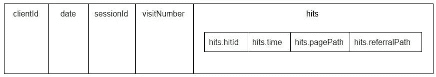

# Google BigQuery 中的标准 SQL

> 原文：<https://towardsdatascience.com/standard-sql-in-google-bigquery-c2636ae4b7c8?source=collection_archive---------8----------------------->


来源:[沉积照片](https://ru.depositphotos.com/174010544/stock-photo-web-developer-php-code-close.html)

## 在市场营销中使用的优势和示例

2016 年，Google BigQuery 引入了一种新的与表交流的方式:标准 SQL。在那之前，BigQuery 有自己的结构化查询语言，称为 BigQuery SQL(现在称为 Legacy SQL)。

乍一看，传统 SQL 和标准 SQL 没有太大的区别:表名的写法略有不同；标准有稍微严格的语法要求(例如，不能在 FROM 前加逗号)和更多的数据类型。但如果你仔细观察，会发现一些微小的语法变化给营销人员带来了许多优势。

在 OWOX 上，我们决定澄清以下问题的答案:

*   标准 SQL 相对于传统 SQL 的优势是什么？
*   标准 SQL 有哪些功能，如何使用？
*   如何从传统 SQL 迁移到标准 SQL？
*   标准 SQL 还兼容哪些服务、语法特性、操作符和函数？
*   如何对营销报告使用 SQL 查询？

# 标准 SQL 相对于传统 SQL 的优势是什么？

## 新数据类型:数组和嵌套字段

标准 SQL 支持新的数据类型:数组和结构(数组和嵌套字段)。这意味着在 BigQuery 中，使用从 JSON/Avro 文件加载的表变得更加容易，这些表通常包含多级附件。

嵌套字段是较大表格中的小型表格:


在上图中，蓝色和黄色条是嵌入迷你表格的线条。每行是一个会话。会话有共同的参数:日期、ID 号、用户设备类别、浏览器、操作系统等。除了每个会话的常规参数之外，还将命中数表附加到该行。



点击数表包含用户在网站上的操作信息。例如，如果用户单击横幅、翻阅目录、打开产品页面、将产品放入购物篮或下订单，这些操作将被记录在 hits 表中。

如果用户在网站上下订单，关于订单的信息也将输入到 hits 表中:

*   transactionId(标识交易的编号)
*   transactionRevenue(订单总值)
*   交易装运(运输成本)

使用 OWOX BI 收集的会话数据表具有类似的结构。

假设您想知道过去一个月来自纽约市用户的订单数量。要找出答案，您需要参考 hits 表并计算唯一事务 id 的数量。为了从这样的表中提取数据，标准 SQL 有一个 UNNEST 函数:

```
#standardSQL 
**SELECT** 
**COUNT** (**DISTINCT** hits.transaction.transactionId) -- count the number of unique order numbers; DISTINCT helps to avoid duplication
**FROM** `project_name.dataset_name.owoxbi_sessions_*` -- refer to the table group (wildcard tables)
**WHERE** 
  (
  _TABLE_SUFFIX **BETWEEN** FORMAT_DATE('%Y%m%d',**DATE_SUB**(**CURRENT_DATE**(),   INTERVAL 1 **MONTHS**)) -- if we don’t know which dates we need, it’s better to use the function FORMAT_DATE INTERVAL 
  **AND**
  FORMAT_DATE('%Y%m%d',**DATE_SUB**(**CURRENT_DATE**(), INTERVAL 1 **DAY**)) 
  ) 
**AND** geoNetwork.city = ‘**New** York’ -- choose orders made in New York City
```

如果订单信息记录在单独的表中，而不是在嵌套表中，则必须使用 JOIN 将包含订单信息的表和包含会话数据的表组合起来，以便找出订单是在哪个会话中生成的。

## 更多子查询选项

如果需要从多级嵌套字段中提取数据，可以使用 SELECT 和 WHERE 添加子查询。例如，在 OWOX BI 会话流表中，另一个子表 product 被写入 hits 子表。product 子表收集通过增强的电子商务数组传输的产品数据。如果网站上建立了增强型电子商务，并且用户已经查看了产品页面，则该产品的特征将被记录在产品子表中。

为了获得这些产品特征，在主查询中需要一个子查询。对于每个产品特性，在括号中会创建一个单独的选择子查询:

```
**SELECT** 
  column_name1, -- list the other columns you want to receive
  column_name2,
  (**SELECT** productBrand **FROM** UNNEST(hits.product)) **AS**    hits_product_productBrand,
  (**SELECT** productRevenue **FROM** UNNEST(hits.product)) **AS** hits_product_productRevenue, -- list product features
  (**SELECT** localProductRevenue **FROM** UNNEST(hits.product)) **AS** hits_product_localProductRevenue,
  (**SELECT** productPrice **FROM** UNNEST(hits.product)) **AS** hits_product_productPrice,
**FROM** `project_name.dataset_name.owoxbi_sessions_YYYYMMDD`
```

由于标准 SQL 的功能，构建查询逻辑和编写代码变得更加容易。相比之下，在遗留 SQL 中，您需要编写这种类型的阶梯:

```
**SELECT** 
  column_name1,
  column_name2, 
  column_name3 
**FROM** (
  **SELECT** table_name.some_column **AS** column1…
  **FROM** table_name
)
```

## 对外部来源的请求

使用标准 SQL，您可以直接从 Google Bigtable、Google Cloud Storage、Google Drive 和 Google Sheets 访问 BigQuery 表。
也就是说，不用将整个表加载到 BigQuery 中，只需一次查询就可以删除数据，选择需要的参数，上传到云存储。

## 更多用户功能(UDF)

如果你需要使用一个没有记录的公式，用户定义函数(UDF)会帮助你。在我们的实践中，这种情况很少发生，因为标准的 SQL 文档几乎涵盖了数字分析的所有任务。

在标准 SQL 中，用户自定义函数可以用 SQL 或 JavaScript 编写；传统 SQL 只支持 JavaScript。这些函数的参数是列，它们取的值是操作列的结果。在标准 SQL 中，函数可以在与查询相同的窗口中编写。

## 更多连接条件

在传统 SQL 中，连接条件可以基于等式或列名。除了这些选项之外，标准 SQL 方言还支持通过不等式和任意表达式进行连接。

例如，为了识别不公平的 CPA 伙伴，我们可以选择在交易的 60 秒内源被替换的会话。要在标准 SQL 中做到这一点，我们可以在连接条件中添加一个不等式:

```
#standardSQL
**SELECT** *
**FROM** 
  (
  **SELECT**
  traff.clientId **AS** clientId,
  traff.page_path **AS** pagePath,
  traff.traffic_source **AS** startSource,
  traff.traffic_medium **AS** startMedium,
  traff.time **AS** startTime,
  aff.evAction **AS** evAction,
  aff.evSource **AS** finishSource,
  aff.evMedium **AS** finishMedium,
  aff.evCampaign **AS** finishCampaign,
  aff.time **AS** finishTime,
  aff.isTransaction **AS** isTransaction,
  aff.pagePath **AS** **link**,
  traff.time-aff.time **AS** diff
  **FROM**
    (
    **SELECT** 
    fullVisitorID **AS** clientId,
    h.page.pagePath **AS** page_path,
    trafficSource.source **AS** traffic_source,
    trafficSource.medium **AS** traffic_medium,
    trafficSource.campaign **AS** traffic_campaign,
    date,
    SAFE_CAST(visitStartTime+h.time/1000 **AS** INT64) **AS** **time**
      **FROM** `demoproject.google_analytics_sample.ga_sessions_20190301`,
      UNNEST (hits) **AS** h
      **WHERE** trafficSource.medium != 'cpa'
      ) **AS** traff
**JOIN** (
  **SELECT** 
  total.date date,
  total.time **time**,
  total.clientId **AS** clientId,
  total.eventAction **AS** evAction,
  total.source **AS** evSource,
  total.medium **AS** evMedium,
  total.campaign **AS** evCampaign,
  tr.eventAction **AS** isTransaction,
  total.page_path **AS** pagePath
  **FROM** 
  (
  **SELECT** 
  fullVisitorID **AS** clientId,
  h.page.pagePath **AS** page_path,
  h.eventInfo.eventAction **AS** eventAction, 
  trafficSource.source **AS** **source**,
  trafficSource.medium **AS** **medium**,
  trafficSource.campaign **AS** campaign,
  date,
  SAFE_CAST(visitStartTime+h.time/1000 **AS** INT64) **AS** **time**
  **FROM** `demoproject.google_analytics_sample.ga_sessions_20190301`,
  UNNEST(hits) **AS** h
    **WHERE**
    trafficSource.medium ='cpa'
    ) **AS** total
**LEFT** **JOIN** 
  (
  **SELECT**
  fullVisitorID **AS** clientId,
  date,
  h.eventInfo.eventAction **AS** eventAction,
  h.page.pagePath pagePath,
  SAFE_CAST(visitStartTime+h.time/1000 **AS** INT64) **AS** **time**
  **FROM** `demoproject.google_analytics_sample.ga_sessions_20190301`,
  UNNEST(hits) **AS** h
  **WHERE** h.eventInfo.eventAction = 'typ_page'
  **AND** h.type = 'EVENT'
  **GROUP** **BY** 1, 2, 3, 4, 5
  ) **AS** tr
**ON** total.clientId=tr.clientId
**AND** total.date=tr.date
**AND** tr.time>total.time -- JOIN tables by inequality. Pass the additional WHERE clause that was needed in Legacy SQL
**WHERE** tr.eventAction = 'typ_page'
  ) **AS** aff
**ON** traff.clientId = aff.clientId
)
**WHERE** diff> -60
**AND** diff<0
  **GROUP** **BY** 1, 2, 3, 4, 5, 6, 7, 8, 9, 10, 11, 12, 13
  **ORDER** **BY** clientId, finishTime
```

标准 SQL 在连接方面的唯一限制是，它不允许使用 WHERE column IN (SELECT …)形式的子查询进行半连接:

```
#legacySQL
**SELECT**
  mother_age,
  **COUNT**(mother_age) total
**FROM**
  [bigquery-**public**-**data**:samples.natality]
**WHERE** -- such a construction cannot be used in Standard SQL
  state **IN** (**SELECT**
              state
            **FROM**
              (**SELECT**
                 state,
                 **COUNT**(state) total
               **FROM**
                 [bigquery-**public**-**data**:samples.natality]
               **GROUP** **BY**
                 state
               **ORDER** **BY**
                 total **DESC**
               **LIMIT** 10))
  **AND** mother_age > 50
**GROUP** **BY**
  mother_age
**ORDER** **BY**
  mother_age **DESC**
```

## 出错的可能性更小

如果条件不正确，传统 SQL 中的某些函数会返回 NULL。例如，如果您的计算中出现了被零除的情况，查询将被执行，空条目将出现在表的结果行中。这可能会掩盖查询或数据中的问题。

标准 SQL 的逻辑更简单。如果条件或输入数据不正确，查询将生成错误，例如被零除，因此您可以快速更正查询。以下检查嵌入在标准 SQL 中:

*   +、-、×、总和、AVG、标准偏差的有效值
*   被零除

## 请求运行更快

由于对传入数据进行了初步过滤，用标准 SQL 编写的连接查询比用传统 SQL 编写的连接查询要快。首先，查询选择符合连接条件的行，然后处理它们。未来，Google BigQuery 将致力于提高标准 SQL 的查询速度和性能。

## 表格可以编辑:插入和删除行，更新

数据操作语言(DML)函数在标准 SQL 中可用。这意味着您可以通过编写查询的同一个窗口来更新表以及在表中添加或删除行。例如，使用 DML，您可以将两个表中的数据合并成一个表:

```
#standardSQL
**MERGE** dataset.Inventory **AS** T
**USING** dataset.NewArrivals **AS** S
**ON** T.ProductID = S.ProductID
**WHEN** **MATCHED** **THEN**
  **UPDATE** **SET** quantity = T.quantity + S.quantity
**WHEN** **NOT** **MATCHED** **THEN**
  **INSERT** (ProductID, quantity) **VALUES** (ProductID, quantity)
```

## 代码更容易阅读和编辑

使用标准 SQL，复杂的查询不仅可以用 SELECT 启动，还可以用 With 启动，从而使代码更易于阅读、注释和理解。这也意味着更容易防止自己的错误和纠正别人的错误。

```
#standardSQL
WITH total_1 AS ( -- the first subquery in which the intermediate indicator will be calculated
    **SELECT**
        **id**,
        metric1,
       **SUM**(metric2) **AS** total_sum1
    **FROM** `project_name.dataset_name.owoxbi_sessions_YYYYMMDD`
    **GROUP** **BY**
        **id**, metric
),
total_2 **AS** ( -- the second subquery
    **SELECT**
        **id**,
        metric1,
        **SUM**(metric2) **AS** total_sum2
    **FROM** `project_name.dataset_name.owoxbi_sessions_YYYYMMDD`
           **GROUP** **BY**
        **id**, metric1
),
total_3 **AS** ( -- the third subquery
    **SELECT**
        **id**,
        metric,
       **SUM**(metric2) **AS** total_sum3
       **FROM** `project_name.dataset_name.owoxbi_sessions_YYYYMMDD`
    **GROUP** **BY**
        **id**, metric
)
**SELECT** *,
**ROUND**(100*( total_2.total_sum2 - total_3.total_sum3) / total_3.total_sum3, 3) **AS** **difference** -- get the difference index: subtract the value of the second subquery from the value of the third; divide by the value of the third 
**FROM** total_1
**ORDER**  **BY** 1, 2
```

如果有分几个阶段完成的计算，使用 with 运算符会很方便。首先，您可以在子查询中收集中间指标，然后进行最终计算。

谷歌云平台(GCP)包括 BigQuery，是一个处理大数据的全周期平台，从组织数据仓库或数据云到运行科学实验以及预测和说明性分析。随着标准 SQL 的引入，BigQuery 正在扩大其受众。对于营销分析师、产品分析师、数据科学家和其他专家团队来说，与 GCP 合作正变得越来越有趣。

# 标准 SQL 的功能和用例示例

在 OWOX BI，我们经常使用使用标准的 Google Analytics 360 export to Google big query 或 OWOX BI 管道编译的表。在下面的例子中，我们将研究针对这些数据的 SQL 查询的细节。

## 1.选择时间间隔的数据

在 Google BigQuery 中，您站点的用户行为数据存储在通配符表中(带星号的表)；每天形成一个单独的表。这些表的名称相同:只是后缀不同。后缀是 YYYYMMDD 格式的日期。例如，表 owoxbi_sessions_20190301 包含 2019 年 3 月 1 日的会话数据。

我们可以在一个请求中直接引用一组这样的表，以便获得数据，例如，从 2019 年 2 月 1 日到 2 月 28 日。为此，我们需要在 FROM 中用*替换 YYYYMMDD，在 WHERE 中，我们需要为时间间隔的开始和结束指定表后缀:

```
#standardSQL
**SELECT** sessionId, 
**FROM** `project_name.dataset_name.owoxbi_sessions_*`
**WHERE** _TABLE_SUFFIX **BETWEEN** �' AND �'
```

我们并不总是知道收集数据的具体日期。例如，每周我们可能需要分析过去三个月的数据。为此，我们可以使用 FORMAT_DATE 函数:

```
#standardSQL
**SELECT**
 <enumerate **field** **names**>
**FROM** `project_name.dataset_name.owoxbi_sessions_*`
**WHERE** 
_TABLE_SUFFIX **BETWEEN** FORMAT_DATE('%Y%m%d',**DATE_SUB**(**CURRENT_DATE**(), INTERVAL 3 **MONTHS**))
**AND**
FORMAT_DATE('%Y%m%d',**DATE_SUB**(**CURRENT_DATE**(), INTERVAL 1 **DAY**))
```

在 BETWEEN 之后，我们记录第一个表的后缀。短语 CURRENT_DATE()，INTERVAL 3 MONTHS 表示从当前日期开始选择最近 3 个月的数据。第二个表后缀在和之后格式化。需要将间隔的结束标记为昨天:CURRENT_DATE()，间隔 1 天。

## 2.检索用户参数和指标

Google Analytics 导出表中的用户参数和指标被写入嵌套的 hits 表以及 customDimensions 和 customMetrics 子表。所有定制维度都记录在两列中:一列是站点上收集的参数数量，另一列是它们的值。下面是一次点击传输的所有参数的样子:


为了将它们解包并在单独的列中写入必要的参数，我们使用以下 SQL 查询:

```
-- Custom Dimensions (in the line below index - the number of the user variable, which is set in the Google Analytics interface; dimension1 is the name of the custom parameter, which you can change as you like. For each subsequent parameter, you need to write the same line: (**SELECT** **MAX**(**IF**(**index**=1, **value**, NULL)) **FROM** UNNEST(hits.customDimensions)) **AS** dimension1, 
-- Custom Metrics: the index below is the number of the user metric specified in the Google Analytics interface; metric1 is the name of the metric, which you can change as you like. For each of the following metrics, you need to write the same line:  (**SELECT** **MAX**(**IF**(**index**=1, **value**, NULL)) **FROM** UNNEST(hits.customMetrics)) **AS** metric1
```

请求看起来是这样的:

```
#standardSQL
**SELECT** <**column** name1>,
<column_name2>, -- list column names
(**SELECT** **MAX**(**IF**(**index**=1, **value**, NULL)) **FROM** UNNEST(hits.customDimensions)) **AS** page_type,
(**SELECT** **MAX**(**IF**(**index**=2, **value**, NULL)) **FROM** UNNEST(hits.customDimensions)) **AS** visitor_type, -- produce the necessary custom dimensions
(**SELECT** **MAX**(**IF**(**index**=1, **value**, NULL)) **FROM** UNNEST(hits.customMetrics)) **AS** metric1 -- produce the necessary custom metrics
<column_name3> -- if you need more columns, continue to list
**FROM** `project_name.dataset_name.owoxbi_sessions_20190201`
```

在下面的截图中，我们从 Google BigQuery 中的 Google Analytics 360 演示数据中选择了参数 1 和 2，并将其命名为 page_type 和 client_id。每个参数都记录在单独的列中:


## 3.按流量来源、渠道、活动、城市和设备类别计算会话数量

如果您计划在 Google Data Studio 中可视化数据，并按城市和设备类别进行过滤，这样的计算非常有用。使用计数窗口功能很容易做到这一点:

```
#standardSQL
**SELECT**
<column_name 1>, -- choose any columns 
**COUNT** (**DISTINCT** sessionId) **AS** total_sessions, -- summarize the session IDs to find the total number of sessions
**COUNT**(**DISTINCT** sessionId) **OVER**(**PARTITION** **BY** date, geoNetwork.city, session.device.deviceCategory, trafficSource.source, trafficSource.medium, trafficSource.campaign) **AS** part_sessions -- summarize the number of sessions by campaign, channel, traffic source, city, and device category
**FROM** `project_name.dataset_name.owoxbi_sessions_20190201`
```

## 4.合并几个表中的相同数据

假设您在几个 BigQuery 表中收集已完成订单的数据:一个收集来自商店 A 的所有订单，另一个收集来自商店 b 的订单。您希望将它们合并到一个包含以下列的表中:

*   client _ id——标识唯一购买者的号码
*   transaction_created —时间戳格式的订单创建时间
*   交易标识—订单编号
*   is_approved —订单是否已确认
*   交易 _ 收入—订单金额

在我们的示例中，从 2018 年 1 月 1 日到昨天的订单必须在表中。为此，从每组表中选择适当的列，为它们指定相同的名称，并用 UNION ALL 合并结果:

```
#standardSQL
**SELECT** 
cid **AS** client_id, 
order_time **AS** transaction_created,
order_status **AS** is_approved,
order_number **AS** transaction_id
**FROM** `project_name.dataset_name.table1_*`
**WHERE** (
  _TABLE_SUFFIX **BETWEEN** �'
  AND
  FORMAT_DATE('%Y%m%d',DATE_SUB(CURRENT_DATE(), INTERVAL 1 DAY))
  )UNION ALL 
SELECT
userId AS client_id,
created_timestamp AS transaction_created,
operator_mark AS  is_approved,
transactionId AS transaction_id
FROM `project_name.dataset_name.table1_*`
WHERE (
  _TABLE_SUFFIX BETWEEN �'
  **AND**
  FORMAT_DATE('%Y%m%d',**DATE_SUB**(**CURRENT_DATE**(), INTERVAL 1 **DAY**))
  )
**ORDER** **BY** transaction_created **DESC**
```

## 5.创建业务信道组的字典

当数据进入 Google Analytics 时，系统会自动确定特定转换所属的群体:直接搜索、有机搜索、付费搜索等等。为了识别一组频道，Google Analytics 查看转换的 UTM 标签，即 utm_source 和 utm_medium。你可以在谷歌分析帮助中阅读更多关于渠道组和定义规则的内容。

如果 OWOX BI 客户端想要将它们自己的名称分配给通道组，我们创建一个字典，哪个转换属于一个特定的通道。为此，我们使用条件 CASE 操作符和 REGEXP_CONTAINS 函数。此函数选择指定正则表达式出现的值。

我们建议从您的谷歌分析来源列表中选择姓名。以下是如何将此类条件添加到请求正文的示例:

```
#standardSQL
**SELECT** 
**CASE** 
**WHEN** (REGEXP_CONTAINS (**source**, 'yandex') **AND** **medium** = 'referral' **THEN** 'Organic Search' 
**WHEN** (REGEXP_CONTAINS (**source**, 'yandex.market')) **AND** **medium** = 'referral' **THEN** 'Referral'
**WHEN** (REGEXP_CONTAINS (**source**, '^(go.mail.ru|google.com)$') **AND** **medium** = 'referral') **THEN** 'Organic Search'
**WHEN** **medium** = 'organic' **THEN** 'Organic Search'
**WHEN** (**medium** = 'cpc') **THEN** 'Paid Search'
**WHEN** REGEXP_CONTAINS (**medium**, '^(sending|email|mail)$') **THEN** 'Email'
    **WHEN** REGEXP_CONTAINS (**source**, '(mail|email|Mail)') **THEN** 'Email'
    **WHEN** REGEXP_CONTAINS (**medium**, '^(cpa)$') **THEN** 'Affiliate'
    **WHEN** **medium** = 'social' **THEN** 'Social'
    **WHEN** **source** = '(direct)' **THEN** 'Direct'
 **WHEN** REGEXP_CONTAINS (**medium**, 'banner|cpm') **THEN** 'Display'
    **ELSE** 'Other'
  **END** channel_group -- the name of the column in which the channel groups are written
**FROM** `project_name.dataset_name.owoxbi_sessions_20190201`
```

# 如何切换到标准 SQL

如果您还没有切换到标准 SQL，您可以在任何时候这样做。主要是避免在一个请求中混合使用方言。

## 备选方案 1。切换到 Google BigQuery 界面

默认情况下，在旧的 BigQuery 接口中使用遗留 SQL。要在方言之间切换，单击查询输入字段下的**显示选项**，取消选中 SQL 方言旁边的**使用传统 SQL** 框。


默认情况下，新接口使用标准 SQL。在这里，您需要转到“更多”选项卡来切换方言:


## 选项 2。在请求的开头写前缀

如果您没有勾选请求设置，您可以从所需的前缀(#standardSQL 或#legacySQL)开始:

```
#standardSQL
**SELECT**
  weight_pounds, state, **year**, gestation_weeks
**FROM**
  `bigquery-public-data.samples.natality`
**ORDER** **BY** weight_pounds **DESC**
**LIMIT** 10;
```

在这种情况下，Google BigQuery 将忽略界面中的设置，并使用前缀中指定的方言运行查询。

如果您有使用 Apps 脚本按计划启动的视图或保存的查询，请不要忘记在脚本中将 useLegacySql 的值更改为 false:

```
var job = {
configuration: {
  query: {
    query: '**INSERT** **INTO** MyDataSet.MyFooBarTable (**Id**, Foo, Date) **VALUES** (1, \'bar\', current_Date);',
    useLegacySql: false
    }
```

## 选项 3。过渡到视图的标准 SQL

如果您使用 Google BigQuery 而不是表，而是视图，那么这些视图就不能用标准的 SQL 方言访问。也就是说，如果您的演示文稿是用遗留 SQL 编写的，您就不能用标准 SQL 向它写请求。

要将视图转换为标准 SQL，您需要手动重写创建它的查询。最简单的方法是通过 BigQuery 接口。

1.打开视图:


2.单击详细信息。查询文本应该会打开，下面会出现“编辑查询”按钮:


现在，您可以根据标准 SQL 的规则编辑请求。
如果您计划继续使用该请求作为演示文稿，请在完成编辑后单击保存视图。

# 兼容性、语法功能、运算符、函数

## 和睦相处

由于标准 SQL 的实现，您可以直接从 BigQuery 访问存储在其他服务中的数据:

*   Google 云存储日志文件
*   Google Bigtable 中的交易记录
*   其他来源的数据

这使得您可以使用谷歌云平台产品来完成任何分析任务，包括基于机器学习算法的预测和说明性分析。

## 查询语法

标准方言中的查询结构几乎与传统语言中的相同:

表和视图的名称用句点(句号)分隔，整个查询用重音符括起来:` project _ name . data _ name _ name . table _ name ` big query-public-data . samples . natality '

查询的完整语法，以及对每个操作符中可以包含的内容的解释，被编译为 BigQuery 文档中的一个模式。

标准 SQL 语法的特征:

*   在 SELECT 语句中列出字段需要逗号。
*   如果在 FROM 之后使用 UNNEST 运算符，则在 UNNEST 之前会放置一个逗号或连接。
*   FROM 前面不能加逗号。
*   两个查询之间的逗号相当于交叉连接，所以要小心使用。
*   连接不仅可以通过列或等式来完成，还可以通过任意表达式和不等式来完成。
*   可以在 SQL 表达式的任何部分(在 SELECT、FROM、WHERE 等中)编写复杂的子查询。).在实践中，还不可能像在其他数据库中那样使用 WHERE column_name IN (SELECT …)这样的表达式。

## 经营者

在标准 SQL 中，运算符定义数据的类型。例如，数组总是写在方括号[]中。运算符用于比较、匹配逻辑表达式(NOT、or、AND)以及算术计算。

## 功能

标准 SQL 比 Legacy 支持更多特性:传统聚合(sum、number、minimum、maximum)；数学、字符串和统计函数；以及 HyperLogLog ++等罕见格式。

在标准方言中，有更多处理日期和时间戳的函数。Google 文档中提供了完整的特性列表。最常用的函数用于处理日期、字符串、聚合和窗口。

**1。聚合函数**

COUNT (DISTINCT column_name)计算列中唯一值的数量。例如，假设我们需要统计 2019 年 3 月 1 日来自移动设备的会话数。由于一个会话号可以在不同的行上重复，所以我们只想计算唯一的会话号值:

```
#standardSQL
**SELECT** 
**COUNT** (**DISTINCT** sessionId) **AS** sessions
**FROM**  `project_name.dataset_name.owoxbi_sessions_20190301`
**WHERE** device.deviceCategory = 'mobile'
```

SUM(column _ name)-列中值的总和

```
#standardSQL
**SELECT** 
**SUM** (hits.transaction.transactionRevenue) **AS** revenue
**FROM**  `project_name.dataset_name.owoxbi_sessions_20190301`,
UNNEST (hits) **AS** hits -- unpacking the nested field hits
**WHERE** device.deviceCategory = 'mobile'
```

MIN(列名)| MAX(列名)-列中的最小值和最大值。这些函数便于检查表中数据的分布。

**2。窗口(分析)功能**

分析函数考虑的不是整个表的值，而是某个窗口的值，即您感兴趣的一组行。也就是说，您可以在一个表中定义段。例如，您可以为城市、设备类别等计算 SUM(收入),而不是为所有线路。通过向分析函数 SUM、COUNT 和 AVG 以及其他聚合函数添加 OVER 条件(PARTITION BY column_name ),可以转换这些函数。

例如，您需要按流量来源、渠道、活动、城市和设备类别统计会话数量。在这种情况下，我们可以使用下面的表达式:

```
**SELECT**
        date,
        geoNetwork.city,
        t.device.deviceCategory,
        trafficSource.source,
        trafficSource.medium,
        trafficSource.campaign,
**COUNT**(**DISTINCT** sessionId) **OVER**(**PARTITION** **BY** date, geoNetwork.city, session.device.deviceCategory, trafficSource.source, trafficSource.medium, trafficSource.campaign) **AS** segmented_sessions
**FROM**  `project_name.dataset_name.owoxbi_sessions_20190301` t
```

超过确定将进行计算的窗口。PARTITION BY 指示应该对哪些行进行分组以进行计算。在某些函数中，需要用 ORDER BY 指定分组的顺序。

有关窗口函数的完整列表，请参见 BigQuery 文档。

**3。字符串功能**

当您需要更改文本、将文本格式化为一行或粘附列的值时，这些选项非常有用。例如，如果您想从标准的 Google Analytics 360 导出数据中生成唯一的会话标识符，字符串函数非常有用。让我们考虑一下最流行的字符串函数。

SUBSTR 剪切部分字符串。在请求中，这个函数被写成 SUBSTR (string_name，0.4)。第一个数字指示从行首跳过多少个字符，第二个数字指示删除多少个数字。例如，假设您有一个日期列，其中包含字符串格式的日期。在这种情况下，日期如下所示:20190103。如果您想从这一行中提取年份，SUBSTR 将帮助您:

```
#standardSQL
**SELECT**
**SUBSTR**(date,0,4) **AS** **year**
**FROM** `project_name.dataset_name.owoxbi_sessions_20190301`
```

CONCAT (column_name 等。)粘合价值观。让我们使用上一个示例中的日期列。假设你希望所有的日期都这样记录:2019–03–01。要将日期从当前格式转换成这种格式，可以使用两个字符串函数:首先，用 SUBSTR 剪切字符串的必要部分，然后通过连字符将它们粘合起来:

```
#standardSQL
**SELECT**
**CONCAT**(**SUBSTR**(date,0,4),"-",**SUBSTR**(date,5,2),"-",**SUBSTR**(date,7,2)) **AS** date
**FROM** `project_name.dataset_name.owoxbi_sessions_20190301`
```

REGEXP_CONTAINS 返回正则表达式所在列的值:

```
#standardSQL
**SELECT** 
**CASE**
**WHEN** REGEXP_CONTAINS (**medium**, '^(sending|email|mail)$') **THEN** 'Email'
    **WHEN** REGEXP_CONTAINS (**source**, '(mail|email|Mail)') **THEN** 'Email'
    **WHEN** REGEXP_CONTAINS (**medium**, '^(cpa)$') **THEN** 'Affiliate'
**ELSE** 'Other'
**END** Channel_groups
**FROM** `project_name.dataset_name.owoxbi_sessions_20190301`
```

该函数可以在 SELECT 和 WHERE 中使用。例如，在 WHERE 中，您可以使用它来选择特定页面:

```
WHERE REGEXP_CONTAINS(hits.page.pagePath, 'land[123]/|/product-order')
```

**4。日期功能**

通常，表格中的日期以字符串格式记录。如果您计划在 Google Data Studio 中可视化结果，需要使用 PARSE_DATE 函数将表中的日期转换为日期格式。

PARSE_DATE 将 1900–01–01 格式的字符串转换为日期格式。
如果表格中的日期看起来不同(例如，19000101 或 01_01_1900)，您必须先将它们转换成指定的格式。

```
#standardSQL
**SELECT** 
PARSE_DATE('%Y-%m-%d', date)  **AS** date_new
**FROM** `project_name.dataset_name.owoxbi_sessions_20190301`
```

DATE_DIFF 计算两个日期之间经过的时间，以天、周、月或年为单位。如果您需要确定用户看到广告和下订单之间的时间间隔，这很有用。下面是该函数在请求中的样子:

```
#standardSQL 
**SELECT** DATE_DIFF( 
PARSE_DATE('%Y%m%d', date1), PARSE_DATE('%Y%m%d', date2), **DAY** 
) **days** -- convert the date1 and date2 lines to the DATE format; choose units to show the difference (DAY, WEEK, MONTH, etc.)
**FROM** `project_name.dataset_name.owoxbi_sessions_20190301`
```

如果你想了解更多关于所列功能的信息，请阅读[big query Google Features——详细回顾](https://www.owox.com/blog/use-cases/google-bigquery-functions-functions/)。

# 营销报告的 SQL 查询

标准 SQL 方言允许企业通过深度细分、技术审计、营销 KPI 分析和识别 CPA 网络中的不公平承包商，从数据中提取最大限度的信息。下面是一些商业问题的例子，在这些问题中，对 Google BigQuery 中收集的数据进行 SQL 查询将会对您有所帮助。

1.ROPO 分析:评估线上活动对线下销售的贡献。要执行 ROPO 分析，您需要将在线用户行为数据与来自 CRM、呼叫跟踪系统和移动应用程序的数据结合起来。

如果在第一个和第二个数据库中有一个关键字——一个对每个用户都是唯一的公共参数(例如，用户 ID)——您可以跟踪:
哪些用户在商店购买商品之前访问了网站
用户在网站上的行为
用户花了多长时间做出购买决定
哪些活动对线下购买量的增加最大。

2.通过参数的任意组合对客户进行细分，从网站行为(访问的页面、浏览的产品、购买前访问网站的次数)到忠诚卡号和购买的商品。

3.找出哪些注册会计师的合作伙伴是在恶意工作，并取代 UTM 标签。

4.通过销售漏斗分析用户的进度。

我们已经用标准的 SQL 方言准备了一些查询。如果您已经从您的网站、广告来源以及 Google BigQuery 中的 CRM 系统收集了数据，您可以使用这些模板来解决您的业务问题。只需用自己的项目名称、数据集和表替换 BigQuery 中的项目名称、数据集和表。在集合中，您将收到 11 个 SQL 查询。

**对于使用从 Google Analytics 360 到 Google BigQuery 的标准导出收集的数据:**

*   任何参数上下文中的用户操作
*   关键用户操作的统计数据
*   查看特定产品页面的用户
*   购买特定产品的用户的行为
*   通过任何必要的步骤设置漏斗
*   内部搜索网站的有效性

**对于使用 OWOX BI 在 Google BigQuery 中收集的数据:**

*   按来源和渠道划分的归因消费
*   城市吸引游客的平均成本
*   按来源和渠道列出的毛利润 ROAS
*   按付款方式和交付方式列出的 CRM 中的订单数量
*   各城市的平均交付时间