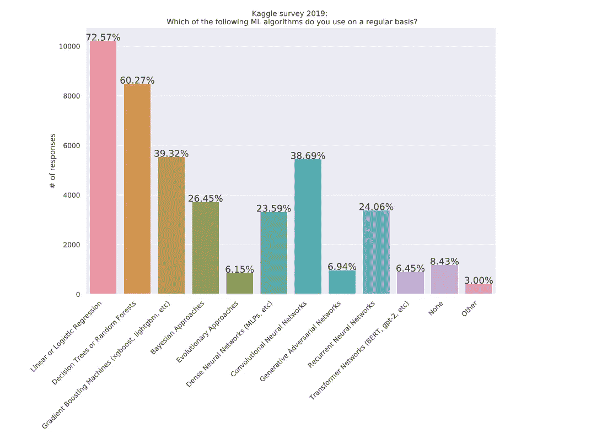
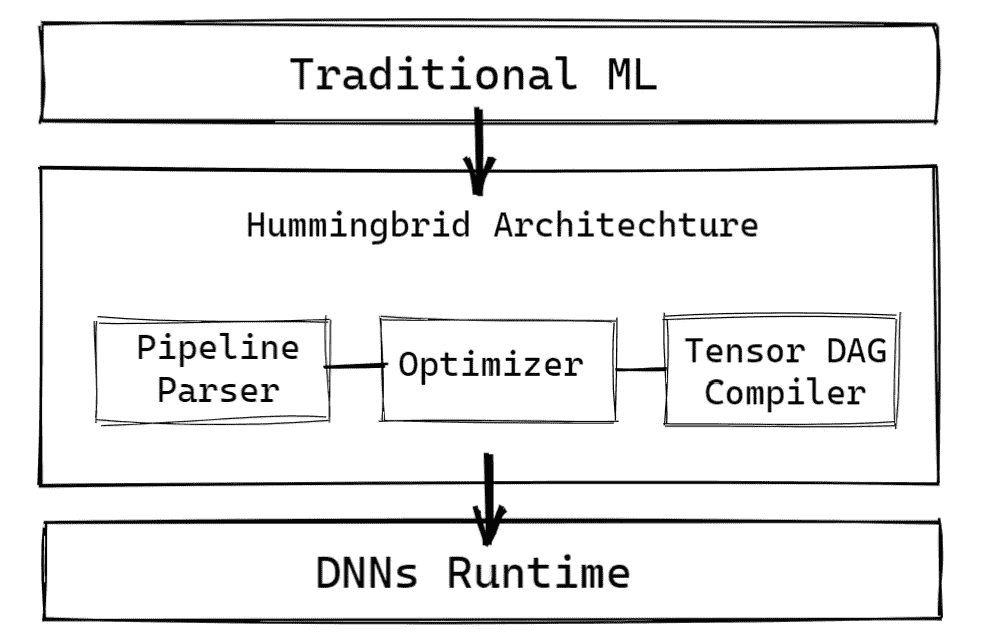
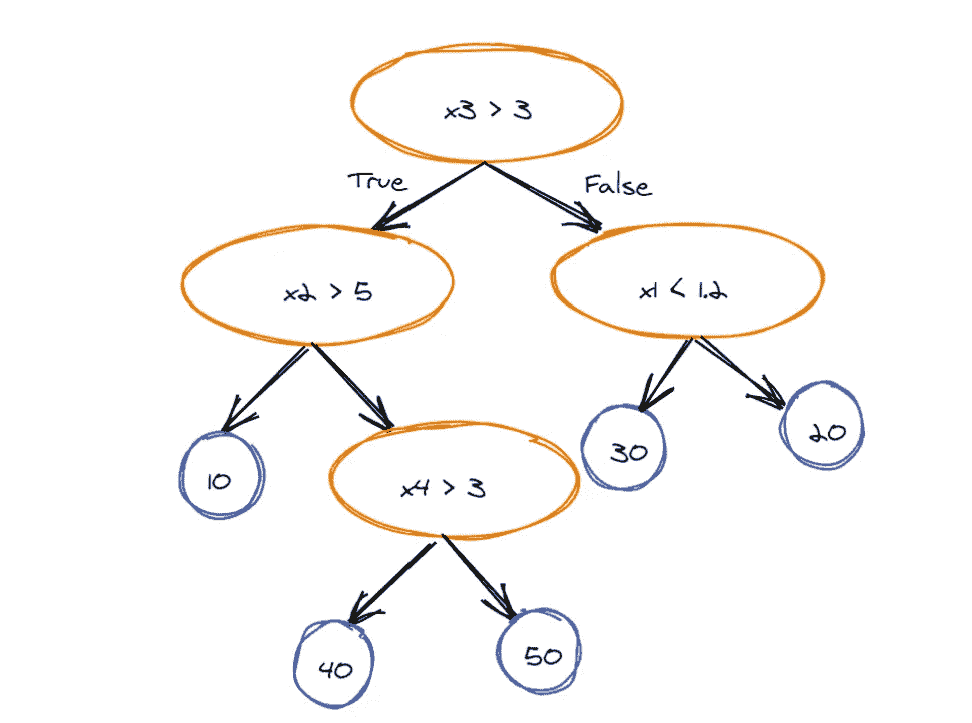
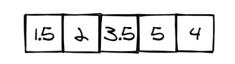
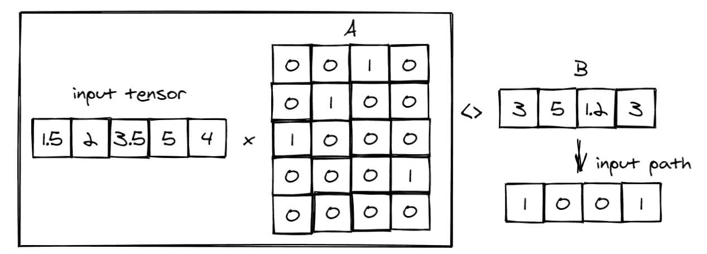
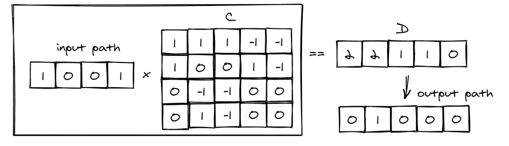
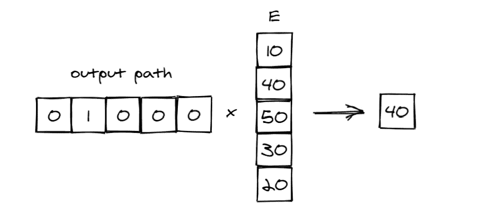
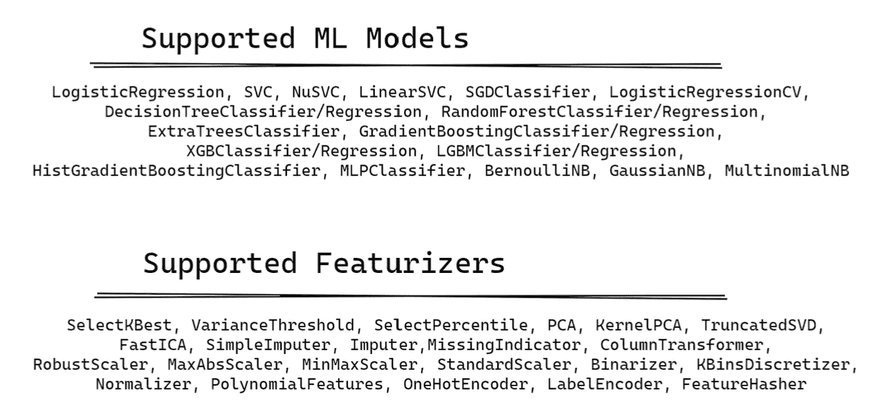

# 使用 Hummingbird 将传统机器学习管道标准化为张量计算

> 原文：<https://towardsdatascience.com/standardizing-traditional-machine-learning-pipelines-to-tensor-computation-using-hummingbird-7a0b3168670?source=collection_archive---------38----------------------->

图片由[尼克·费因斯](https://unsplash.com/@jannerboy62)提供(来源于 unsplash)

## 来自**微软研究员**的**蜂鸟**包的应用

# 背景和挑战📋

T 这里仅仅是没有新闻中提到的**机器学习**、**深度学习**、**人工智能**的日子。说到传统 ML **，**我想提一下发展了很久的基础算法；与**深度神经网络** (DNNs)形成对比。尽管**深度学习**近年来在计算机视觉、自然语言处理或推荐系统等许多方面发展迅速，...**传统的机器学习**仍然完全占据主导地位。

Kaggle 调查 2019 结果(图片由作者提供)

另一项 [*调查*](https://arxiv.org/abs/1912.09536) 研究了 2017 年 7 月(GH2017)在 **GITHUB** 上的 120 万个公开可用的数据科学笔记本和 2019 年 7 月(GH2019)的 510 万个笔记本中的“使用最多的库”，表明最广泛使用的四个库是 **NumPy、Matplotlib、Pandas、**和 **Scikit-learn** (不是 DNNs 框架此外， **Scikit-learn** 的知名度大约是 PyTorch 和 TensorFlow 总和的 5 倍，而且增长速度也超过了这两家公司。

它们仍然备受关注的主要原因是解释黑盒的能力，以便在软件基础设施中为业务、更简单和更有效的使用做出正确的指示。最近，不仅是大型企业，还有中小型企业都在寻求**机器学习**来帮助解决业务挑战，包括预测性维护、客户流失预测和供应链优化。对于企业来说，他们更喜欢理解数据，研究每个参数的特征，并彻底考虑它们，而不是仅仅朝着高度准确的预测前进。

然而，交互式或分析型企业应用程序有一条关键路径，即**模型评分**。在数据科学解决方案的总成本中，模型得分占**45–65%**(基于 AWS 报告[1])。通常，在部署时，甚至在培训期间，ML 模型被多次评分并应用于实际工作应用中(例如，横向扩展批量或交互式服务、个人计算机、移动和物联网设备)。由于可移植性、可维护性、部署和监控方面的考虑，评分控制了复杂性。因此，评分模型的延迟(计时)和吞吐量是企业非常关心的问题。

到目前为止，最流行的工具包像 ML.NET 的**(。NET)、Scikit-learn(基于 Python)和 H2O(基于 Java)来生成操作符的预测管道(pipeline ),例如训练模型、预处理程序、特征化器、缺失值估算器，但是它们主要是针对训练而优化的，而不是针对部署期间测试集的评分。这些框架的可移植性通常受限于在许多环境中支持它们的操作者。优化**模型评分**的解决方案之一是通过将复杂多样的**传统 ML** 转化为一小组简单张量，从 DNNs 中利用**有向无环图** (DAGs)的优势。基于这一想法，许多系统已经被建立，如 **ONNX 运行时**【2】、**torch script**【3】和**TVM**【4】，利用了神经网络 DNN 运行时优化的相对计算简单性，但是它们在与**传统 ML 一起工作的能力和适用性方面仍然有限。****

**最近发布了**、**、[、**蜂鸟**、](https://github.com/microsoft/hummingbird)、 **-** 一个来自微软研究团队的库，它可以将特征化运算符和**传统 ML** 模型编译成一小组张量运算，以增强 CPU 和硬件加速器(GPU，TPU)的高效计算。它为降低基础设施复杂性和**传统 ML** 的模型评分成本开辟了新的途径。在接下来的章节中，**系统架构和实现**在三个基本研究问题方面的重点将使您对其有一个清晰的概述。**

> **传统的最大似然算子(基于线性代数的，如线性模型，算法的，如决策树)可以转化为张量计算吗？**
> 
> **张量空间中产生的(密集)计算能与我们作为输入(例如，遍历一棵树)得到的(稀疏)命令性选择竞争吗？**
> 
> **HUMMINGBIRD 能帮助降低软件复杂性和提高模型可移植性吗？**

# **技术亮点📄**

****

****蜂鸟**的高层架构(图片由作者提供)**

****蜂鸟**库是基于对**传统 ML 流水线**周期寿命的简单观察。一旦应用了特征并训练了模型，就可以将整个管线符号化为将输入特征转换为预测分数的函数(例如，对于二元分类为真或假)。因此， **Hummingbird** 的目标是将流水线中每个操作符的预测函数(而不是训练算法)编译成张量计算，并将它们适当地联系起来。为此，**蜂鸟**引入了三个主要组件:**

1.  ****管道解析器**:生成内存中的中间表示(IR)对象，用其输入参数和相关的输入/输出依赖关系对给定预测管道中的每个运算符进行编码。**
2.  ****优化器:**为操作符搜索潜在的编译策略，并产生潜在的修改 IR。**
3.  ****张量 DAG 编译器:**挑选优化的 IR 对象，并将其编译成遵循目标 DNN 运行时格式的张量运算。**

****蜂鸟**目前支持将很多有代表性的算法算子编译成张量计算。在实践中，没有一种策略始终支配其他策略，它取决于每个输入和模型结构。更多细节，可以去看看他们的[**Github**](https://github.com/microsoft/hummingbird)**或者这篇 [**论文**](https://scnakandala.github.io/papers/TR_2020_Hummingbird.pdf) **。******

****在这篇文章中，介绍了基于树的模型的方法。编译基于树的模型有三种不同的策略:**通用矩阵乘法** (GEMM)、 **TreeTraversal、**和 **PerfectTreeTraversal。******

*   ******GEMM** 策略可以在批量小或者有大量小树的模型上高效运行(CPU 上 D≤ 3，GPU 上 D≤10——D 是树的高度)。****
*   ******TreeTraversal:** 对于大批量和较高的树(D > 10)， **TreeTraversal** 策略通常优于 **GEMM** 策略。****
*   ******PerfectTreeTraversal** 比 **TreeTraversal** 稍快，因为索引查找次数减少，合并内存访问更好，但如果树太深， **PerfectTreeTraversal** 会遇到内存占用问题(D≤ 10)。****

****让我们来看一个简单的例子，看看**蜂鸟**如何用 **GEMM** 策略编译简单的回归树。在这个例子中，树将输入作为具有五个元素( *x* ∈R5)、四个决策节点(橙色)和五个叶节点(蓝色)的特征向量。**蜂鸟**将将决策树模型翻译成如下神经网络:****

********

****简单回归树(作者图片)****

********

****假设我们想要计算这个观察的输出****

*   ******步骤 1:** 将输入张量乘以张量 A(从上面的决策树模型计算得到),该张量捕获输入特征和内部节点之间的关系。然后将其与张量 B 进行比较，张量 B 被设置为每个内部节点的阈值，以创建表示从输入到节点的路径的高音输入路径。在这种情况下，树模型具有 4 个条件，输入向量是 5，因此，张量 A 的形状是 5×4，张量 B 是 1×4。****

********

*   ******步骤 2:** 张量 p 将与张量 C 相乘，张量 C 捕捉内部节点是否是该内部节点的父节点，如果是，它是在左子树还是右子树中(左= 1，右=-1，否则=0)，然后检查与张量 D 的等号，张量 D 捕捉从叶节点到树根的路径中其父节点的左子节点的计数，以创建表示从节点到输出的路径的 tenor 输出路径。在这种情况下，该树模型具有 4 个条件的 5 个输出，因此，张量 C 的形状是 4x5，张量 D 是 1x5。****

********

*   ******第三步:**张量 P 将与捕获叶节点之间映射的张量 E 相乘，以推断最终预测。在这种情况下，树模型有 5 个输出，因此，张量 E 的形状是 5x1。****

********

****从这个例子中，我们可以清楚地想象出**蜂鸟**如何编译一个基于树的模型。此外，**蜂鸟**还有其他技术可以高效地编译**传统的 ML** ，比如自动广播、最小化操作符调用、… 目前**蜂鸟**支持超过 40 个 scikit-learn 操作符**(**[**Github**](https://github.com/microsoft/hummingbird)**)******

********

******Scikit-learn** 目前在**蜂鸟**中支持的操作符(图片由作者提供)****

****即使 **Hummingbird** 非常有用，为企业和数据科学家节省了大量时间和金钱，但它仍处于开发阶段，有许多局限性，需要社区做出更多贡献来改进:****

*   ****不支持任意用户定义的运算符****
*   ****不支持稀疏数据****
*   ****不支持文本特征提取****
*   ****目前正在开发中****

# ****实验评估📊****

****让我们用**加州住房数据集来测试**蜂鸟**在回归模型中的表现。**总观察值为 20640，有 8 个数字输入特征，目标变量为房屋价值中值。这个数据集是从 [StatLib](http://lib.stat.cmu.edu/datasets/) 存储库中获得的，您也可以使用`[**sklearn.datasets.fetch_california_housing**](https://scikit-learn.org/stable/modules/generated/sklearn.datasets.fetch_california_housing.html#sklearn.datasets.fetch_california_housing)`函数下载。****

**在本实验中，从简单到复杂测试了 4 种不同的模型，分别是**线性回归、决策树回归、RandomForestRegressor 和 xgb 回归。**要使用的指标是 MSE 和运行时间，显示在帖子的末尾。**

**毫无疑问，使用复杂的模型，准确性会提高，但训练时间以及评分时间也会增加。让我们将这些模型编译成张量运算符，并检查编译是否有助于减少运行时间。首先，这些转换后的模型将在 CPU 中运行。**

**运行时间在所有情况下都没有减少。原因是测试数据的数量不大，每个模型本身的复杂程度是正常的。让我们看看转换后的模型在 GPU 中运行的性能。**

**在这段时间里，运行时间比在 CPU 中运行减少了。然而，与原始模型相比，只有 RandomForestRegressor 和 XGBRegressor 的运行时间有所减少，而 LinearRegression 和 DecisionTreeRegressor 的运行时间仍然较高，因为模型本身很简单。所有结果汇总如下。**

# **最后的想法📕**

**很明显可以看出模型的复杂性(或准确性)与运行时间之间的权衡。由于测试数据的数量、数据集的复杂性和模型的复杂性，在某些情况下将传统模型转换为张量算子无助于减少评分时间。你可以自由地用更复杂的**特征符**来测试编译模型的性能，在管道模型中如使用变换技术(RobustScaler，StandardScaler，KBinsDiscretizer，..)、插补技术(SimpleImputer，MissingIndicator，..)或特征提取技术(多项式特征，特征散列器，..)来查看转换为张量运算符的效率。**

**如果你想进一步讨论，可以联系我。这是我的 [Linkedin](https://www.linkedin.com/in/vumichien/)**

**尽情享受吧！！！👦🏻**

# **参考**

**[1]亚马逊。亚马逊 sagemaker 的总拥有成本(tco)。https://pages.awscloud.com/rs/112-TZM-766/图片/亚马逊 _SageMaker_TCO_uf.pdf，2020。**

**[2] ONNX 运行时。[https://github.com/microsoft/onnxruntime.](https://github.com/microsoft/onnxruntime.)**

**[3] TorchScript 文档。[https://pytorch.org/docs/stable/jit.html.](https://pytorch.org/docs/stable/jit.html.)**

**[4]陈、莫罗、江、郑、严、科恩、沈、王、胡、策泽、盖斯特林和克里希那穆提。Tvm:深度学习的自动化端到端优化编译器，2018**