# 星巴克提供分析

> 原文：<https://towardsdatascience.com/starbucks-capstone-challenge-35e3b8c6b328?source=collection_archive---------32----------------------->

## Udacity 的数据科学家纳米学位计划的顶点项目

索林·索尔布在 [Unsplash](https://unsplash.com?utm_source=medium&utm_medium=referral) 上的照片

# 项目概述

这是 Udacity 的数据科学家纳米学位项目的一个顶点项目。在这个项目中，给定的数据集包含模拟星巴克奖励移动应用程序上的客户行为的模拟数据。每隔几天，星巴克就会向手机应用程序的用户发出一次报价。优惠可以仅仅是饮料的广告，也可以是实际的优惠，如折扣或 BOGO(买一送一)。某些用户可能在特定的几周内收不到任何优惠。并非所有用户都收到相同的报价，这是使用该数据集要解决的挑战。

# 问题陈述

该项目的目标是将交易、人口统计和优惠数据结合起来，以确定哪些人口统计组最适合哪种优惠类型。这个数据集是真实星巴克应用程序的简化版本，因为底层模拟器只有一种产品，而星巴克销售几十种产品。

**这一目标可以通过以下策略实现:**

*   探索和可视化数据。
*   数据预处理。
*   对清洁的预处理数据应用快速数据分析
*   缩放数字特征。
*   尝试几种监督学习模型。
*   使用选择的度量(精确度)评估模型，然后在其中选择最佳的监督学习模型。
*   如果结果需要改进，实现 **GridSearchCV** 以找到最佳参数(以提高所选模型的性能)。

# 数据集描述

数据包含在三个文件中:

*   portfolio.json —包含报价 id 和关于每个报价的元数据(持续时间、类型等)。)
*   profile.json —每个客户的人口统计数据
*   transcript.json 记录交易、收到的报价、查看的报价和完成的报价

以下是文件中每个变量的模式和解释:

**portfolio.json**

*   id(字符串)—优惠 id
*   offer_type (string) —一种优惠类型，即 BOGO、折扣、信息
*   难度(int)——完成一项提议所需的最低花费
*   奖励(int) —奖励是为完成一项提议而给予的
*   duration(int)-要约开放的时间，以天为单位
*   频道(字符串列表)

**profile.json**

*   年龄(整数)—客户的年龄
*   成为会员日期(int) —客户创建 app 帐户的日期
*   性别(str) —客户的性别(请注意，有些条目包含“O”代表其他，而不是 M 或 F)
*   id (str) —客户 id
*   收入(浮动)—客户的收入

**抄本. json**

*   事件(str) —记录描述(即交易、收到的报价、查看的报价等。)
*   人员(字符串)—客户 id
*   time (int) —测试开始后的时间，以小时为单位。数据开始于时间 t=0
*   value —(字符串字典)—报价 id 或交易金额，具体取决于记录

# 韵律学

为了评估我们模型的性能，我们将使用准确性。选择这一指标的原因如下:

*   因为我们有一个简单的分类问题，即要么:要约已查看，要约已完成。
*   它使我们能够通过比较正确预测的数量与预测的总数(准确性的概念)来识别我们的模型预测得有多好。

# 解释性数据分析

## 1.投资组合数据集

该数据集包含 6 列:

*   奖励(int) —奖励是为完成一项提议而给予的
*   频道(字符串列表)
*   难度(int)——完成一项提议所需的最低花费
*   duration(int)-要约开放的时间，以天为单位
*   offer_type (string) —一种优惠类型，即 BOGO、折扣、信息
*   id(字符串)—优惠 id

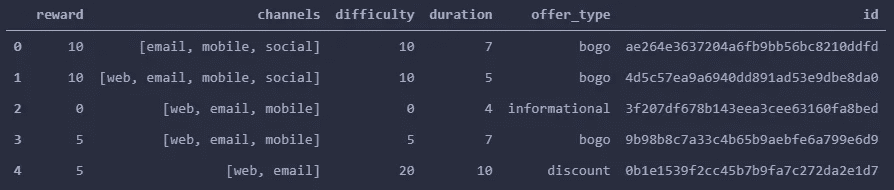

投资组合数据集的头。

**投资组合数据集的探索显示了以下内容:**

*   该数据集既没有空值也没有重复值。
*   有三种类型的优惠:“BOGO”(买一送一)、“信息”和“折扣”。
*   数据集中包括 4 个报价，分类为:“BOGO”，4 个报价分类为“折扣”，2 个报价分类为“信息”。
*   “难度”一栏的单位是美元，并不反映获得奖励的难度。重新缩放该功能是一个有用的步骤。**这需要在建模之前完成。**

## 2.个人资料数据集

该数据集包含 5 列:

*   性别(str):客户的性别(M:男性，F:女性，O:其他)。
*   年龄(int):客户的年龄。
*   id (str):客户 id。
*   become _ member _ on(int):客户创建 app 账户的日期。
*   收入(浮动):客户的收入。

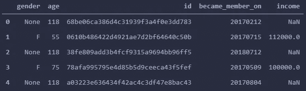

配置文件数据集的头。

**剖面数据集的探索和可视化显示如下:**

*   数据集没有重复的行。
*   该数据集在“性别”、“收入”变量上各有 2175 个缺失值。
*   顾客的年龄从 18 岁到 101 岁不等。尽管这 2175 名客户的注册年龄是 118 岁，但我仍然认为这个特定年龄是异常值。很明显，数据集中的这 2175 行有问题。

**探索和可视化“性别”、“收入”和“年龄”变量**

“性别”和“收入”变量中缺失的值仅与 2175 名 118 岁注册的客户相关。换句话说，118 岁的顾客没有登记的“性别”和“收入”。**这需要在数据预处理部分进行清理。**

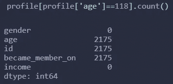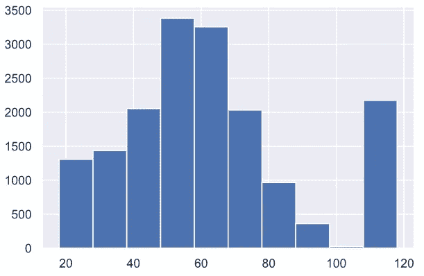

年龄分布

根据现有数据，客户分为三个“性别”类别(M、F 和 O)。记住上面的观察结果，有 2175 个值缺失，男性顾客(8484 名男性)多于女性顾客(6129 名女性)，男性顾客占 57%，女性顾客占 41%。然而，有 212 名顾客选择了“O”作为他们的性别。

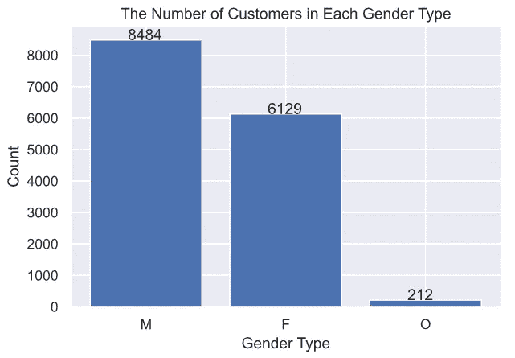

收入分配栏

顾客的收入从 3 万到 12 万不等，大多数顾客的收入在 5 万到 7.5 万之间。

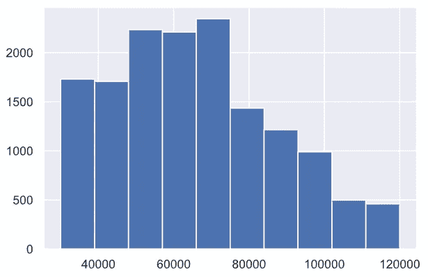

## 3.抄本数据集:

该数据集包含 4 列

*   人员(字符串)—客户 id
*   事件(str) —记录描述(即交易、收到的报价、查看的报价等。)
*   value —(字符串字典)—报价 id 或交易金额，具体取决于记录
*   time (int) —测试开始后的时间，以小时为单位。数据开始于时间 t=0

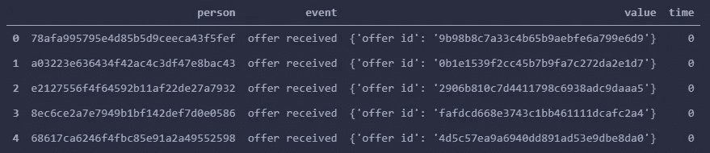

**对抄本数据集的探索显示了以下内容:**

*   数据集既没有重复的行，也没有缺失的值。
*   如上所述,“值”列是一个字典，我们可以在其中应用某种特征工程来提取有用的数据，这些数据肯定会有助于我们未来模型的成功。**该步骤将通过数据预处理(争论/清理)部分完成。**
*   该数据集中有四种类型的事件:“交易”、“收到报价”、“查看报价”和“报价完成”。
*   所有被分类为“事务”的事件在其“值”列中都没有“已提供”。

# 数据处理

## 投资组合数据集:

处理这些数据包括:

1.  将“id”列重命名为“offer_id”。
2.  将“持续时间”列的单位从天更改为小时。
3.  将“duration”列重命名为“duration_h ”,表示测量单位为“小时”
4.  使用最小最大缩放器标准化“难度”和“奖励”特征。
5.  使用 one-hot 编码从“channels”列创建虚拟变量，然后删除“channels”列。
6.  用更简单的 id 替换“优惠 id”。
7.  将“报价类型”替换为代表各报价类型的整数，如下所示:

*   BOGO
*   打折
*   报告的

原始投资组合数据集

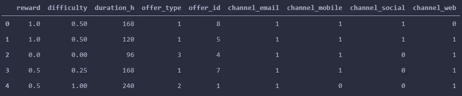

数据处理后的投资组合数据集

## 配置文件数据集:

处理这些数据包括:

1.预处理“id”功能:

*   将“id”列名重命名为“customer_id”。
*   重新排列列，使“customer_id”列成为数据集中的第一列。
*   用最简单的数值替换 customer_id 字符串值。

2.预处理“年龄”特征:

*   将年龄= 118 替换为 NaN 值。
*   删除没有“年龄”、“性别”和“收入”的客户(删除行)。
*   将“年龄”和“收入”列的数据类型更改为“int”。
*   创建一个新列“年龄组”,其中包括每个客户所属的年龄组
*   将“年龄组”分类标签替换为相应的数字标签，如下所示:

> 1:青少年

> 2:年轻成人

3 岁以上:成人

> 4:老年人

3.预处理“收入”功能:

*   创建一个新列“income_range ”,其中包括客户收入所属的收入范围。
*   将“收入范围”分类标签替换为相应的数字标签，如下所示:

大于 1:平均(30，000–60，000)

> 2:高于平均水平(60，0001–90，000)

> 3:高(超过 90，000)

4.预处理“性别”特征:

*   将“性别”分类标签替换为相应的数字标签，如下所示:

> 1: F(女性)

> 2: M(男性)

> 3: O

5.预处理“成为成员”功能:

*   将' became_member_on '列的数据类型从 int 更改为 date，并将其设置为 otoe 中的适当格式一种可读的日期格式，如果需要，可以很容易地对其进行分析。
*   向现有数据集添加一个新列“start_year”，该列将显示客户成为会员的年份(用于进一步分析)。
*   向现有数据集添加一个新列“membership_days”，该列将显示自客户成为会员以来的天数(用于进一步分析)。
*   创建一个新列“member_type ”,表示成员的类型:新成员、普通成员或忠诚成员，具体取决于其“membership_days”的数量。
*   将“member_type”分类标签替换为相应的数字标签，如下所示:

> 1:新会员(1000 天或更短时间内的会员)

> 2:普通会员(1001-1600 天会员资格)

> 3:忠诚(超过 1600 天的会员资格)

*   删除“年龄”、“收入”、“成为会员日期”和“会员天数”列，因为不再需要它们。

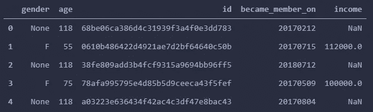

原始轮廓数据集

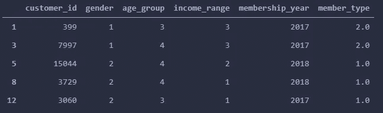

处理后的剖面数据集

## 抄本数据集

处理这些数据包括:

1.将“time”列重命名为“time_h ”,表示测量单位为“小时”。

2.预处理“人”特征:

*   将“人员”列重命名为“客户标识”。
*   将“customer_id”列中的分类值替换为与每个客户 id 相对应的新初始化的数值，这些数值是由之前对“id”功能的预处理产生的

3.预处理“值”功能:

*   将“值”列中存在的每个键提取到单独的列，而不是删除“值”列。
*   用“不适用”值填写“报价 id”列中的所有 nan(即不适用)。
*   删除“值”列，因为不再需要它。

4.预处理“事件”功能:

*   从我们的 clean _ 抄本数据集中排除“交易”或“收到报价”的所有事件。
*   将“事件”分类标签替换为相应的数字标签，如下所示:

> 1:报价完成

> 2:已查看报价

5.预处理“offer_id”功能:

*   将“offer_id”列中的分类值替换为预处理投资组合数据集时使用的相应数值

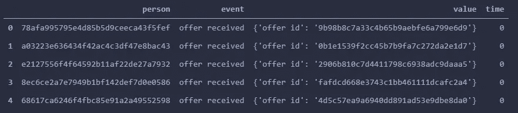

原始抄本数据集

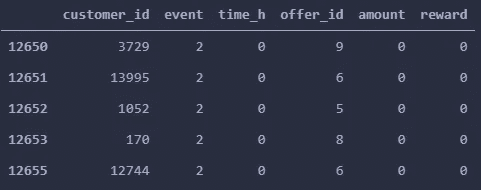

处理后的转录数据集

# 将三个清理过的数据集(投资组合、配置文件和交易)合并成一个主清理数据集

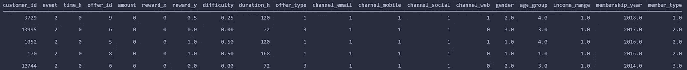

主数据帧

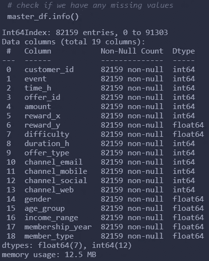

删除缺失值后的主数据集

# 主数据集的分析

对主数据报的快速分析包括一些问题，例如:

## Q1——每个年龄组(青少年、年轻人、成年人和老年人)的常见优惠是什么？

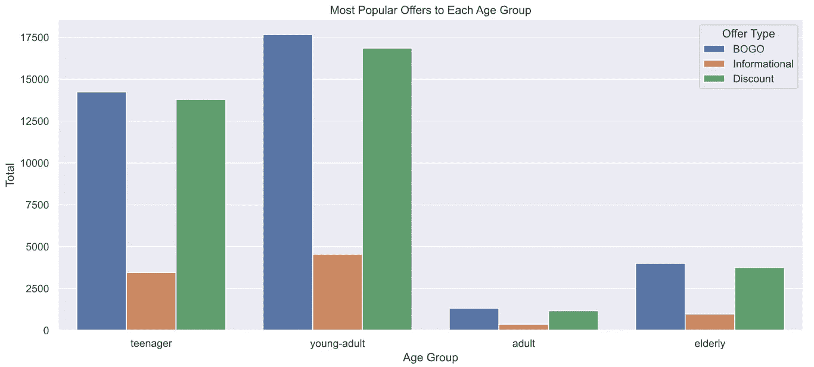

所有年龄组中最常见的优惠类型是 BOGO，其次是折扣优惠。然而，最不常见的提议是信息性提议。我相信 BOGO 的优惠比星巴克的其他优惠更有吸引力。

## Q2——基于收入最高的顾客的人口统计数据，男性还是女性？

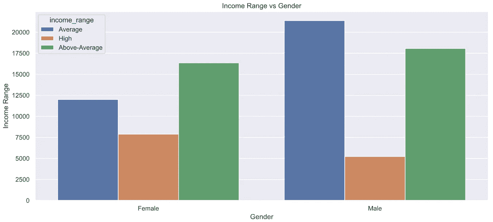

高收入(9 万以上)的客户多为女性客户。然而，平均收入(30，000-60，000)的客户大多是男性。

## Q3——男性或女性中，谁需要很长时间才能获得每份工作？

当谈到完成一项提议所花费的时间时，男性和女性非常接近。雄性和雌性都需要大约 17 天才能完成。

## Q4——星巴克每年有多少新会员？

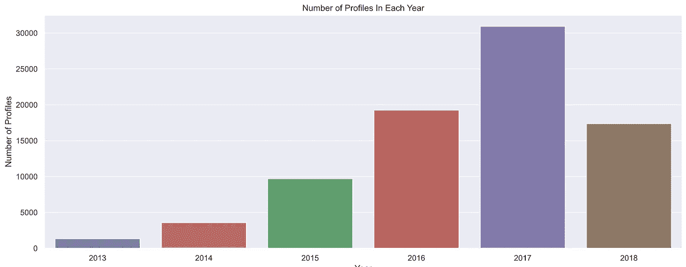

**2017 年**就新会员数量而言，是星巴克最好的一年。在我们的数据集中，大约有 38% 的客户在这一年注册为会员。

## Q5 —男女都喜欢哪种类型的促销(优惠)？

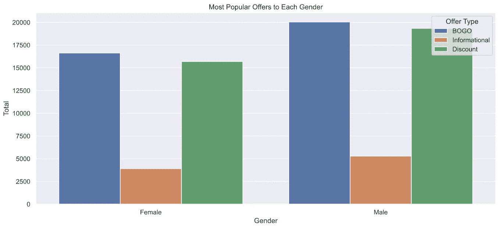

我们得到的图表显示，男女都喜欢 BOGO 和折扣优惠，他们对信息性优惠的反应相同，他们似乎都对它不感兴趣。

## Q6 —同一个客户的两份抄本的平均长度是多少？

客户完成报价的平均时间不到 16 天(372 小时)。

## Q7 —在顾客查看的所有报价中，他们完成了多少报价？

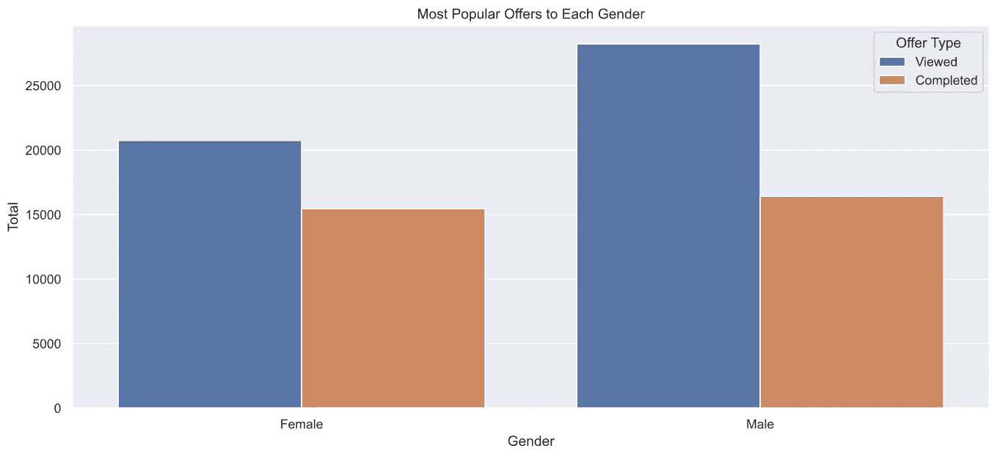

# 数据建模

在这一部分，我试图建立一个模型来预测客户是会**只查看**报价，还是会**查看&完成**报价。由于该模型关注的是事件**‘报价视图’**和**‘报价完成’**，我将只考虑事件**‘报价视图’**或**‘报价完成’**的那些记录。换句话说，我不会将带有事件'**交易**或'**报价已收到**'的抄本包括在我的训练和测试集中。

**说到特征，我打算**只考虑**那些我认为对我们的模型准确预测**目标**很重要的特征。**

**那些特征是:' time_h '，' offer_id '，' amount '，' reward_x '(将被重命名为' reward ')，'难度'，' duration_h '，' offer_type '，' gender '，' age_group '，' income_range '，' member_type '。**

****目标(标签)是:‘事件’**，它将保存数值:**

****1** : *报价完成***

****2** : *报价已查看。***

****以下是建模前要素数据框的外观:****

**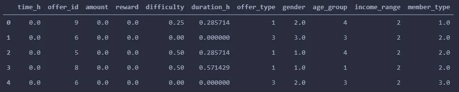**

****我的特征和标签的形状是:****

*   **训练特征形状:(65843，11)**
*   **训练标签形状:(65843，)**
*   **测试特征形状:(16461，11)**
*   **测试标签形状:(16461，)**

**对于**建模**部分，我尝试了六种不同的模型，结果如下:**

**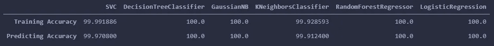**

**上表显示了与使用不同监督学习模型相关的准确度分数。如表中所示，**我们在 4 个模型(共 6 个模型)的训练集和测试集上都有 100%的准确率**。为了尽可能避免过度拟合，我将选择在测试集上给我最低精度分数的模型，这就是 **KNeighborsClassifier** 。在这个模型上，我在测试集上得到了 99.88%。我知道这是一个很高的分数，但我选择了这个模型，因为我相信它可以用于解决二元结果问题陈述:**关于客户是否会查看报价(只是查看)或他是否会(完成报价)，即查看&完成该特定报价。****

# **结论**

****通过这个项目，我试图分析星巴克提供的数据集，然后建立一个模型，可以预测客户是否会完成报价或只是浏览？****

**首先，我研究了每个数据集，将其可视化以获得对数据的整体理解。这还包括分析数据集的不同方面。然后，我转移到预处理部分。预处理数据是花费大部分时间和精力的任务。数据集有点棘手，包含的数据要求我使用我的争论/工程和预处理技能来获得三个数据集的最终干净版本。下一步是创建一些可以提高模型性能的潜在特性。这些特征是从原始的现有列派生出来的，但是包含在数据集中的值和简单值的范围较小。这方面的例子如下:**

*   **从“年龄”功能派生的“年龄组”功能。然后，我将特征的分类标签替换为相应的数字标签，如下所示:**

**1:青少年**

**2:年轻人**

**3:成人**

**4:老年人**

*   **从“收入”功能派生的“收入范围”功能。这包括客户收入所属的收入范围。然后，我将“收入范围”分类标签替换为相应的数字标签，如下所示:**

**1:平均(30，000–60，000)**

**2:高于平均水平(60，0001–90，000)**

**3:高(9 万以上)**

*   **“member_type”功能派生自“became _ member _ on”功能。当然，分类标签的特征已经被相应的数字标签所取代，如下所示:**

**1:新成员(1000 天或更短时间内的成员)**

**2:普通会员(1001-1600 天会员资格)**

**3:忠诚(超过 1600 天的会员资格)**

## **对数据集的快速分析让我获得了以下见解:**

*   **顾客的收入从 3 万到 12 万不等，大多数顾客的收入在 5 万到 7.5 万之间。**
*   **根据现有数据，客户分为三个“性别”类别(M、F 和 O)。记住上面的观察结果，有 2175 个值缺失，男性顾客(8484 名男性)多于女性顾客(6129 名女性)，男性顾客占 57%，女性顾客占 41%。然而，有 212 名顾客选择了“O”作为他们的性别。**
*   **所有年龄组中最常见的优惠类型是 BOGO，其次是折扣优惠。然而，最不常见的提议是信息性提议。我相信 BOGO 的优惠比星巴克的其他优惠更有吸引力。**
*   **高收入(9 万以上)的客户多为女性客户。然而，平均收入(30，000-60，000)的客户大多是男性。**
*   **当谈到完成一项提议所花费的时间时，男性和女性非常接近。雄性和雌性都需要大约 17 天才能完成。**
*   **就新会员数量而言，2017 年是星巴克最好的一年。在我们的数据集中，大约有 38%的客户在这一年注册为会员。**
*   **男性和女性都喜欢 BOGO 和折扣优惠，他们对信息优惠的反应是一样的，他们似乎都对此不感兴趣。**
*   **客户完成报价的平均时间不到 16 天(372 小时)。**
*   **女性完成了她们所查看的要约的 75%,比男性多 16%,男性只完成了她们所查看的要约的 58%。女性似乎比男性更容易被升职说服。**

# **丰富**

**虽然我相信“总有改进的空间”这句话，但我认为 **KNeighborsClassifier** 模型给了我很高的分数。试图改进这样的模型肯定会使我们陷入过度拟合的错误。因此，我不会建议对这个模型进行任何改进，因为我相信我们不需要试图获得更好的结果。**

**值得一提的是，我计划使用 **GridSearchCV** 来改进我将要选择的模型。这是我的计划，在被高分击中之前。**

**我相信我在预测模型方面取得了非常好的结果。我非常理解星巴克提供的数据。**

**由于总有改进的空间，我认为改进数据收集或解决与缺失数据或 NaNs 相关的问题的想法将非常有用。我认为，我们可以从这个数据集获得很好的见解，也可以建立很好的预测模型来解决与这个数据集相关的问题。这些模型的示例如下:**

*   **构建一个可以预测向哪个客户发送哪种优惠的模型？**
*   **建立一个模型，可以预测哪些客户会购买(不管是否有优惠)**

# **反射**

**我喜欢在这个顶点项目上工作，它让我提高了我在数据预处理和建模方面的技能。在我看来，最困难的部分是决定问题陈述。这是因为薄弱的问题陈述肯定会导致其他工作被低估和重视。**

**预处理步骤是要完成的最长和最具挑战性的部分。数据集本身是鼓舞人心的。老实说，一切都很棒。**

**包含项目文件和数据集的 GitHub 存储库可以在这个[链接](https://github.com/VishalkrishnaBlaze/Starbucks-Capstone-Challenge.git)中找到。**