# 星巴克顶点挑战

> 原文：<https://towardsdatascience.com/starbucks-capstone-challenge-b95b0931bab4?source=collection_archive---------50----------------------->

## 这个项目是 Udacity 数据科学纳米学位的一部分


图片来源: [seattle.eater(免费用于商业用途)](https://cdn.vox-cdn.com/thumbor/L8oitvUmrZbnqzJn5V4yA3-GLL4=/0x0:4608x3072/920x613/filters:focal(2154x1388:2890x2124):format(webp)/cdn.vox-cdn.com/uploads/chorus_image/image/66466902/shutterstock_1516971902.0.jpg)

# 介绍

星巴克提供了模拟数据，模拟星巴克奖励移动应用程序上的客户行为。每隔几天，星巴克就会向手机应用程序的用户发出一次报价。优惠可以仅仅是饮料的广告，也可以是实际的优惠，如折扣或 BOGO(买一送一)。某些用户可能在特定的几周内收不到任何优惠。并非所有用户都收到相同的报价，这是这个数据集要解决的挑战。

任务是将交易、人口统计和优惠数据结合起来，以确定哪些人口统计组对哪种优惠类型做出最佳响应。

数据包含在三个文件中:

*   portfolio.json —包含报价 id 和关于每个报价的元数据(持续时间、类型等)。).
*   profile.json —每个客户的人口统计数据。
*   transcript.json 记录交易、收到的报价、查看的报价和完成的报价。

以下是文件中每个变量的模式和解释:

**portfolio.json**

*   id(字符串)—优惠 id
*   offer_type (string) —优惠的类型，如 BOGO、折扣、信息
*   难度(int)——完成一项提议所需的最低花费
*   奖励(int) —为完成一项提议而给予的奖励
*   duration(int)-要约开放的时间，以天为单位
*   频道(字符串列表)

**profile.json**

*   年龄(整数)—客户的年龄
*   成为会员日期(整数)—客户创建应用程序帐户的日期
*   性别(str) —客户的性别(请注意，有些条目包含“O”代表其他，而不是 M 或 F)
*   id (str) —客户 id
*   收入(浮动)—客户的收入

**转录本. json**

*   事件(str) —记录描述(即交易、收到的报价、查看的报价等。)
*   人员(字符串)—客户 id
*   time (int) —测试开始后的时间，以小时为单位。数据开始于时间 t=0
*   value —(字符串字典)—报价 id 或交易金额，具体取决于记录

## 问题陈述

我选择解决的问题是建立一个模型来预测客户是否会对报价做出反应。

以下是我在分析过程中遵循的主要步骤:

1-探索和清理给定的数据集。

2-组合数据集以获得包含相关特征的最终干净数据。

3-将数据分成训练和测试数据集/缩放特征。

4-选择合适的绩效矩阵。

5-使用 GridSearch 训练分类器并选择最佳估计器

6-计算最佳估计值给出的特征重要性。

7-使用测试数据计算模型的性能，并绘制混淆矩阵。

## **1-探索和清理给定的数据集**

为了理解数据集并揭示初始模式、特征和兴趣点，首先我们需要探索数据集，包括检查缺失值、可视化数据分布等。这样，我们可以看到数据能告诉我们什么，以及如何选择支持模型实现的重要特性。
我们还会做一些预处理，在这一步中，数据会被转换或编码，使其达到机器可以轻松解析的状态。

```
*# read in the json files*
portfolio = pd.read_json('data/portfolio.json', orient='records', lines=**True**)
profile = pd.read_json('data/profile.json', orient='records', lines=**True**)
transcript = pd.read_json('data/transcript.json', orient='records', lines=**True**)
```

投资组合数据

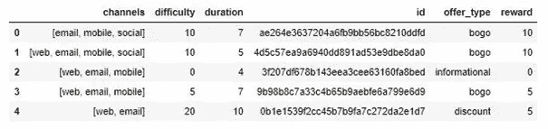

投资组合的预处理执行如下:

*   将功能的名称“id”更改为“offer_id”。
*   将持续时间从一天改为一小时。
*   将 OneHotEncoding 应用于 channels 列。
*   将 OneHotEncoding 应用于 offer_type 列。

所有这些步骤都包含在下面的函数中:

```
**def** clean_portfolio(portfolio):

    *'''*
 *data cleaning the portfolio dataframe*

 *INPUT:*
 *portfolio - the portfolio dataframe to be cleaned*

 *OUTPUT:*
 *portfolio - the cleaned portfolio dataframe*

 *'''*

    *# Change name of feature id to offer_id*
    portfolio.rename(columns={'id': 'offer_id'}, inplace=**True**)

    *# change the duration from day to hour*
    clean_portfolio = portfolio.copy()
    clean_portfolio['duration'] = clean_portfolio['duration'] * 24

    *# apply one hot encoding to channels culumn*

    channels=clean_portfolio['channels'].map(**lambda** x: ','.join(map(str, x))).str.get_dummies(sep=',')

    *# apply one hot encoding to offer_type column*
    offer_type = pd.get_dummies(clean_portfolio['offer_type'])

    *# drop the culumns channels and offer_type* 
    clean_portfolio.drop(['channels', 'offer_type'], axis=1, inplace=**True**)

    *# combine the dataframe clean_portfolio and offer_type to form a cleaned dataframe*
    clean_portfolio = pd.concat([clean_portfolio, channels, offer_type], axis=1, sort=**False**)

    **return** clean_portfolio
```

将函数应用于投资组合数据集

```
clean_portfolio=clean_portfolio(portfolio)
```

清理完数据后，看起来是这样的:

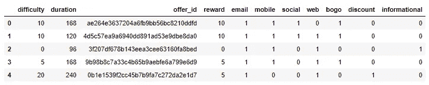

b 剖面数据

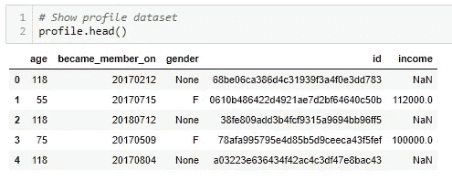

绘制年龄分布图

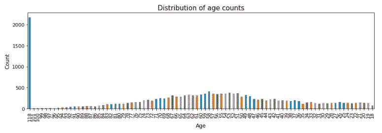

从上面的图中，我们可以清楚地看到，年龄为 118 岁的客户在分布图中非常突出，这似乎是异常值。我检查了年龄等于 118 的所有配置文件，它们没有任何性别和收入，年龄为 118 的客户数量为 2175 是不现实的，出于这些原因，我将删除年龄为 118 的所有行。

配置文件的预处理执行如下:

*   在配置文件数据框中将列 id 的名称更改为 customer_id。
*   删除年龄在 118 岁以上的客户。
*   将 OneHotEncoding 应用于特征“性别”。
*   将特征“年龄”转换为“年龄-十年”,这将有助于确定某一特定年龄是否更受优惠的影响。
*   将 OneHotEncoding 应用于功能“按年代”。
*   创建功能“成为成员年”，其中客户从功能“成为成员年”成为成员。
*   创建功能“成为会员月”，其中客户从功能“成为会员月”成为会员。
*   创建功能“成为会员日”，其中客户从功能“成为会员日”成为会员。
*   从“成为会员”功能创建客户的“成为会员”功能。
*   将 OneHotEncoding 功能应用于“成为 _ 成员 _ 年份”。
*   将 OneHotEncoding 功能应用于“成了 _ 成员 _ 月”。
*   将特征“收入”转换为“收入范围”,这将有助于确定某一特定收入范围是否更多地受到报价的影响。
*   将 OneHotEncoding 功能应用于“income_by_range”。

所有这些步骤都包含在下面的函数中

```
def clean_profile(profile):

    """ Transforms a DataFrame that contains demographic data for each 
    customer

    INPUT:
        (Optional) data_dir: String that stores the full path to the
                             data directory

    OUTPUT:
        profile: DataFrame that contains demographic data for each 
                 customer
    """
    # copy dataframe from profile to clean_profile
    clean_profile = profile.copy()

    # Change name of culumn id to customer_id in profile dataframe
    clean_profile.rename(columns={'id': 'customer_id'}, inplace=True)

    # Remove customers with age 118
    profile_118 = clean_profile[clean_profile['age'] == 118]
    clean_profile.drop(index=profile_118.index, inplace=True) 

    # OneHotEncoding feature 'gender'
    gender_dummies = pd.get_dummies(clean_profile['gender'], prefix='', prefix_sep='')

    # Convert fetaure 'age' into 'age_by_decade' which would be helpful in determining if a particular age 
    #is influenced more by an offer
    clean_profile['age_by_decade'] = pd.cut(clean_profile['age'], bins=range(10,120,10),right=False, labels=['10s','20s', '30s', '40s', '50s','60s', '70s', '80s', '90s', '100s'])

    # OneHotEncoding feature 'age_by_decade'
    age_dummies = pd.get_dummies(clean_profile['age_by_decade'], prefix='age', prefix_sep='_')

    # Drop feature 'age' 
    clean_profile.drop(columns=['age'], axis=1, inplace=True)

    # Convert type of feature 'became_member_on' to type Datetime
    type(pd.to_datetime(clean_profile['became_member_on'],format='%Y%m%d').dt)# Create feature 'became_member_year' in which customer became member from feature 'became_member_on'
    clean_profile['became_member_year'] = pd.to_datetime(clean_profile['became_member_on'],format='%Y%m%d').dt.year# Create feature 'became_member_month' in which customer became member from feature 'became_member_on'
    clean_profile['became_member_month'] = pd.to_datetime(clean_profile['became_member_on'],format='%Y%m%d').dt.month

    # Create feature 'became_member_day' in which customer became member from feature 'became_member_on'
    clean_profile['became_member_day'] = pd.to_datetime(clean_profile['became_member_on'],format='%Y%m%d').dt.day

    # Create feature 'became_member_tenure' of customers from feature 'became_member_on'
    clean_profile['became_member_tenure'] = (datetime.today().date() - pd.to_datetime(clean_profile['became_member_on'],format='%Y%m%d').dt.date).dt.days# Drop feature 'became_member_on'
    clean_profile.drop(columns=['became_member_on'], axis=1, inplace=True)

    # OneHotEncoding feature 'became_member_year'
    year_dummies = pd.get_dummies(clean_profile['became_member_year'], prefix='', prefix_sep='')# OneHotEncoding feature 'became_member_month'
    month_dummies = pd.get_dummies(clean_profile['became_member_month'], prefix='month', prefix_sep='_')

    # Convert feature 'income' into 'income_by_range' which would be helpful in determining
    # if a particular income range is influenced more by an offer
    clean_profile['income_by_range'] = pd.cut(clean_profile['income'], bins=range(30000,140000,10000), right=False,\
                                    labels=['30ths','40ths', '50ths', '60ths', '70ths','80ths', '90ths',\
                                            '100ths', '110ths', '120ths'])

    # OneHotEncoding feature 'income_by_range'
    income_dummies = pd.get_dummies(clean_profile['income_by_range'], prefix='income', prefix_sep='_')

    # combine the dataframe clean_profile with the different dummies variables
    clean_profile = pd.concat([clean_profile, gender_dummies, age_dummies,year_dummies,month_dummies,income_dummies], axis=1, sort=False)# Return a DataFrame with clean customer profile data
    return clean_profile
```

将函数应用于数据集配置文件

```
*# apply the function clean_profile on our dataset 'profile' to  get a cleaned profile*
clean_profile=clean_profile(profile)
```

这是我们数据集简介的新栏目

```
*# show the columns of cleaned profile data*
clean_profile.columns
```

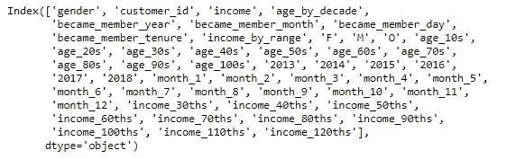

显示数据的可视化表示

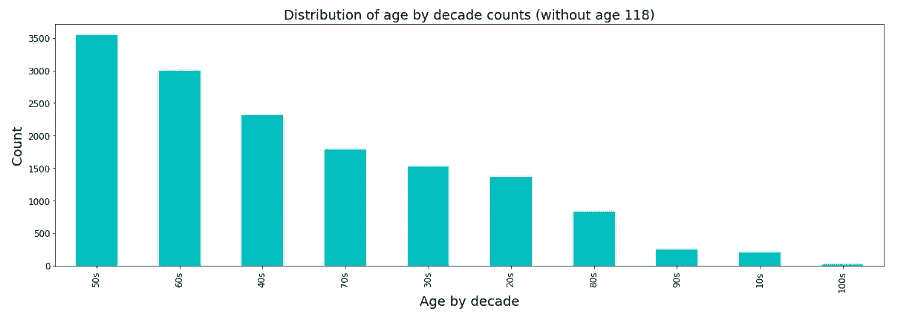

该图显示，在去掉年龄 118 之后，特征年龄是均匀分布的，我们看到大多数消费者的年龄在 40 到 80 岁之间。

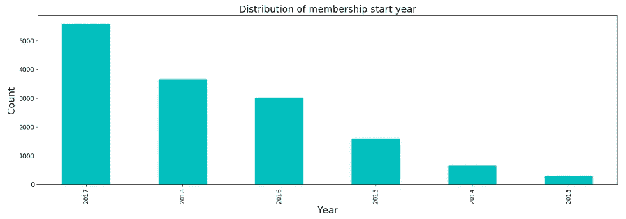

结果表明，大多数顾客在 2017 年加入了星巴克奖励计划，随后在 2018 年加入。

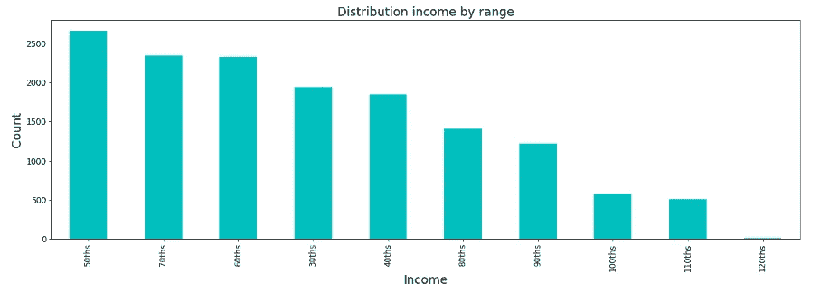

从上面的图中，我们看到大多数顾客的收入在 30 000 到 90 000 之间。

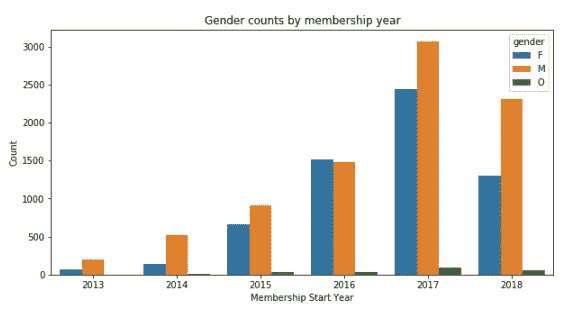

剧情描绘了每年加入计划的男性客户比女性客户多。

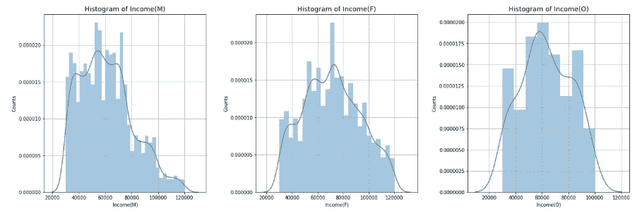

从上面的图表中，我们得出结论，男性和女性的最低和最高收入大致相同，但低收入水平的男性顾客数量略高于女性顾客。此外，其他人的收入分配也与男性和女性相似，最低和最高收入低于男性和女性。

c-抄本数据

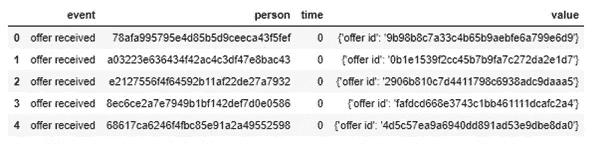

转录本的预处理如下进行:

*   在副本数据框中，将人物姓名更改为 customer_id。
*   从副本数据框架中删除年龄为 118 岁的客户的观察结果，因为我们发现年龄为 118 岁的客户是异常值。
*   创建仅包含优惠事件的数据框 offers_df 和仅包含交易事件的交易 _df。
*   清理和转换 offers_df 和 transaction_df 数据集。

首先，我们使用下面的函数清理数据集副本

```
**def** clean_trascript(transcript):

    *'''*
 *data cleaning the transcript dataframe*

 *INPUT:*
 *transcript - the transcript dataframe to be cleaned*

 *OUTPUT:*
 *transcript - the cleaned transcript dataframe*

 *'''*
    *# copy dataframe from transcript to clean_transcript*
    clean_transcript = transcript.copy()

    *# Change name of feature person to customer_id in transcript dataframe*
    clean_transcript.rename(columns={'person': 'customer_id'}, inplace=**True**)

    *# Remove observations having customers with age 118 from transcript dataframe*
    clean_transcript = clean_transcript[~clean_transcript['customer_id'].isin(id_age_118)]    

    **return** clean_transcript
```

在转录数据集上应用函数

```
clean_transcript=clean_trascript(transcript)
```

创建仅包含报价事件的数据帧 offers_df 和仅包含交易事件的交易 _df

```
*# Create a list of offer event types*
offer_event_list = ['offer received', 'offer viewed', 'offer completed']

*# Find index where feature 'event' is 'offer received', 'offer viewed', 'offer completed'*
offer_index = clean_transcript[clean_transcript['event'].isin(offer_event_list)].index

*# Find index where feature event is 'transaction'*
transaction_index = clean_transcript[~clean_transcript['event'].isin(offer_event_list)].index

*# Create offers_df*
offers_df = clean_transcript.loc[offer_index,:]

*# Create transaction_df*
transaction_df = clean_transcript.loc[transaction_index,:]
```

这些是我们的新桌子

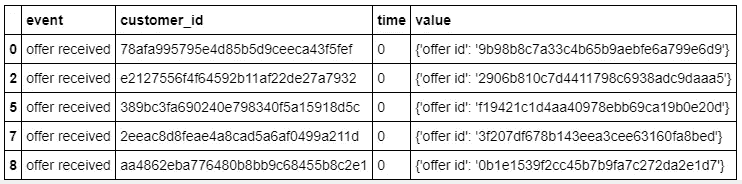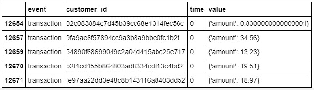

那些桌子似乎需要清洗一下

*   清洁报价 _df

```
*# Create another column 'offer_type' with respect to feature 'offer_id'*
offers_df['offer_type'] = offers_df['offer_id'].copy()

offers_df['offer_type'].replace(['ae264e3637204a6fb9bb56bc8210ddfd','4d5c57ea9a6940dd891ad53e9dbe8da0',\
                                 '9b98b8c7a33c4b65b9aebfe6a799e6d9','f19421c1d4aa40978ebb69ca19b0e20d'],\
                                 'bogo', inplace=**True**)

offers_df['offer_type'].replace(['0b1e1539f2cc45b7b9fa7c272da2e1d7','2298d6c36e964ae4a3e7e9706d1fb8c2',\
                                 'fafdcd668e3743c1bb461111dcafc2a4','2906b810c7d4411798c6938adc9daaa5'],\
                                 'discount', inplace=**True**)

offers_df['offer_type'].replace(['3f207df678b143eea3cee63160fa8bed','5a8bc65990b245e5a138643cd4eb9837'],\
                                 'informational', inplace=**True**)
*# Drop feature value as it is not required now and drop feature offer_type as that information is also in portfolio dataframe*
offers_df.drop(columns=['value', 'offer_type'], inplace=**True**)

*# OneHotEncoding feature 'event'*
offers_df = pd.get_dummies(offers_df, columns=['event'], prefix='', prefix_sep='')

*# Reorder columns of offers_df dataframe*
col_order = ['customer_id', 'offer_id', 'time', 'offer received', 'offer viewed', 'offer completed']
offers_df = offers_df.reindex(col_order, axis=1)
```

*   清理交易 _df

```
*# Create column 'amount' in the dataframe transaction_df*
transaction_df['amount'] = transaction_df['value'].apply(**lambda** x: x['amount'])*# Drop'event' and 'value' features*
transaction_df.drop(columns=['event', 'value'], inplace=**True**)
```

这些是生成的数据集的最终外观(offers_df 和 transaction_df):

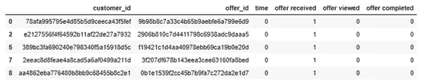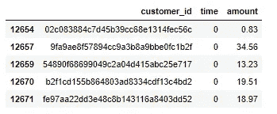

**2-组合数据集以获得包含相关特征的最终干净数据。**

下面的函数包括用于组合数据集 clean_portfolip、clean_profile、offers_df 和 transaction_df 的代码。

```
*# Create function to combine transaction, offer, portfolio and profile datasets*
**def** create_combined_data(portfolio, profile, offers_df, transaction_df):

    *'''Create a combined dataframe from the transaction, demographic and offer data:*
 *INPUT:*
 *portfolio - (dataframe),offer metadata*
 *profile - (dataframe),customer demographic data*
 *offers_df - (dataframe), offers data for customers*
 *transaction_df - (dataframe), transaction data for customers*
 *OUTPUT:*
 *combined_data_df - (dataframe),combined data from transaction, demographic and offer data*
 *'''*

    combined_data = [] *# Initialize empty list for combined data*
    customer_id_list = offers_df['customer_id'].unique().tolist() *# List of unique customers in offers_df*

    *# Iterate over each customer*
    **for** i,cust_id **in** enumerate(customer_id_list):

        *# select customer profile from profile data*
        cust_profile = clean_profile[clean_profile['customer_id'] == cust_id] 

        *# select offers associated with the customer from offers_df*
        cust_offers_data = offers_df[offers_df['customer_id'] == cust_id]

        *# select transactions associated with the customer from transactions_df*
        cust_transaction_df = transaction_df[transaction_df['customer_id'] == cust_id]

        *# select received, completed, viewed offer data from customer offers*
        offer_received_data  = cust_offers_data[cust_offers_data['offer received'] == 1]
        offer_viewed_data = cust_offers_data[cust_offers_data['offer viewed'] == 1]
        offer_completed_data = cust_offers_data[cust_offers_data['offer completed'] == 1]

        *# Iterate over each offer received by a customer*
        rows = [] *# Initialize empty list for a customer records*

        **for** off_id **in** offer_received_data['offer_id'].values.tolist():

            *# select duration of a particular offer_id*
            duration = clean_portfolio.loc[clean_portfolio['offer_id'] == off_id, 'duration'].values[0]

            *# select the time when offer was received*
            off_recd_time = offer_received_data.loc[offer_received_data['offer_id'] == off_id, 'time'].values[0]

            *# Calculate the time when the offer ends*
            off_end_time = off_recd_time + duration

            *#Initialize a boolean array that determines if the customer viewed an offer between offer period*
            offers_viewed = np.logical_and(offer_viewed_data['time'] >= off_recd_time,offer_viewed_data['time'] <= off_end_time)

            *# Check if the offer type is 'bogo' or 'discount'*
            **if** (clean_portfolio[clean_portfolio['offer_id'] == off_id]['bogo'].values[0] == 1 **or**\
                    clean_portfolio[clean_portfolio['offer_id'] == off_id]['discount'].values[0] == 1):

                *#Initialize a boolean array that determines if the customer completed an offer between offer period*
                offers_comp = np.logical_and(offer_completed_data ['time'] >= off_recd_time,\
                                                 offer_completed_data ['time'] <= off_end_time)

                *#Initialize a boolean array that selects customer transctions between offer period*
                cust_tran_within_period = cust_transaction_df[np.logical_and(cust_transaction_df['time'] >= off_recd_time,\
                                                                                 cust_transaction_df['time'] <= off_end_time)]

                *# Determine if the customer responded to an offer(bogo or discount) or not*
                cust_response = np.logical_and(offers_viewed.sum() > 0, offers_comp.sum() > 0) **and**\
                                                    (cust_tran_within_period['amount'].sum() >=\
                                                     clean_portfolio[clean_portfolio['offer_id'] == off_id]['difficulty'].values[0])

            *# Check if the offer type is 'informational'*
            **elif** clean_portfolio[clean_portfolio['offer_id'] == off_id]['informational'].values[0] == 1:

                *#Initialize a boolean array that determines if the customer made any transctions between offer period*
                cust_info_tran = np.logical_and(cust_transaction_df['time'] >= off_recd_time,\
                                                    cust_transaction_df['time'] <= off_end_time)                   

                *# Determine if the customer responded to an offer(informational) or not*
                cust_response = offers_viewed.sum() > 0 **and** cust_info_tran.sum() > 0                  

                *#Initialize a boolean array that selects customer transctions between offer period*
                cust_tran_within_period = cust_transaction_df[np.logical_and(cust_transaction_df['time'] >= off_recd_time,\
                                                                                 cust_transaction_df['time'] <= off_end_time)]

            *# Initialize a dictionary for a customer with required information for a particular offer*
            cust_rec = {'cust_response': int(cust_response),'time': off_recd_time,'total_amount': cust_tran_within_period['amount'].sum()}
            cust_rec.update(clean_profile[clean_profile['customer_id'] == cust_id].squeeze().to_dict())
            cust_rec.update(clean_portfolio[clean_portfolio['offer_id'] == off_id].squeeze().to_dict())

            *# Add the dictionary to list for combined_data*
            rows.append(cust_rec)

        *# Add the dictionaries from rows list to combined_data list*
        combined_data.extend(rows)

    *# Convert combined_data list to dataframe*
    combined_data_df = pd.DataFrame(combined_data)

    *# Reorder columns of combined_data_df*
    combined_data_df_col_order = ['customer_id', 'offer_id', 'time']

    port_ls = clean_portfolio.columns.tolist()
    port_ls.remove('offer_id')
    pro_ls = clean_profile.columns.tolist()
    pro_ls.remove('customer_id')
    combined_data_df_col_order.extend(port_ls)
    combined_data_df_col_order.extend(pro_ls)
    combined_data_df_col_order.extend(['total_amount', 'cust_response'])

    combined_data_df = combined_data_df.reindex(combined_data_df_col_order, axis=1)
    combined_data_df.to_csv('combined_data2.csv', index=**False**)
    **return** combined_data_df
```

以下是组合数据的特征:

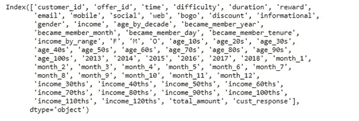

创建一个名为 offer_success 的数据框，其特征为 offer_id、count、success_pourcentage 和 offer_type，以建立出价之间的比较。

```
**def** calculate_percentage_success():

    *'''Create dataframe offer_success with features offer_id, success_pourcentage and offer_type*

 *OUTPUT:*
 *offer_response - (dataframe), with the features offer_id, success_pourcentage and offer_type*
 *'''*

    *#* 
    offer_response = combined_data_df.groupby(['offer_id'])['cust_response'].count().reset_index()
    offer_response.rename(columns={'cust_response': 'count'}, inplace=**True**)
    success_pourcentage = combined_data_df.groupby(['offer_id'])['cust_response'].sum()/\
                combined_data_df.groupby(['offer_id'])['cust_response'].count()
    np.round(success_pourcentage.values*100,2)
    offer_response['success_pourcentage'] = np.round(success_pourcentage.values*100,2)                                  
    offer_response['offer_type'] = offer_response['offer_id'].map({'ae264e3637204a6fb9bb56bc8210ddfd': 'bogo',\
                                                               '4d5c57ea9a6940dd891ad53e9dbe8da0': 'bogo',\
                                                               '3f207df678b143eea3cee63160fa8bed': 'informational',\
                                                               '9b98b8c7a33c4b65b9aebfe6a799e6d9': 'bogo',\
                                                               '0b1e1539f2cc45b7b9fa7c272da2e1d7': 'discount',\
                                                               '2298d6c36e964ae4a3e7e9706d1fb8c2': 'discount',\
                                                               'fafdcd668e3743c1bb461111dcafc2a4': 'discount',\
                                                               '5a8bc65990b245e5a138643cd4eb9837': 'informational',\
                                                               'f19421c1d4aa40978ebb69ca19b0e20d': 'bogo',\
                                                               '2906b810c7d4411798c6938adc9daaa5': 'discount'})

    offer_response=offer_response.sort_values(by=['success_pourcentage'], ascending=**False**)
    **return** offer_response
```

这是数据集 offer_success

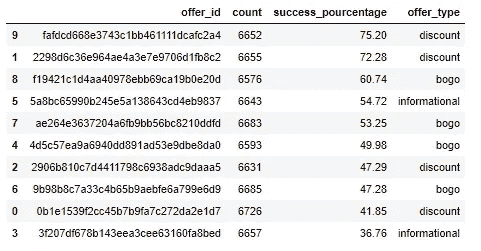

绘制两个条形图，一个到*显示了有多少客户获得了特定的报价，另一个显示了每次报价的成功率。*

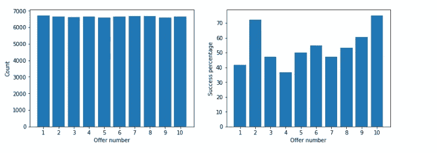

从上面显示的结果中，我们注意到发送给客户的报价数量几乎相同。
对于要约的成功率，我们观察到 10 号和 2 号要约最成功，成功率分别为 75.20%和 72.28%，最低的是 4 号要约，成功率为 36.76%。

*   获得准备好的数据集的最后一步是清除无用的要素。

```
*# Drop features from combined_data which are not required for training the model*
combined_data_df.drop(columns=['customer_id', 'offer_id', 'time', 'email','gender', 'income', 'age_by_decade','became_member_year',
'became_member_month', 'became_member_day','income_by_range'], inplace=**True**)
```

清洗后，我们得到上面的列:

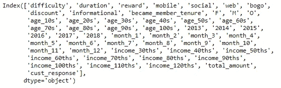

## **3-将数据分成训练和测试数据集/缩放特征**

我们使用的数据通常分为训练数据和测试数据。训练集包含一个已知的输出，模型学习这个数据，以便以后推广到其他数据。我们有测试数据集来测试我们的模型对这个子集的预测。

```
*# features : independece variables that act as the input of the model*
X = combined_data_df.drop(columns=['cust_response'])
*# target : the variable to predict* 
y = combined_data_df['cust_response'
*# split data into train and test sets*
X_train, X_test, y_train, y_test = train_test_split(X, y, test_size=0.3, random_state=42)
```

然后，我们继续进行特征缩放，这是一种使用最小最大缩放器来归一化独立变量范围或数据特征的方法。

准备要缩放的要素列表

```
*# Prepare list of features to scale*
features_to_scale = ['difficulty', 'duration', 'reward', 'became_member_tenure', 'total_amount']
```

然后是缩放要素的函数

```
**def** features_scale(df, feat=features_to_scale):

    *"""*
 *Scale list features in a given dataframe*

 *INPUT:*
 *- df (dataframe): dataframe having features to scale*
 *- feat (list): list of features in dataframe to scale*

 *OUTPUT:*
 *- scaled_df (dataframe): dataframe containing scaled features*
 *"""*

    *# Prepare dataframe with features to scale*
    df_feat_scale = df[feat]

    *# Apply feature scaling to df*
    scaler = MinMaxScaler()
    df_feat_scale = pd.DataFrame(scaler.fit_transform(df_feat_scale), columns = df_feat_scale.columns,index=df_feat_scale.index)

    *# Drop orignal features from df and add scaled features* 
    df = df.drop(columns=feat, axis=1)
    df_scaled = pd.concat([df, df_feat_scale], axis=1)

    **return** df_scaled
```

将函数应用于要素

```
*# Scale selected features in training set i.e. X_train*
X_train_scaled = features_scale(X_train, feat=features_to_scale)
```

计算目标类在训练集中的分布百分比

```
round((y_train.squeeze().value_counts()/y_train.squeeze().count())*100,2)
```

输出

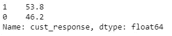

从上面显示的结果中，我们可以观察到我们的训练数据集几乎是平衡的，响应报价的客户数量(53.8%)和未响应报价的客户数量(46.2%)几乎相等。因为，我们的训练数据集几乎是平衡的，我们不需要处理技术来对抗类别不平衡。

## 4-选择适当的绩效矩阵

我们发现，我们的训练数据在目标类的分布方面几乎是平衡的，精度、召回率和 f1_score 等性能指标是评估模型的完美度量。F1 得分指标是“精确度和召回率指标的调和平均值”,是一种更好的方法，可以提供更强的问题预测能力以及预测模型的预测能力。

## 5-使用 GridSearch 训练分类器并选择最佳估计器

下面的函数将使用 k-fold 交叉验证来拟合分类器，并计算 f1 值

```
**def** fit_classifier(clf, param_grid, X=X_train_scaled.values, y=y_train.squeeze().values):

    *"""*
 *Fits a classifier to its training data using GridSearchCV and calculates f1_score*

 *INPUT:*
 *- clf (classifier): classifier to fit*
 *- param_grid (dict): classifier parameters used with GridSearchCV*
 *- X_train_scaled (DataFrame): training features*
 *- y_train (DataFrame): training label*

 *OUTPUT:*
 *- classifier: input classifier fitted to the training data*
 *"""*

    *# cv uses StratifiedKFold*
    *# scoring f1 available as parameter*
    start = time.time()
    grid = GridSearchCV(estimator=clf, param_grid=param_grid, scoring='f1', cv=5, verbose=0)
    print("Training **{}** :".format(clf.__class__.__name__))
    grid.fit(X, y)
    end = time.time()
    time_taken = round(end-start,2)

    print(clf.__class__.__name__)
    print("Time taken : **{}** secs".format(time_taken))
    print("Best f1_score : **{}**".format(round(grid.best_score_,4)))
    print("*"*40)

    **return** grid.best_score_, grid.best_estimator_, time_taken
```

初始化分类算法

```
lr = LogisticRegression(random_state=42) *# LogisticRegression*
rfc = RandomForestClassifier(random_state=42) *# RandomForestClassifier*
gbc = GradientBoostingClassifier(random_state=42) *# GradientBoostingClassifier*
abc = AdaBoostClassifier(random_state=42) *# AdaBoostClassifier*
```

寻找最佳分类算法

```
cl_names = []
cl_scores = []
cl_best_ests = []
cl_time_taken = []
cl_dict = {}

**for** classifier **in** [lr, rfc, abc, gbc]:
    best_score, best_est, time_taken = fit_classifier(classifier, {})
    cl_names.append(classifier.__class__.__name__)
    cl_scores.append(best_score)
    cl_best_ests.append(best_est)
    cl_time_taken.append(time_taken)
```

输出

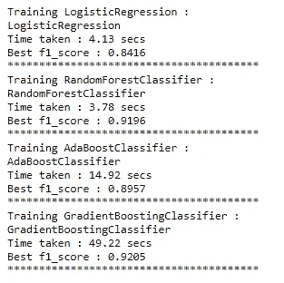

RandomForestClassifier 和 GradientBoostingClassifier 的 f1_score 几乎相等(大约。0.92)，但 RandomForestClassifier 比 GradientBoostingClassifier 花费的训练时间要少得多。因此，上述 4 种分类器中性能最好的分类器算法是 RandomForestClassifier。

*   然后，我们可以借助 GridSearchCV 中的 param 网格来调整 RandomForestClassifier 分类器。

```
*# Tuninig RandomForestClassifier classifier with the help of param grid in GridSearchCV*
param_grid = {
               *# Number of trees in random forest*
              'n_estimators': [10, 50, 80, 100],
               *# Maximum number of levels in tree*
              'max_depth': [**None**],
               *# Minimum number of samples required to split a node*
              'min_samples_split': [2, 5, 10],
               *# Minimum number of samples required at each leaf node*
              'min_samples_leaf': [1, 2, 4]}

rfc = RandomForestClassifier(random_state=42)
rfc_best_score, rfc_best_est, _ = fit_classifier(rfc, param_grid)
rfc_best_est
```

调整后，我们获得了以下结果:

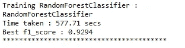

为了选择要调整的超参数，我们进行了彻底的网格搜索，它接受许多超参数，并尝试超参数的每一个可能的组合以及我们希望它执行的许多交叉验证(这里我们选择 cv=5)。彻底的网格搜索是确定要使用的最佳超参数值的好方法，但是随着我们添加每个额外的参数值和交叉验证，它会很快变得非常耗时。

我们选择调整的参数是:min_samples_leaf、min_samples_split、n_estimators、max_depth。在调整之前，这些参数的值是 max_depth=None，min_samples_leaf=1，min_samples_split=2，n_estimators=10。

上面显示的代码运行了 20 多分钟，但选择的超参数在预测训练模型时有 92.94%的准确性。得到的“最佳”超参数如下:min_samples_leaf = 1，min_samples_split = 2，n_estimators = 100，max_depth=None。

仔细而有条理地调整超参数可能是有利的。它可以使我们的分类模型更准确，这将导致总体上更准确的预测。

我们注意到，在对训练好的 RandomForestClassifier 进行微调之后，我们得到了更好的 f1 _ score 0.9294，而在调整之前它是 0.9196，因此我们可以观察进度。

## 6-计算最佳估计值给出的特性重要性

通过 RandomForestClassifier 准备包含要素及其重要性的数据框

```
feature_imp = pd.DataFrame(rfc_best_est.feature_importances_,index=X_train_scaled.columns.tolist(),columns=['feat_imp']).reset_index()

feature_imp.rename(columns={'index': 'feature'}, inplace=**True**)
feature_imp['feat_imp_rate'] = np.round((feature_imp['feat_imp']/feature_imp['feat_imp'].sum())*100,2)
feature_imp = feature_imp.sort_values(by=['feat_imp_rate'], ascending=**False**).reset_index(drop=**True**)
feature_imp.drop(columns=['feat_imp'],inplace=**True**)
feature_imp
```

绘制*特征及其重要性的条形图*

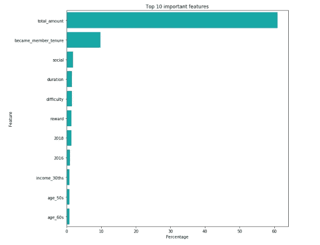

从上面显示的结果中，我们注意到:

影响客户在查看报价后是否会对报价做出回应的 4 大特征是:

*   客户花费的总金额是最重要的特征，它几乎不会影响客户在查看报价后是否会完成报价。
*   “成为会员任期”是第二大特征，它代表了顾客成为星巴克奖励计划会员的时间长短，对顾客是否会在回应后完成报价有很大影响。
*   “社交功能”表示，如果星巴克通过社交媒体向顾客发送报价，可能会比其他沟通方式得到更多回应。
*   “难度”特征，表示如果客户响应并完成报价，完成报价所需的最小花费金额。

## 7-使用测试数据计算模型的性能，并绘制混淆矩阵

*   计算预测

```
*# Classification of test data using best model trained on train data*
predictions = rfc_best_est.predict(X_test_scaled)
```

*   绘制归一化混淆矩阵

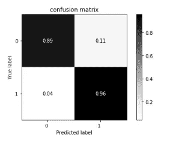

结果表明，有 4%的百分比错误分类客户接受要约和 11%的错误分类客户拒绝要约。由于假阴性比假阳性少，我们的预测模型做得很好，因为它错过会响应的个体的机会非常低。

由于 Starbucks 不希望错过向愿意回应的个人发送报价，因此该模型适合这种情况，因为它不会错过向愿意回应的个人发送报价。此外，星巴克不会介意向一些不会回复的人发送报价，因为他们已经覆盖了所有会回复的人。因此，我们的预测模型在这种情况下会工作得很好。

# 结论

我选择解决的问题是建立一个模型来预测客户是否会对报价做出反应。我解决这个问题的策略主要有三个步骤。首先，在预处理投资组合、配置文件和交易数据集之后，我将它们组合起来，以获得包含相关特征的最终干净数据，该数据可用于训练我们的模型。其次，在分割数据以训练和测试数据集之后，我们使用 GridSearch 选择了最佳估计器“RandomForestClassifier ”,这是上述 4 个测试的分类器中性能最好的分类器算法(我比较了 F1 分数和所用时间)。第三，我使用测试数据预测测试目标，并绘制混淆矩阵以确保我们的模型的性能，我们发现我们的预测模型非常适合这种情况。

我喜欢在这个项目中工作，这让我可以在一个真实的项目中工作。这个项目最有趣的方面是结合不同的数据集，并使用预测建模技术和分析来为业务提供更好的决策和价值。争吵是最长也是最具挑战性的部分。整个分析中最困难的部分是找到逻辑和策略来创建一个组合数据集，并决定问题陈述。

# 丰富

*   如果有更多的客户指标，可能会有更好的预测。对于这一分析，我觉得我们所掌握的客户信息有限，只有年龄、性别和收入。为了找到最佳的客户统计数据，最好能有更多的客户特征。这些附加特征可以帮助提供更好的分类模型结果数据，以便具有更好的模型。
*   此外，最初看起来我们有很多数据要处理，但是一旦删除了 NaN 值和重复的列，并将数据合并到一个单独的数据集中，就好像模型可能会从更多的数据中受益。有了更多的数据，分类模型可能已经能够产生更好的 F1 分数结果。
*   另外，我们可以通过另一个问题陈述来改进这个项目，我们可以建立一个模型来预测哪些人口统计群体会购买，即使他们没有收到报价。

请注意，文章讨论的是分析的重要代码，你可以在这里找到星巴克顶点挑战项目[的完整代码。](https://github.com/LailaSabar/Starbucks-Capstone-Challenge)