# 使用 CatBoost 和散景的星巴克顾客特征分析

> 原文：<https://towardsdatascience.com/starbucks-customer-classification-using-catboost-c3026d1785d7?source=collection_archive---------20----------------------->

## [多类](/machine-learning-multiclass-classification-with-imbalanced-data-set-29f6a177c1a) | [活页夹](https://mybinder.org/v2/gh/hardik101/dsnd-capstone-project/master)

## 使用客户旅程和多类分类的解决方案


[TR](https://unsplash.com/@trance?utm_source=unsplash&utm_medium=referral&utm_content=creditCopyText) 在 [Unsplash](https://unsplash.com/s/photos/starbucks?utm_source=unsplash&utm_medium=referral&utm_content=creditCopyText) 上拍照

# 介绍

在这篇文章中，我探索了由 [Starbucks](https://www.starbucks.com/) 与 [Udacity](https://www.udacity.com/) 合作提供的客户数据，以了解客户在潜在回报方面的行为。星巴克的移动应用程序向其顾客发送不同种类的激励优惠，以保持他们对该品牌的参与。

这篇文章的动机是讨论一种用来分析预测客户响应的数据和机器学习解决方案的解决方案。

我使用机器学习库 [CatBoost](https://catboost.ai/) 来解决多类分类问题，并使用[散景](https://docs.bokeh.org/en/latest/index.html)作为主要的可视化工具。

该项目的 GitHub Repo 可以在[这里](https://github.com/hardik101/dsnd-capstone-project)找到。

# 1.概观

> 该数据集包含模拟星巴克奖励移动应用程序上的客户行为的模拟数据。每隔几天，星巴克就会向手机应用程序的用户发出一次报价。优惠可以仅仅是饮料的广告，也可以是实际的优惠，例如折扣或 BOGO(买一送一)。某些用户可能在特定的几周内收不到任何优惠。
> 
> 在要约到期之前，每个要约都有一个有效期。例如，BOGO 的报价可能只有五天的有效期。你会在数据集中看到，信息优惠有一个有效期，即使这些广告仅仅是提供关于产品的信息；例如，如果信息性报价有七天的有效期，您可以假设客户在收到广告后的七天内感受到了报价的影响。

*【项目概述摘自 Udacity 的顶点项目* [*数据科学纳米学位项目*](https://blog.udacity.com/2018/05/introducing-udacity-data-scientist-nanodegree-program.html)*】*

**数据集**

数据包含在三个文件中:

*portfolio.json —包含要约 id 和关于每个要约的元数据(持续时间、类型)*

*profile.json —每个客户的人口统计数据*

*抄本. json —交易记录、收到的报价、查看的报价和完成的报价*

# 2.问题陈述

目的是分析单个客户的行为，以识别不寻常的模式。这种分析的发现应该有助于星巴克企业根据具体结果重新评估其奖励计划。

我旨在针对以下业务问题提供分析:

*   我们可以根据客户的响应能力对他们进行分类吗？
*   我们能否识别不关心奖励计划的高收入客户？
*   我们能否确定过去没有任何交易的客户？
*   我们能否可视化客户与优惠和消费活动的互动，以获得有趣的见解？

# 3.解决方案概念

*   有三个不同的数据集，我逐一研究并识别任何问题，如缺失信息、额外/冗余信息、其他不一致。我通过在必要时充分利用视觉化来实现这一点。在这一步的最后，我有了一个干净的数据集，可以做进一步的探索。
*   我将所有三个数据集合并成一个数据集，并通过高级可视化进行进一步分析。基于此，我构建了一个分类问题，通过一些机器学习算法来解决。
*   我选择了 CatBoost 算法，一种多类分类算法。它自动识别高度相关的特征之间的关系，并带有内置的可视化功能。使用它训练和评估模型是简单的。使用默认参数的最终结果通常会更好，因为 CatBoots 在内部使用水平决策树。由于我们正在处理分类问题，并且错误分类的错误不会导致任何不利影响，在这种情况下，模型准确性应该是我们的标准评估标准，包括混淆矩阵。
*   最后，我对整体分析的结果进行评估，包括机器学习模型的评估。

# 4.数据探索和基本可视化

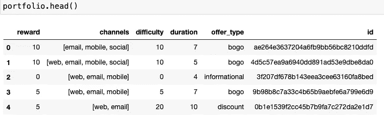

投资组合数据集预览

*   通过查看“通道”列，将每个通道值分解到单独的列中并使用 0|1 标识符对其进行编码是有意义的。
*   让我们为“offer_type”列创建虚拟列，对其进行编码，并删除原来的列，因为我们不再需要它。

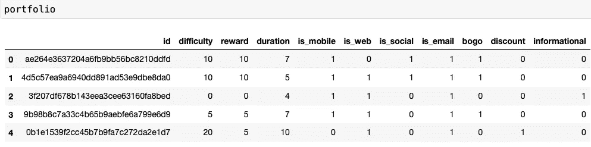

清理后的投资组合数据集

在这里，每个报价总是通过“电子邮件”渠道发送。因此，该特征仅提供信息，并且可能不会给任何机器学习算法的预测能力增加任何价值。

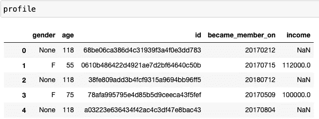

配置文件数据集预览

显然,“年龄”值 118 是缺失值的占位符。进一步的分析显示，性别、年龄和收入栏总共有 2175 个缺失条目。

“成为会员”列是一个带有时间戳的日期，让我们将其转换为可读性更好的格式，并提取自客户注册以来的天数。

让我们创建一些可视化工具来分析人口统计数据

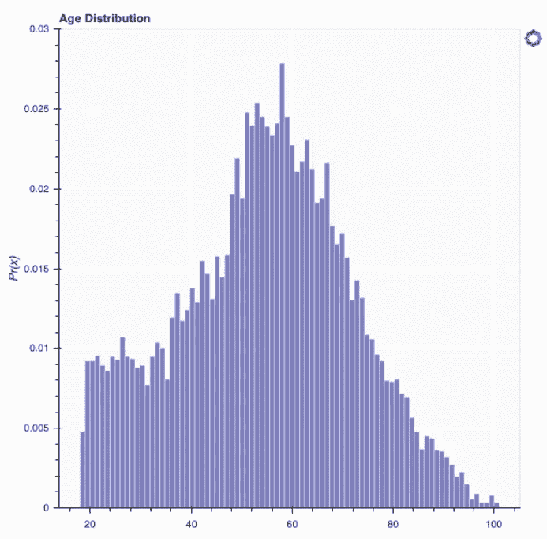

顾客年龄分布

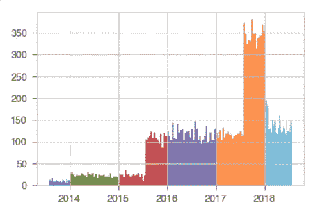

按年份统计的客户注册数

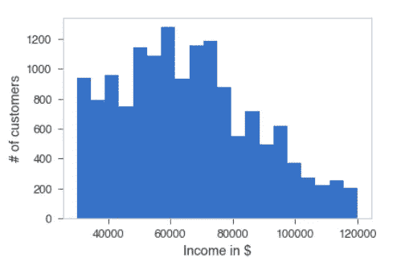

客户收入分配

左图显示了这些年来客户数量的稳步增长。然而，在 2017 年底有一个陡峭的下降。这也可能是由于准备数据集的采样。

令人惊讶的是，属于相对较低收入群体的客户很多，属于相对较高收入群体的客户很少。

配对图显示，女性客户不多，女性群体年龄相对较大，收入较高。


人口统计数据对图表

**具体观察结果**

*   年龄组[20，30]中没有收入高于 80K 的客户。
*   在[40，50]年龄组中，没有收入高于 10 万英镑的客户。
*   所有 2000 多天前成为会员的客户收入都低于 10 万。


成绩单数据集预览

快速查看一下脚本数据集，就会发现“value”列被编码为一个字典。如果事件与报价相关，则“值”列编码报价 id，如果是交易事件，则编码交易金额。

因此，将“价值”列解码为单独的列，以了解优惠和客户花费的金额之间的关系是有意义的。

# 5.数据预处理和高级可视化

首先要计算完成的总报价数和每个客户查看的总报价数。
这些数据包括客户有意或无意的“完成的报价”。不应向不知情已完成报价的客户发送进一步的报价。这个群体代表了公司的盈利客户。

我们将我们的成绩单数据集与客户人口统计数据(个人资料)和投资组合数据相结合。

在应用于联合数据集的几个预处理步骤之后，

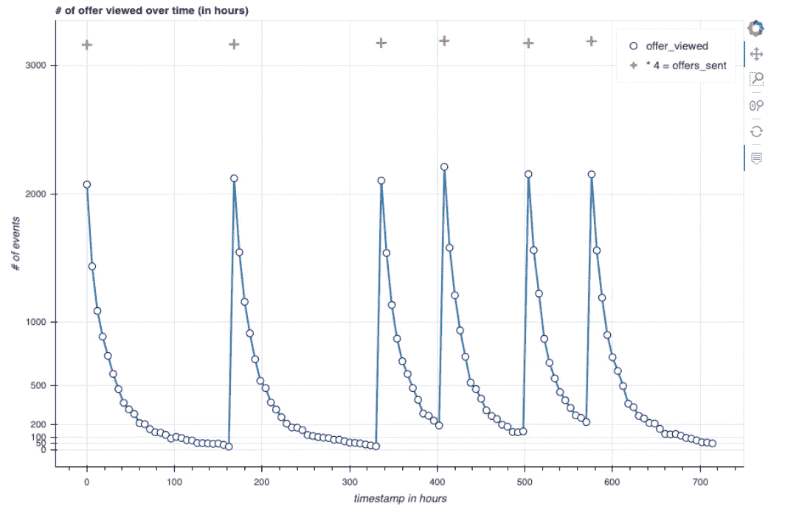

按时间线查看的出价数([0–714])

上图显示了根据时间戳查看的报价数量(以小时为单位)。在六个峰值中，浏览报价的数量急剧增加。

我已经在图表中嵌入了收到的报价数(正确的收到报价数是标记数的四倍)。当收到新的报价时，已查看报价的数量会增加，然后随着时间的推移慢慢减少。一般来说，大多数优惠都是在收到后 24 小时内查看的。

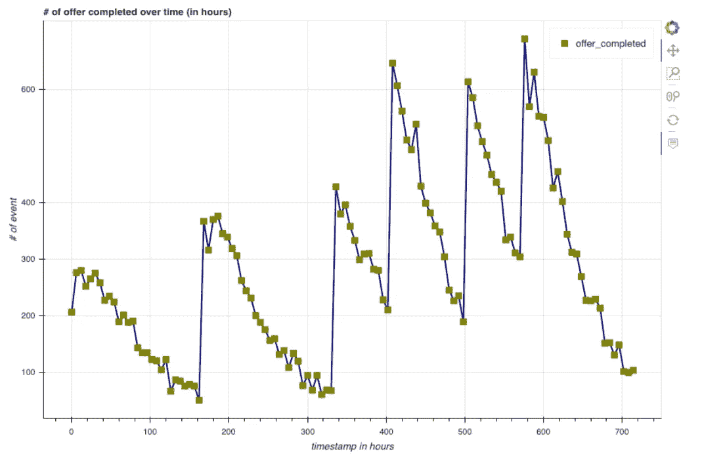

根据时间表完成的出价数([0–714])

上图显示了以小时为单位的时间戳中已完成的报价数量。它遵循与之前图表相似的模式，因为新报价在 24 天内发送了 6 次，因此图表有 6 个峰值。

在每个峰值之间，图表逐渐减小，就像查看报价图表一样。然而，下降并不像查看报价图那样平稳。下跌期间有一些地方选股。

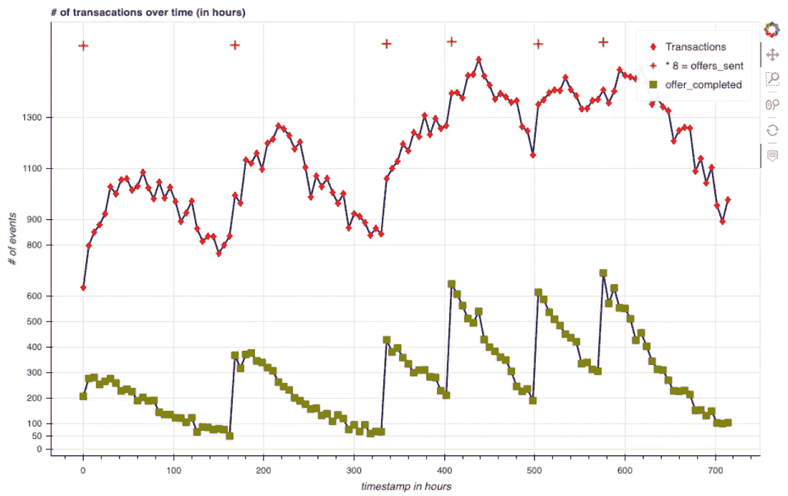

显示交易数量和按时间表完成的报价的联合图表

上面的图表结合了一些交易和报价一起完成。在交易的每个“报价发送间隔”之间有一个局部峰值。这意味着当收到报价时，客户会快速执行一些交易，从而完成报价。

在时间戳 0 处，存在大约 600 个事务。其中大约 200 个有助于“要约完成”(时间戳为 0 时完成的要约数量)，这大约是 25%的转化率。这个数字与已完成要约总数与交易总数的比值=> 138953/33579)*100 = 24.16%大致吻合。

存在一些高价值交易(100 美元以上)。这可能是个人为特殊活动或公司客户的大订单。这样的高价值交易导致与客户相关联的所有当前报价被完成。

在现实中，这些交易并没有完成要约的动机，因此应被视为副作用。向如此高收入的客户发出报价不会导致他们购买行为的增加或减少。因此，我们应该从数据集中删除这样的高价值交易。

接下来，我们还应该找出并清除不响应的客户。我定义无响应客户=未收到报价、未查看+未达成交易。

在一些进一步的预处理步骤之后，我发现有 422 个客户没有进行交易。其中，412 人收到并查看了报价，10 人收到但未查看任何报价。

同样，在分析交易金额时，收集了以下观察结果:

*   有些交易超过 1000 美元。
*   范围[0.05，50]内的事务比该范围内的其他事务多得多。
*   任何超过 50 美元的交易都可以被视为高价值交易，不一定有动机完成报价。

# 6.通过客户之旅进行特征工程

在本节中，我们将通过一些高级的可视化方式来了解顾客与产品的互动。基于此，我定义了一些计算特征。

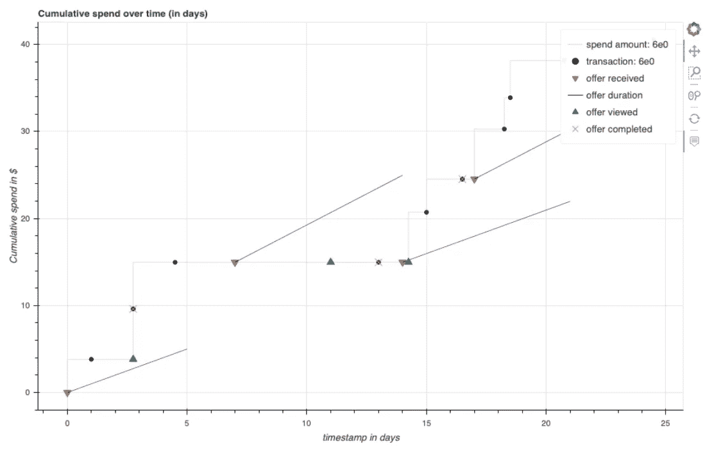

客户旅程(id:“6 E0”)

在上面的图表中，我们有一个客户，他/她已经完成了发送给他/她的所有报价。如果这些交易的价值较低，通常需要一次以上的交易才能完成要约。

有时，客户会立即查看报价，而有时，他/她会在稍后时间查看。

在完成的 4 个报价中，只有 1 个(最后完成的)未被客户查看。

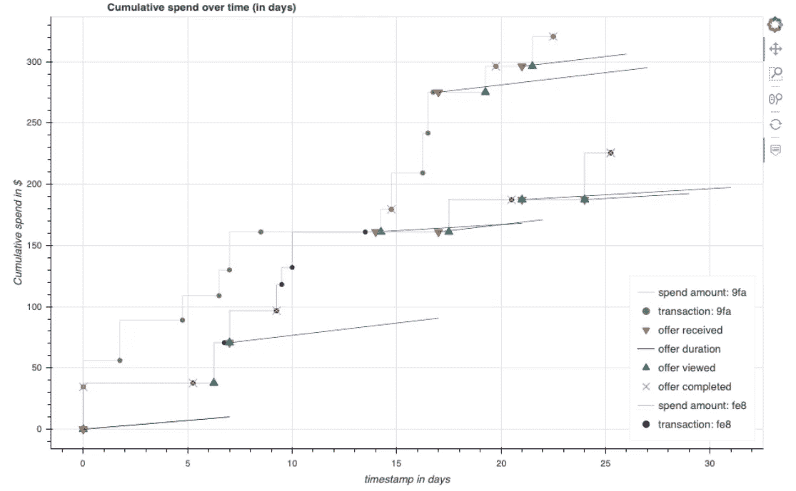

两位高价值客户的并肩之旅

在这里，我们有两个高付费客户并排完成了所有收到的报价。

有趣的是，对于客户“9fa ”,在完成第一次报价后，他/她已经进行了五次交易，总计约 75 美元，没有任何待完成的报价。它表明，这些交易没有动机完成报价，并显示客户在没有任何报价的情况下的消费倾向。

**基于以上分析我推导出以下自定义特性**
1。给定客户完成报价的百分比
2。给定客户完成的报价绝对计数
3。给定客户查看的优惠的百分比
4。给定客户查看的优惠的绝对数量
5。给定客户的总消费金额

# 7.模型训练+评估

**注意事项:**

我们的问题属于多类分类的范畴。多类分类问题可以总结如下:

给定一个数据集，该数据集具有𝑥𝑖和𝑁类的实例，其中每个𝑥𝑖实例都精确地属于一个类，𝑦𝑖是多类分类器的目标问题。
在训练和测试之后，对于测试集中的每个实例𝑥𝑖，我们有一个具有正确类别𝑦𝑖和预测类别𝑎𝑖的表。因此，对于每个实例，我们要么匹配(𝑦𝑖=𝑎𝑖),要么不匹配(𝑦𝑖≠𝑎𝑖).
然而，F1-score 也可以用于多类问题的评估。

**由于在我们的案例中，错误分类的成本并不高(向没有响应的客户发送报价不会给公司带来额外的成本)，因此 F1-分数是不必要的。**

> *在这个项目中，我更喜欢使用混淆矩阵和平均分作为我们的评估指标。* ***混淆矩阵:*** *一个混淆矩阵显示了实际和预测类的组合。矩阵的每一行代表预测类中的实例，而每一列代表实际类中的实例。这是一个很好的方法来衡量模型是否能解释类属性的重叠，并理解哪些类最容易混淆。*
> 
> **准确率:**
> 分类正确的项目总数百分比- (TP+TN)/(N+P)
> *TP:真正
> TN:真负
> N:负
> P:正*

*对于不平衡的类分布，我已经给每个类标签提供了权重，CatBoost 自动处理。*

我已经创建了一个自定义目标标签来表示客户的响应能力。

对于二元分类，它将简单地根据完成的报价百分比对客户进行分类。如果报价完成百分比> 50 %，则客户属于“响应型”客户。否则，它属于“无响应”类。

稍后，我将问题扩展到多类分类。为此，我创建了 3 级、4 级和 5 级标签，将完成的报价百分比分配给特定的类别，并为每个类别分配适当的标签。

对于 5 类问题，标签编码如下:

> 编码= {
> 
> '响应':4，
> '非常响应':0，
> '中等响应':3，
> '非常响应':2，
> '无响应':1

# **模型评估策略**

**1。超参数固定值的模型评估(基础模型)**

我在所有分类问题(class_2，class_3，class_4，class_5)上使用以下固定超参数评估 CatBoost 分类器

> *迭代次数= 2000*
> 
> *loss _ function =[' multi class ']*
> 
> *早停轮数= 50*
> 
> *eval_metric = 'Accuracy'*

其余参数值默认由 CatBoost 分类器提供。

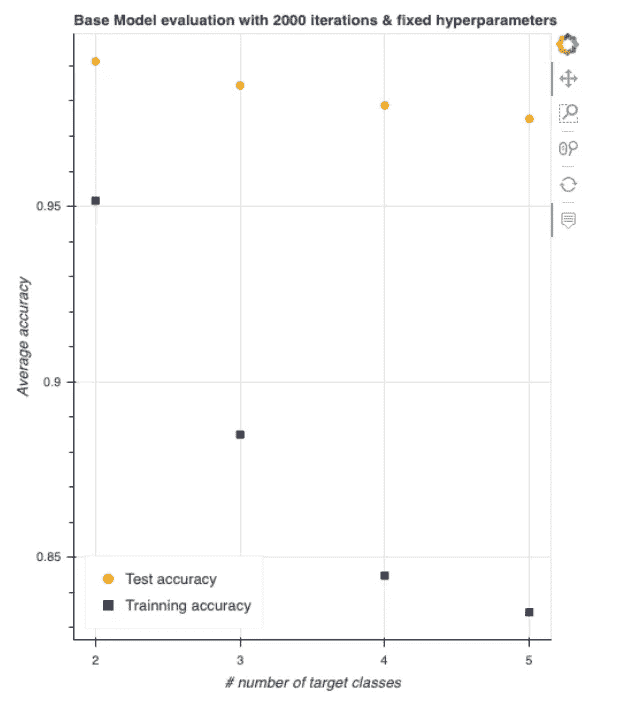

使用固定超参数的基本模型评估

**2。使用 GridSearch 找到的超参数进行模型评估(调整模型)**

在这一轮实验中，我编写了一个定制的 GridSearch 函数，它为每个给定的超参数范围找到最佳值，并返回训练数据上平均精度最佳的模型超参数。

对于 CatBoost Multiclassifier，有许多超参数需要优化。可在[此处](https://catboost.ai/docs/concepts/parameter-tuning.html)找到详细列表:

我只选择了以下具有指定范围的超参数(通过在 CatBoost 网站和 Kaggle 上的一些研究找到)，以找到具有最佳性能的模型。

```
- iterations = [1000,3000]
- loss_function =  ['Logloss','MultiClass','MultiClassOneVsAll']
- depth = [4,6,8]      
- early_stopping_rounds = [10, 20, 50]
```

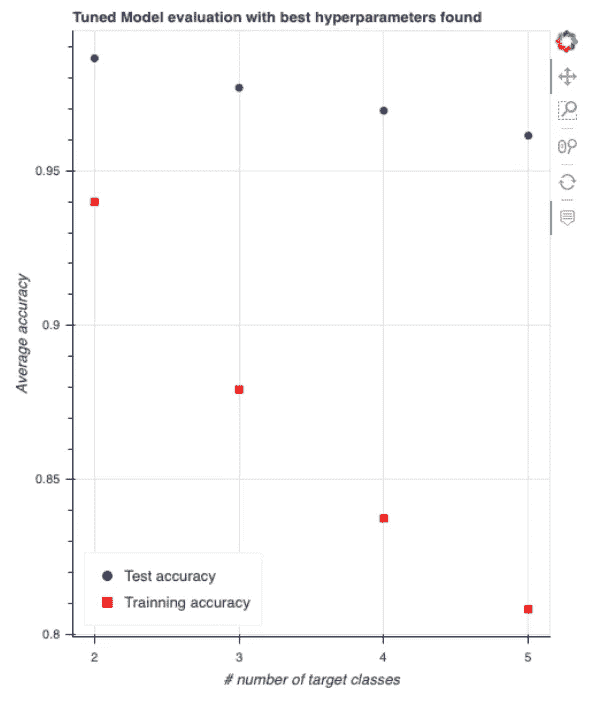

使用 GridSearch 的最佳发现超参数模型评估

# 8.结论+反思

*   我评估了四个多类分类模型并记录了结果。似乎训练精度是模型性能的可靠指标，而不是测试精度。

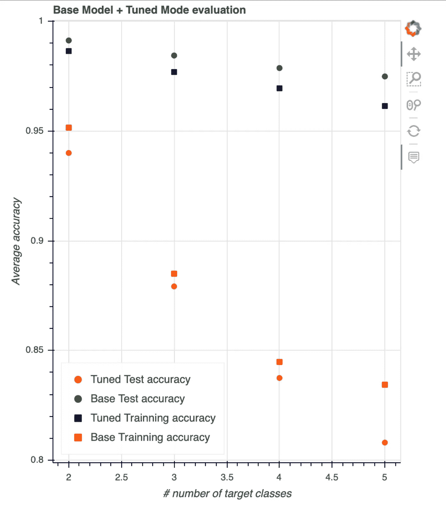

综合两种评估

*   这表明基本模型实际上比通过 GridSearch 找到参数的模型表现得更好。这可能是因为范围选择没有优化。在未来的工作中，使用 RadomizedGridSearch 评估模型可能会很有趣。
*   向 GridSearch 提供太多的参数会导致搜索非常慢(一个模型需要 7 个多小时)，因此我缩小了参数范围，然后平均花费 20 分钟来搜索最佳参数。
*   最初，我面临一些清理事务和确定如何使用事务数据进行数据建模的挑战。关键的洞见是识别出同一时间线与不同事件相关。这让我能够绘制一些伟大的客户旅程可视化和随后的定制功能创建。
*   总的来说，我觉得参与这个项目很令人兴奋。我学到了很多关于数据分析的东西，特别是使用散景的数据可视化。
*   使用 CatBoost 创建一个模型需要一些初步的尝试和错误。尽管我没有改变很多默认参数，但结果非常好。部分原因是因为我在训练集中包括了像“查看的报价数量”这样的功能，这是报价完成率的一个很好的指标，基于此，我对目标类进行了编码。

**未来细化**

*   我建议尝试自定义分类特征来训练模型。
*   此外，从数据集中移除一些自定义要素并评估模型也会很有趣。
*   关于特征工程，可以开发关于顾客在查看报价之前已经花费多少的特征。

非常感谢您阅读这篇文章。如果你对该项目的更多细节感兴趣，请点击查看项目资源库[。](https://github.com/hardik101/dsnd-capstone-project)