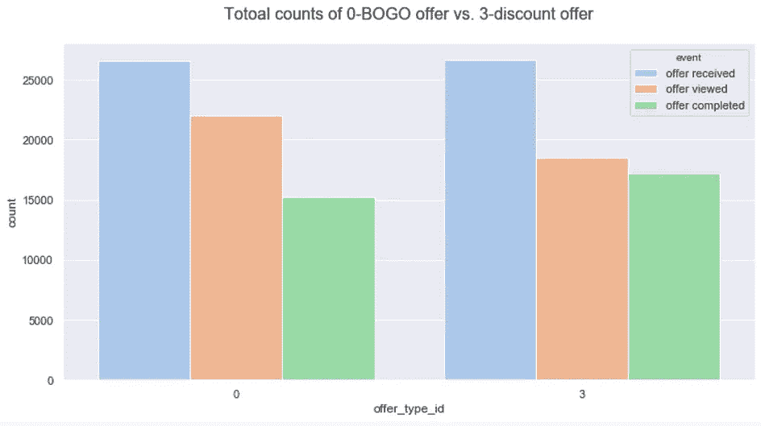
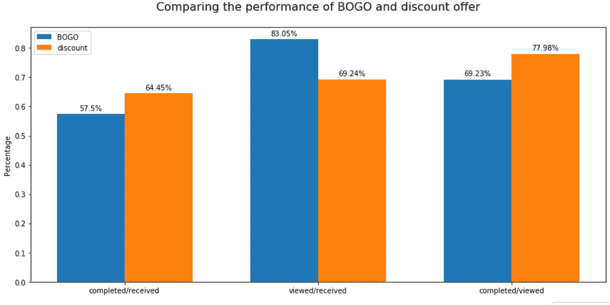

# 星巴克优惠数据集——uda city 顶点

> 原文：<https://towardsdatascience.com/starbucks-offer-dataset-udacity-capstone-7b562843ff47?source=collection_archive---------15----------------------->

## [实践教程](https://towardsdatascience.com/tagged/hands-on-tutorials)

## 对“浪费要约”的调查


由[卡尔·弗雷德里克森](https://unsplash.com/@kfred?utm_source=medium&utm_medium=referral)在 [Unsplash](https://unsplash.com?utm_source=medium&utm_medium=referral) 上拍摄

## 介绍

Starbucks Offer Dataset 是学生可以从中选择的数据集之一，以完成他们的 Udacity 数据科学纳米学位的顶点项目。该数据集包含模拟数据，模拟顾客收到星巴克报价后的行为。这些数据是通过星巴克奖励移动应用程序收集的，优惠每隔几天就会发送给移动应用程序的用户。

数据文件包含 3 个不同的 JSON 文件。

```
*File descriptions provided by Udacity*portfolio.json — containing offer ids and meta data about each offer (duration, type, etc.)profile.json — demographic data for each customertranscript.json — records for transactions, offers received, offers viewed, and offers completed
```

有 3 种不同类型的优惠:买一送一(BOGO)，折扣，和信息意味着纯粹的广告。然而，对于每种类型的优惠，优惠期限、困难或促销渠道可能会有所不同。该数据集包含大约 300，000+个模拟事务。

这个项目的目标不是由 Udacity 定义的。因此，它是开放式的。尽管如此，从为星巴克提供商业价值的角度来看，问题总是要么:我们如何增加销售额，要么我们如何省钱。如何省钱的问题不是不花钱，而是不把钱花在无效的事情上。

从这两个角度来看，都有很多值得探索的东西。Udacity 给出的一个警告引起了我的注意。它警告我们，一些优惠在用户不知情的情况下被使用，因为用户不会加入这些优惠；报价已经给出。因此，如果一些用户不管有没有优惠都会在星巴克消费，我们还不如保存这些优惠。

我觉得这是个有趣的问题。我决定对此进行调查。我想看看我是否能找出这些用户是谁，我们是否能避免或尽量减少这种情况的发生。在下面的文章中，我将介绍我是如何研究这个问题的。我将遵循 CRISP-DM 流程。如果你不熟悉这个概念。这是我写给你的一篇文章。

[](/2-crucial-things-that-data-science-online-courses-didnt-teach-you-2da0ae3267bd) [## 数据科学在线课程没有教给你的两件重要事情

### 如果你的数据科学在线课程大纲看起来像…

towardsdatascience.com](/2-crucial-things-that-data-science-online-courses-didnt-teach-you-2da0ae3267bd) 

## 业务理解和数据理解

我们先来看看数据。从数据集来看，很明显，我们需要组合所有三个数据集，以便执行任何分析。此外，数据集需要大量清理，主要是因为我们有许多分类变量。

下面是我希望在分析结束时解决的五个业务问题。前三个问题是为了对数据集有一个全面的了解。最后两个问题直接解决了我想调查的关键业务问题。

*   Q1:哪个是最受欢迎的提议？
*   Q2:不同的人群对报价有不同的反应吗？
*   问题 3:人们通常会查看并使用优惠吗？还是他们在没有注意到的情况下使用了报价？
*   Q4:如果存在这样一个群体，那么哪一类人更有可能在没有查看报价的情况下使用报价或进行购买？
*   Q5:如果有，哪种类型的优惠更有可能在不被查看的情况下被使用？

在我摆弄了一下数据之后，我还决定在这个分析中只关注 BOGO 和折扣优惠，主要有两个原因。一是因为我相信 BOGO 和折扣优惠与信息性优惠/广告有着不同的商业逻辑。对于 BOGO 和折扣优惠，我们希望找出不知情的人，这样我们就不会白花钱。对于这个广告，我们想确定哪一组人被鼓励花更多的钱。换句话说，一个逻辑是确定损失，而另一个是衡量增长。

另一个原因和第一个原因联系在一起，就是关于范围的问题。由于不同的业务逻辑，我想把这个分析的范围限制在只回答这个问题:谁是“浪费”我们的产品的用户，我们如何避免它。因此，我没有分析信息提供类型。

## 成功指标及其合理性

重复一遍，我想要解决的商业问题是调查用户在没有观看我们的产品的情况下使用它的现象。换句话说，优惠没有起到刺激消费的作用，因此被浪费了。因此，关键的成功标准是我是否能识别出这群用户以及这种行为背后的原因。此外，如果我可以建立一个机器学习模型来预测这种情况何时可能发生，这将是有帮助的。在这种情况下，该公司将处于一个更好的位置，不会浪费这个机会。

明确地说，关键的成功标准是我是否对上面列出的所有问题都有明确的答案。因为能够回答这些问题意味着我可以清楚地识别出有这种行为的用户群，并对原因进行一些教育猜测。

对于机器学习模型，我重点以交叉验证准确率和混淆矩阵作为评价。准确性分数很重要，因为我的模型的目的是帮助公司预测何时要约可能会被浪费。所以精度越高越好。

当然，当数据集高度不平衡时，准确度分数不会是实际准确度的良好指标，精确度分数、f1 分数或混淆矩阵会更好。然而，在这种情况下，不平衡的数据集不是一个大问题。两个虚拟模型，其中一个使用随机猜测的方法，另一个使用全部选择多数的方法，一个具有 51%的准确度分数，另一个具有 57%的准确度分数。这表明数据集不是高度不平衡的。

我选择混淆矩阵作为第二个评估矩阵，与交叉验证准确性一样重要。原因是与假阳性和假阴性相关的商业成本可能不同。因此，了解模型更容易出现哪种类型的错误将是有益的。有些人喜欢 f1 的分数。然而，我发现 f1 的分数有点难以理解。因此，我坚持使用混淆矩阵。为了更好地处理第一类和第二类错误，这里是我之前写的另一篇文章，有更多的细节。

[](/programming-journal-4-why-do-we-have-to-talk-about-type-1-error-and-type-2-error-41b3ae68bb96) [## 为什么一定要说 1 型错误和 2 型错误？

### 从模型评估到商业决策…

towardsdatascience.com](/programming-journal-4-why-do-we-have-to-talk-about-type-1-error-and-type-2-error-41b3ae68bb96) 

## 数据准备

在数据准备阶段，我主要做了两件事。一个是合并 3 个数据集。另一个是将所有的分类变量转换成数字表示。

合并 3 个数据集的一个困难是抄本数据集中的'*值'*'列包含报价 id 和美元金额。此外，该列是一个字典对象。下面是我如何使用' *offer_id '来分隔列，以便数据集可以与投资组合数据集相结合。*

当把分类变量转换成数值变量时。有两个更复杂的列，一个是“*年”*列，另一个是*“通道”*列。*‘year’*列很棘手，因为数字表示的顺序很重要。举个例子，如果我用:0–2017，1–2018，2–2015，3–2016，4–2013。这违背了我们的直觉。然而，对于其他变量，如“性别”和“事件”，数字的顺序并不重要。因此，我为分类变量编写了一个不需要考虑顺序的函数。

*‘channel’*列比较棘手，因为每个单元格都是一个对象列表。有两种方法可以解决这个问题。一种方法是将每个通道转换成列索引，并用 1/0 表示该行是否使用了该通道。然而，我使用了另一种方法。我意识到有 4 种不同的频道组合。我想知道不同的组合对每个优惠有什么不同的影响。所以，我想把物品清单当做 1 个东西。我是这样处理的。

## EDA 和结果:

Q1:哪个是最受欢迎的提议？



左边绝对数字，右边百分比|作者图片

回答:折扣优惠更受欢迎，因为它不仅在绝对值方面“报价完成”的数量略高，而且总体完成/接收率也更高(~7%)。然而，值得注意的是，BOGO 优惠有更大的机会被顾客看到。

Q2:不同的人群对报价有不同的反应吗？

在两个图表中，红色的“否”表示未完成(查看或收到)，绿色的“是”表示“报价完成”。

对于 BOGO 的提议

对于折扣优惠

回答:对于这两种提议，男性完成的几率都要低得多。越是忠诚的客户，加入 5-6 年的人使用这两种优惠的机会也越低。比较这两种优惠，女性稍微更多地使用 BOGO，而男性更多地使用折扣。然而，仅仅从外观上看，这两个报价之间并没有太大/显著的区别。

问题 3:人们通常会查看并使用优惠吗？还是他们在没有注意到的情况下使用了报价？

答:在实验时间的前 5 天中，*“要约已完成”*的峰值略早于*“要约已查看”*。随着时间的推移，它们同步得更好，这表明大多数人有意识地使用了这个提议。随着时间的推移，“已完成报价”和“已查看报价”之间的差距也在缩小。

Q4:如果存在这样一个群体，那么哪一类人更有可能在没有查看报价的情况下使用报价或进行购买？

我挑选了客户 id，它的第一个要约事件是“offer received ”,随后是第二个事件“offer completed”。他们是跳过“已查看报价”的人。然后，我将他们的人口统计信息与其他人进行了比较。这是项目中最棘手的部分，因为我需要弄清楚如何提取对要约的第二个响应。我是这样做的。

以下是我的分析结果:

答:正如您所看到的，没有显著的差异，这令人失望。这表明，所有客户都有可能在不看我们的产品的情况下使用我们的产品。那么，这可能与我们设计产品的方式更有关系吗？我们来看下一个问题。

Q5:如果有，哪种类型的优惠更有可能在不被查看的情况下被使用？

如您所见，产品的设计的确与众不同。例如，蓝色部分，即报价以“1d7”结尾，明显大于正态分布(~17%)。以“2a4”结尾的报价也比正态分布高出 4–5%。以下是关于这些优惠的信息，按照它们在没有被注意到的情况下被使用的次数排序。

回答:我们看到促销渠道和持续时间起着重要的作用。从这个分析中我们可以得出以下结论。

*   如果一份工作是通过网络和电子邮件推广的，那么它被发现的机会就大得多
*   在不查看的情况下用于链接到优惠的持续时间。持续时间越长
*   与 BOGO 相比，折扣优惠类型也有更大的机会不用看就能使用。

## 建模和评估

我想调查的主要问题是，谁浪费了这些提议，这个问题已经被之前的数据工程和 EDA 解决了。建立机器学习模型的目的是预测一项提议被浪费的可能性。如果机会很大，我们可以计算商业成本并重新考虑决定。因此，该模型可以帮助最小化“浪费要约”的情况。

对于模型选择，我正在决定是使用决策树还是逻辑回归。我将范围缩小到这两个，因为在这种情况下，拥有预测的类别概率也是有用的。我们可以知道我们对一个特定的预测有多有信心。此外，我们可以设定，如果只有 70%以上的机会，客户会浪费一个报价，我们将考虑撤回一个报价。对我来说，仅仅因为客户有 51%的机会浪费它，就撤销一个报价是没有意义的。

我最终选择了逻辑回归，因为它更稳健。决策树通常需要更多的调整，并且对不平衡数据集等问题更加敏感。我们的数据集与

```
1- ‘wasted offers’: 31723
0- ‘used offers’: 23499
```

建模前的一个重要步骤是获得正确的标签。在这种情况下，标签“浪费”意味着客户要么根本没有使用该产品，要么使用后没有查看。以下是我如何创建这个标签。

然后我丢弃所有其他事件，只保留*‘浪费的’*标签。我将这个数据集与 profile 和 portfolio 数据集合并，以获得我需要的特性。最终，数据框看起来像这样:

我使用 GridSearchCV 来调整逻辑回归模型中的*【C】*参数。我使用默认的*【L2】*作为*惩罚。*原因是我们在数据集中没有太多的特征。代码如下:

最佳模型实现了 71%的交叉验证准确性，75%的精确度分数。对于混淆矩阵，假阳性的数量(~15%)多于假阴性的数量(~14%)，这意味着该模型更有可能在现实中不会被浪费的报价上出错。

为了改进模型，我对多数标签进行了下采样，并平衡了数据集。我使用下采样而不是上采样或 smote 等其他方法的原因是:1)即使在下采样后，我们也有足够的数据 2)根据我的理解，不平衡数据集不是由于有偏差的数据收集过程，而是由于可用样本较少。在这种情况下，使用 SMOTE 或上采样会导致数据集过拟合的问题。更多细节，下面是我深入探讨这个问题时的另一篇文章。

[](/from-imbalanced-dataset-to-boosting-algorithms-1-2-798cd6384ecc) [## 从不平衡数据集到助推算法

### 不平衡数据集完整工具包

朝向数据科学](/from-imbalanced-dataset-to-boosting-algorithms-1-2-798cd6384ecc) 

在平衡数据集后，最佳模型的交叉验证准确性增加到 74%，精确度分数仍为 75%。对于混淆矩阵，假阳性减少到 11%，假阴性减少到 15%。这意味着模型更有可能在现实中想要的报价上出错。通过调整更多的参数或尝试像 XGboost 这样的树模型，该模型有很大的潜力可以进一步改进。但是，由于个人时间和精力的限制，我就此打住了。

## 总结/概括

总之，我已经向您介绍了我如何处理数据来合并 3 个数据集，以便我可以进行数据分析。我谈到了我如何使用 EDA 来回答我在文章开始时提出的业务问题。在这个过程中，您可以看到我需要如何进一步处理我的数据以适合我的分析。我还强调了处理数据最困难的地方，以及我是如何处理这个问题的。

结果硕果累累。我成功地回答了我提出的所有商业问题。虽然，在调查之后，问这样一个问题似乎是错误的:谁是没有看我们的产品就使用了它的顾客？相反，问题应该是:为什么我们的报价没有被浏览就被使用了？原因是人口统计并不重要，但优惠的设计很重要。

最后，我用逻辑回归建立了一个机器学习模型。我解释了为什么选择模型，如何准备模型处理的数据以及模型的结果。我使用了 3 种不同的指标来衡量模型、交叉验证准确性、精确度分数和混淆矩阵。在这篇文章的最后，我想对商业和潜在的未来研究提出一些建议。

## 最后建议和未来研究

为了避免或改善不经查看就使用报价的情况，我建议如下:

*   通过至少 3 个渠道推广产品，增加曝光率
*   排除持续 10 天的报价，最大值。7 天。如果一个报价真的很难，20 级，客户就不太可能为之努力。与此同时，那些实现这一目标的人很可能会实现这一数额的支出，而不管报价如何。

我的另一个建议是，我相信折扣优惠有很大的潜力。在那些浏览过报价的人中，完成率为 78%。因此，如果公司能够提高折扣优惠的收视率，就有很大的机会刺激更多的支出。

对于以后的学习，还有很多可以做的。最显而易见的两件事是执行一项分析，合并来自信息提供的数据，并改进我当前模型的性能。观察顾客对信息提供的反应以及广告或信息提供是否也有助于 BOGO 和折扣的表现将是有趣的。将我的模型准确率提高到 85%以上会很有帮助。

*我的全额回购可以在这里进入* [*。*](https://github.com/wchen928/starbucks_capstone)