# 星巴克促销活动:你会花钱吗？

> 原文：<https://towardsdatascience.com/starbucks-promotional-campaigns-will-you-spend-your-money-9e8e965ab3d?source=collection_archive---------79----------------------->

## 使用 Python 和 ensemble 方法深入挖掘星巴克顾客


埃里克·麦克林在 [Unsplash](https://unsplash.com?utm_source=medium&utm_medium=referral) 上的照片

每当星巴克向你提供买一送一的促销活动时，你会感到兴奋吗？然而，你被这个优惠吸引到最近的星巴克店消费了吗？

# **简介**

所使用的数据集包含来自星巴克的模拟数据，这些数据模拟了顾客在他们的 rewards 移动应用上的行为。星巴克每隔几天就会发出一次优惠，可以是饮料的广告，也可以是实际的优惠，如折扣或 BOGO(买一送一)。然而，并不是每个用户都能得到相同的优惠，而且在优惠到期之前，每个优惠都有一个有效期。

通过将年龄和性别等人口统计数据与交易和报价数据相结合，我们希望实现两个目标:

## **1。报价视图和已完成的预测模型**

想象自己是一名收入一般的年轻女性，当你查看手机时，你看到一则广告:星巴克的 BOGO 促销活动将在 3 天后到期。你会使用促销吗？

或者想象一下如果你是一个富裕忙碌的中年男性。你会有时间去看星巴克的广告吗？或者你会直接在最近的星巴克店里使用 BOGO 促销活动？

该模型旨在预测特定人群中的特定客户是否会查看或/和完成星巴克发送的报价。

## **2。平均支出预测模型**

相对于平均交易，星巴克给你的优惠有多有效？如果您收到并查看了星巴克的某些优惠，您会在星巴克消费多少金额？该模型旨在了解会员在看到优惠后直到有效期到期平均会花多少钱。

# **第一部分报价查看&完成预测模型**

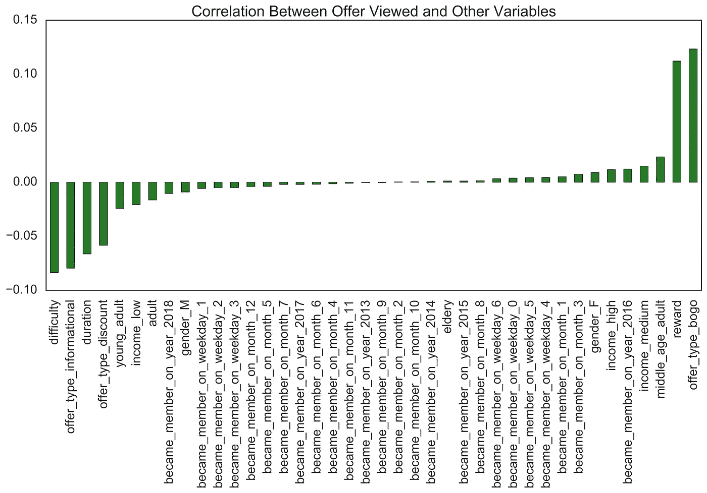

由作者拍摄

基于上面的相关图，推广变量(类型、奖励、难度)而不是人口统计属性影响更多的人观看广告。像 BOGO 这样的提议似乎很有吸引力。超过 70%的优惠被会员查看。与只有 57.9%成功率的其他类型的活动相比，这是一个非常显著的数字。

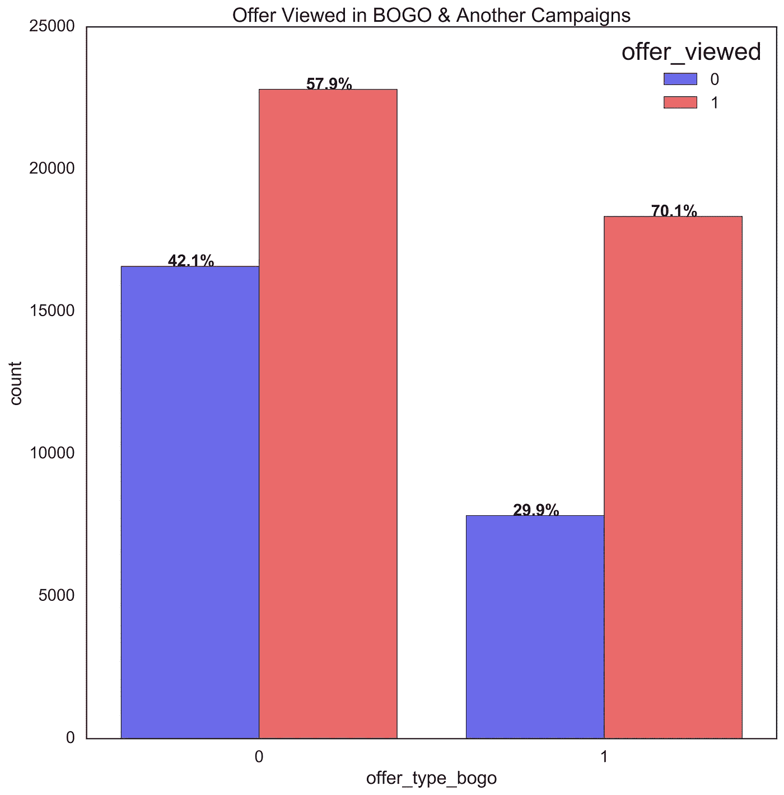

由作者拍摄

然而，故事是不同的其他类型的运动，如信息运动，将通知你，如果有新类型的饮料。只有 55%的会员观看了广告。

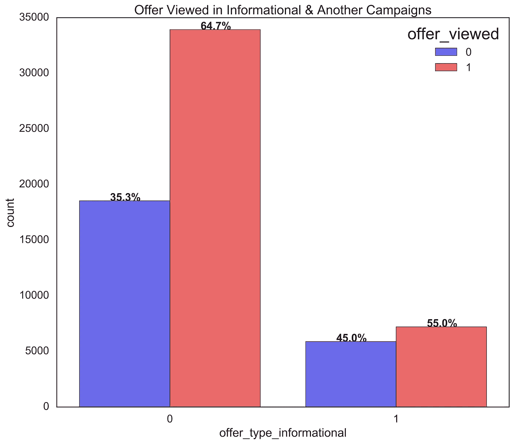

由作者拍摄

与报价最相关的人口统计属性是年龄组。如下图所示，年轻成人年龄组(17-25 岁)中有 41.6%的会员甚至不屑于看到报价，而其他年龄组的成功率为 63.1%。

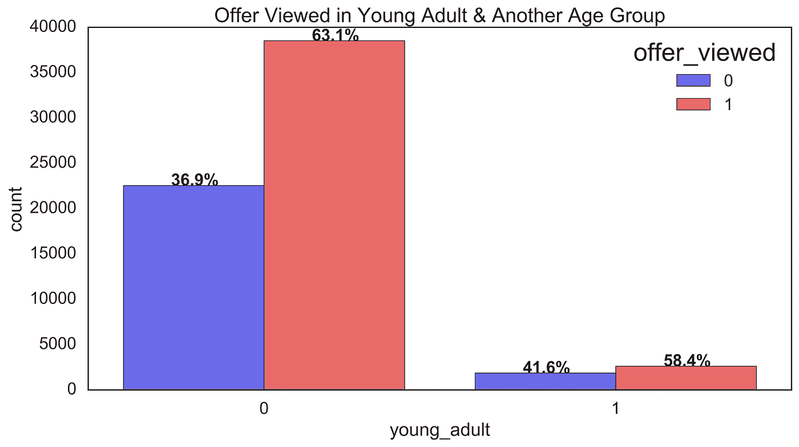

由作者拍摄

这是为什么呢？似乎年轻的成年人群体对 BOGO 的促销活动反应良好。68.2%的人看过 BOGO 的竞选活动，只有 52%的人看过其他类型的竞选活动。

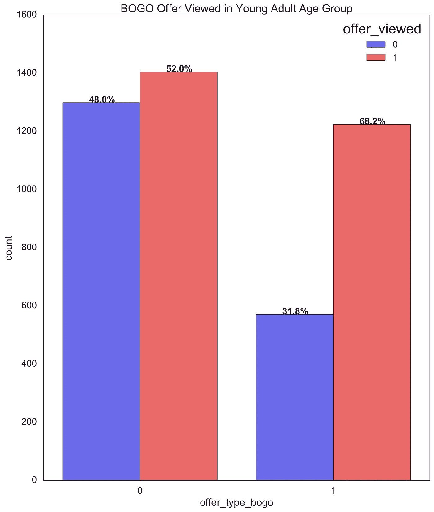

由作者拍摄

现在，让我们继续讨论报价完成与其他变量的关系。请注意，当会员在促销有效期到期前超过最低消费时，优惠即被归类为已完成。

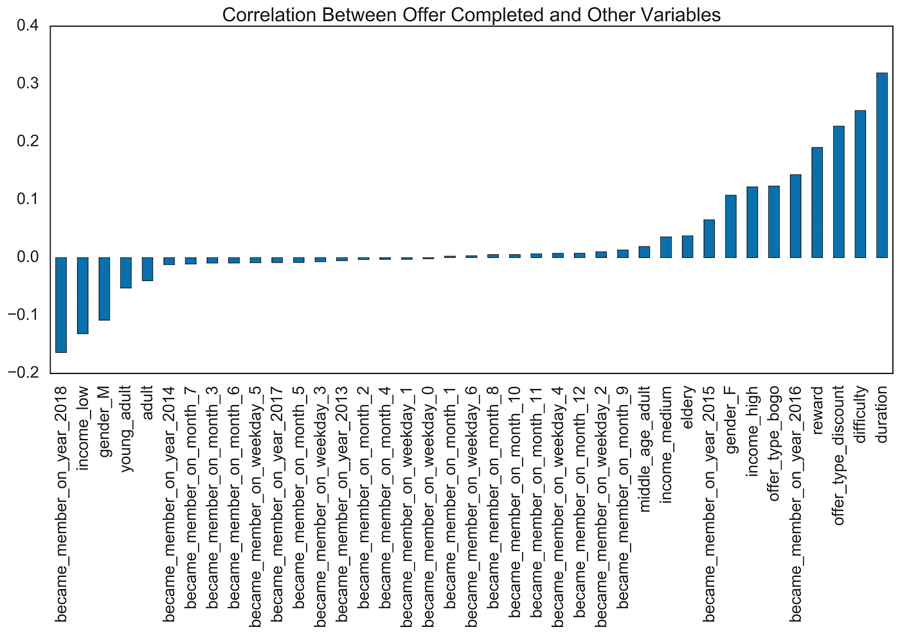

由作者拍摄

发现的一个有趣的注意事项是，2018 年加入的成员(数据集的最新成员)的失败率为 71.5%。它比其他会员多了将近 20%!

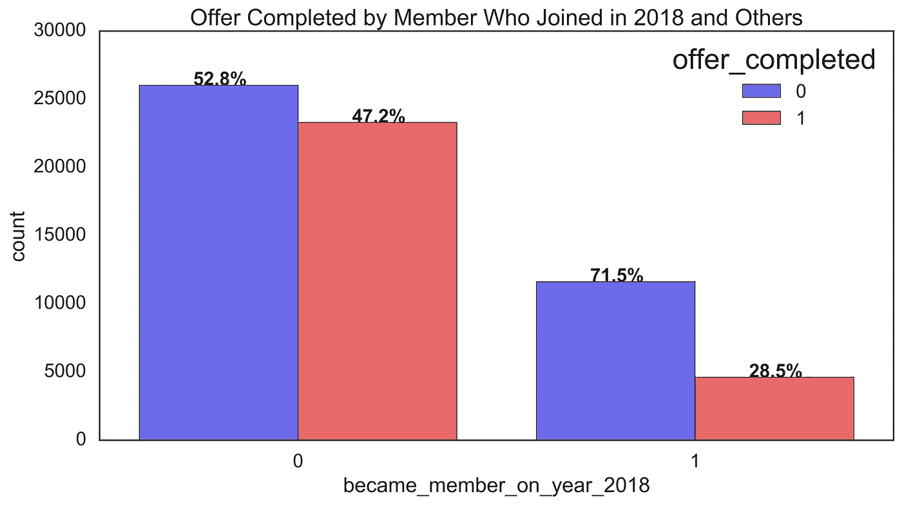

由作者拍摄

但是优惠的类型呢？虽然 BOGO 活动是最成功的报价，但折扣活动对报价完成率的影响更大。

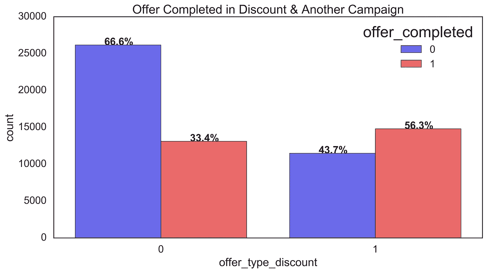

由作者拍摄

性别在这里被证明是至关重要的。与女性相比，男性未完成工作的比例高出 14%。

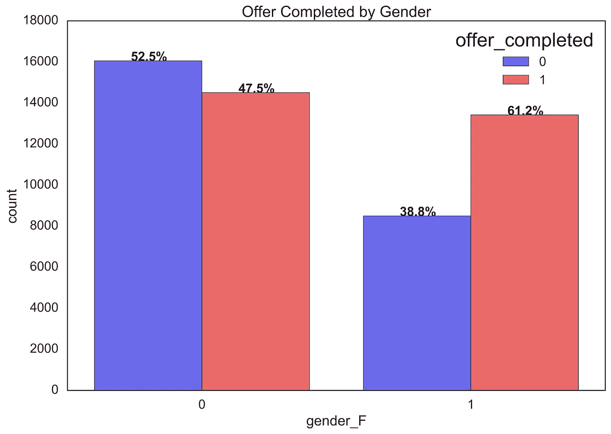

由作者拍摄

我们知道，与女性相比，男性不太可能完成报价。现在，什么样的男人会完成一个提议，什么样的提议足够吸引他们去完成？通过结合上面的另一个见解，我们可以看到折扣非常受欢迎，在 2018 年之前成为会员的男性中有 59%完成了折扣。

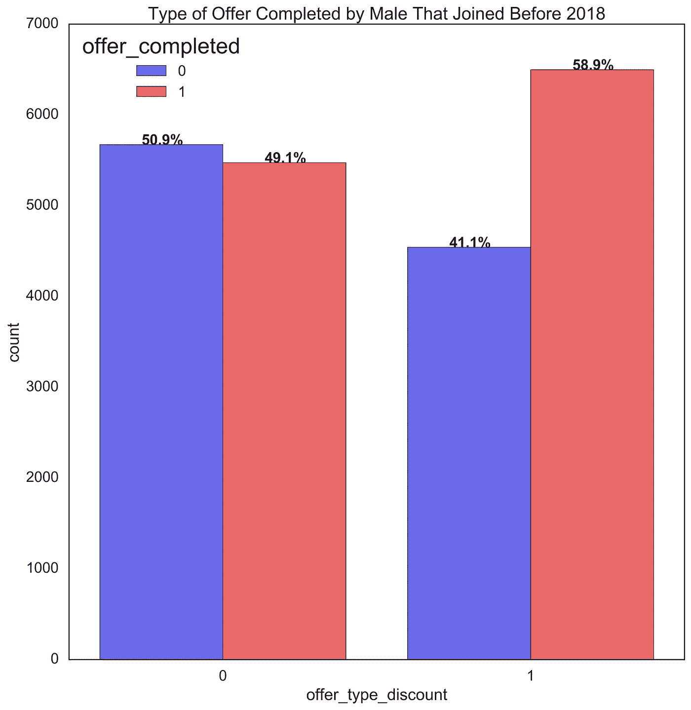

由作者拍摄

让我们开始建模。由于有两个分类，即已查看和已完成的报价，因此使用 MultiOutputClassifier，这意味着将有四种不同类型的输出，即未查看和未完成报价的客户(0，0)，未查看和完成报价的客户(0，1)，已查看和未完成报价的客户(1，0)，以及已查看和完成报价的客户(1，1)。两个集成学习模型，梯度提升和随机森林与网格搜索一起使用。

```
pipeline = Pipeline([
    ('clf', MultiOutputClassifier(GradientBoostingClassifier())) 
    ])parameters = [
    {
    "clf": [MultiOutputClassifier(GradientBoostingClassifier())],
    'clf__estimator__learning_rate':[0.5, 0.25],
    'clf__estimator__n_estimators':[100, 200],
    },
    {
    "clf": [MultiOutputClassifier(RandomForestClassifier())],
    'clf__estimator__n_estimators': [100,200]
    }]grid = GridSearchCV(pipeline, param_grid = parameters, cv=10, return_train_score=False)grid.fit(X_train, y_train)
```

在训练数据集中以 54%的最佳平均测试分数返回的最佳模型是具有学习率 0.25 和 n_estimators 100 的超参数的梯度增强。

为什么渐变提升比随机森林表现更好？对于不平衡数据集，如用于此模型的训练数据集(只有 8%的标签是未查看和完成报价的客户)，梯度提升的性能优于随机森林。Boosting 一步一步地关注困难的例子，这些例子通过加强正类的影响给出了处理不平衡数据集的好策略。

让我们看看模型如何执行测试数据集。

```
y_pred = grid.predict(X_test)label = ['Offer Viewed', 'Offer Completed']report = classification_report(y_test, y_pred, output_dict=True, target_names=label)confusion_matrix_viewed = multilabel_confusion_matrix(y_test, y_pred)[0]
accuracy_viewed = round(sum(confusion_matrix_viewed.diagonal())*100/confusion_matrix_viewed.sum(), 2)
recall_viewed = round(report['Offer Viewed']['recall']*100,2)
precision_viewed = round(report['Offer Viewed']['precision']*100,2)
confusion_matrix_completed = multilabel_confusion_matrix(y_test, y_pred)[1]
accuracy_completed = round(sum(confusion_matrix_completed.diagonal())*100/confusion_matrix_completed.sum(), 2)
recall_completed = round(report['Offer Completed']['recall']*100,2)
precision_completed = round(report['Offer Completed']['precision']*100,2)print('The overall accuracy of the model on both class in the test dataset is {}%. Accuracy, recall and precision for offer viewed are {}%, {}% and {}%, \
while accuracy, recall and precision for offer completed are {}%, {}% and {}%.'.format(round(grid.score(X_test, y_test)*100,2),\                                                                              accuracy_viewed,recall_viewed,precision_viewed,\                                                                                   accuracy_completed,recall_completed,precision_completed))
```

该模型在测试数据集中对两个类的总体准确率为 53.85%。已查看要约的准确率、召回率和准确率分别为 71.03%、80.39%和 75.13%，已完成要约的准确率、召回率和准确率分别为 72.44%、70.27%和 66.84%。

# 第二部分。平均支出预测模型

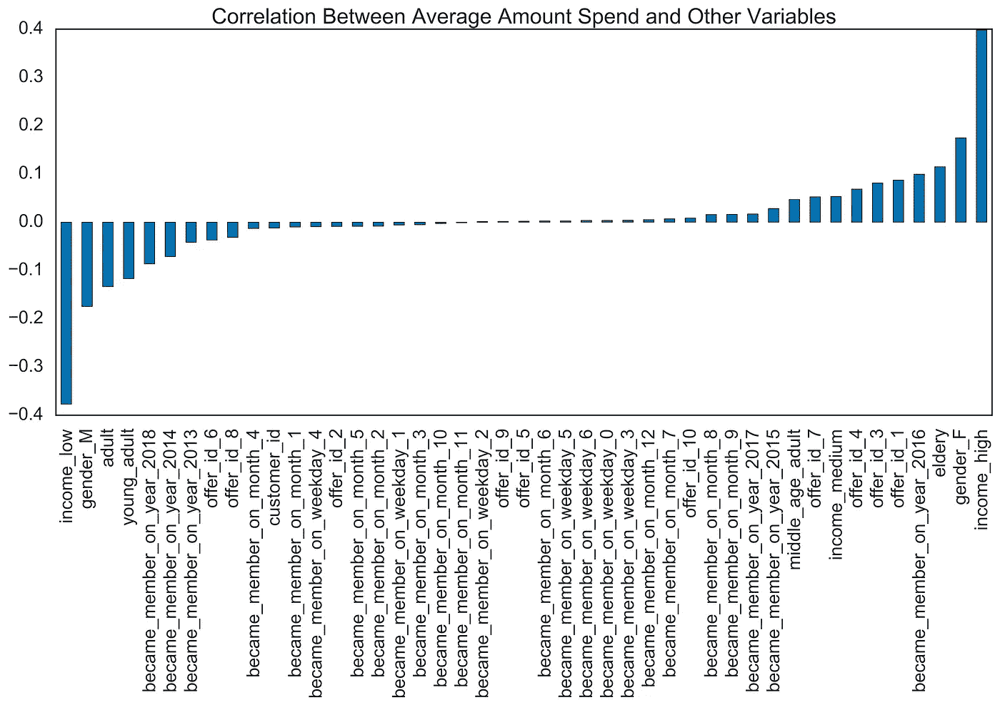

由作者拍摄

人口统计组属性，如收入、性别和年龄组，在会员在优惠有效期内查看优惠后，主导与会员平均消费的相关性。

被归类为高收入成员的成员通常花费大约 30 美元，中等收入成员通常花费 20 美元，低收入成员通常花费大约 5-10 美元。

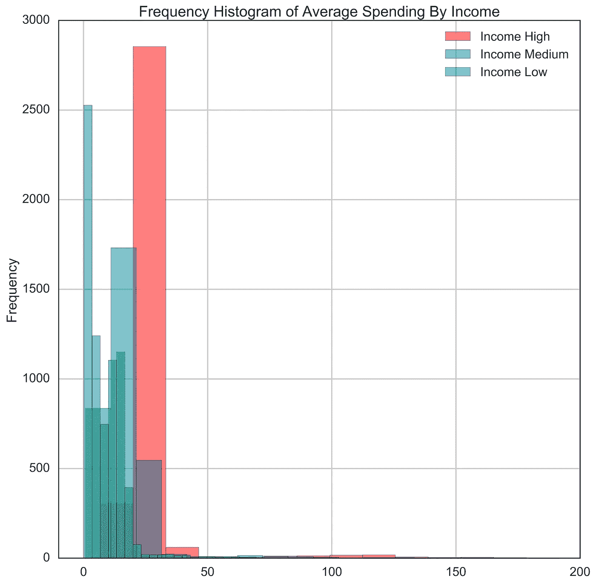

由作者拍摄

男性和女性在看到报价后的消费行为是不同的。女性通常花费 25-30 美元，而男性通常只花费 10 美元以下。

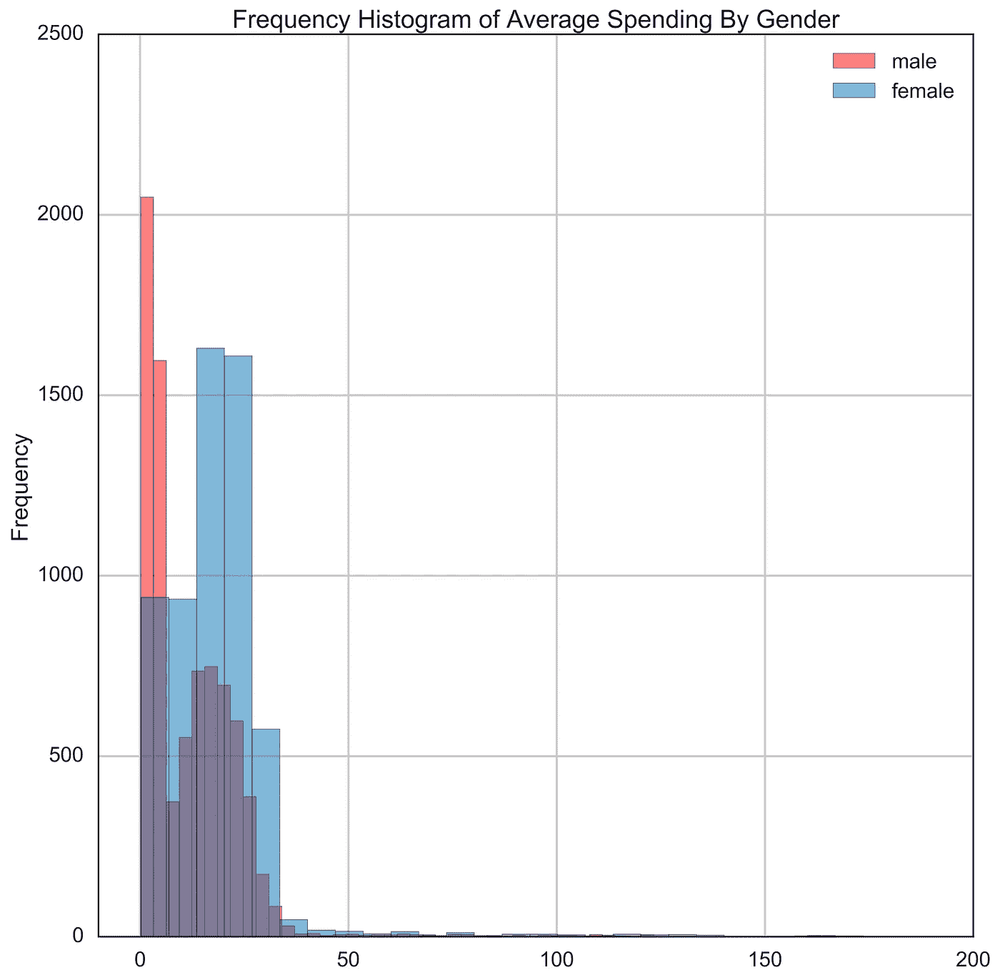

由作者拍摄

最有趣的是老年组(60 岁以上)和其他年龄组之间的比较。老年人群花费最多，大约 30 美元，而其他年龄组大约 10 美元。

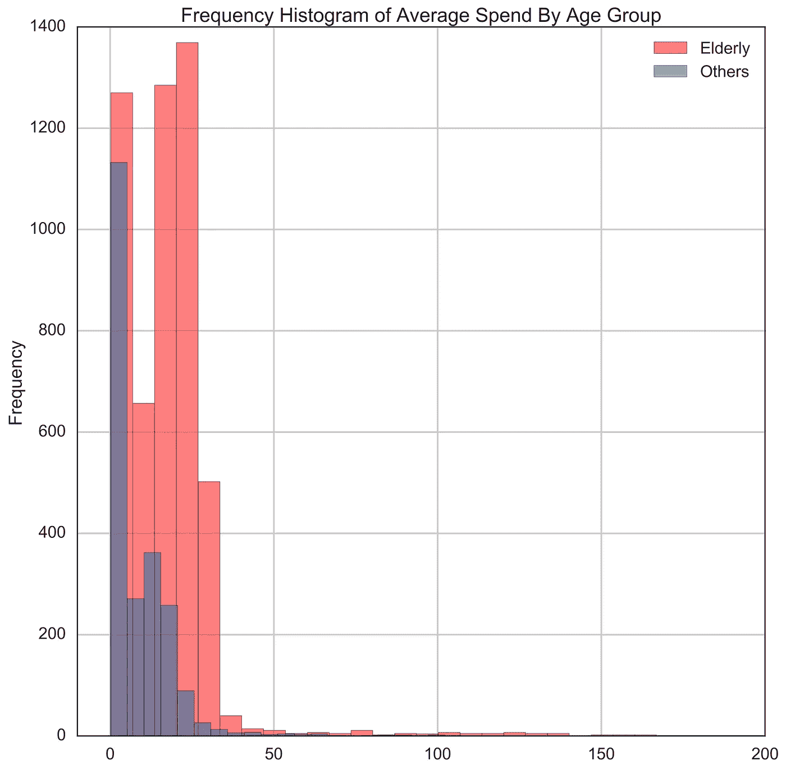

由作者拍摄

让我们开始建模。梯度推进和随机森林与网格一起用于搜索最佳模型和超参数。

```
pipeline = Pipeline([
    ('clr', GradientBoostingRegressor()) 
    ])parameters = [
    {
    "clr": [GradientBoostingRegressor()],
    'clr__learning_rate':[0.5, 0.25, 0.1],
    'clr__n_estimators':[100, 200,300],
    'clr__max_depth':[10,20,50]
    },
    {
    "clr": [RandomForestRegressor()],
    'clr__n_estimators': [100,200,300],
    'clr__max_depth':[10,20,50],
    'clr__min_samples_split':[2, 5, 10]
    }]grid_amount = GridSearchCV(pipeline, param_grid = parameters, cv=10, return_train_score=False)grid_amount.fit(X_train, y_train.values.ravel())y_pred_train = grid_amount.predict(X_train)
print(mean_absolute_error(y_train, y_pred_train))
print(mean_squared_error(y_train, y_pred_train))
```

运行网格搜索后的最佳模型是随机森林，其超参数估计数为 300，最大深度为 10，最小样本分裂为 10。训练数据集上的平均绝对误差和均方误差分别为 5.52 和 186.80。

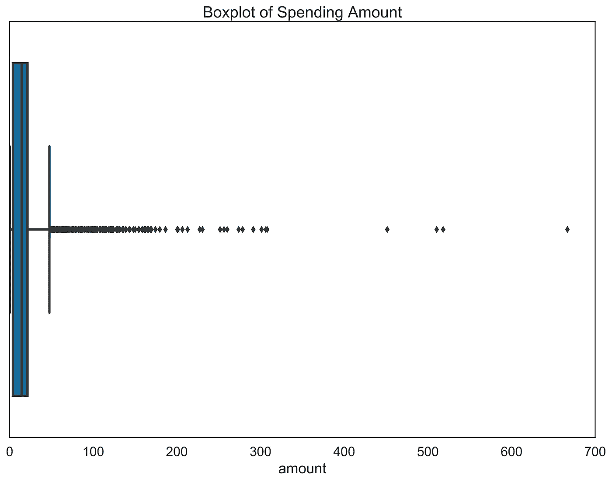

由作者拍摄

对于这种回归问题，随机森林的表现优于梯度增强的原因是因为数据中存在异常值(见上图)。[离群值可能对 boosting 不利，因为 boosting 将每棵树建立在先前树的残差/误差上。异常值将比非异常值具有大得多的残差，因此梯度增强将在这些点上集中不成比例的注意力。](https://stats.stackexchange.com/questions/140215/why-boosting-method-is-sensitive-to-outliers#:~:text=Outliers%20can%20be%20bad%20for,its%20attention%20on%20those%20points.)

让我们看看它在测试数据集中的表现。

```
y_pred = grid_amount.predict(X_test)
print(mean_absolute_error(y_test, y_pred))
print(mean_squared_error(y_test, y_pred))
```

在测试数据集上，平均绝对误差和均方误差分别为 6.33 和 279.52。

与数据集中从 0 到 600 的平均支出范围值相比，6.33 的平均绝对误差听起来令人吃惊，但是我们应该考虑到数据集的平均值只有 15 左右。

# **第三部。结论&改进**

1.  优惠类型等促销属性会影响会员查看他们收到的优惠的行为。70%的会员会查看像 BOGO 这样的优惠类型。
2.  在完成报价的过程中，人口属性起着重要作用。与女性相比，男性未完成工作的比例高出 14%。
3.  对于提供已查看和已完成的模型，梯度增强的性能优于随机森林模型，因为对于不平衡数据集，它的性能优于随机森林。为了改进，欠采样或过采样不平衡类可以解决这个问题。梯度增强模型在测试数据集中的两个类上的总体准确度是 53.85%。已查看要约的准确率、召回率和准确率分别为 71.03%、80.39%和 75.13%，已完成要约的准确率、召回率和准确率分别为 72.44%、70.27%和 66.84%。
4.  在报价有效期内，不同的人口统计组在他们观看某些报价后，相对于他们花费的平均金钱表现不同。男性通常只花 10 美元以下，而女性通常花 25-30 美元左右。
5.  对于平均支出模型，随机森林比梯度增强模型表现更好，因为数据集中存在离群值。为了改进，处理异常值可能会解决这个问题。测试数据集中的平均绝对误差和均方误差分别为 6.33 和 279.52。

# **参考文献**

完全归功于 Udacity 和 Starbucks 提供的数据集。你可以在这里看到完整的代码:【https://github.com/dhaneswaramandrasa/starbucks】T2。

1.  【http://ecmlpkdd2017.ijs.si/papers/paperID241.pdf 
2.  [https://medium . com/@ aravanshad/gradient-boosting-vs-random-forest-CFA 3 fa 8 f 0d 80](https://medium.com/@aravanshad/gradient-boosting-versus-random-forest-cfa3fa8f0d80)
3.  [https://stats . stack exchange . com/questions/140215/why-boosting-method-is-sensitive-to-Outliers #:~:text = Outliers % 20 can % 20 be % 20 bad % 20 for，its % 20 attention % 20 that % 20 points。](https://stats.stackexchange.com/questions/140215/why-boosting-method-is-sensitive-to-outliers#:~:text=Outliers%20can%20be%20bad%20for,its%20attention%20on%20those%20points.)