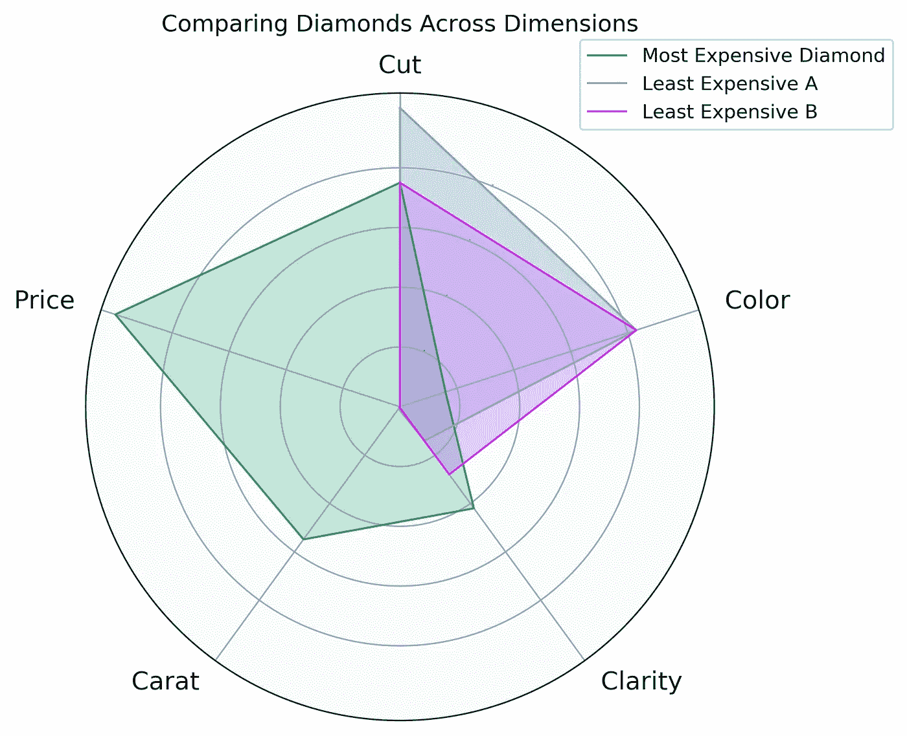
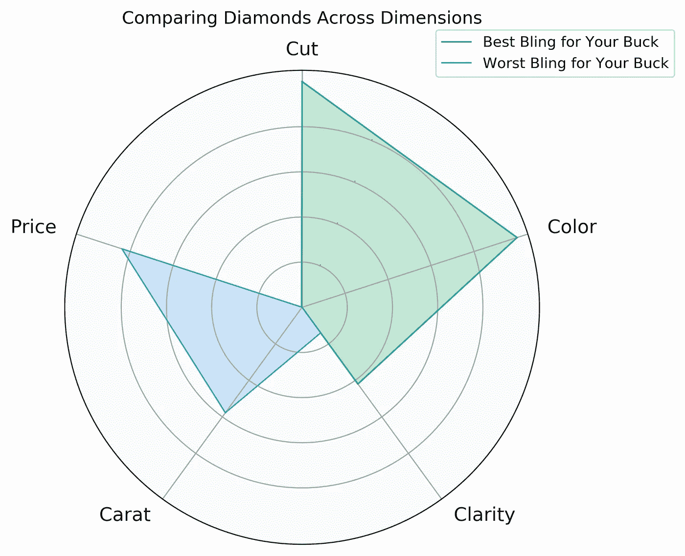

# Python 中的星图

> 原文：<https://towardsdatascience.com/stars-charts-in-python-9c20d02fb6c0?source=collection_archive---------35----------------------->

## 使用 Diamonds 和 Matplotlib 创建星图的教程


戴夫·赫林在 [Unsplash](https://unsplash.com?utm_source=medium&utm_medium=referral) 上拍摄的照片

钻石是数据科学家最好的朋友。更具体地说，在 Kaggle 上发现的钻石数据集[。在本文中，我将通过一个简单的工作流程来创建一个星图(又名蜘蛛图或雷达图)。本教程改编自](https://www.kaggle.com/shivam2503/diamonds) [Alex 在 Python Charts](https://www.pythoncharts.com/2019/04/16/radar-charts/) 的精彩工作流程。本文中的所有代码和所需的数据集都可以在 GitHub 的[中找到。](https://github.com/Datadolittle/Diamond_Star_Chart)

## 钻石是数据科学家最好的朋友

首先，您需要几个库。我正在运行 Python 3。我使用 Jupyter 笔记本、pandas、matplotlib 和 numpy 创建了这个工作流。如果您的系统中没有这些软件包，可以通过 pip 或 conda 安装它们。

```
pip install jupyterlab
pip install pandas
pip install matplotlib 
pip install numpy
```

数据集可以从 [Kaggle](https://www.kaggle.com/shivam2503/diamonds) 下载，大小应该在 3.2 MB 左右。我已经在 Github 上包含了数据集的副本。我在数据文件夹里有数据集。用熊猫加载数据集，删除额外的索引列，我们就可以开始了！

```
df = pd.read_csv("data/diamonds.csv")
df.drop("Unnamed: 0", axis=1, inplace=True)
```

## 3 C 的水平

钻石的 4 C 标准是切割、颜色、净度和克拉。切割、颜色和净度被定义为钻石行业中使用的分类变量。克拉是代表宝石重量的数字。


照片由[张浩](https://unsplash.com/@haozlife?utm_source=medium&utm_medium=referral)在 [Unsplash](https://unsplash.com?utm_source=medium&utm_medium=referral) 上拍摄

为了创建星形图，我们需要用数字来表示钻石行业术语。为此，我们需要收集数据集中的级别信息。Cut 由五个级别组成，其中**理想**为最高级别【4】，**一般**为最低级别【0】。在颜色的七个等级中， **D** 为最高等级【6】，而 **J** 为最低等级【0】。最后，净度由八个级别组成，其中 **IF、**表示内部无瑕疵为最高级别【7】，而 **I1** 、内含物级别 1 为最低级别【0】。

## 显示切割和抛光数据

在我们的数据集中，我们剔除了 3 个偏离下游色谱柱刻度的异常值。

```
## Cut diamonds that skew carat range
indicies_to_remove = [27415, 27630, 27130]
df = df.drop(indicies_to_remove)
```

接下来，我们在数据帧中创建新的列来存放通过将字典映射到 C 的列而创建的排名。下面是一个映射示例。

```
cut={'Ideal':4,'Premium':3,'Very Good':2,'Good': 1,'Fair':0}
df['Cut'] = df['cut'].map(cut) #Note: 'Cut' is a different column
```

最后，我们需要缩放我们将在星形图中使用的列，以公平地表示数据。

```
## Convert all rankings and contiguous data to scale between 0-100
factors = ['Cut', 'Color', "Clarity", "carat", "price"]new_max = 100
new_min = 0
new_range = new_max - new_min## Create Scaled Columns
for factor in factors:
    max_val = df[factor].max()
    min_val = df[factor].min()
    val_range = max_val - min_val
    df[factor + '_Adj'] = df[factor].apply(lambda x: (((x - min_val) * new_range) / val_range) + new_min)
```

然后，我们将缩放后的列划分为子集，用于下游绘图。**请注意，我们正在创建一个新的数据框架(df2 ),其中仅包含我们打算在星形图中使用的列。**

```
## Subset scaled columns 
df2 = df[['Cut_Adj', "Color_Adj", "Clarity_Adj", "carat_Adj", "price_Adj"]]
df2.columns = ['Cut', "Color", "Clarity", "Carat", "Price"]
```

# 演出的明星

要创建星形图表，我们必须指定要使用的列，并使用 numpy 创建圆形绘图对象。

```
labels = ['Cut', "Color", "Clarity", "Carat", "Price"]
points = len(labels)angles = np.linspace(0, 2 * np.pi, points, endpoint=False).tolist()
angles += angles[:1]
```

然后，我们创建一个助手函数，仅通过索引号绘制一个菱形。

```
def add_to_star(diamond, color, label=None):
    values = df2.loc[diamond].tolist()
    values += values[:1]
    if label != None:
        ax.plot(angles, values, color=color, linewidth=1, label=label)
    else:
        ax.plot(angles, values, color=color, linewidth=1, label=diamond)
    ax.fill(angles, values, color=color, alpha=0.25)
```

现在魔法开始了！我们可以开始用我们想要的钻石填充我们的星图。最贵的和两个最便宜的怎么样:

```
## Create plot object   
fig, ax = plt.subplots(figsize=(6, 6), subplot_kw=dict(polar=True))## Plot a new diamond with the add_to_star function
add_to_star(27749, '#1aaf6c', "Most Expensive Diamond")
add_to_star(0, '#429bf4', "Least Expensive A")
add_to_star(1, '#d42cea', "Least Expensive B")
```

这个数量足以创建一个星图，但是，没有 x 标签，没有方向，也没有自定义风格。让我们改变这一切！

```
## Fix axis to star from top
ax.set_theta_offset(np.pi / 2)
ax.set_theta_direction(-1)## Edit x axis labels
for label, angle in zip(ax.get_xticklabels(), angles):
    if angle in (0, np.pi):
        label.set_horizontalalignment('center')
    elif 0 < angle < np.pi:
        label.set_horizontalalignment('left')
    else:
        label.set_horizontalalignment('right')## Customize your graphic# Change the location of the gridlines or remove them
ax.set_rgrids([20, 40, 60 ,80])
#ax.set_rgrids([]) # This removes grid lines# Change the color of the ticks
ax.tick_params(colors='#222222')
# Make the y-axis labels larger, smaller, or remove by setting fontsize
ax.tick_params(axis='y', labelsize=0)
# Make the x-axis labels larger or smaller.
ax.tick_params(axis='x', labelsize=13)# Change the color of the circular gridlines.
ax.grid(color='#AAAAAA')
# Change the color of the outer circle
ax.spines['polar'].set_color('#222222')
# Change the circle background color
ax.set_facecolor('#FAFAFA')# Add title and legend
ax.set_title('Comparing Diamonds Across Dimensions', y=1.08)
ax.legend(loc='upper right', bbox_to_anchor=(1.3, 1.1))# Draw axis lines for each angle and label.
ax.set_thetagrids(np.degrees(angles), labels)
```

那么产量是多少呢？



最贵和最便宜的两颗钻石的星图。Carets 似乎是价格的一大驱动因素。

# 最物有所值的珠宝

4 C 系列中价格最低、评级最高的钻石是什么？要找出答案，我们必须得到 4 个 C 的总价值，然后除以原始(未缩放)价格。这个部分对包含所有原始列的原始数据帧进行操作。为了计算总数，我们对四个缩放的列求和。

```
df['Total'] = df['Cut_Adj'] + df['Color_Adj'] + df['Clarity_Adj'] + df['carat_Adj']## Divide Value total by Price
df['4C_by_Price'] = df['Total']/df['price']
df = df.sort_values(by="4C_by_Price", ascending=False)
```

对我们来说最闪亮的钻石是#31597，最不闪亮的钻石是#26320。这些钻石在星图上如何比较？下面我们来探讨一下:



一个是交易中的钻石，另一个是一大块碳。

## 结论:

感谢您使用 matplotlib 探索星形图表格式中的一些钻石特征。如果你有任何问题，请在下面或者完整代码的位置 [GitHub 库](https://github.com/Datadolittle/Diamond_Star_Chart)发表。我的名字是[科迪·格利克曼](https://codyglickman.com/)，我可以在 [**LinkedIn**](https://www.linkedin.com/in/codyglickman/) **上找到。**一定要看看其他一些关于有趣的数据科学项目的文章！

[](/creating-photo-mosaics-using-python-49100e87efc) [## 使用 Python 创建照片镶嵌

### 一步一步的教程，让你自己的美丽的图像

towardsdatascience.com](/creating-photo-mosaics-using-python-49100e87efc) [](/to-beard-or-not-to-beard-that-is-the-question-b46864d7e003) [## 刮胡子，还是不刮胡子，这是个问题

### 使用深度学习对有胡须和无胡须的照片进行年龄分类

towardsdatascience.com](/to-beard-or-not-to-beard-that-is-the-question-b46864d7e003) [](/dashing-through-christmas-songs-using-dash-and-sql-34ef2eb4d0cb) [## 使用 Dash 和 SQL 快速浏览圣诞歌曲

### 使用 SQL 数据库创建 Dash 仪表板的简单项目

towardsdatascience.com](/dashing-through-christmas-songs-using-dash-and-sql-34ef2eb4d0cb)