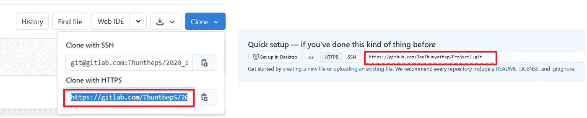

# 开始在您现有的数据科学项目中使用 Git

> 原文：<https://towardsdatascience.com/start-using-git-in-your-existing-data-science-project-27118c92f86e?source=collection_archive---------54----------------------->

## 现在开始使用 Git 还不算太晚


照片由 [Yancy Min](https://unsplash.com/@yancymin?utm_source=medium&utm_medium=referral) 在 [Unsplash](https://unsplash.com?utm_source=medium&utm_medium=referral) 上拍摄

在数据科学中，你通常不是独自工作。使用 git 将有助于您与团队协作。即使你的项目中已经有了几样东西，现在开始使用 Git 还不算太晚。本文将指导您如何从现有的数据科学项目中启动 git 存储库。

# 我们开始吧！

## 第一步。准备 Git 账户/软件

*   如果您还没有 git 帐户，请在线创建。请随意挑选你最喜欢的。我推荐 [GitHub](https://github.com/) 或者 [Gitlab](https://about.gitlab.com/) 。
*   将 [git-scm](https://git-scm.com/) 安装到您的机器上。

## 第二步。创建存储库

拥有 Git 帐户后，创建一个新的空白项目存储库，并根据自己的喜好命名(与您的数据科学项目相匹配)。项目为空非常重要。不要创建任何文件或使用 Git 提供程序的任何模板。

然后，复制远程存储库 URL。



**git lab 资源库(左)和 Github 资源库(右)中的远程 URL 位置**(图由作者提供)

## 第三步。在您的项目目录中启动 Git

在这一步中，我们将在您的工作目录中启动 Git。在窗口操作中，可以从右键菜单中打开 Git Bash 开始。在 Mac 中，您可以使用终端菜单。或者，您也可以使用 VS-Code 中的内置控制台。


**在 Window 操作系统上打开 Git Bash**(图由作者提供)

然后，我们将使用`git init`命令启动本地存储库。接下来通过`git add .`命令将文件添加到本地存储库中。然后，我们使用`git commit`命令提交存储库中的文件变更。

```
**$ git init
$ git add .
$ git commit -m 'First commit'**
```

然后，我们需要使用步骤 2 中的`git remote add ...`命令，使用远程存储库 URL 将这个本地存储库添加到远程存储库中。通过将我们提交的更改推送到远程存储库，设置并确认一个带有`git remote -v`的新远程 URL。

```
**$ git remote add origin <**remote repository URL from step 2**>
$ git remote -v
$ git push origin master**
```

差不多就是这样！简单对吗？

# 结论

这篇短文介绍了如何以一种简单的方式在现有项目中启动 Git。如果您有任何问题、意见或建议，请随时给我留言。

安全健康**！**

**感谢您的阅读。👋**😄