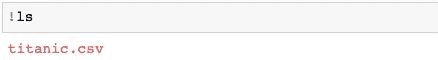
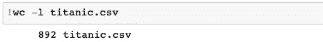
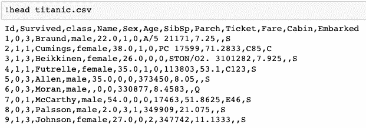
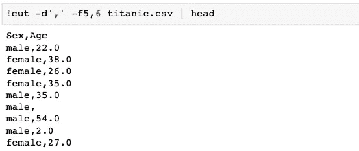
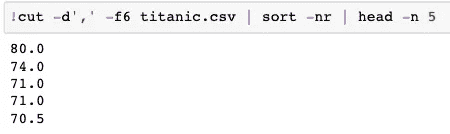
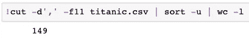
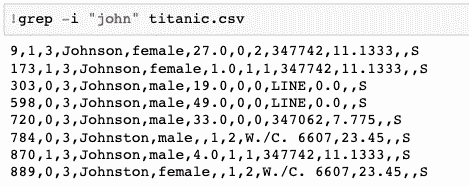
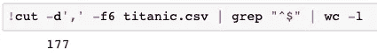
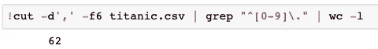

# 开始使用 Linux 命令快速分析结构化数据，而不是熊猫

> 原文：<https://towardsdatascience.com/start-using-linux-commands-to-quick-analyze-structured-data-not-pandas-f63065842269?source=collection_archive---------29----------------------->


照片由[弗拉季斯拉夫](https://unsplash.com/@garri?utm_source=unsplash&utm_medium=referral&utm_content=creditCopyText)在 [Unsplash](https://unsplash.com/s/photos/choose?utm_source=unsplash&utm_medium=referral&utm_content=creditCopyText) 上拍摄

有时我们需要快速分析或验证我们的结构化数据。一般来说，人们倾向于使用熊猫，因为它看起来简单而且视觉效果好。熊猫的问题是，如果你有大量数据，它可能会超级慢。

我们还有另一个选择，那就是 Linux 命令。Linux 命令运行速度非常快(即使是在海量数据上)，你甚至不需要 IDE/笔记本来运行它。你可以在你的终端上执行它们。

我准备用本教程中著名的 [**泰坦尼克**](https://www.kaggle.com/c/titanic/data) 数据作为例子。此外，为了更好地显示，我将在 Jupyter 笔记本中编写这些 Linux 命令(仅针对本教程)。

## 我们开始吧

我们在某个位置有一个名为`titanic.csv`的 CSV 文件。



## 行数

我们先检查一下行数。我们可以使用 [WC](https://linux.die.net/man/1/wc) 命令来完成。

```
wc -<option> <file>
```



WC 代表字数。它可以读取一个文件的行数(`-l`)、字数(`-w`)和字符数。

## 先睹为快

通过做[头](https://linux.die.net/man/1/head)我们可以轻松地瞥一眼数据。我们可以检查列名和样本值。这和我们在熊猫身上做的一样。

```
head <file>
```



如果你想看到一个具体的行数，然后做

```
head -n <num_lines> <file>
```

同样，您可以看到数据的`tail`，它显示了数据的最后一部分。

```
tail -n <num_lines> <file>
```

## 逐列分析

列在结构化数据中很重要，您可以从数据中剪切/提取特定的列并对其进行分析。

我们可以使用 [CUT](https://linux.die.net/man/1/cut) 命令来提取特定的列。

```
cut -d'<delim>' -f<col_num> <file>
```

在这里，我删除了第 5 栏和第 6 栏(性别和年龄),而忽略了这两栏。您还可以提供列范围。例如，`f1–3`将提取第 1、2 和 3 列。



在 Linux 中管道(`|`)是一个非常有用的操作符。我们可以使用管道在其他命令的输出上运行一个命令，就像我上面做的那样。首先，我提取了 2 列，然后做了标题。我们现在会经常看到管道的使用。

## 检查列的最小值-最大值

很多时候我们需要知道列的值域。这里我们可以使用[排序](https://linux.die.net/man/1/sort)命令来完成任务。

```
sort <option> <file>
```

让我们检查年龄列中的最大值。基本上是泰坦尼克号上年纪最大的人。



我们看到它是 80。首先，我们剪切年龄列，然后以逆序(`-nr`)对该列进行排序，然后跳过它。

我们可以通过提供标志`-n`以数字顺序对列进行排序，通过提供标志`-nr`以相反的数字顺序对列进行排序。如果我们不提供`-n`标志，那么一列按字典顺序排序。

## 检查列中的唯一值

在这个数据中，我们有一个名为 cabin 的列，它告诉乘客所在的客舱 ID。让我们看看泰坦尼克号上总共有多少个船舱。



我们看到总共有 149 个船舱。首先我剪切了 cabin 列，然后通过传递`-u`标志对该列进行排序，该标志只给出唯一的值。然后计算这些唯一值的数量。

## 在数据中搜索

很多时候，我们需要在数据中搜索文本。我们可以使用 [GREP](https://linux.die.net/man/1/grep) 命令来完成。我假设你已经熟悉了 [regex](https://docs.python.org/3/howto/regex.html) (正则表达式)。

```
grep <option> "<regex>" <file>
```

假设我们想要查看乘客姓名以`john`开头的所有记录。



`grep`命令搜索所有行中的文本`john`并打印匹配的行。参数`-i`在匹配时忽略大小写。我们在执行 grep 时提供了一个正则表达式。

## 检查列中的空值

让我们检查年龄列中空值的数量。



首先，我们删除年龄列，然后使用`^$` regex 清空空行。数一数这样的线。

## 检查范围内的值

让我们查一下有多少乘客年龄在 10 岁以下。



有 62 名这样的乘客。基本上，如果你知道如何使用正则表达式，你可以在一个命令中做很多这样强大的事情。

## 最后一个例子:)

假设我们想要检查在车祸中幸存的男性人数。


首先，我选择包含`male`单词的行。然后剪切第 2(幸存)列，然后重新标记其中值为 1 的行(其中 1 幸存，0 未幸存)。然后最后计算行数。所以我们有 161 个。

我们只需使用一个简单的 Linux 命令就可以完成几乎所有的基本分析，这个命令即使在处理大量数据时也运行得非常快。一旦你开始使用这些命令，你会发现你可以用它做更多的事情。

我希望这篇博客对你有所帮助。请让我知道你的想法。感谢阅读。