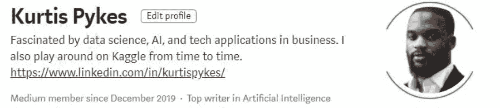
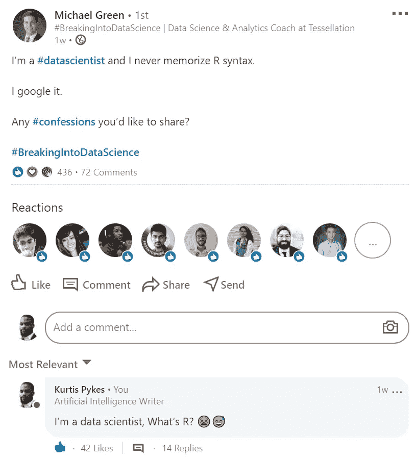

# 用 4 个步骤开始您的数据科学之旅

> 原文：<https://towardsdatascience.com/start-your-data-science-journey-in-4-steps-f5b5a6e7e80b?source=collection_archive---------38----------------------->

布拉登·科拉姆在 [Unsplash](https://unsplash.com?utm_source=medium&utm_medium=referral) 拍摄的照片

## 开始数据科学职业生涯的自以为是的路径指南

直到 2018 年 9 月，“人工智能”这个词对我来说毫无意义。我在为皇家邮政寄信，并一如既往地好奇想学习一项不需要我付出体力的技能。编程的想法确实出现在脑海中，但我不认为我足够聪明——毕竟我是一名运动员，高中毕业后没有受过正规教育(除非你想把我的 3 级教练徽章和 BTEC 列入体育项目)。

不到两年，我获得了我认为是我人生旅程中的一个重大成就:**我现在是一名顶尖的人工智能作家。**

在最初充满喜悦之后，我的思维发生了转变，在我意识到之前，我开始反思我从哪里来…

> 我所采取的每一项重大行动都是对困难局面的回应，但并不一定非要如此！

我收起了对编程的恐惧，事实上我已经 5 年多没有做过一点数学了，这已经不再让我担心，然而，这只是因为我失去了邮递员的工作——我没有其他选择。我在 2019 年 12 月开始了我的中道之旅，但只是因为新冠肺炎疫情让我休假，我才开始定期发帖——我需要用我的时间做一些有成效的事情，否则我只会在家里无聊，直到我被要求回到工作岗位(如果我被要求回来的话)。

意识到我被动的生活方式是不必要的费力，我决定积极主动，希望在数据科学领域有所作为。

你不需要像我一样！如果你现在正在读这篇文章**，那么你今天就有机会决定变得积极主动！在这一点上，我的目标是为你提供帮助我达到现在位置的工具，以便你可以启动你的职业生涯。**

> **不要等待机会，要创造机会！Kurtis Pykes**

## **数据科学家的成就**

**我们经常看到成为数据科学家的先决条件，它们是多么令人生畏；**精通**统计学、线性代数、微积分、编程、机器学习等(名单不停)。**

****都是垃圾！****

**我是在说这些技能是不必要的吗？**见鬼不！**你需要具备编程知识，以及使用你选择的编程语言处理数据的能力，但是仅仅对数学有基本的了解就足以**开始你的旅程。****

> **注意:记住这篇文章是关于你职业生涯的开始**

**使用来自 [Dataquest](https://www.dataschool.io/talkpython/) 的摘录，我们来定义数据科学:**

*****提出有趣的问题，然后用数据回答这些问题的过程。一般来说，数据科学的工作流程看起来是这样的:*****

*   *****问一个问题*****
*   *****收集可能有助于你回答那个问题的数据*****
*   *****清理数据*****
*   *****探索、分析和可视化数据*****
*   *****建立并评估一个机器学习模型*****
*   *****传达结果*****

**(来源: [Dataquest](https://www.dataschool.io/talkpython/) )。**

**在开始之前，很容易陷入试图学习一切的困境，我会根据经验告诉你，这将是一场你无法赢得的艰苦战斗——我还没有找到人来证明我在这一点上是错的，如果是你，请留下回应。要发展成为一名数据科学家，你需要更多的数学流利度和其他专业技能，但在旅程开始时，你应该专注于培养必要的技能，让你能够迈出第一步。**

## **1)学习一门编程语言**

**本世纪的辩论之一，Python 与 r。当我开始学习编程时，我选择了 Python，这只是因为这是我在 2018 年第一次开始学习编程时唯一听说过的语言。**

**如果让我选择今天先学习哪一个更好，我会选择更容易掌握的一个，因为它们都是非常好的选择，都有许多支持数据科学工作流的包。换句话说，把你自己暴露给这两者，然后决定你觉得哪一个更容易。**

**你不需要成为 Dan Bader (Python 编程专家)。你的重点应该是理解数据类型、数据结构、语法、函数、条件语句、比较、理解、循环和模块。其余的你可以随着时间的推移学习。**

****

**(来源: [LinkedIn](https://www.linkedin.com/feed/update/urn:li:activity:6686602367795830784/?commentUrn=urn%3Ali%3Acomment%3A(activity%3A6686602367795830784%2C6686673162635116544)) )**

****资源****

> **注意:我向 R 用户道歉，因为我只能引用我个人使用过并发现有用的东西。**

****学习 Python 3 | code academy**——[https://www.codecademy.com/learn/learn-python-3](https://www.codecademy.com/learn/learn-python-3)**

****Python 的搭便车指南**——【https://docs.python-guide.org/ **

****用于数据分析的 Python**—[https://www . Amazon . co . uk/Python-Data-Analysis-Wes-Mckinney/DP/1491957662](https://www.amazon.co.uk/Python-Data-Analysis-Wes-Mckinney/dp/1491957662)**(这不是附属链接)****

****Python 数据科学手册**——[https://jakevdp.github.io/PythonDataScienceHandbook/](https://jakevdp.github.io/PythonDataScienceHandbook/)**

## **2)学习基础数学**

**你需要的数学技能的程度完全取决于你想要的角色——如果你刚刚开始，很可能你会去找一个初级/实习生的角色。在此基础上，你需要的数学肯定比你想象的要少。当我开始学习数学时，我觉得它很有趣，并决定学习整个 A-Level 课程大纲，但我可以向你保证，**你不需要这样做，而且非常耗时。****

**考虑到你对数学有很好的直觉，并且知道如何编码，那么你很好。你知道的足够多，可以获得一个初级数据科学家或实习生的职位-一旦获得这个职位，就要靠你去更深入地研究数学并建立你的数学技能，这将使你的职业生涯进一步发展。**

**重要的是，你要设定一个停止专注于数学的时间——大约 2-3 个月，取决于你掌握事物的速度。请记住，这是一个人们花了一生的时间来学习，但仍然无法完全攻克的课题。**

> **"如果你不知道什么时候该停下来，你可能会永远停下来. "Kurtis Pykes**

****资源****

****可汗学院|统计**——[https://www.khanacademy.org/math/statistics-probability](https://www.khanacademy.org/math/statistics-probability)**

****可汗学院|微分学**——[https://www.khanacademy.org/math/differential-calculus](https://www.khanacademy.org/math/differential-calculus)**

****可汗学院|线性代数**——[https://www.khanacademy.org/math/linear-algebra](https://www.khanacademy.org/math/linear-algebra)**

****考试答案**——[https://www.examsolutions.net/a-level-maths/edexcel/](https://www.examsolutions.net/a-level-maths/edexcel/)**

## **3)学习机器学习**

****

**在 [Unsplash](https://unsplash.com?utm_source=medium&utm_medium=referral) 上由 [Franck V.](https://unsplash.com/@franckinjapan?utm_source=medium&utm_medium=referral) 拍摄的照片**

**如果我们遵循我按时间顺序列出的路径，那么你已经建立了我们的编程技能(我们也会使用重要的数据科学框架，如 SciPy、NumPy、Matplotlib 和 Pandas ),并且已经实践过了(即使用我们学习和/或教授的技能)。此外，你已经在必要的数学方面打下了良好的基础，所以剩下的就是学习机器学习了。**

**许多人直接进入深度学习，我个人认为这不是最好的事情，因为深度学习的许多基本概念都源于机器学习。也就是说，你可能想学习一些机器学习算法，下面是我要说的 5 个开始:**

*   **[线性回归](/algorithms-from-scratch-linear-regression-c654353d1e7c)**
*   **[逻辑回归](/algorithms-from-scratch-linear-regression-c654353d1e7c)**
*   **分类和回归树**
*   **KNN**
*   **朴素贝叶斯**
*   **SVM**

> ****注**:维基百科和交叉验证的栈交换是上述算法的一个很好的起点。**

****资源****

****使用 Scikit-Learn 和 Tensorflow 进行机器实践学习**——[https://amzn.to/2ZESDEp](https://amzn.to/2ZESDEp)**

****用 Python 进行机器学习简介**——[https://amzn.to/32oj6I5](https://amzn.to/32oj6I5)**

****机器学习(吴恩达)| Coursera**——[https://www.coursera.org/learn/machine-learning](https://www.coursera.org/learn/machine-learning)**

****深度学习专业化(作者吴恩达)| Coursera**——[https://www.coursera.org/learn/machine-learning](https://www.coursera.org/learn/machine-learning)**

> ****注意**:机器学习课程在 Matlab 中，你可能想用你选择的语言来重现它，因为这也将是发展你的编程技能和直觉的好练习。**

## **4)不要停止学习**

**永远不要停止学习！下面的链接非常符合这一点，所以我推荐阅读它们。**

** [## 数据科学家如何更快地学习

### 学会学习的有效策略

towardsdatascience.com](/how-to-learn-faster-for-data-scientist-cfd96d317ce6)  [## 学习数据科学的 3 个阶段

### 了解学习的 3 个阶段，以及我们如何将其有效地应用于数据科学学习

towardsdatascience.com](/3-stages-of-learning-data-science-9a04e96ba415)  [## 最重要的数据科学项目

### 每个数据科学家都必须做的项目

towardsdatascience.com](/the-most-important-data-science-project-458d016ef8a6)  [## 如何获得你真正想要的数据科学职位

### 当承担与人工智能相关的角色时，必须做的事情没有被充分提及

towardsdatascience.com](/how-to-secure-a-data-science-role-you-actually-want-169afc52019b)  [## 为您的数据科学事业保持动力

### 我们可以长期保持动力。

towardsdatascience.com](/staying-motivated-for-your-data-science-career-e845f18421e1) 

非常感谢你读到这个故事的结尾。如果您认为我遗漏了什么，或者您想向我指出什么，或者如果您仍然不确定什么，您的反馈是有价值的。发个回应！然而，如果你想和我联系，我在 LinkedIn 上是最活跃的，我也很乐意和你联系。

 [## Kurtis Pykes -人工智能作家-走向数据科学| LinkedIn

### 在世界上最大的职业社区 LinkedIn 上查看 Kurtis Pykes 的个人资料。Kurtis 有一个工作列在他们的…

www.linkedin.com](https://www.linkedin.com/in/kurtispykes/)**