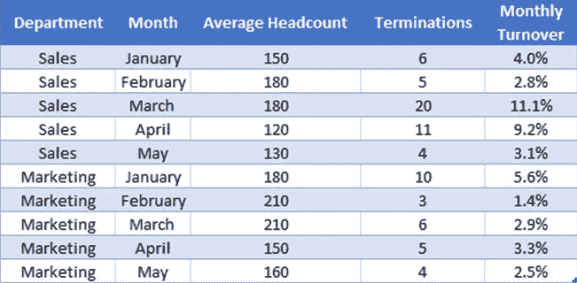
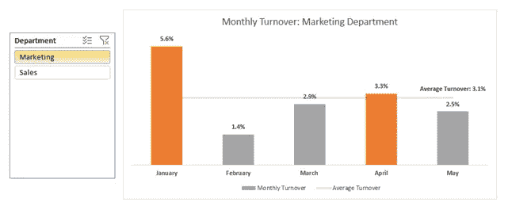

# 启动人员分析功能:3 个构件

> 原文：<https://towardsdatascience.com/starting-a-people-analytics-function-3-building-blocks-4293ddc160f8?source=collection_archive---------40----------------------->

构建可扩展的人员分析功能的坚实基础。你必须从某个地方开始，你也可以从这里开始。

Alex Kotliarskyi 在 [Unsplash](https://unsplash.com?utm_source=medium&utm_medium=referral) 上的照片

**人员分析**(也称为人力资源分析、人才分析和劳动力分析)本质上是利用员工相关数据来推动业务决策。

这很流行。

数据无处不在，每一秒，每一毫秒，我们都在收集更多的数据。商业领袖已经认识到，利用他们的数据做出商业决策可能会对他们的底线产生巨大的影响。

*什么类型的广告活动能产生最多的销售额？什么样的产品利润率最高？我们的目标人群在哪里购物最多？*

收集数据，分析数据，然后根据这些见解做出决策已经成为一种期望。随着企业领导人越来越精通数据，迫切需要将这些原则应用到与员工相关的决策中。接下来是人员分析。

*如果你想看* [*超级酷的例子*](https://rework.withgoogle.com/subjects/people-analytics/) *，谷歌的 People Analytics 团队已经公开了他们的一些最有影响力的项目。*

好吧，你被收买了。您确信 People Analytics 将改变世界，使您的业务效率提高一百万倍，并使您的员工成为这个星球上最积极参与的员工。你希望你的组织从这个新领域中获益。欢迎来到酷小子桌。

但是你从哪里开始呢？

照片由 [rawpixel](https://burst.shopify.com/@rawpixel) 在[爆发](https://burst.shopify.com/)时拍摄

首次开始时，请记住以下三点，这将有助于为您的人员分析功能打下坚实的基础，并迅速获得关注:

1.  使其**准确**
2.  使其**可行**
3.  使其**可访问**

# 1.使它准确

在理想的情况下，所有的数据都将存储在一个集中管理的数据库中。众所周知，我们生活的世界远非理想，我们的数据通常存在于各种地方，来自各种来源，并以各种格式存在。哦，快乐。

这会让我们的工作变得复杂吗？是的。这是否让我们的工作有时令人沮丧？还有，是的。但是有几件事你可以在早期就确定下来，这会让你在将来省去很多麻烦:

*   建立数据所有权
*   只有一个真实的来源
*   尽早建立信誉

## **建立数据所有权**(或者“管理”，如果你想更花哨的话)。

有许多[方法来建立数据所有权](https://www.sas.com/content/dam/SAS/en_au/doc/whitepaper1/5%20Models%20Data%20Stewardship%20White%20Paper.pdf)以满足您组织的独特需求。但首先，你需要确定:*谁*是**负责*什么*数据的**，*它*在哪里**活**，*你如何*保持它**安全**并确保它**准确**。

哈，就这些？！

同样，这可能看起来势不可挡，但坚持与我无畏的战士。让我们试一个例子。假设薪酬数据由财务部处理，并记录在我们的[人力资源信息系统](https://www.analyticsinhr.com/blog/human-resources-information-system-hris/) (HRIS)中。

我们会说，财务部门的 Gracie Lou Freebush 每个月都会在我们的 HRIS 系统中运行一份报告，并将其与招聘部门签署的录取通知书进行核对。她会加密文件并保存到我们的内部服务器上。

就这样，我们建立了数据所有权！

*   Gracie Lou 负责薪酬数据的*(或“管家”)。*
*   *这些数据存放在我们的 HRIS 系统和我们的内部服务器上。*
*   *我们通过对照录取通知书检查数据来确保 ***的准确性*** 。*
*   *数据通过加密保持 ***安全*** 。*

*很简单，柠檬榨汁机。*

## ***有单一的真理来源。**或者，有一个“资源优势等级”(我只是瞎编的但是跟我在一起)。*

*如果数据有出入，以什么来源为准？*

*让我们回到金融界的格雷西·卢。她运行了本月的报告，并根据招聘部门的聘用信检查员工的薪酬数据。*

*突然，她意识到维克多梅尔林有两个冲突的价值补偿！HRIS 系统的报告显示他的薪酬为 180，000 美元，而他签署的聘用信显示他的薪酬为 18，000 美元。*

*如果我们已经确定我们的 HRIS 在“资源优势等级”的顶端(因为 HRIS 由招聘经理、运营团队、薪资团队和法律团队审查)，我们可能会得出结论，在录用函中有一个数据输入错误，也就是一个打字错误。*

*在这种情况下，我们的 HRIS 通过了大多数团队的大多数批准，因此我们将它放在我们的源优势层次结构的顶部，而录取通知书到目前为止只由一个人审核。(这个例子是为了说明起见，*拜托，看在上帝的份上，*对 offer letters 有多个审核步骤)。*

*随着人员分析的成熟，您使用越来越多的数据源(财务数据、人口统计数据、调查数据等)。等等。等等。)这变得越来越重要。*

**

*由[林赛·亨伍德](https://unsplash.com/@lindsayhenwood?utm_source=medium&utm_medium=referral)在 [Unsplash](https://unsplash.com?utm_source=medium&utm_medium=referral) 上拍摄*

## ***及早建立信誉。***

*当你刚开始工作时，花 80%的时间检查你的工作质量。80%.最低限度。我没开玩笑。*

> *如果人们不信任你的数据，他们就不会信任你。*

*错误时有发生。同样，我们处理的数据极其复杂，在我们的分析中，微小的错误很容易泛滥成灾。你可以在 99%的时间里准确无误，但当出现错误时，人们只会注意到那 1%。*

*当我寄出一份包含 200 种不同计算方法的 10 页季度报告时，我从未收到过一封电子邮件说“哇，所有这些计算都绝对正确，你做得真好！”然而，我收到了(许多)类似这样的电子邮件，“第 6 页第 34 行的数字实际上应该是 7.2，而不是 7.4。”*

*每次收到这样的邮件，我都会少活几年。通常，报告显示的是 7.2 而不是 7.4 是有充分理由的。但是，可怕的事实是，有时给我发邮件的人是对的，但确实有错误。这是一种可怕的感觉。振作起来，查理。找一个能帮助你正确看待错误的人谈谈(我可以提供同情和虚拟拥抱)，把注意力放在你学到的东西上，并在未来改变它。*

> *当出现错误时，解释是什么导致了错误的发生，以及你采取了什么权宜之计来防止它再次发生。*

*以下是一些尽可能减少错误发生的方法:*

*   ***将数据与您之前计算的数据进行比较**。今年的营业额和去年的营业额有明显的不同吗？区别有意义吗？*
*   ***让多人进行计算**。这可能是资源密集型的，但也可能是非常有益的，尤其是在开始的时候。通过对一名新分析师这样做，我们意识到他们是用第一个月和最后一个月的平均人数来计算营业额的，而我用的是每个月的平均人数。从技术上来说，两者都可以被认为是“正确的”,但我们需要保持一致。*
*   ***用手算**。别因为这个恨我。这是我最不喜欢做的事。我喜欢自动化，尽我所能让我的过程更有效率。为了做到这一点，我经常有模板或脚本为我进行计算。但是，我总是会选择几个部门，在那里我也会手工进行计算，以确保自动化流程按预期工作。对于那些重视效率的人来说，这可能是痛苦的，但确保准确性是如此重要。*
*   ***过滤检查**。在查看高级结果时，发现错误可能会更加困难。在进行数据检查时，尝试查看小组的结果(例如，按部门、地点等)。)并确保他们的结果是准确的。对于小团队来说，错误更容易被发现。*
*   ***创建你自己的质量保证清单**(这里的[例子是](https://www.usaid.gov/sites/default/files/documents/1865/_508_Data_Quality_20Assessment_Checklist.pdf))。*

**

*照片由[斯科特·格雷厄姆](https://unsplash.com/@sctgrhm?utm_source=medium&utm_medium=referral)在 [Unsplash](https://unsplash.com?utm_source=medium&utm_medium=referral) 上拍摄*

# *2.让它变得可行。*

*在 People Analytics 中，你可以做很多令人惊讶、精彩、超酷的事情，以至于你不知道从哪里开始。从最基本的开始，给人们他们需要的东西。让你的工作具有可操作性:*

*   *使项目与公司目标一致*
*   *有冠军*
*   *提出*切实的*建议*

*项目计划的一个好方法是从现有的业务优先级和目标开始。为了让你的努力产生最大的影响，人们需要关心它，人们需要能够为此做些什么。*

*一个**拥护者**或执行发起人，是将目标放在人们关注的最前沿，让人们负起责任，并促进正在完成的工作的人。理想情况下，此人在您的组织中非常显眼，并在游戏中有一些“皮肤”(即，他们在个人或专业上有动力看到目标的实现)。*

*尽早让这个人加入你的项目*。这应该是一种互利的关系:你帮助赞助商实现目标，赞助商帮助推广你的工作。没有执行发起人，项目会很快消亡，没有人使用、阅读或关心你的工作。悲哀。日。一个冠军可以创造一个不同的世界。**

****

**照片由[马太·亨利](https://burst.shopify.com/@matthew_henry?utm_campaign=photo_credit&utm_content=Free+Stock+Photo+of+Pointing+At+Postit+%E2%80%94+HD+Images&utm_medium=referral&utm_source=credit)从[爆出](https://burst.shopify.com/education?utm_campaign=photo_credit&utm_content=Free+Stock+Photo+of+Pointing+At+Postit+%E2%80%94+HD+Images&utm_medium=referral&utm_source=credit)**

**最后，你需要根据你项目的结果提出**切实可行的建议**。**

**当我第一次开始时，我会展示我的发现，然后期望人们前进和成功。我以为我的工作是运行分析，而他们的工作是运行分析。我会把我的发现发出去，期望世界会改变。但是，令我懊恼的是，什么都没发生。**

**有一个关键的差距——我正在分享我的发现，但人们仍然不知道如何与他们一起做。好吧，我们发现教育水平并不是给定职位绩效的重要指标，那又怎样？**

> **我们需要帮助我们的观众理解，不仅仅是我们的发现，还有我们的发现意味着什么，以及他们能为此做些什么。**

**如果我们发现教育水平不是绩效的重要指标，这可能意味着我们应该改变该职位的选拔流程。通过扩大我们的选择标准，我们可以增加 X%的候选人数量。这也意味着我们可以通过雇佣一个教育程度较低的人来节省 Y 美元，这个人可能会有较低的报酬，但在工作上同样有效。**

**现在他们正在拾起你放下的东西。他们买你卖的东西。闻你煮的东西…你懂了。**

# **3.让它变得容易理解(理想情况下，也让它变得漂亮)。**

**在你恐慌之前，你不必出去学一个数据可视化软件(至少现在还没有……)。这可能很简单。它可以在 Excel 中(每个人和他们的妈妈使用它是有原因的，在那个游戏中没有羞耻)。**

**只要让它可视化，最好是互动的。在消化视觉信息方面，人类拥有超能力。我们做得非常迅速和有效。利用我们的天赋吧！**

**分享您的数据时，请做到:**

*   **视觉的**
*   **交互式(例如使用过滤器)**
*   **易于访问(例如实时数据访问)**

**让我们尝试以下两种体验，并思考我们的观众更喜欢哪一种:**

## **选项 1:**

****

**Excel 中的计算表。**

**这里有很多信息，这*可能*是一件好事。如果您的受众是一直沉浸在这些数据中的人，他们可能需要这种程度的细节。但也很难从这些数据中得出有意义的结论。这里有很多，但是我在找什么呢？营业额多少才算“差”？**

## **选项 2:**

****

**在 Excel 中使用部门切片器组合条形图/折线图。**

**选项 2 是一个更直观的选项。**

**这非常简单，但与我们之前的情况相比，这已经是一个巨大的进步。现在，我们可以过滤到我们感兴趣的部门，我们的条形图会根据它们是高于还是低于该部门的平均月营业额来改变颜色。**

**我们可以立即看到，在 1 月和 4 月，营销团队的营业额比平时高。四月的营业额看起来并没有比平时高多少，但是一月的营业额确实比平时高，而且可能值得进一步调查。**

**例如，我们可能会发现这些人中的大多数在奖金发放后马上就离开了。为了留住我们的员工，推迟发放奖金的时间可能是值得的。**

**现在事情真的越来越令人兴奋了。**

## **交互性**

**领导者往往只关心与他们“相关”的数据。如果你给一个领导发全公司营业额，他们会说*好吧，没问题，但是我的****部门*的营业额是多少？***

**分享数据时，重要的是让您的结果具有足够的互动性，这样领导者会觉得他们可以缩小他们认为足够具体的群体*的范围*。**

**每个领导都是自己特别的雪花。有些人喜欢按部门或成本中心过滤，有些人喜欢按位置过滤，有些人甚至喜欢按不同的职位过滤。**

> **然而，我们的工作是拯救领导者，而不是让我们的结果变得如此互动，以至于不再有意义。**

**首先，牢记保密性之类的事情非常重要(例如，不要显示少于 20 人的小组的结果)。当尺寸变得太小时，结果也就失去了意义。100%的离职率确实令人担忧，但如果该部门/地点/职位只有一个人，就不会如此。**

**帮助领导了解为什么要限制结果中的互动量，然后坚定自己的决定。**

## **随手可得。**

**你可以完成有史以来最酷、最具突破性的分析。但是如果没有人看到它——如果没有人可以访问它——它就不算数。人们不能使用他们没有的东西。**

**让数据易于访问是数据民主化的理念。这并不意味着每个员工都应该拥有进入你的分析的所有原始数据的完全访问权。**

> **这意味着以适当的访问级别将信息送到需要它的人手中。**

**大多数情况下，当更多的人有更多的机会访问数据时，好事就会发生。显然，始终要考虑隐私问题、道德问题和提供数据访问权限的潜在后果(我在和你说话，扎克伯格)。**

**建立人员分析功能时，决定如何分享结果至关重要。重要的考虑因素是:**

*   ****内容**(如仪表盘、报表等。)**
*   ****格式**(如 Excel、BI 工具、HRIS 系统等。)**
*   ****节奏**(如每月、每季度等。)**

**不管你做了什么决定，一个领导者都应该确切地知道如何、在哪里以及何时可以获得他们的结果。当然，这些决策可以是反复的。开始时，您可能会每月用 Excel 发送报告，然后，随着人员分析功能的成熟，您可能会让领导实时访问 Power BI 中的仪表板。**

**无论你做什么，让你的数据容易消化。见鬼，让它成为一种乐趣。它会让人们回来买更多。**

****

**来自[爆发](https://burst.shopify.com/hands?utm_campaign=photo_credit&utm_content=High+Res+Thumbs+Up+On+Yellow+Picture+%E2%80%94+Free+Images&utm_medium=referral&utm_source=credit)的 [Sarah Pflug](https://burst.shopify.com/@sarahpflugphoto?utm_campaign=photo_credit&utm_content=High+Res+Thumbs+Up+On+Yellow+Picture+%E2%80%94+Free+Images&utm_medium=referral&utm_source=credit) 的照片**

**总之，在构建人员分析功能时，首先要做到以下几点:**

1.  **使其**准确
    -** 建立数据所有权
    -**-**拥有单一的真实来源
    -**-**尽早建立可信度**
2.  **使之**可行
    -** 使项目与公司目标一致
    -**-**有一个拥护者
    -**-**提出切实的建议**
3.  **使**可访问
    -** 使用视觉效果
    -**-**使其可交互
    -**-**使其易于访问**

**继续用你的头撞墙。变得更好了！**