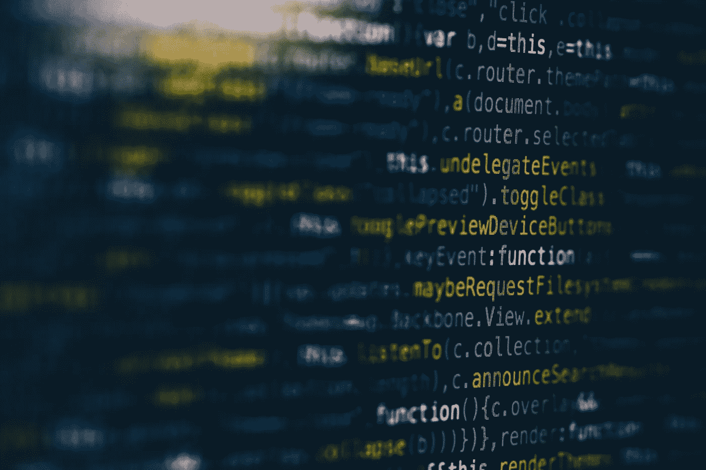

# 在新冠肺炎期间开始数据科学

> 原文：<https://towardsdatascience.com/starting-data-science-during-covid-19-199931a6f902?source=collection_archive---------67----------------------->

## 我学到了什么

马库斯·斯皮斯克在 [Unsplash](https://unsplash.com/s/photos/data?utm_source=unsplash&utm_medium=referral&utm_content=creditCopyText) 上的照片

自学一项新技能并不容易。

为了事业自学一套新的技能，绝对不容易。

自学是一种承诺，需要专注和奉献，最重要的是，**时间**。

如果你正在阅读这篇文章，我会假设你很有可能在某个时候听说过数据科学家被归类为 21 世纪最性感的工作******。你在谷歌上搜索，看到各种来源的报告称，目前数据科学家短缺，需求将继续快速增长。在你的研究过程中，你发现了吸引每个人注意力的主要东西，他们的薪水。在浏览互联网寻找成为数据科学家所需的一些先决条件时，您开始注意到一些趋势，例如:******

*   ******Python 中的知识******
*   ******结构化查询语言******
*   ******统计数字******
*   ******线性代数******
*   ******离散数学******
*   ******结石******
*   ******机器学习******
*   ********拥有硕士或博士学位********

****这个清单还在继续。****

****突然之间,“21 世纪最性感的工作”听起来像是要花一个世纪的时间才能获得这项工作的技能。****

****还是会？****

****时间是我们生命中最重要的东西。回到我上面提到的列表，许多人开始远离学习数据科学，因为他们没有时间去学习一切。****

****这是百分之百可以理解的。大多数对学习数据科学感兴趣的人无法仅仅离开生活几个月到一年来学习所有这些复杂的主题。我也是有同样问题的人之一，但是后来新冠肺炎来了。****

# ******我的故事******

****新冠肺炎迫使我们许多人(包括我自己)呆在家里，让许多人失业。起初，我对自己说“我应该利用这段自我隔离的时间，最终学会数据科学”。****

****说起来容易做起来难。****

****自学一项新技能并不容易。****

****学习一项新技能，尤其是在当前的世界形势下，由于新冠肺炎和乔治·弗洛伊德被恐怖杀害后在世界范围内点燃的大规模抗议活动。这是一个很难集中注意力和学习的时期，尤其是对我来说，作为一名年轻的非裔美国男性，我目睹了社交媒体上爆发的一切。****

****然而，在**无数次尝试**学习数据科学之后，我现在**终于看到了进步**，为我自己在这个领域的成功铺平了道路。****

****在过去的两年里，我断断续续地试图学习这门学科。我尝试过各种 MOOC，比如 DataCamp、Coursera、Codecademy、Udacity 等等。****

****虽然我在学习时理解了这些网站上教授的主题，但我从未能够记住这些信息。我一点也不想诋毁这些网站。它们是非常好的学习资源，许多人利用它们获得了成功。我不是他们中的一员，而**需要一种不同的方式**。我会学到一些东西，然后第二天就忘了怎么做。这是一个重复的循环，我完成了模块，但没有感觉到我学到了什么。****

****四月初的某一天，我在 YouTube 上遇到了一位名叫 [Ken Jee](https://medium.com/@kenneth.b.jee) 的数据科学内容创作者。我看了他的第一个视频，我记得他说过**学习数据科学的最佳方式是做项目。******

****就在那一刻，我的脑海里突然灵光一现。****

****我在他的 YouTube 频道[上浏览了他的一个播放列表，在那里他讲述了如何从项目规划阶段到部署模型来处理一个数据科学项目。我彻底地看完了他的教程系列，并把它作为我自己的项目重新创建。我不仅学到了东西，而且我正在**实施它们**并将这些概念应用到一个真实的项目中。通过这样做，我开始一点一点地保留我所做的事情。](https://www.youtube.com/c/kenjee1)****

****突然间，事情开始变得有意义了。****

****在开发我的第一个项目时，我偶然发现了另一个数据科学内容创作者，名叫 [Chanin Nantasenamat](https://medium.com/@chanin.nantasenamat) ，他在自己的 [YouTube 频道](https://www.youtube.com/c/dataprofessor)上化名为 Data Professor。他创建了一个关于如何用 Hugo 和 GitHub 页面制作数据科学作品集网站的[教程](https://www.youtube.com/watch?v=mEZ1Hj5yQ-8)，我照着做了。这是一个巨大的信心助推器，因为我现在有一个可视化平台来展示我的项目，因为我完成了它们。我会把成品 [**链接到这里**](https://mariorashadhub.github.io/Paul_Portfolio/) 给那些对它的样子很好奇的人。我最喜欢 Chanin 在他的视频结尾经常说的一句话是**“学习数据科学的最好方法是做数据科学”。******

# ****未来计划****

****我现在正在进行我的第二个项目，规划我的第三个项目，并开始在毕马威(KPMG)进行虚拟数据分析实习。我之所以想写这篇文章，是因为我想分享我是如何开始走向成功的故事**，因为我现在正在做**来激励你。世界正在快速变化，与其在以后讲述我是如何做到的，我想现在就写下来，现在作为我正在努力实现我的目标，并告诉你**如果你还没有开始你的数据科学之旅，现在还为时不晚。******

******我将继续记录我的故事和前进的进程。请随时关注我，并留下来了解我和我的旅程。******