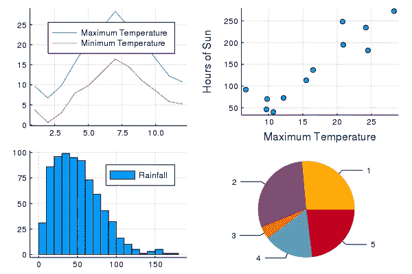
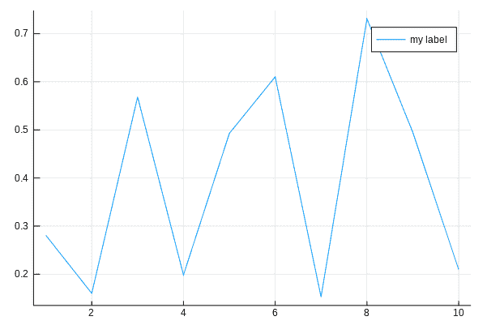
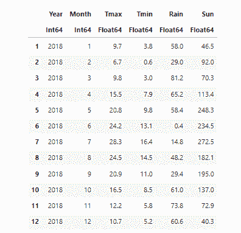
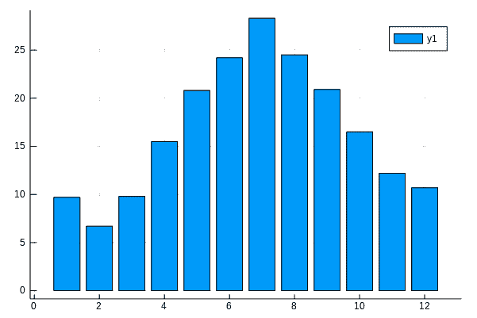
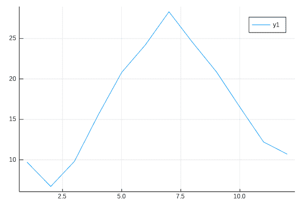
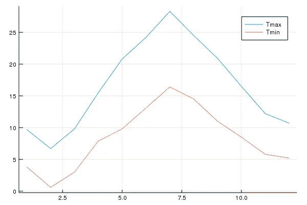
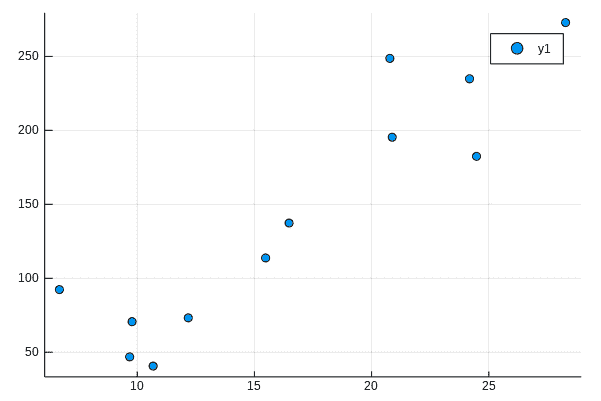
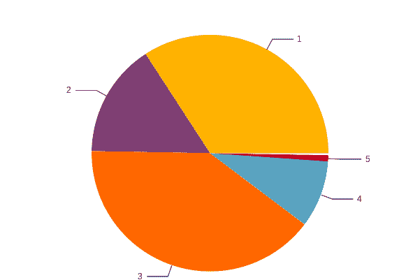
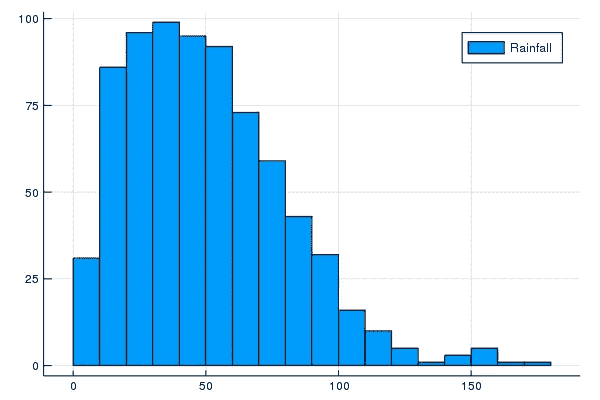

# 使用 Julia 语言和 Jupyter 笔记本开始数据可视化

> 原文：<https://towardsdatascience.com/starting-data-visualization-with-the-julia-langauge-and-jupyter-notebooks-289bc9f0cd09?source=collection_archive---------21----------------------->

## 使用 Julia 和 Jupyter，您几乎不需要任何编程知识就可以制作出令人印象深刻的数据可视化。



不久前，我写了一篇关于使用 Julia 和在线 Jupyter 笔记本环境 JuliaBox 进行数据可视化的文章。当时 JuliaBox 是一项免费服务；不幸的是，情况不再是这样了——它不贵，但也不是免费的。

这是那篇文章的一个新版本，你可以使用你自己的 Jupyter 笔记本环境(这个环境是免费的)。你需要安装 Jupyter 笔记本，Julia 语言，然后配置它们以便 Jupyter 了解 Julia。

如果这听起来很复杂，别担心，一点也不复杂。

# Jupyter 笔记本

你首先需要的是一个 Jupyter 笔记本。如果你已经安装了，那就太好了。如果没有，你应该遵循这篇文章:

[](https://projectcodeed.blogspot.com/2019/08/setting-up-jupyter-notebooks-for-data.html) [## 使用 Anaconda 为数据可视化设置 Jupyter 笔记本](https://projectcodeed.blogspot.com/2019/08/setting-up-jupyter-notebooks-for-data.html) 

(这篇文章关注的是 Python，但是因为 Jupyter 要求安装 Python，所以这里没有什么不相关的。)

# 朱莉娅

Julia 是一种相对较新的数据分析语言。它有一个高级语法，旨在易于使用和理解。有人称之为新 Python。

然而，与 Python 不同的是，它是一种编译语言，这意味着尽管它像 Python 一样容易编写，但它运行得更快，因为它被转换为更容易被计算机理解的低级代码。如果您必须处理需要大量处理的大型数据集，这非常有用。


与 Python 相比，Julia 对程序的布局也没有那么挑剔。

Julia 拥有现代编程语言的所有特性，但是在这里，我们将看看 Julia 的数据可视化能力。这些既令人印象深刻又易于使用。

一旦你安装了 Julia 和 Jupyter，你就可以创建运行 Julia 代码的 Jupyter 笔记本，执行它们并导出为 HTML。您可以将可视化保存为标准的 *png* 文件，并将其保存到您的文档中。

如果您想完成本文中的示例，可以下载数据文件和 Jupyter 笔记本，用于您自己的设置。我会把链接放在文章的最后。

# 安装 Julia

要安装 Julia，你需要去 https://julialang.org/的[下载适合你操作系统的版本。安装很简单，只需按照说明操作。](https://julialang.org/)

一旦你安装了它，你需要做几件事情。因此，启动 Julia，您将在如下窗口中看到命令提示符:


第一件事是允许朱庇特和朱莉娅互相交谈。在提示符下键入此内容，然后按<return>:</return>

```
using Pkg
```

这告诉 Julia 您将使用包管理器。然后键入以下内容并点击<return>:</return>

```
Pkg.add("IJulia")
```

IJulia 是将 Jupyter 和 Julia 联系起来的包裹。您可能需要等待它下载和安装。

一旦你安装了 IJulia，你就可以用 Jupyter 打开一个新的笔记本，用 Julia 代替 Python。

现在你需要添加几个我们将在教程中用到的包。键入以下几行:

```
Pkg.add("Plots")
```

和

```
Pkg.add("CSV")
```

和

```
Pkg.add("DataFrames")
```

稍后您将会用到这些软件包。

现在，您可以通过执行以下命令来关闭 Julia:

```
exit()
```

或者简单地关上窗户。

现在你可以开始了！所以，使用 Julia 作为内核，启动一个 Jupyter 笔记本，开始行动吧。

# 朱莉娅·图斯

与大多数其他语言一样，Julia 依赖于特定专业用途的代码库。我们最初感兴趣的一个叫做*图*。这为我们提供了创建数据可视化的能力。

所以我们需要执行的第一段代码是这样的:

```
using Plots
```

当你在笔记本的代码单元中输入这个代码并按下 *ctrl/enter* 执行它时，它会告诉 Julia 加载我们将用来创建可视化的库。

当您第一次执行笔记本中的单元格时，可能需要一点时间来执行。这是因为 Julia 代码是在第一次执行时动态编译的。后续的代码运行要快得多。

[](https://projectcodeed.blogspot.com/2020/02/plotting-with-pandas-introduction-to.html) [## 用熊猫绘图:数据可视化导论

### 可视化数据使您有机会深入了解数据元素之间的关系，从而…

projectcodeed.blogspot.com](https://projectcodeed.blogspot.com/2020/02/plotting-with-pandas-introduction-to.html) 

# 你的第一次想象

我通常将不同的代码放入笔记本的新单元中。这意味着我只需要运行我需要的代码，而不是整个笔记本。我建议你也这样做，所以在一个新的单元格中我键入了下面的代码:

```
x = 1:10; y = rand(10); # These are the plotting data 
plot(x,y, label="my label")
```

运行它产生了下图:



第一次朱莉娅可视化

令人印象深刻。让我解释一下这是怎么回事。

*x = 1:10；y =兰特(10)；#这些是绘图数据*

这位代码创建两位数据，一位称为
*x* ，另一位称为 *y* 。 *x* 被赋予从 1 到 10 的数字范围的值，而 *y* 被赋予 10 个伪随机数的范围(每个伪随机数将具有 0 到 1 之间的值)。因此，我们在这里有一个图形的基础:一个范围从 1 到 10 的 x 轴和 x 轴上每个点的 y 值。

下一步很简单。

*plot(x，y，label= "我的标签")*

这段代码调用一个函数来绘制图表，我们所做的就是给它 x 和 y 值——另外，我们还给它一个标签。

这很简单，但是，当然，我们真的想可视化一些真实的数据。

我有几个表，我在其他文章中用过。这是一组关于过去几十年英国伦敦天气的数据。我是从英国气象局提供的公共表格中推导出来的。

数据记录了每个月记录的最高温度、最低温度、降雨量和日照时数。我有两个文件，一个是完整的数据集，一个是 2018 年的，只有。它们是 CSV 格式的，就像您可以导入到电子表格中一样。

为了处理这些文件，我们需要另一个允许我们读取 CSV 文件的库。

我们可以看到在下一段代码中引用的库，即`using CSV`，下面一行实际上是将数据读入变量`d`，这是一个 DataFrame。

```
using CSV
d = CSV.read("london2018.csv", DataFrame)
```

运行代码的结果是，我们现在有了一个如下所示的数据表:



# 来自有意义数据的图表

我们下载的数据是一个表格，有 6 栏:`Year`、`Month`、`Tmax` (最高温度)、`Tmin` (最低温度)、`Rain` (降雨量毫米数)和`Sun` (日照时数)。

这是数据的子集(仅针对 2018 年)，因此`Year` 列在所有行中具有相同的值。

# 条形图

所以，我们有的是 2018 年每个月的数据。如果我们想在柱状图中绘制每个月的最高温度，我们可以这样做:

```
bar(d.Month, d.Tmax)
```

*bar* 是一个绘制条形图的函数(还有什么？)并且我们提供了 x 和 y 轴的列。我们通过使用数据表的名称，后跟列的名称来实现这一点。这两个名字用一个点隔开。

这里，我们将列`Month` 作为 x 轴，将`Tmax`作为 y 轴，因此我们在表格中绘制了 12 个月中每个月的最高记录温度。

将它放入一个新的代码单元并运行它，您会惊喜地(我希望)看到这个图表:



条形图

# 折线图

如果你想制作一个折线图，你可以做同样的事情，但是使用函数`plot`

```
plot(d.Month, d.Tmax)
```



折线图

如果您想在同一张图表上绘制最高和最低温度，您可以这样做:

```
plot(d.Month, [d.Tmax, d.Tmin], label=["Tmax","Tmin"])
```

请注意，`d.Tmax`和`d.Tmin` *，*这两个值在方括号中组合在一起，并用逗号分隔。这是向量或一维数组的符号。此外，我们还为线条添加了标签，这些标签以相同的方式分组。我们得到了这样一个图表:



# 散点图

或者散点图怎么样？散点图通常用于查看是否可以在数据中检测到模式。这里我们绘制了最高温度与日照时数的关系图。正如你所料，这是一种模式:一种明显的相关性——日照时间越长，气温越高。

```
scatter(d.Tmax, d.Sun)
```



# 圆形分格统计图表

我们拥有的数据并不适合被描绘成饼图，所以我们将再次生成一些随机数据— 5 个随机数。

```
x = 1:5; y = rand(5); # These are the plotting data
pie(x,y)
```



# 柱状图

现在，我们将加载更多的数据:

```
d2 = CSV.read("londonweather.csv"`, DataFrame)
```

这类似于我们一直使用的数据表，但更大，因为它涵盖了几十年的数据，而不仅仅是一年。这给了我们大量的降雨量数据，这样我们就可以看到伦敦在一段较长的时间内的降雨量分布。

```
histogram(d2.Rain, label="Rainfall")
```

这是结果。



# 保存图表

在 Jupyter 环境中看到这些图表当然很好，但是为了有用，我们需要能够保存它们以便在我们的文档中使用它们。

您可以像这样保存图表:

```
histogram(d2.Rain, label="Rainfall") 
savefig("myhistogram.png")
```

运行此代码时，不会显示图表，但会以给定的文件名保存。

# 结论

我希望这是有用的——我们已经查看了 Julia Plots 中可用的基本图表。朱莉娅的故事远比我们在这篇短文中看到的要多，你也可以用情节做更多的事情，但我希望你已经发现这篇介绍已经激起了你探索更多的欲望。

## 下载

右键单击下面的三个链接下载文件，然后将它们复制到 Jupyter 将使用的目录中。然后在你的文件列表中打开 *plotweatherjulia.ipynb* 。

笔记本在这里: [plotweatherjulia.ipynb](https://github.com/alanjones2/dataviz/raw/master/plotweatherjulia.ipynb)

而数据文件在这里: [london2018.csv](https://github.com/alanjones2/dataviz/raw/master/london2018.csv) 和 [londonweather.csv](https://github.com/alanjones2/dataviz/raw/995f48b31ab4b9a1af32352042b5e6cfe83ebf3b/londonweather.csv)

一如既往，感谢阅读。如果你想知道我什么时候发表新文章，请考虑在这里注册一个电子邮件提醒。

如果你不是一个媒体订阅者，那就注册吧，这样你就可以每月花 5 美元阅读尽可能多的文章。在这里注册我会赚一点佣金。