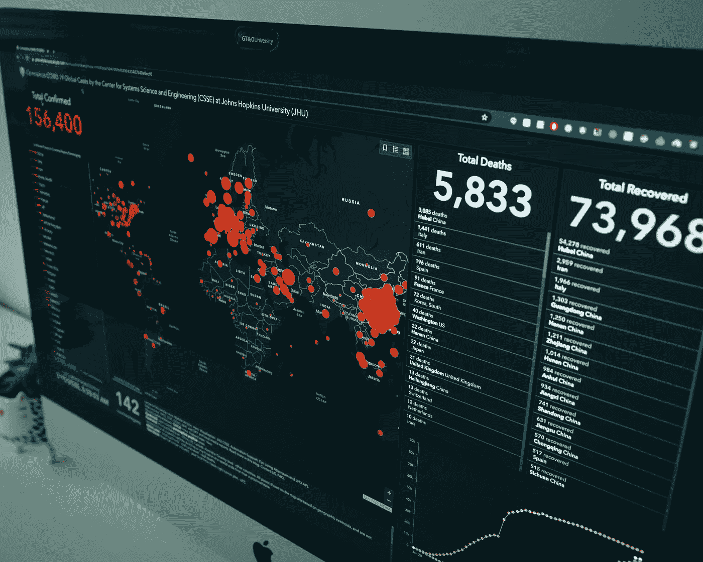
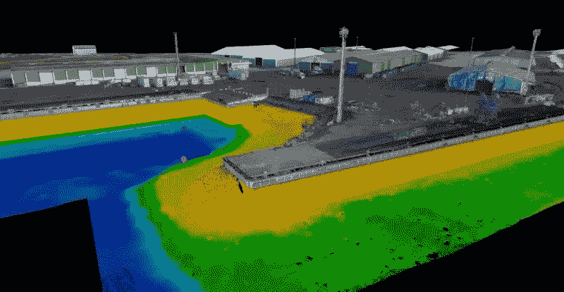

# 社会影响评价中的 GIS-云集成

> 原文：<https://towardsdatascience.com/starting-over-61d16c1eece1?source=collection_archive---------65----------------------->

## 从零开始…在疫情的中间。

现在我们开始看到隧道的尽头，经济和社会后果开始出现，不仅对经济的稳定，而且对我们的社会福利制度的稳定构成严重威胁。

回顾 2012 年，在完美经济风暴期间，我发起了一项提案，为马德里的一个相关非政府组织实施一个关于地理信息系统(GIS)的试点项目。

尽管 2012 年和 2020 年的危机起源不同，但两者在社会经济层面的影响可以作为案例研究。

数据库的管理、其与 GIS 平台(如 [Esri 的 ArcGIS](https://www.esri.com/en-us/arcgis/about-arcgis/overview) )的兼容性以及预测模型的开发是试点项目开发过程中出现的几个挑战之一。

在过去十年中，数据库管理和处理领域以及地理信息系统平台方面的技术进步取得了巨大进步，特别是结合了云平台等技术里程碑的发展。

地理信息系统平台已证明其在报告疫情演变能力方面的有用性。照片:[克莱班克斯。去飞溅](https://unsplash.com/photos/_Jb1TF3kvsA)

现在，在新冠肺炎造成的复杂背景下，我想知道云平台的兴起如何帮助研究和分析疫情在社会经济层面的影响。

> 在云平台上开发的新应用能否为新冠肺炎社会经济影响的 GIS 研究中的大数据管理、预测分析、人工智能或人工智能提供解决方案？

# 社会影响评估中的地理信息系统(SIA)

由硬件、软件和地理参考数据集成的地理信息系统优化了与非营利组织活动的地理规划有关的问题的解决方案。

在这方面，地理信息系统支持该组织开展的咨询、分析和研究，缩短了分析人员在研究不平等和贫困问题上花费的时间。这优化了组织的生产力和效率。

在 2012 年经济危机最糟糕的时刻，许多慈善和非营利组织在缓冲西班牙经济危机的影响方面做了大量得到认可的工作。此外，对该国城市地区的贫困和社会不平等进行了许多研究。

这意味着这些组织必须在其不同的行政管理级别(如街道、社区、地区)处理大量数据。

这些组织每年生成的信息给分析人员带来了各种各样的困难，特别是在数据处理和解释方面。这主要是由于组织活动产生的数据的数量、异质性和多样性。

事实上，近年来出现了几个专门为非政府组织使用 GIS 技术的机构，以填补直到最近还不存在的空白。

我的建议侧重于为该组织的活动管理实施一个地理信息系统平台，包括其数据管理规划和外部开发战略。

在非政府组织内部管理和操作大量数据的过程中实施地理信息系统，有助于以更有效的方式优化宝贵的资源，并更好地了解其活动产生的信息。

 [## 人道主义者的制图和信息管理

### 此刻，全世界的注意力都集中在一件事上:新冠肺炎疫情。卡通正在适应它的…

www.cartong.org](https://www.cartong.org/) 

除了优化信息和大数据的管理之外，GIS 为非政府组织提供的另一个好处是，从质量上提高了非政府组织宣传该地区慈善过程以及该组织所做的任何其他工作产生的影响和外联效益的能力。

在这方面，在采用 GIS 平台之前，在基于网络的 GIS 社会影响评估中有三个关键因素需要考虑**。**

****通过识别管理和操作中的困难，优化组织的内部数据库**,并通过促进持续更新，促进其在未来 GIS 项目中使用的标准化。**

**通过设计和实施与地图生成一样灵活的**沟通策略**，加强组织工作的沟通，让更多潜在受众了解非政府组织所做工作的范围。**

****在分析、管理和组织的数据生产过程中引入新的信息技术工具**。地理信息系统将允许在第一阶段确定与该组织的数据管理有关的问题。**

# **云的影响**

**从大数据和工业生产力解决方案到人工智能(AI)和机器学习(ML)应用的开发，云技术已经成为不同行业不同用途的关键基础设施。**

**例如，在[教育部门](https://www.esri.com/news/arcwatch/0312/gis-in-education-the-web-and-beyond.html)，通过响应与*在线*教育相关的临时需求，大数据管理的发展显示了最相关的云平台特性之一，即**灵活性**。**

**此外，医疗保健等战略行业的大数据管理是云技术最有趣的方面之一。患者信息的保护和 GDPR 的实施直接影响到医院备份向云的渐进迁移，以及医院网络从云中生成的异构数据的管理。**

**除了灵活性，更值得注意的方面是云平台的**可扩展性**和**可靠性**。这一点在管理大量异构数据时尤为明显，例如公共或私人医疗保健系统。医院备份迁移、客户行为预测模型开发、营销活动或零售消费者研究中的成本节约是一大优势。**

**成本节约、灵活性、无缝维护和易于部署，使云平台成为社会经济、环境和战略基础设施管理等领域 GIS 分析发展的最佳选择。**

****

**云平台在 3D 制图的最新发展中展示了它们的潜力。来源:[吉斯格罗](https://www.gisgro.com/)**

# **GISers 的新机遇**

> **“云 GIS 可以定义为*在可扩展的弹性环境中使用虚拟化平台或基础设施的下一代按需 GIS 技术”。***
> 
> ***(相关:* [*云 GIS 定义*](https://gislounge.com/cloud-gis-terms/) *)***

**毫无疑问，云平台为现有技术和基于众所周知的概念(如 GIS)的新兴技术带来了新的机遇。**

**云技术彻底改变了 GIS 分析师的工作方式。尽管 GEO 部门在其工作流程中采用云平台的速度很慢，但大量 GIS 组织和咨询公司已经将项目转移到了云上。**

**在地图中生成的大数据现在可以在云中实时管理，由于有了云，最近只为桌面开发的工具现在可以在 Web-GIS 版本中使用。**

**许多在云中开发的应用程序现在允许管理大型 GIS 数据库存储。**

**例如，开发机载栅格技术的公司就属于这种情况，这些公司不仅将云作为向客户提供更快、更简单服务的基础，还将其作为在不同领域开发新的有用应用的结构，例如工程和复杂基础设施的维护。**

** [## GISGRO -在线 3D 资产管理平台

### GISGRO 智能易用的基础设施管理在线平台。使用 GISGRO 建立一个数字孪生…

www.gisgro.com](https://www.gisgro.com/?gclid=CjwKCAjwi_b3BRAGEiwAemPNUxEDd2gGX6SU6t8BdUrXjHf2a9xc7x26NaQ3rzOJMuBIi3nWBWtAfhoC5LcQAvD_BwE) 

3D 建模技术广泛应用于灾害和应急管理，特别是在需要快速有效评估的世界偏远地区。

## 云-GIS 集成的其他优势:

**处理**大量数据、应用程序、地理空间分析的可能性，以及与其他用户实时共享它们的可能性。

**投资回报(ROI)优化。**共享和发布地图的时间更少，数据/地图始终可用；

能够**选择各种部署、服务和业务模式**以最适合组织的目标。

可用性 24H/7 :在未来的地理信息系统项目中，非政府组织将可以在任何时候访问从创建的图层生成的文件，以促进可用性。
在这一点上，实施云技术是有意义的。这将节省外包工作的成本，该机构在未来完全可以做得很好。

**建议优先采用 GIS-云模型**

在云平台中实施基于 web 的 GIS 之前，要考虑的最重要的方面总结如下:

**a)组织活动领域的活动定义**。这将允许管理层优化所需的潜在资源。

**b)详细了解该组织的工作**、空间和主题，详细描述该地区不同行政级别慈善流程的位置。

**c)数据库的改进、同质化和标准化**。由于数据量巨大，许多非营利组织发现他们的数据库缺乏管理。这不仅将迫使未来的研究，而且内部信息管理的重组。**