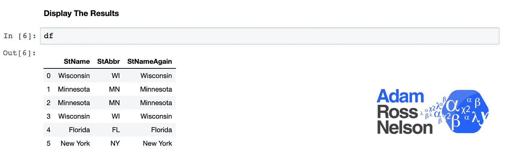

# 州名到州名缩写人行横道

> 原文：<https://towardsdatascience.com/state-name-to-state-abbreviation-crosswalks-6936250976c?source=collection_archive---------36----------------------->

图片来源:“Via Design Pickle”——[更多关于属性](https://adamrossnelson.medium.com/image-credit-attributions-a24efcc730ad)。

## 我不得不第一百万次穿过州名和州名缩写。

## 概观

作为一名数据科学家、研究人员或任何类型的数据从业人员，您已经拥有或将最终拥有一个列出州名的数据集。但是，你需要州名缩写。或者可能正好相反。

对于初学者，甚至是中级数据专家来说，这可能是一项棘手而繁琐的任务。我花了一点时间来分享一个快速(并且在许多用例中容易应用)的方法来解决这个问题。

上面代码的输出。图片来源:“作者截屏”——[更多关于属性](https://adamrossnelson.medium.com/image-credit-attributions-a24efcc730ad)。

## 警告

*   只有当负责 clerk.org 的法院的好书记官将 html 表放在适当的位置时，这段代码才会起作用。此外，该表仍然是指定位置的第一个可用表。
*   只有在 clerk.org 的表格准确无误的情况下，这个代码才会起作用。你应该四处找找其他的桌子。或者，将一个放在容易拿到的地方供自己使用。
*   此代码假设您已连接到互联网。
*   这段代码的预期功能还假设原始数据集正确且一致地拼写了每个状态。也没有其他印刷错误。

 [## 加入我的介绍链接媒体-亚当罗斯纳尔逊

### 作为一个媒体会员，你的会员费的一部分会给你阅读的作家，你可以完全接触到每一个故事…

adamrossnelson.medium.com](https://adamrossnelson.medium.com/membership) 

# 感谢阅读

感谢阅读。把你的想法和主意发给我。你可以写信只是为了说声嗨。如果你真的需要告诉我是怎么错的，我期待着尽快和你聊天。Twitter:[@ adamrossnelson](https://twitter.com/adamrossnelson)LinkedIn:[Adam Ross Nelson 在 Twitter](https://www.linkedin.com/in/arnelson) 和脸书: [Adam Ross Nelson 在脸书](https://www.facebook.com/adamrossnelson)。