# 田纳西州新冠肺炎分析

> 原文：<https://towardsdatascience.com/state-of-tennessee-covid-19-analysis-6933b7bd35bf?source=collection_archive---------29----------------------->

这是一篇让州领导和公民更好地了解田纳西州冠状病毒数据的文章，以及为什么严格遵守社交距离如此重要。有很多图表和表格！跟着我。

**关于数据限制—** 数据分析师总是不愿意使用他们知道不完整、不具代表性或存在固有缺陷的数据。缺乏全面的测试无疑使这些数据集有资格被谨慎对待。

**该州确诊病例数量较低——原因如下**

**测试可用性滞后**:根据 tn.gov 的数据，截至 2010 年 3 月 31 日营业结束时，田纳西州目前已经进行了大约每百万人 4011 次测试。Quest 官方表示，他们的平均测试处理时间为 4-5 天，然而，我的一名直系亲属在加州的一家医疗协会工作，负责联络医生和医院管理人员，他们表示测试处理积压了 10 天的等待时间。我的丈夫是当地呼叫中心的经理，他有一个阳性病例——一名被感染的员工在 10 天后终于收到了他的测试结果。像这样符合等待时间的轶事开始被全国性的报道所报道。

**即使我们没有获得数据，指数增长仍在发生:**这种滞后表明，在过去 10 天左右进行的任何测试实际上都没有实时报告，而是滞后 10 天。根据过去 24 小时内报告的病例数量，我们每天检测大约 1，000 人。1000 次测试乘以 10 天，等于 10000 次未报告的测试。目前大约有 10%的测试呈阳性，所以根据非常粗略的估计，这意味着在 3 月 27 日 20 日写这篇文章时，田纳西州可能有超过 2300 例病例，而不是该州报告的[1321 例。但是事情是这样的，指数增长意味着案件会继续指数增长，而测试 ***不是*** 。](https://coronavirus.jhu.edu/map.html)

田纳西州活跃案例的增长率根据当前图表*的线，不包括 3/31/20* 处的急剧上升轨迹，当前增长率为. 2915。如果你应用简单的指数增长方程，它预测到 4 月 10 日有 33，000 个病例。增长率为 0.15(明显低于自病例 1 以来的大多数 24 小时内的增长率)，预计到 4 月 10 日将有 30，000 例病例。虽然这确实是推测性的，但可以肯定的是，检测报告中的任何积压都意味着该州的实际确诊病例仅在积压开始的最后一天有效。

**只有有共同症状的患者才会接受测试**:你必须在有资格接受测试之前接受评估，而且评估仅基于最普遍或最严重的症状。这意味着，在任何给定的时间，可能会有几倍以上的轻微和不明原因的病例不符合检测条件——这些人，虽然他们自己不是一个问题——*正在成为其余人口的疾病宿主*。有几个突出的当地例子说明了这一点。回到 3 月 8 日，一名在& T 塔(蝙蝠侠大楼)的[工作的员工被报道为一个积极的症状案例。这个人一定是在病毒传播的窗口期来工作的，因为在病例被确认后，他们关闭了大楼进行深度清洁。这意味着 4 天的测试过程，然后 5-14 天无症状，并能够摆脱病毒。这意味着，从 2 月中下旬开始的几天时间里，共用那栋大楼的 2000 名员工有一定的暴露机会。同样的场景在拥有 1500 多名员工的 Murfreesboro 的 State Farm 呼叫中心上演。测试呈阳性的人已经请了一周的病假——我个人对这种情况有所了解。有多少人被感染了？3 月 12 日，Gulch Crossing 办公大楼因一个阳性病例而被关闭进行清洁——这里住着 800 名工人。有多少像这样的场景在未经测试的情况下发生了？其他国家的数据显示我们很快就会知道。](https://www.tennessean.com/story/news/health/2020/03/09/nashville-batman-building-closed-response-coronavirus-concerns/4991068002/)

作为一个州，我们没有获得任何这种数据，也没有用我们报告的[数字](https://www.theatlantic.com/health/archive/2020/03/how-many-americans-are-sick-lost-february/608521/?utm_medium=offsite&utm_source=medium&utm_campaign=all)来说明这一点，这意味着我们没有能力真正为峰值医疗利用率做好准备。

田纳西州的倍增时间平均为 2.75 天:倍增时间是一种控制疾病增长速度的方法。增长率是指数增长方程中的“r ”,它告诉你病毒传播的速度。即使我们在 27 日实际上有 1321 个病例，这意味着三天后我们将有 2600 个病例。六天后我们会有 5200 人。两周内，我们将有近 10，000 个案例。但问题是，在某个时候，速度会开始加快，你会得到更快的传播，因为越多的人被感染，就有越多的人感染其他人。是的，我们的自愿抑制措施肯定有缓解效果。但最重要的是，很可能是机缘巧合给了我们一个宽限期——春假和龙卷风使学校在李州长下达全州范围的命令之前关闭了。学校关闭可能是我们现在看到的抑制曲线的效果——记住所有的缓和都有 10-17 天的滞后。

**图 1:包括田纳西州在内的 7 个州的活跃案例(橙色):**

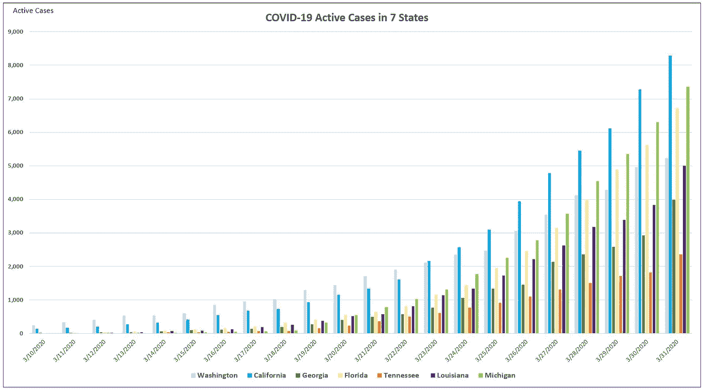

【https://github.com/nytimes/covid-19-data 

在上面的图表中，田纳西州是橙色的，显示了几个类似的南部州，以及爆发时间晚几天的华盛顿和加利福尼亚。田纳西州的增长速度似乎比其他城市慢，原因更可能是 1)病毒在社区传播中的延迟引入，2)学校因龙卷风、春假和冠状病毒而产生的缓解效应，以及主要大学迅速停止校园课程。

**图 2:学校关闭日期**

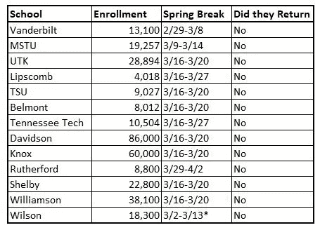

数据来源于校区和大学网页。*表示威尔逊县学区因 2010 年 3 月 2 日的龙卷风停课一周

**图 3:田纳西州的疫情曲线**

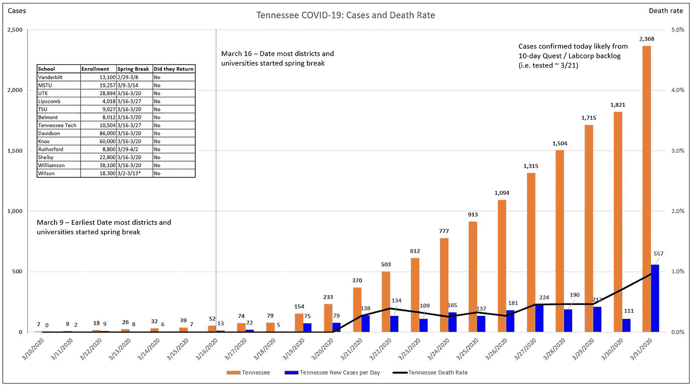

[https://github.com/nytimes/covid-19-data](https://github.com/nytimes/covid-19-data)

上面显示了田纳西州孤立的疫情曲线——橙色是活跃病例，蓝色是每天的新病例。这条曲线与学校停课的时间框架相结合，证实了在中国湖北省和意大利看到的情况。*抑制措施的所有效果从实施到看到活动案例下降有 12-14 天的延迟*。请看以下来自中国和意大利的图片。

**图 4:中国湖北省——全球疫情爆发的中心**

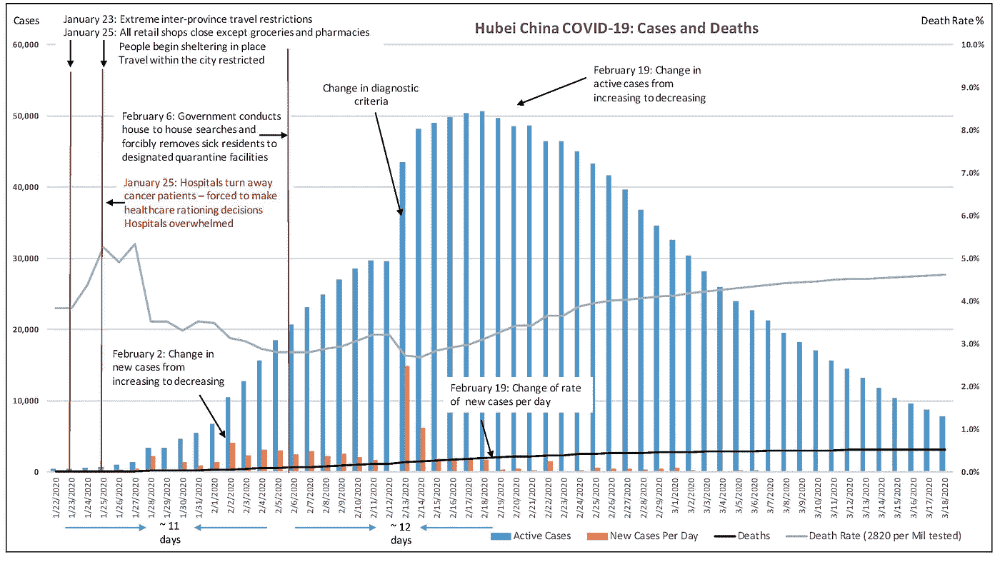

**图 5:意大利**

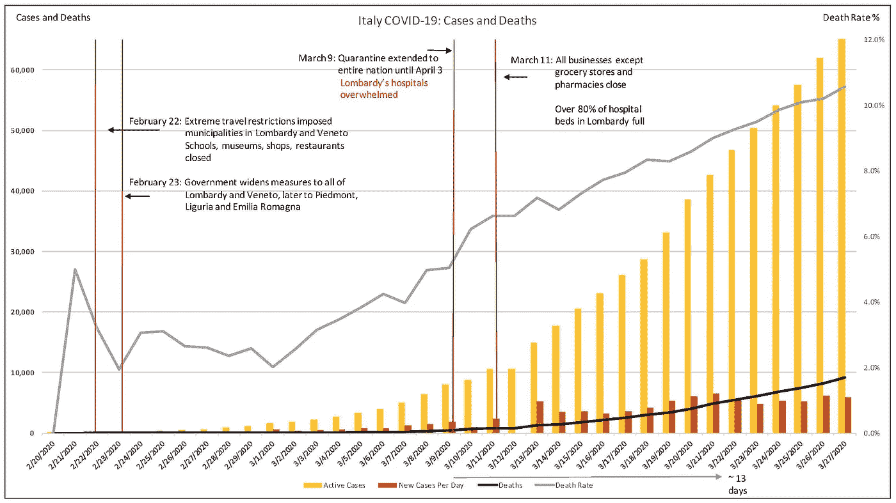

红线表示颁布镇压措施的日期。蓝/黄条表示该国的活跃病例，深橙色表示每天的新病例。每次实施缓解措施后，大约需要 10-14 天才能看到每天新病例的减少。

在中国，每天新增病例开始下降后，又过了 12 天才看到实际活跃病例总数开始下降。

**新冠肺炎和田纳西州及其他州的健康统计**

**图 6:11 个选定州实施缓解措施的新冠肺炎有效案例及日期**

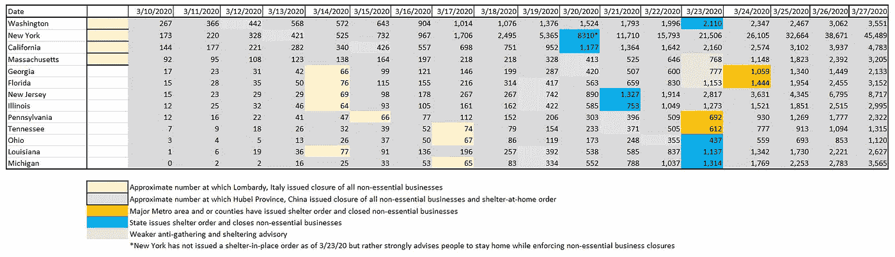

数据来源:【https://coronavirus.jhu.edu/map.html 

浅黄色方框表示意大利在伦巴第地区发布停业和居家命令时的病例数。蓝色表示中国在湖北省发布关闭和居家命令时该省的人数。

**图 7:美国 11 个州的死亡率**

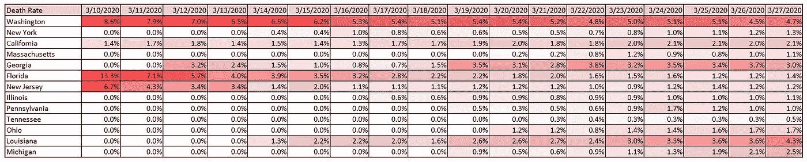

数据来源:[https://coronavirus.jhu.edu/map.html](https://coronavirus.jhu.edu/map.html)

上表显示了这些州目前的死亡率——这通常是对流行病后的真实死亡率进行的回顾性校正。田纳西州极低的数字表明数据报告可能存在滞后，或者在用电高峰之前对相对较少的严重病例进行过度护理的能力。

**图 8:美国 11 个州的增长率**

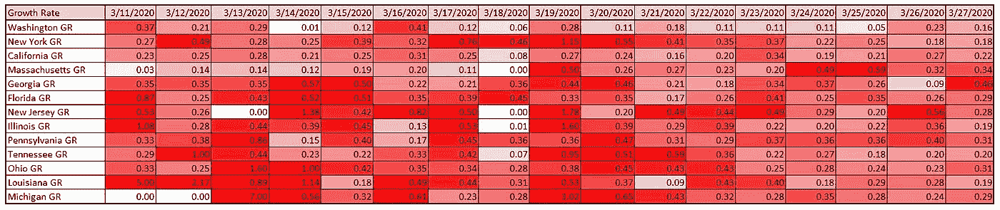

数据来源:[https://coronavirus.jhu.edu/map.html](https://coronavirus.jhu.edu/map.html)

上表显示了增长率，即代数指数增长方程中的变量“r”。当病例增长更快时，这个数字会更高。在其他国家，指数增长并没有减缓到持续低于 0.1，直到他们接近最大活跃病例。这意味着他们有效地限制了受感染的人群。不要指望很快在田纳西州或美国其他州看到这种行为。

**图 9:美国 11 个州的翻倍时间**

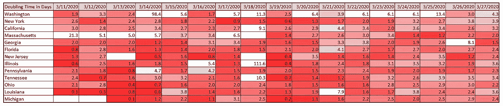

数据来源:[https://coronavirus.jhu.edu/map.html](https://coronavirus.jhu.edu/map.html)

上表显示了以天为单位的倍增时间，每天使用增长率数字进行计算。翻倍时间是指以给定的速度将案例翻倍所需的时间。随着增长率上升，倍增时间下降。

**图 10:美国 7 个州的年龄人口统计数据、新冠肺炎死亡率以及诊断为糖尿病的人口百分比**

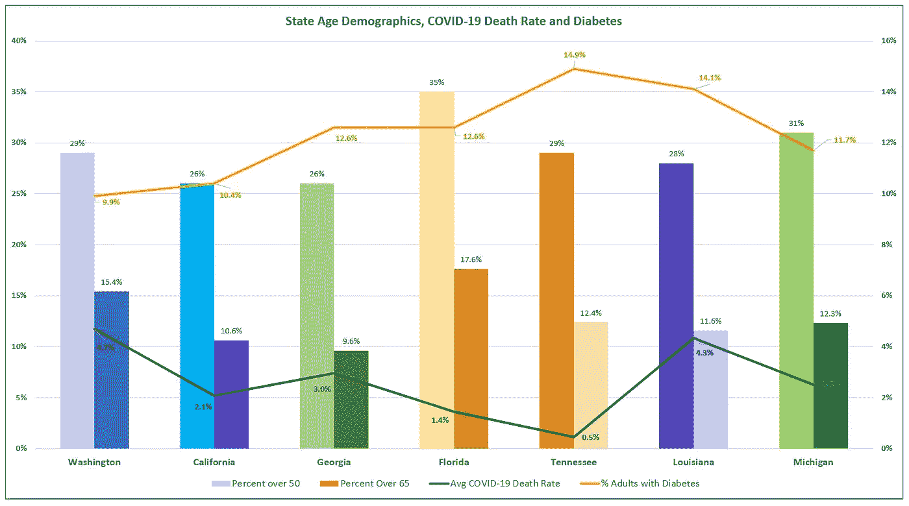

数据来源:Census.gov、[、https://coronavirus.jhu.edu/map.html](https://coronavirus.jhu.edu/map.html)、[https://www . americasheahelhtrankings . org/explore/annual/measure/Diabetes](https://www.americashealthrankings.org/explore/annual/measure/Diabetes)、[https://memphischoard . com/select-Memphis/data-center/population/](https://memphischamber.com/select-memphis/data-center/population/)、[https://www . kff . org/other/state-indicator/distribution-by-age/？current time frame = 0&sort model = % 7B % 22 solid % 22:% 22 location % 22，%22sort%22:%22asc%22%7D](https://www.kff.org/other/state-indicator/distribution-by-age/?currentTimeframe=0&sortModel=%7B%22colId%22:%22Location%22,%22sort%22:%22asc%22%7D)

上表显示了各相似州 50 岁以上和 65 岁以上的人口统计数据，包括田纳西州(橙色)以及新冠肺炎迄今为止的总死亡率(3/27/20)和各州糖尿病人口的百分比(这是增加新冠肺炎死亡率的一个风险因素)。

**图 11:美国 7 个选定州的年龄人口统计、慢性阻塞性肺病和心脏病死亡率**

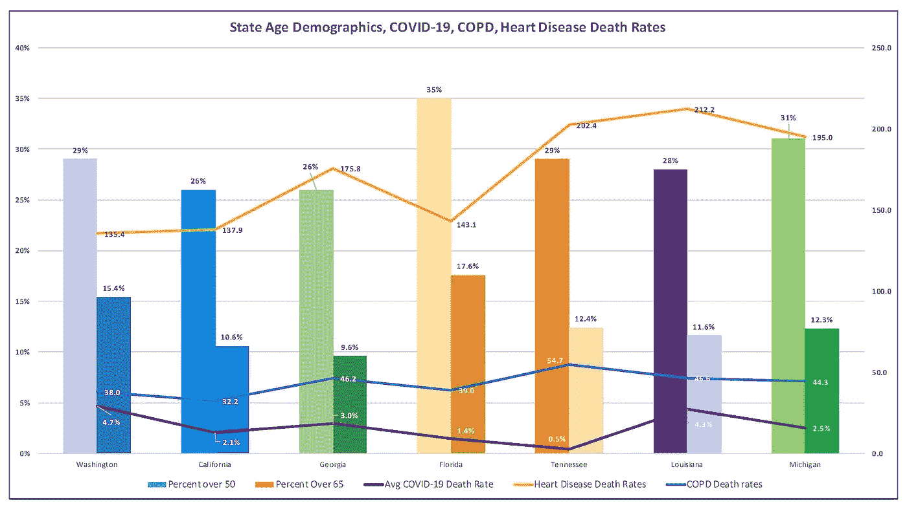

数据来源:Census.gov、[https://coronavirus.jhu.edu/map.html](https://coronavirus.jhu.edu/map.html)、[https://www . americasheahelhtrankings . org/explore/annual/measure/Diabetes](https://www.americashealthrankings.org/explore/annual/measure/Diabetes)、[https://memphischoard . com/select-Memphis/data-center/population/](https://memphischamber.com/select-memphis/data-center/population/)、[https://www.cdc.gov/nchs/pressroom/stats_of_the_states.htm](https://www.cdc.gov/nchs/pressroom/stats_of_the_states.htm)、[https://www . kff . org/other/state-indicator/distribution-by-age/？current time frame = 0&sort model = % 7B % 22 solid % 22:% 22 location % 22，%22sort%22:%22asc%22%7D](https://www.kff.org/other/state-indicator/distribution-by-age/?currentTimeframe=0&sortModel=%7B%22colId%22:%22Location%22,%22sort%22:%22asc%22%7D)

上表显示了与左侧 y 轴相关联的彩色条中 50 岁和 65 岁以上人口的百分比。各种类似的州用田纳西(橙色)表示。较大的条形表示百分比超过 50，较小的条形表示百分比超过 65。当前新冠肺炎累积死亡率(2010 年 3 月 27 日)和每个州每 100，000 人的慢性阻塞性肺病和心脏病死亡率(两者都是增加新冠肺炎死亡率的风险因素)显示为与右侧 y 轴相关的线。[田纳西州是慢性阻塞性肺病死亡率最高的地区，心脏病死亡率第二高](https://www.cdc.gov/nchs/pressroom/stats_of_the_states.htm)。

**图 12:特定州和国家的人口密度和 50 岁以上公民**

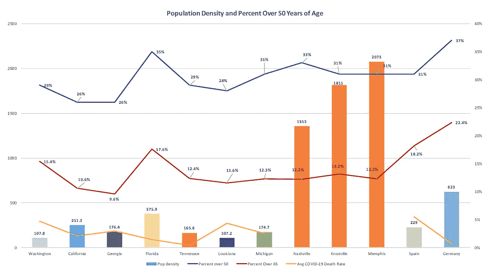

数据来源:Census.gov、[、](https://coronavirus.jhu.edu/map.html)、[https://www . americasheahelhtrankings . org/explore/annual/measure/Diabetes](https://www.americashealthrankings.org/explore/annual/measure/Diabetes)、[https://memphischoard . com/select-Memphis/data-center/population/](https://memphischamber.com/select-memphis/data-center/population/)、[https://www.cdc.gov/nchs/pressroom/stats_of_the_states.htm](https://www.cdc.gov/nchs/pressroom/stats_of_the_states.htm)、[https://www . kff . org/other/state-indicator/distribution-by-age/？current time frame = 0&sort model = % 7B % 22 solid % 22:% 22 location % 22，%22sort%22:%22asc%22%7D](https://www.kff.org/other/state-indicator/distribution-by-age/?currentTimeframe=0&sortModel=%7B%22colId%22:%22Location%22,%22sort%22:%22asc%22%7D)

上图用彩色条显示了给定州和国家的人口密度。蓝线代表 50 岁以上人口的百分比，红线代表每个城市、州或国家 65 岁以上人口的百分比。根据目前可用的文献，从 40 岁开始死亡率增加。黄线表示新冠肺炎各城市、州或国家的当前累积死亡率(如有)。

**图 13:根据中国湖北数据得出的按年龄统计的死亡率**

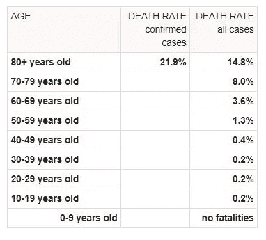

数据来源:[https://www . world ometers . info/coronavirus/coronavirus-age-sex-demographics/](https://www.worldometers.info/coronavirus/coronavirus-age-sex-demographics/)

该图显示了年龄人口统计在评估人群可能风险中的重要性。在中国观察到的死亡风险在 40 岁时增加一倍，并且从那里开始上升。

**图 14:已患疾病者的死亡率**

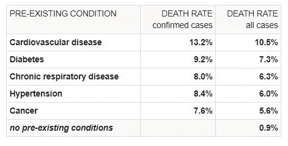

[https://www . worldometers . info/coronavirus/coronavirus-age-sex-demographics/](https://www.worldometers.info/coronavirus/coronavirus-age-sex-demographics/)

该图显示了患有复杂先存疾病的患者的风险有多高，在评估人群风险时也必须考虑在内。[疾病预防控制中心估计，大约 33.2%](https://www.cdc.gov/nchs/fastats/hypertension.htm) 的美国人口患有高血压，田纳西州高于全国平均水平 [38.5%](https://bettertennessee.com/health-brief-hypertension-in-tennessee/) (2017)。

底线是，虽然自愿措施和学校关闭显然会对病例的增长产生抑制作用，但在这个国家有无数自私和粗心的人即使生病也去公共场合*的例子，因为他们认为自己购物的权利比其他人生存的权利更重要。人群中风险最高的个体是我们中最脆弱的人群——温顺的人——我们的孕妇、我们敬爱的老人以及已经在与重大健康问题作斗争的人。*

*新的数据也表明，其他国家和纽约州的年轻人也未能幸免于重症监护室或死亡。纽约大约 25%的住院患者年龄在 20-40 岁之间，40%的患者年龄在 20-54 岁之间。我完全理解田纳西州是一个有自由主义价值观的保守州。但是有一些情况需要强有力的领导干预，数据响亮地显示这是时候了。越多不认真对待这一问题的人暴露出来，反过来又暴露了其他人，越多的脆弱人群将被感染和死亡。*

*绝对没有证据表明病毒的传播会以任何其他方式发展，但呈指数增长——除非实施严格的学校和企业关闭以及留在家中的命令。在田纳西州没有理由“等着瞧”。到我们“看到”的时候，至少 2 周内扭转趋势就太晚了。德国在 48 小时内增加了 20，000 个案例，这些案例都是建议性的，而不是强制性的限制。两周内会发生很多事。*

*我再次敦促你们实施更强有力的措施，要求非必要的企业关闭，人们呆在家里，并帮助医疗机构和必要的企业(实际上是必要的企业)为即将到来的疾病高峰做好准备。*