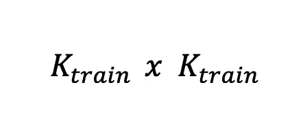
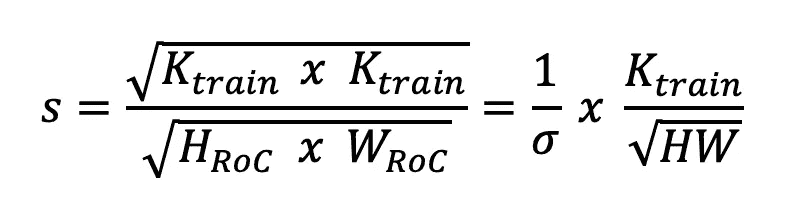
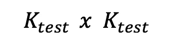
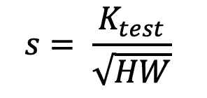
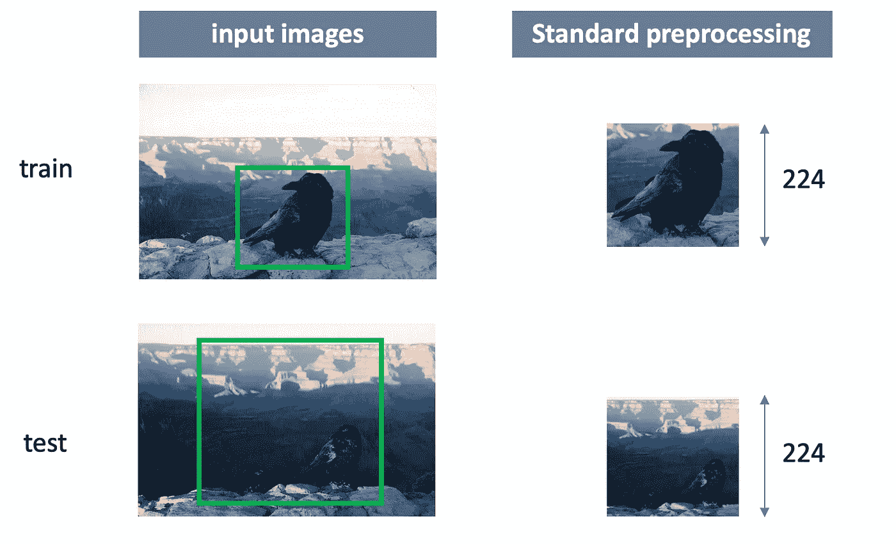
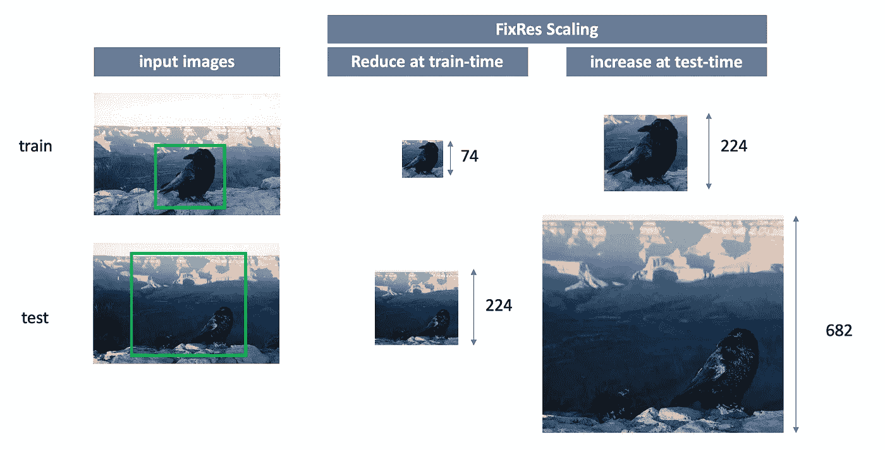
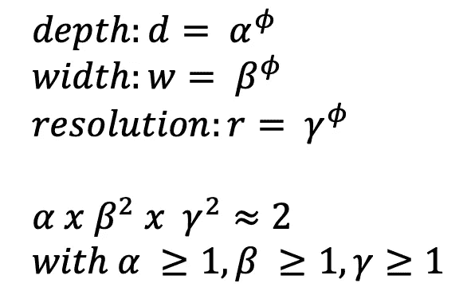
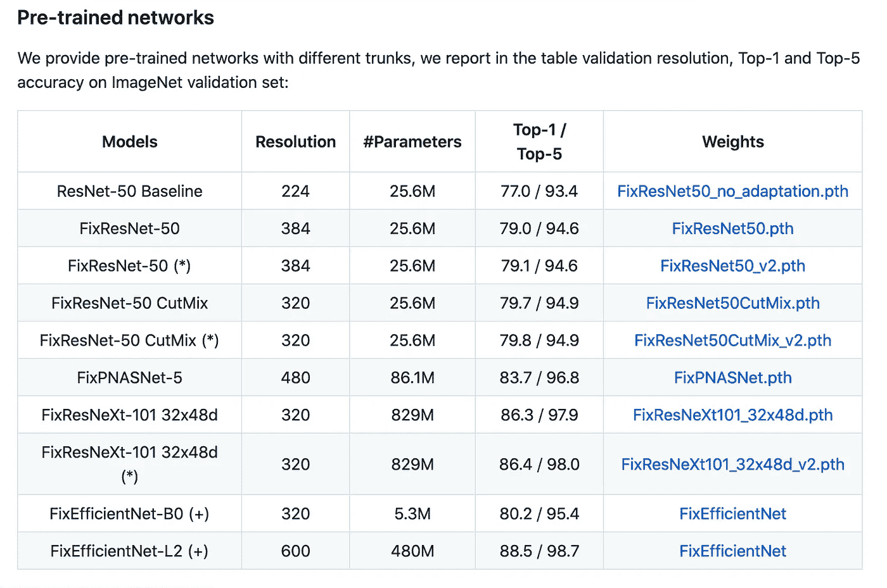

# 最先进的图像分类算法:固定有效网络-L2

> 原文：<https://towardsdatascience.com/state-of-the-art-image-classification-algorithm-fixefficientnet-l2-98b93deeb04c?source=collection_archive---------21----------------------->

## 结合脸书和谷歌人工智能团队的 FixRes 和 EfficientNet

**FixEfficientNet** 是一种结合了两种现有技术的技术:脸书人工智能团队【2】*的 *FixRes* 和谷歌人工智能研究团队首次提出的*efficient net*【3】。FixRes 是 Fix Resolution 的简称，它试图为用于训练时间的 RoC(分类区域)或用于测试时间的 crop 保持固定的大小。EfficientNet 是 CNN 维度的复合缩放，提高了准确性和效率。本文旨在解释这两种技术，以及为什么它们是最先进的。*

*FixEfficientNet 已于 2020 年 4 月 20 日与脸书人工智能研究团队的相应论文一起首次亮相[1]。该技术用于图像分类，是*计算机视觉*领域的一项任务。它目前是最先进的，在 ImageNet 数据集上具有最好的结果，480M 参数，前 1 名准确率为 88.5%，前 5 名准确率为 98.7%。*

*但是，让我们更深入一点，以便更好地理解这些组合技术:*

# *理解修复*

## *训练时间*

*在脸书人工智能研究团队提出 FixRes 技术之前，最先进的技术是从图像中提取随机的像素方块。这被用作**训练时间**的 RoC。(请注意，使用这种技术会人为增加数据量)。然后调整图像大小以获得固定大小的图像(=裁剪)。然后将其输入卷积神经网络[2]。*

*RoC =输入图像中的矩形/正方形
crop =使用双线性插值重新调整到特定分辨率的 RoC 像素*

## *列车时间尺度增强*

*为了更好地理解 FixRes 到底做了什么，让我们来看看数学。改变输入图像中 RoC 的大小会影响给 CNN 的对象大小的分布。对象在输入图像中的尺寸为 ***r x r*** 。如果 RoC 现在被缩放，那么它被改变 s，并且对象的大小现在连续地是 ***rs x rs*** 。*

*对于增强，使用 PyTorch 的 RandomResizedCrop。输入图像的尺寸为***H×W***，从中随机选择一个 RoC。然后这个 RoC 被调整到一个裁剪尺寸*

**

*来源:作者图片。*

*输入图像( ***H x W*** )对输出的裁剪的缩放比例可由以下系数表示:*

**

*来源:作者图片。*

## *测试时间*

*在**测试时间**，RoC 通常位于图像的中心，这导致所谓的*中心裁剪*。来自训练时间和测试时间的两种裁剪具有相同的大小，但是它们来自图像的不同部分。这往往导致 CNN 的分布出现偏差[2]。*

## *测试时间尺度增强。*

*如前所述，测试增强不同于训练时间增强(关键词中心裁剪)。作物的大小*

**

*关于输入图像是正方形(H=W)的假设，测试增强的比例因子可以表示为*

**

****这有什么发现？*** 在 FixRes 开发出来之前，测试的预处理和训练时间是分开开发的，这导致了偏差。连续地，脸书人工智能团队试图找到一个解决方案，同时执行预处理，并以某种方式同步，这就是 **FixRes** 。*

**

*来源:作者图片。*

*如上所述的标准预处理通常会在训练时扩大 RoC**而在测试时缩小 RoC。***

*FixRes 技术采用*非此即彼的方法*。它或者降低训练时间分辨率并保持测试裁剪**的大小，或者**增加测试时间分辨率并保持训练裁剪的大小。目的是检索相同大小的对象(这里是乌鸦)以减少 CNN 中的尺度不变性[2]。这看起来像下面这样:*

**

*来源:作者图片。*

*这导致对如何将数据馈送给 CNN 的两个影响:*

1.  *图像中对象(此处为乌鸦)的大小因固定缩放而改变。*
2.  *不同作物大小的使用对神经元被激活的方式和时间有影响。*

## *变化激活统计的问题*

*Touvron 等人发现，更大的测试作物和最重要的对象大小的调整导致更好的准确性。然而，这是调整对象大小和改变激活统计之间的权衡。*

*测试表明，激活图随着图像分辨率的变化而变化。K_test = 224 导致 7×7 的地图，K_test = 64 导致 2×2 的地图，K_test = 448 导致 14×14 的地图。这表明激活分布在测试时变化，并且值在分类器范围之外[1]。*

*为了解决激活统计的变化问题，提出了两种解决方案:*

1.  ***参数适应:**参数弗雷歇分布用于拟合平均池层。然后，通过标量变换将新分布映射到旧分布，并作为激活函数应用。*
2.  ***微调:**应用校正的另一种方式是模型的微调。微调仅适用于 CNN 的最后几层。*

*在微调阶段，使用标签平滑[1]。*

# *想看更多这样的故事？*

## *[开始使用](https://medium.com/@hucker.marius/membership)*

# *高效网络架构[3]*

*作者预先训练了几个模型，从这些模型中，L2 效率网显示出最好的结果。**但是什么是效率网呢？***

*与大多数图像分类算法一样，有效网络也是基于细胞神经网络的。如果你不知道 CNN 是什么，[点击这里](https://medium.com/@RaghavPrabhu/understanding-of-convolutional-neural-network-cnn-deep-learning-99760835f148)。CNN 有三个维度:宽度、深度和分辨率。深度是层的数量，宽度是通道的数量(例如，传统的 RGB 将具有 3 个通道)，分辨率是图像的像素。*

*EfficientNets 引入了复合缩放，它利用了所有三个维度:*

***宽度缩放** —可以通过增加图像的通道来增加宽度。然而，精度增益下降得相当快。*

***深度缩放** —是常规且最典型的缩放方式。通过增加深度，可以增加神经网络的层数。但是添加更多的层并不总是能提高网络的性能。大多数情况下，它需要更多的时间，但由于渐变消失，随着层数的增加，性能可能会停滞甚至下降。*

***分辨率缩放—** 这意味着增加分辨率和像素数量，例如从 200x200 增加到 600x600。这种缩放的问题是，精度增益随着分辨率的提高而消失。直到某一点，你的精度可能会增加，但精度增量减少。*

*所有三个维度的升级会导致精度增量递减，并且所有三个维度的平衡缩放对于实现最佳精度结果是必要的。因此，建议采用复合缩放:*

**

*来源:作者图片。*

*ɸ指定可用的资源，而阿尔法、贝塔和伽玛负责资源的分配。*

*Touvron 等人[1]“使用神经结构搜索来开发新的基线网络，并将其放大以获得一系列模型，称为 EfficientNets。”神经架构搜索(NAS)优化了 FLOPS 和精度。*

# *结论*

*这两种技术的结合产生了目前图像分类中最好的算法，领先于 EfficientNet Noisy Student。在效率和准确性方面，它都是当前领先的算法。由于其 98.7%的前 5 名准确度，仍有改进的可能性，但它已经相当准确了。因此，它仍然要等待，直到这是一种新的技术取代。*

*由于本文不包含任何实现，您可以使用作者的官方 Github 自行尝试:[http://github.com/facebookresearch/FixRes.](https://github.com/facebookresearch/FixRes)*

*作者[1]的预训练网络如下所示*

**

*github 回购截图。*

***我希望你能理解并喜欢它！***

* [## 请继续关注马里乌斯·哈克的新文章

### 请继续关注 Marius Hucker 的新文章。如果您还没有注册，您将创建一个中型帐户…

medium.com](https://medium.com/subscribe/@hucker.marius)* 

****参考文献*** :*

*[1]h .图夫龙、a .韦达尔迪、m .杜泽和 h .杰古(2020 年 b)。修正训练-测试分辨率差异。ArXiv:2003.08237 [Cs] 。[http://arxiv.org/abs/2003.08237](http://arxiv.org/abs/2003.08237)*

*[2]h .图夫龙、a .韦达尔迪、m .杜泽和 h .杰古(2020 年 a)。修复列车测试分辨率差异。*ArXiv:1906.06423【Cs】*。[http://arxiv.org/abs/1906.06423](http://arxiv.org/abs/1906.06423)*

*[3]谭，米，乐，张庆伟(2020).反思卷积神经网络的模型缩放。 *ArXiv:1905.11946 [Cs，Stat]* 。[http://arxiv.org/abs/1905.11946](http://arxiv.org/abs/1905.11946)*