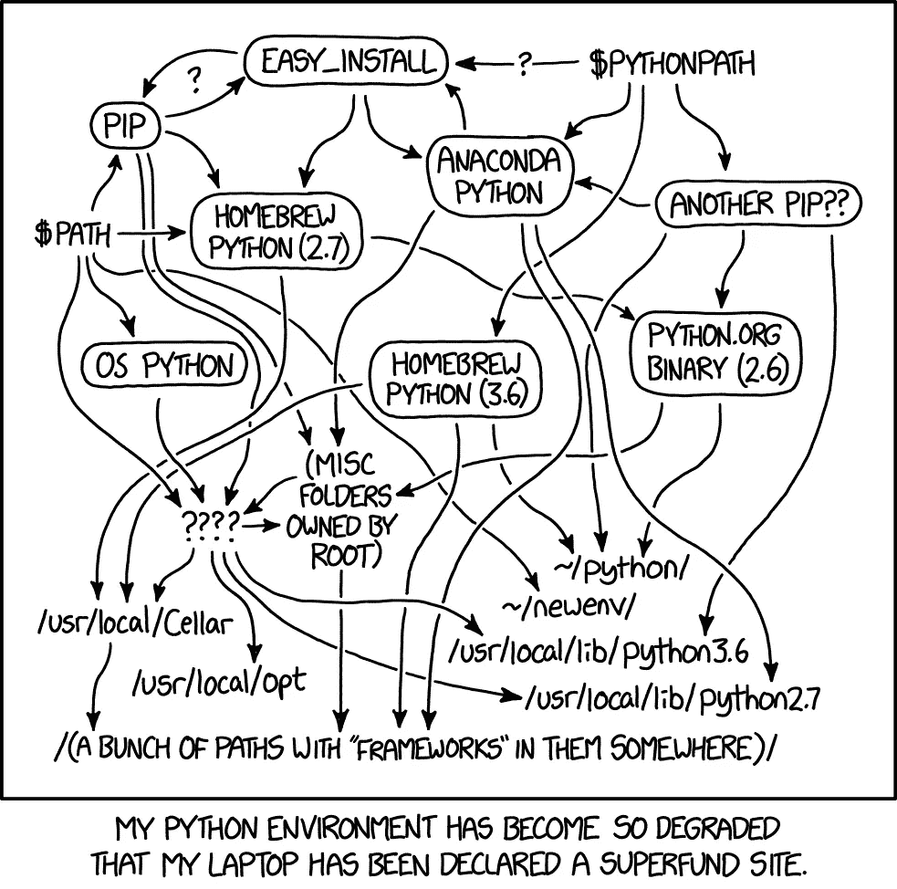

# 最先进的 python 项目设置

> 原文：<https://towardsdatascience.com/state-of-the-art-python-project-setup-82a046fc1f20?source=collection_archive---------14----------------------->

## 为您的下一个 python 项目提供有见解的设置指南

Python 是发展最快的编程语言之一。它的工具正在快速发展以迎头赶上。我写 python 已经超过 10 年了，有时很难跟上所有的新工具。最近，我有机会(也有时间)评估其中一些新工具，这个领域的活动给我留下了深刻的印象。以下是我目前(2020 年 6 月)理想的 python 项目设置。

[https://xkcd.com/1987/](https://xkcd.com/1987/)

## 依赖管理: [pipenv](https://pypi.org/project/pipenv/)

python 中的依赖管理非常困难和复杂。过去，我曾使用 [pip-tools](https://github.com/jazzband/pip-tools) 和 virtualenv 来管理(非常不成功)各种项目的依赖和 env。Pipenv 彻底改变了开发体验。它以更优雅的方式解决了这些问题。Pipenv 将 virtualenv 和依赖关系管理结合到一个简单易用的工具中。您基本上为每个 pipfile 获得了一个自动化的 virtualenv，同时也为确定性构建获得了一个锁文件。Pipenv 还提供了额外的安全性，因为它使用哈希来检查锁定的依赖关系。尽管一些基本的操作，比如添加和安装一个新的库非常慢，但是这些操作很少发生，所以它仍然比其他任何方法都好。

**更新:**结账[诗词](https://python-poetry.org/)也是 pipenv 的改进版。

## 棉绒:[薄片 8-黑色](https://pypi.org/project/flake8-black/) + [或其他](https://github.com/timothycrosley/isort)

[Flake8](https://pypi.org/project/flake8/) 是最受欢迎的蟒蛇皮， [black](https://pypi.org/project/black/) 是最固执己见且简单易用的蟒蛇皮。黑 linter 真的很好，真的是一个基本的蟒蛇林挺好。black 中缺少的两个特性是导入排序和查找未使用的导入/变量。Isort 解决了前者，flake8-black 解决了后者。这些工具提供了非常简单的 CLI 工具来自动修复大多数问题，这使得遵守 linter 规则变得非常容易。虽然我真的希望有一个工具可以将这三者结合起来。

## 静态类型检查器: [mypy](http://mypy-lang.org/)

Mypy 是最常见和最广泛使用的 python 静态类型检查器。尽管确保 python 代码定义了正确的类型是一项不小的工作，但这是完全值得的。该工具提供了许多选项来打开和关闭各种不同类型的检查。我真正欣赏的一点是只在任何新代码上运行检查器的选项，这使得将它添加到现有的 repo 并在项目中增量添加类型成为可能。

## 测试: [pytest](https://docs.pytest.org/en/stable/)

这不应该是一个惊喜。Pytest 是最受欢迎的 python 测试框架，拥有超过 6000 个 github stars。Pytest 提供了更简单的接口和更少的样板代码。它速度快，稳定，功能丰富。

## 代码覆盖率:[覆盖率](https://coverage.readthedocs.io/en/coverage-5.1/)

Coverage 是最常见的 python 覆盖工具，拥有超过 1000 颗 github 星。它与 pytest 配合得很好，并且可以选择仅对项目中任何新编写的代码执行覆盖率阈值。因此，在您现有的 python 项目中稳定地开始实施测试覆盖变得很容易。我在实施代码覆盖方面的唯一问题是，该工具只是以状态代码 2 退出，而没有打印任何可用的错误消息，这使得调试 CI 构建失败的原因变得非常混乱。

## IDE: [VSCode](https://code.visualstudio.com/)

这可能是最有争议的选择。紧随其后的是 Jetbrains 的 Pycharm。我两者都用过，最近转向了 VSCode，主要是因为它是免费的，并且有一组令人惊讶的扩展。您可以轻松地在 VSCode 中设置上述所有工具，并通过提交 git 中的设置与团队的其他成员共享这些工具([示例](https://github.com/NitinAgg/pd2tfrecord/blob/master/.vscode/settings.json))。VSCode 还使得跨多种语言工作变得容易。Pycharm 不错，但是界面感觉有点笨重，过时，速度慢。此外，由于 jetbrains 试图为每种语言销售不同的编辑器，他们在 pycharm 中为其他语言提供的扩展无法提供与 VSCode 相同的无缝体验。迫不及待想试试 VSCode 和 github 一直在做的在线编辑器。

虽然我对上面的设置很满意，但有一件事我觉得还是有点乱:配置文件。Python 工具现在围绕着使用哪种配置文件格式而分散开来。似乎新的工具正在标准化。toml 配置文件，但现在我的 black、isort 和 coverage 配置在 [pyproject.toml](https://github.com/NitinAgg/pd2tfrecord/blob/master/pyproject.toml) 中，flake8 配置在 [setup.cfg](https://github.com/NitinAgg/pd2tfrecord/blob/master/setup.cfg) 中，mypy 设置在 [mypy.ini](https://github.com/NitinAgg/pd2tfrecord/blob/master/mypy.ini) 中。如果我能把所有这些配置放在一个文件中就好了，我可以把它复制粘贴到我所有的项目中。

这里( [link](https://github.com/NitinAgg/pd2tfrecord) )是一个简单的库，上面所有的设置都是在这里配置的。请签出 makefile 并。github/workflows/unit _ tests . YAML 来检查我如何设置 CI。