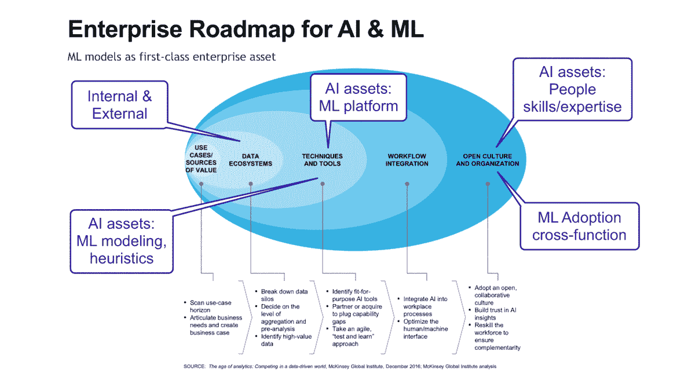

# 机器学习和人工智能*行业的现状

> 原文：<https://towardsdatascience.com/state-of-the-machine-learning-ai-industry-9bb477f840c8?source=collection_archive---------35----------------------->

# 在企业中大规模采用机器学习:ML 平台和 AutoML **【第一部分】**

> 多少 ML 型号才算太多型号

## *TL；博士*:

一般来说，企业和公司，甚至初创公司，都在努力运营和 [*生产*](/what-does-it-mean-to-productionize-data-science-82e2e78f044c) 机器学习模型。

> ML 模型封装了模式、规则和知识，实现了业务流程的自动化和优化。它们是数据驱动的应用和 AI*服务的重要组成部分，改善并经常取代传统的基于规则的业务流程，提高生产力和成果。

#MLSEV 机器学习学校—slide deck[https://www . slide share . net/ed slide/Machine-Learning-platformization-automl-adopting-ml-at-scale-in-the-enterprise](https://www.slideshare.net/edslide/machine-learning-platformization-automl-adopting-ml-at-scale-in-the-enterprise)

从 2012 年到 2018 年，蓝筹技术公司实施了定制的内部使用的 ML 平台(即脸书的 FBLearning、优步的米开朗基罗、Twitter 的 Cortex、AirBnB 的 BigHead)，其中许多平台主要基于开源包，并针对各自公司的特定用例进行了深度定制。

从那时起，行业内出现了企业级 ML 平台解决方案的强劲发展，包括来自现有供应商的解决方案(如亚马逊 Sagemaker、微软 Azure ML、谷歌云 ML 等)和该领域的挑战者(如 DataRobot、H2O、BigML、Dataiku)。现任供应商遵循增量战略方法，他们的 ML 服务产品位于现有云服务之上，作为另一个应用层，而不是挑战者采用的 ML *原生*方法。

随着 ML 采用率的增加，许多企业正在迅速转向*现成的*数据科学&机器学习平台，以加快上市时间、降低运营成本并提高成功率(*部署和运营的 ML 模型数量*)。

鉴于目前的 ML 项目中只有一小部分，POC(概念证明)和模型达到生产和有意义的 ROI，ML 平台和 AutoML ( *自动化机器学习*)正在成为增加 ML 模型快速原型和用例验证( *ROI 验证*)的首选工具。

## **结论:**

1.  尽管付出了巨大且不断增长的努力，包括过去几年公司对 ML 项目和计划的投资，**只有一小部分 ML 模型进入生产**并交付切实的成果。那些在许多情况下被证明是有利可图或非常有利可图的。在规模上， [Pareto 原则](https://en.wikipedia.org/wiki/Pareto_principle)适用于 **20%的 ML 计划占 80%的收益**，而许多 PoC 项目被放弃或冻结以待以后改进。
    *【市场更新:连线，文章-11 月-2020 年*’*[*公司都在争相使用人工智能——但很少有回报*](https://www.wired.com/story/companies-rushing-use-ai-few-see-payoff/)*’】*
2.  证据表明，市场正在接近一个转折点，越来越多的公司倾向于**购买(而不是构建)**ML 平台和工具，考虑**现成的供应商解决方案或混合方法而不是开源**。
3.  **AutoML，以及 API，**是 ML 平台不可或缺的组成部分，以提高快速模型原型、ML 用例验证和部署能力。基本原理是通过增加 ML 候选用例的数量和成功率(在生产中部署的 ML 模型)来实现更好的 ROI(投资回报)。
4.  **数据(数量和质量— ML 就绪)、ML 技术债务、MLOps vs DevOps 以及企业 ML 流程和技能仍然是采用的主要障碍**。尽管如此，传统的 ML 正在迅速超越炒作周期的顶峰，预计在企业中的主流采用只有 2-3 年的时间。
5.  **未来发展**:除了深度学习，在未来十年，人工智能平台有望逐步融入**知识表示、推理、规划和优化**功能，为实现强大的人工智能铺平道路。

> ***免责声明**:本文中的术语 **AI*** (人工智能)特指**构建机器学习驱动的应用程序**的能力，这些应用程序最终**自动化和/或优化业务流程**和**不应与正式意义上的健壮或强大的人工智能**相混淆，“至少在这十年和/或下一年不太可能发生的事情”(作者强调)

# 摘要

[幻灯片在此](https://www.slideshare.net/edslide/machine-learning-platformization-automl-adopting-ml-at-scale-in-the-enterprise)—[视频 45 分钟在此](https://youtu.be/SZWWbi_hq24)

**【1】释义&上下文【第一部分:本帖】**

机器学习平台定义 ML 模型和应用程序是企业中的一级资产 ML 应用程序的工作流程 ML 算法概述 ML 平台的架构 ML 宣传周期的更新

**【2】规模采用 ML**

机器学习的问题 ML 系统中的技术债务多少个模型是过多的模型对 ML 平台的需求

**[3]ML 平台的市场**

ML 平台市场参考早期采用者定制构建与购买:投资回报率和技术债务 ML 平台供应商格局

**[4]定制构建的 ML 平台**

ML 平台市场参考—近距离观察脸书— FBlearner 优步—米开朗基罗 AirBnB—BigHead ML 平台化成为主流

**[5]从 DevOps 到 mlop**

devo PS**<>**ModelOps ML 平台驱动型组织领导力&问责制

**[6]自动化 ML — AutoML**

扩展 ML —快速原型制作和 AutoML 供应商比较 AutoML: OptiML

**[7]ML 平台的未来发展**

超越深度学习:知识表示、推理、规划和优化

# 1.定义和背景

T [这里的东西并不是作为一个独特的 ML 平台](https://www.forbes.com/sites/cognitiveworld/2019/12/12/theres-no-such-thing-as-the-machine-learning-platform/#4a9b5eda8dde)，产品或者服务。该行业仍然非常分散，术语“ML 平台”、“数据科学平台”或“AI*平台”多次互换使用。

然而，市场上不同的产品和服务有一些共同之处，总结如下:

> ML 平台提供了构建 ML 解决方案(主要是预测性和规范性模型)所必需的高级功能。
> 
> ML 平台支持将这些解决方案整合到业务流程、基础设施、产品和应用中。
> 
> 它支持不同技能的数据科学家(和其他利益相关者，如 ML 工程师、数据分析师和业务分析师/专家)在数据和分析管道中完成多项任务，包括以下所有领域:

ML 工作流—资源分配百分比

> 数据摄取数据准备和转换数据探索和可视化
> 
> 特征工程
> 
> 型号选择、评估和测试(以及 AutoML)
> 
> 部署
> 
> 监控和解释
> 
> 维护和协作

作为工具、系统和服务的组合，ML 平台使实验和快速原型成为可能，但它们的 ROI 是在企业运营和业务流程的背景下实现的，远远超出了实验。

> 参考资料:
> 
> Poul Petersen，剖析一个端到端的 ml 应用程序[https://www . slide share . net/bigml/ML sev-剖析一个 ML 应用程序](https://www.slideshare.net/bigml/mlsev-anatomy-of-an-ml-application)
> 
> [ML 平台研究报告](https://assets.ctfassets.net/nubxhjiwc091/48kgJWJ6s6p7QZWKOsKWhH/c92e2a2a1e85f6ef44d1bd19d012bf8e/Machine_Learnings_Platform_Digital_Catapult_paper.pdf) Papis.io

## 面向 ML & AI 的企业采用框架*

T 鉴于其在企业中的影响和投资回报率，ML 平台&工具及其产品、ML 模型和数据驱动的应用程序可被视为一流的企业资产。

[麦肯锡的全球人工智能调查](https://www.mckinsey.com/featured-insights/artificial-intelligence/global-ai-survey-ai-proves-its-worth-but-few-scale-impact)概述了人工智能*的企业自我报告影响及其优势。

然而，这不仅仅是技术的问题。流程、优先级和人员(领导和责任)在加入和成功部署 ML 驱动的应用和服务中也扮演着不可或缺的角色。

当涉及到 ML 应用程序时，不仅软件开发是不同的，将它们部署和集成到现有系统中也被证明是一个主要的挑战。考虑到 ML 软件开发中的许多差异(更多细节在第 5 节)，DevOps 无法充分处理 MLOps(机器学习操作)。

## ML 算法

对于数据科学家和领域专家来说，管理 ML 算法以及支持它们的计算和数据转换需求无疑是 ML 平台要解决的关键任务。快速试验并对给定数据集应用不同算法的能力是验证任何用例(假设验证)的关键。

Precisely AutoML(自动机器学习)为这一过程提供了进一步的自动化，使用不同的算法创建许多候选模型，并评估它们的性能，以向给定的预测目标提出最佳模型选项。

ML 算法——监督和非监督(由 BigML 公司提供的#MLSEV)

在实践中，企业中的绝大多数 ML 用例(想想营销、金融、人力资源、制造等)不需要深度学习或神经网络算法，除非有非凡的性能要求，或者在需要处理非结构化数据(例如视频、图像或声音)的特定用例中。

几乎 80–90%的用例利用传统的 ML 算法，如线性回归、逻辑回归、随机森林或集成，与更不透明的神经网络方法相比，它们提供了可靠的结果和进一步的可解释性。

[Kaggle 的调查](https://www.kaggle.com/kaggle-survey-2019)包括近 2 万名受访者(数据科学家是重要的一部分),是监控算法使用的良好代理:

蓝框:传统的 ML 算法-红框:CNN，RNN，DNN 和贝叶斯-来源:Kaggle 数据科学和 ML 2019 年的状态

> 参考资料:
> 
> Kaggle 的数据科学和 ML 现状调查【https://www.kaggle.com/kaggle-survey-2019 
> 
> 麦肯锡— [分析时代](https://www.mckinsey.com/~/media/McKinsey/Business%20Functions/McKinsey%20Analytics/Our%20Insights/The%20age%20of%20analytics%20Competing%20in%20a%20data%20driven%20world/MGI-The-Age-of-Analytics-Full-report.ashx)

## ML 平台架构

或者定制的 ML 平台，开源包和技术是首选(例如优步的例子: [HDFS](http://hadoop.apache.org/) 、 [Spark](https://spark.apache.org/) 、 [Samza](http://samza.apache.org/) 、 [Cassandra](http://cassandra.apache.org/) 、 [MLLib](https://spark.apache.org/mllib/) 、 [XGBoost](https://github.com/dmlc/xgboost) 和 [TensorFlow](https://www.tensorflow.org/) )，决定了底层架构的大部分。

要解决的用例以及需要多少实时和静态数据建模是形成平台架构的其他因素。优步服务公司的实时需求(如预测乘车时间)不同于 AirBnB(如推荐者),在访问、处理数据要求和预计预测时间方面与 FICO(如信用评分)也有很大不同，因此具有非常独特的架构需求。

优步的 ML 平台—米开朗基罗，来源:优步工程[https://eng . Uber . com/米开朗基罗-机器学习-平台/](https://eng.uber.com/michelangelo-machine-learning-platform/)

例如，在优步的情况下，在线部署的模型无法访问存储在 HDFS 的数据，这使得很难从在线生产数据库中检索关键功能(例如，查询 UberEATS 订单服务以计算特定时间段内餐馆的平均用餐准备时间)。

优步的解决方案是预先计算并在 Cassandra 中存储那些所需的功能，以便满足预测时的延迟要求(来源:优步工程-米开朗基罗[https://eng . Uber . com/米开朗基罗-机器学习-平台/](https://eng.uber.com/michelangelo-machine-learning-platform/) )。

C 商业 ML 平台，与定制的开源平台相反，旨在概括大量不同的 ML 问题和用例。他们的架构需要支持关键功能，同时允许通过抽象层进行充分的定制:

1.  基础架构(云、混合和本地)的自动部署和自动扩展—分布式
2.  **API** — RESTful ML 服务—编程 API 化和集成
3.  高级功能工程— **DSL****
4.  算法和模型的程序化使用
5.  ML 工作流的程序自动化定制— **DSL**
6.  前端:可视化和界面
7.  开发工具:绑定(Python，R，Java，C)，库，CLI 工具

** DSL 域特定语言

ML 平台架构概述(BigML 公司提供)

使用 DSL 的 API 和编程自动化— **领域特定语言** —保证了一篇衍生文章。特别是 AutoML，将在本系列文章的第 7 节中讨论。

DSL 在 API 和计算基础设施之上提供了必要的抽象层次，以处理复杂性、自动化和定制。DSL 方法的例子有优步的用于特性选择和转换的 DSL([优步的 ML 平台—米开朗基罗](https://eng.uber.com/michelangelo-machine-learning-platform/))和 [BigML 的用于 ML 工作流自动化的 DSL](https://github.com/whizzml/examples)([whiz ML](https://github.com/whizzml/examples))。

> 参考资料:
> 
> 优步工程-米开朗基罗[https://eng . Uber . com/米开朗基罗-机器学习-平台/](https://eng.uber.com/michelangelo-machine-learning-platform/)
> 
> Arxiv:关于机器学习和大数据的 DSL 的调查[https://arxiv.org/pdf/1602.07637](https://arxiv.org/pdf/1602.07637)
> 
> PAPIS.io 会议录:机器学习 API 的过去、现在和未来[http://proceedings.mlr.press/v50/cetinsoy15.pdf](http://proceedings.mlr.press/v50/cetinsoy15.pdf)
> 
> 用于 ML 工作流自动化的 DSL【https://bigml.com/whizzml 

## 机器学习炒作周期的更新

随着企业和从业者走过在实践中应用 ML 的学习曲线，机器学习和深度学习作为技术都经历并超越了炒作周期的顶峰，迅速穿越了“幻灭之谷”(调整预期)。Gartner 的最新炒作周期报告反映了这一点，并预测主流采用将在未来 2-3 年内发生。

来源:Gartner 对 DS 和 ML 2019 的炒作周期

紧随其后，新的人工智能平台的功能，如 AutoML，MLOps，可解释的人工智能或强化学习，目前正在进入炒作曲线，迅速成为炒作。这些新的 ML 技术仍然不成熟，还没有准备好被主流或大规模采用。

## **造 vs 买**

几年前，市场已经被分为开源和行业解决方案。

从 2012 年到 2018 年，蓝筹技术公司实施了定制的 ML 平台供内部使用(即脸书的 FBLearning、优步的米开朗基罗、Twitter 的 Cortex、AirBnB 的 BigHead，稍后在第 4 节中有更详细的分析)。

这些平台中有许多主要基于开源包，并针对这些公司的特定用例进行了深度定制。

尽管开源软件包固有的免费性质(购买的成本优势)和几乎无限的定制能力，但是开源的问题伴随着相关的隐藏技术债务，特别是胶水代码(更多细节见第 2 节[机器学习系统中的隐藏技术债务](https://papers.nips.cc/paper/5656-hidden-technical-debt-in-machine-learning-systems.pdf))。 *D. Sculley 等人，谷歌，NIPS 2015)。*

[*D .斯卡利等人，谷歌，NIPS 2015*](https://papers.nips.cc/paper/5656-hidden-technical-debt-in-machine-learning-systems.pdf)

从长远来看，正是配置、协调和整合不同开源包(胶合代码)的成本增加了成本，使得构建与购买的商业案例对行业解决方案更具吸引力。

该行业已经看到了企业级 ML 平台解决方案和 MLaaS(机器学习即服务或云 ML 服务)的强劲发展，现在该产品分为行业现任者(如亚马逊 Sagemaker、微软 Azure ML、谷歌云 ML 等)和挑战者(DataRobot、H2O、BigML、Dataiku 等)。

对许多企业来说，一个重要的关键驱动因素是**上市时间和竞争力。**由于他们难以通过传统的构建研发方法成功地扩展和获得足够多的 ML 模型，许多人迅速转向*现成的*数据科学&机器学习平台，以加速上市，降低运营成本并提高成功率(部署和运营的 ML 模型的数量)。

> 参考资料:
> 
> 机器学习系统中隐藏的技术债务。 *D. Sculley 等人，谷歌，NIPS 2015*[https://papers . NIPS . cc/paper/5656-hidden-technical-debt-in-machine-learning-systems . pdf](https://papers.nips.cc/paper/5656-hidden-technical-debt-in-machine-learning-systems.pdf)
> 
> Gartner 的人工智能炒作周期[https://www . Gartner . com/smarterwithgartner/top-trends-on-the-Gartner-Hype-Cycle-for-artificial-intelligence-2019/](https://www.gartner.com/smarterwithgartner/top-trends-on-the-gartner-hype-cycle-for-artificial-intelligence-2019/)

**【第一节结束】**

这篇文章的配套幻灯片可以通过这个链接获得[ [在机器学习学校#MLSEV 的演讲—3 月 26 日](https://www.slideshare.net/edslide/machine-learning-platformization-automl-adopting-ml-at-scale-in-the-enterprise) ]

## 关于作者:

[推特](https://www.twitter.com/efernandez)