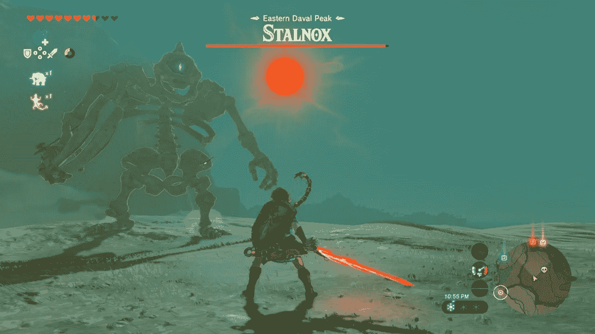
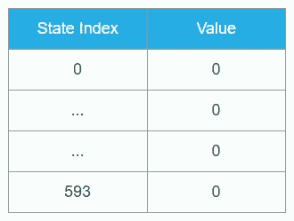
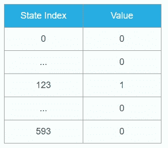
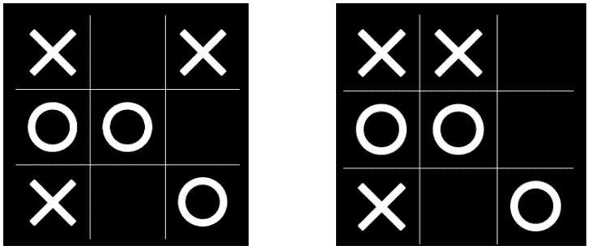
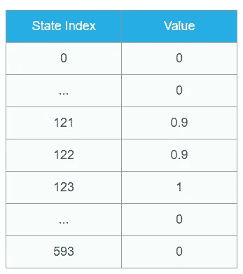
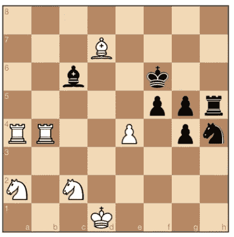

# 状态、行动、奖励——强化学习背后的直觉

> 原文：<https://towardsdatascience.com/states-actions-rewards-the-intuition-behind-reinforcement-learning-33d4aa2bbfaa?source=collection_archive---------9----------------------->

## 强化学习到底是什么，RL 算法在实践中是如何工作的？

2014 年，谷歌以 5 亿美元收购了一家名为 DeepMind 的英国初创公司。这是一个很高的价格，但仅从 DeepMind 产生的宣传效果来看，这项投资似乎已经获得了数倍的回报。ML 的研究人员知道 DeepMind 是因为它在深度强化学习领域的频繁突破。但该公司也吸引了公众的注意力，特别是由于它成功地构建了一种玩围棋的算法。考虑到 DeepMind 在该领域取得进展的频率——alpha go、AlphaGo Zero 和 AlphaZero 在过去几年中的进展——无论是从技术层面还是从影响的角度来看，都很难跟踪到底发生了什么。我打算这么做——提供 DeepMind 在围棋上的成功的高层次观点，并解释他们生产的不同版本的 AlphaGo 之间的区别。

# RL 是什么？

与人类认知相比，机器学习是一个成熟的领域。这当然不是巧合。该领域中许多最受欢迎的任务(视觉、语音和自然语言处理)通常属于人类(或自然)智能的领域。由于算法“所做的”是模拟人类，因此自然会想到算法也“如何”模拟人类。因此，像“神经网络是由人脑启发的”这样的说法比比皆是(事实上，这种说法就像“飞机是由鸟启发的”一样正确)

强化学习特别适合这种比较。就其核心而言，任何强化学习任务都是由三个因素定义的——状态、行动和奖励。状态是任务的当前世界或环境的表示。动作是 RL 代理可以用来改变这些状态的事情。奖励是代理人因执行“正确的”行动而获得的效用。因此，状态会告诉代理当前所处的情况，而奖励会向代理发出信号，表明它应该向哪个状态努力。那么，我们的目标是学习一种“政策”，它会告诉你在每种状态下应该采取什么行动，以尽量获得最大回报。这个宽泛的定义可以用来适应我们每天执行的许多不同的任务。

当你开车时，状态是你的车和邻近车的位置和速度。你可以采取的行动是转动方向盘，踩油门或刹车。奖励取决于你在遵守交通规则的情况下多快到达目的地。

当你玩视频游戏(比如说《塞尔达传说》)时，状态就是你在屏幕上的任何信息——你的位置、附近角色或怪物的存在、你拥有的武器和物品。你的行动可以包括移动或攻击。您的奖励取决于您剩余的生命数量以及您从击败敌人中获得的任何金钱或物品。

塞尔达传说游戏状态。资料来源:Deepak Dilipkumar

让我们看一个更抽象的例子——申请研究生院。你所在的州是你目前的研究/工作概况，以及你拥有的关于不同学校的课程和教授的信息。你的行动可能是决定向谁要推荐信，在你的 SoP 上写什么，以及申请哪所学校。奖励当然是一封录取信(或者由于一封拒绝信而产生的负奖励)。

这些例子表明，从强化学习的角度来看，在不同的“具体性”水平上构建无数的任务通常是可能的。然而，重要的是要注意，对于不同的任务，状态、动作和奖励集的范围可能非常不同。例如，塞尔达游戏中的动作场景虽然很广泛，但显然比申请研究生院的动作场景要小一个数量级。这表明，当你已经清楚地定义了状态、奖励和受限的动作集时，将任务框架化为强化学习效果很好。这可以从 RL 成功完成的[类任务](http://umichrl.pbworks.com/w/page/7597597/Successes%20of%20Reinforcement%20Learning)中看出。

# 解决 RL 任务

解决 RL 任务的一种常见方法叫做“基于价值”。我们试图根据哪些状态可能带来高回报，给每个状态(或每个(状态，下一个行动)对)分配一个数字。这种将每个状态与特定数值联系起来的实体称为价值函数。如果我们以这种方式学习一个适当的值函数，那么从一个特定的状态，我们可以简单地选择很可能导致下一个高值状态的动作。所以我们现在把我们的任务简化为学习这个价值函数的问题。

为了理解这个学习过程可能是什么样子，让我们看一个更具体的例子——井字游戏。状态是当前的棋盘位置，动作是你可以放置“X”或“O”的不同位置，奖励是+1 或-1，取决于你是赢还是输。“状态空间”是特定 RL 设置中可能状态的总数。井字游戏有一个足够小的状态空间(一个合理的估计是 [593](http://brianshourd.com/posts/2012-11-06-tilt-number-of-tic-tac-toe-boards.html) )，我们实际上可以使用一个表格记住每个状态的值。因此，这种方法被称为列表法。这在大多数应用程序中是不实际的(想象一下列出一个棋盘的所有可能的配置并给每个配置赋值)，但是我稍后将回到如何处理这个问题。

我们首先给每个状态分配一些初始值，比如说所有状态都是 0(有更好的初始化策略，但是现在这样就可以了)。最初，我们的表格看起来是这样的(假设我们有一些对州进行编号或索引的方法):

然后，我们开始与对手玩井字游戏，我们遵循的一般规则是，在当前状态下采取的行动是导致下一个状态的行动，下一个状态的价值尽可能高。一开始，由于所有的州都有相同的价值，这就意味着只是从合法的行动中随机挑选。但是在几场比赛之后，你注意到当你到达这个位置(你是 X)时:

你得到+1 的奖励。那么与最终状态相关联的值必须是+1。因此，您更新了您的表(假设最终获胜位置的任意指数为 123):

现在，在接下来的几场比赛中，你看到你带领你到 123 的位置(假设这两个位置分别是 121 和 122)也有可能以高回报结束，只要你采取正确的行动:

因此，您再次更新了表格，注意到倒数第二个状态不一定有+1 的全部奖励，因为仍有可能走错一步，最终输掉或听成平局:

我不会进入实际的方程式，但是在一个高层次上，我们看到回报是一种从最终状态“流”回来的东西，并给最终状态赋予一个具体的值。因此，这些终端状态对于确保算法学习正确的值函数极其重要。我曾经有一个 bug，除了指示这些终端状态的标志之外，一切都按预期工作，算法最终几乎什么也没学到。

因此，如果有足够多的训练游戏，奖励会一直流回到最初的状态，并且你从头到尾都有一个好的策略！例如，进行这种“自举”的一种常见方式，即从紧随其后的状态的值中学习一个状态的值，称为[时间差异学习](https://web.stanford.edu/group/pdplab/pdphandbook/handbookch10.html)。

# 延伸到国际象棋

比如说，这种策略在国际象棋中的效果如何？井字游戏有大约 600 个州。虽然很难计算国际象棋中状态的准确数量，但一个很好的上限似乎是 [10⁴⁵](https://math.stackexchange.com/questions/1406919/how-many-legal-states-of-chess-exists) 。世界上所有的计算机都没有足够的内存来存储这么多的状态，所以将所有的值放在一个表中不再是一个好主意。我们如何处理这个问题？

让我们想想我们下棋。随着我们练习得越来越多，我们开始对某些状态有多“好”有了直观的理解。例如，尝试评估这种状态(白棋):

谁赢了？来源:chess.com

你可能知道白棋的位置更好。很可能你以前从未见过这种确切的董事会状态。尽管如此，你已经对象棋中什么构成了一种状态的“善”建立了直觉。你可能数了每一方剩下的棋子数，并注意到黑方有 2 个额外的棋子，而白方有一个额外的骑士和车，这给了那一方优势。如果你是一个更有经验的玩家，你可能已经看到了可能的下一步棋(比如白象可以拿下黑象)和双方控制的棋盘区域。

所以你肯定没有记住每一个可能的棋位的潜在价值——你已经学会了某种通用函数，将棋盘的状态映射到每个玩家的游戏价值。这正是我们希望 RL 的智能象棋算法通过一个叫做[价值函数逼近](http://www0.cs.ucl.ac.uk/staff/d.silver/web/Teaching_files/FA.pdf)的想法来做的。

首先，我们想出一种方法来表示游戏状态。对于井字游戏，我们可以枚举所有的状态，这意味着每个游戏状态都由一个数字表示。对于国际象棋，一个简单的方法是用一个数字(棋子→ 1，车→ 2 …)表示每一个棋子，然后有一个长度为 64 的列表，该列表编码每个位置上特定棋子的存在(比如说，0 表示空位置)。我们可以将它输入到我们的 RL 算法已经学习的价值函数中，它会吐出一个数字(代表“价值”)或者可能是一个概率(代表黑棋获胜的机会)。

现在实际的 RL 部分非常类似于我们对井字游戏所做的。我们玩了很多游戏，赢了就奖励算法，输了就惩罚算法，随着时间的推移，它将(希望)学习一个代表州值的好函数。唯一的变化是，我们不是从表中查找值，而是通过函数传递输入，并获得相应的值作为输出。有了这个，我们就可以通过观察每一个可能的合法走法所达到的状态来推导出一个下棋的策略，并通过我们的函数传递这些状态中的每一个，以查看哪一个具有最高的值！

这是用 RL 解决国际象棋问题的一种相当幼稚的方式，我们可以用一些复杂的想法来加速计算，改善学习，并最终做出更好的棋。这对于围棋来说尤其重要，因为围棋的状态空间比国际象棋还要大！这可能需要很长时间才能理解，所以我将在这里停下来，在下一篇博客文章中讨论一些关于 Go 的有趣想法。感谢阅读！

*原载于 2018 年 3 月 3 日*[*https://deepakdilipkumar . github . io*](https://deepakdilipkumar.github.io/alphago/)*。*