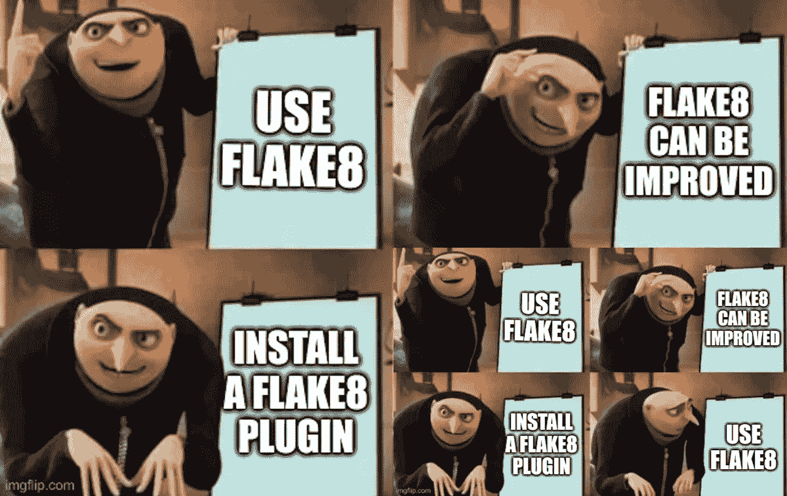

# Python 的静态代码分析

> 原文：<https://towardsdatascience.com/static-code-analysis-for-python-bdce10b8d287?source=collection_archive---------6----------------------->

## 类型和样式检查、潜在的错误和代码复杂性


图片来自维基共享资源

静态代码分析查看代码而不执行它。它通常执行起来非常快，只需要很少的努力就可以添加到您的工作流程中，并且可以发现常见的错误。唯一的缺点是它不是为您的代码量身定制的。

在本文中，您将学习如何在 Python 中执行各种类型的静态代码分析。虽然本文主要关注 Python，但是任何编程语言都可以进行这种类型的分析。

# 代码复杂性


约翰·巴克利普在 [Unsplash](https://unsplash.com?utm_source=medium&utm_medium=referral) 上的照片

测量代码复杂度的一种方法是[圈复杂度](https://en.wikipedia.org/wiki/Cyclomatic_complexity)，也称为 McCabe 复杂度，定义见 [A 复杂度测量](https://books.google.de/books?id=vtNWAAAAMAAJ&pg=PA3&redir_esc=y):

```
CC = E - N + 2*P
```

其中 N 是控制流图中的节点数，E 是边数，P 是条件节点数(if 语句，while/for 循环)。

可以用 [radon](https://pypi.org/project/radon/) 在 Python 中计算:

```
$ pip install radon
$ radon cc mpu/aws.py -s    
mpu/aws.py
    F 85:0 s3_download - B (6)
    F 16:0 list_files - A (3)
    F 165:0 _s3_path_split - A (2)
    F 46:0 s3_read - A (1)
    F 141:0 s3_upload - A (1)
    C 77:0 ExistsStrategy - A (1)
```

第一个字母表示块的**类型(F 表示函数，C 表示类)。然后 radon 给出了**行号**，类/函数的**名称**，一个**等级** (A、B、C、D、E 或 F)，以及实际的**复杂度作为一个数字**。通常，复杂度低于 10 是可以的。[scipy 最复杂的部分](https://github.com/scipy/scipy/blob/master/scipy/sparse/linalg/eigen/lobpcg/lobpcg.py#L127)复杂度为 61。**

除了 radon，还有各种其他的包和 Flake8 插件:

*   flake 8-注解-复杂性:轻推你命名复杂类型
*   [flake 8-认知复杂性](https://pypi.org/project/flake8-cognitive-complexity/):验证认知功能的复杂性
*   [flake 8-expression-complexity](https://pypi.org/project/flake8-expression-complexity/):确保单个表达式不会太复杂；类似于函数/类的圈复杂度。
*   [flake8-functions](https://pypi.org/project/flake8-functions/) :报告过长的函数和带有过多参数的函数
*   [mccabe](https://pypi.org/project/mccabe/) :这被一些其他的工具和项目使用
*   [wily](https://pypi.org/project/wily/) :跟踪、报告 Python 测试和应用程序复杂性的命令行应用程序。
*   [氙](https://pypi.org/project/xenon/):依靠氡

# 风格指南


让你的代码看起来更专业。[猎人在](https://unsplash.com/@huntersrace?utm_source=medium&utm_medium=referral) [Unsplash](https://unsplash.com?utm_source=medium&utm_medium=referral) 上比赛的照片

你可能听说过“pythonic 代码”这个词。这意味着不仅要编写正确的 Python 代码，而且要按照预期的方式使用语言特性([来源](https://stackoverflow.com/a/25011492/562769))。这肯定是一个固执己见的术语，但是有很多插件向您展示了社区中的大部分人认为 pythonic 是什么。

以类似于其他 Python 项目的风格编写代码是有价值的，因为人们会更容易阅读代码。这一点很重要，因为我们阅读软件的次数比编写软件的次数还要多。

那么，什么是 pythonic 代码呢？

先从 [PEP-8](https://www.python.org/dev/peps/pep-0008/) 说起:它是 Python 社区在 2001 年编写并接受的一个风格指南。所以它已经存在了一段时间，大多数人都想跟随它。我见过大多数人不同意的主要部分是 79 的[最大线长。我总是建议在你 95%的代码库中遵循这个建议。对此我给出了](https://www.python.org/dev/peps/pep-0008/#maximum-line-length)[理由](https://martin-thoma.com/python-style-guide/#maximum-line-length)。


黑人项目的标志。图片来源:[黑人投稿人](https://github.com/psf/black/blob/master/docs/_static/logo2.png)

对于纯代码格式化，您应该使用自动格式化程序。我开始喜欢黑色的[因为它不允许定制。黑色格式的代码看起来总是一样的。由于您不能自定义它，所以您不需要讨论它。它只是解决了风格冲突和争论的问题。Black 由 Python 软件基金会维护，可能是 Python 最常采用的自动格式化程序。](https://pypi.org/project/black/)

Google 的 yapf 是另一个自动格式化程序。

# 文档字符串


如果写得好，阅读手册会很有趣。[千层面](https://lasagne.readthedocs.io/en/latest/modules/nonlinearities.html#lasagne.nonlinearities.sigmoid)和[烤肉卷](https://docs.scipy.org/doc/scipy/reference/generated/scipy.ndimage.prewitt.html#scipy.ndimage.prewitt)有很好的文档。劳拉·德维尔德在 [Unsplash](https://unsplash.com?utm_source=medium&utm_medium=referral) 上拍摄的照片

对于文档字符串，有 [PEP-257](https://www.python.org/dev/peps/pep-0257/) 。所有这些规则在社区中都被广泛接受，但是它们仍然允许各种各样的文档字符串。有三种常用的样式:

*   [NumpyDoc 风格](https://numpydoc.readthedocs.io/en/latest/format.html)文档字符串:由 Numpy 和 Scipy 使用。它以固定的顺序对某些指定的部分如`Parameters`和`Returns`进行降价。
*   [Google 风格](https://github.com/google/styleguide/blob/gh-pages/pyguide.md#38-comments-and-docstrings) docstrings:一种超薄格式，有`Args:`和`Returns:`。
*   文档字符串:一种非常灵活的格式，使用重构的文本。

我喜欢 NumpyDoc 格式，因为它非常容易阅读，即使你只是在文本编辑器中使用它。Numpydoc 也得到了编辑器的良好支持。

这里你可以看到三者的对比:

```
def **get_meta_numpydoc**(filepath, a_number, a_dict):
    """
    Get meta-information of an image. Lorem ipsum dolor sit amet, consectetuer adipiscing elit.
    Aenean commodo
    ligula eget dolor. Aenean massa. Cum sociis natoque penatibus
    et magnis dis
    parturient montes, nascetur ridiculus mus. Parameters
    ----------
    filepath : str
        Get metadata from this file
    a_number : int
        Some more details
    a_dict : dict
        Configuration Returns
    -------
    meta : dict
        Extracted meta information Raises
    ------
    IOError
        File could not be read
    """def **get_meta_google_doc**(filepath, a_number, a_dict):
    """Get meta-information of an image. Lorem ipsum dolor sit amet, consectetuer adipiscing elit.
    Aenean commodo
    ligula eget dolor. Aenean massa. Cum sociis natoque penatibus
    et magnis dis
    parturient montes, nascetur ridiculus mus. Args:
        filepath: Get metadata from this file.
        a_number: Some more details.
        a_dict: Configuration. Returns:
        Extracted meta information: Raises:
        IOError: File could not be read.
    """

def **get_meta_sphinx_doc**(filepath, a_number, a_dict):
    """
    Get meta-information of an image. Lorem ipsum dolor sit amet, consectetuer adipiscing elit.
    Aenean commodo
    ligula eget dolor. Aenean massa. Cum sociis natoque penatibus
    et magnis dis
    parturient montes, nascetur ridiculus mus. :param filepath: Get metadata from this file
    :type filepath: str
    :param a_number: Some more details
    :type a_number: int
    :param a_dict: Configuration
    :type a_dict: dict :returns: dict -- Extracted meta information :raises: IOError
    """
```

# 薄片 8

正如阿尔贝托·吉梅诺指出的那样，你应该一直使用棉绒。他们可以检查你的风格，但更重要的是，指出潜在的错误。

是一个包装 PyFlakes、pycodestyle 和 McCabe 脚本的包装器。这是 Python 中林挺最常用的工具。Flake8 太棒了，因为它有太多的插件。我找到了 223 个名称中带有字符串“flake8”的包，并查看了其中的许多包。我还用 trove 分类器`Framework :: Flake8`查看了包，发现了 143 个包，其中 122 个以`flake8-`开头。只有 21 个包有 Flake8 框架的 trove 分类器，但没有以`flake8-`开头，其中只有两个看起来很有趣。

> **边注**:错别字抢注是每个开放包库都要与之斗争的问题(学士论文:[编程语言包管理器中的错别字](https://incolumitas.com/data/thesis.pdf)其中有[的博文](https://incolumitas.com/2016/06/08/typosquatting-package-managers/)和一篇[有趣的后续](https://arxiv.org/pdf/2003.03471.pdf)，学士论文:[对包管理器的攻击](https://is.muni.cz/th/y41ft/thesis_final_electronic.pdf))。Python 中有它造成伤害的例子( [2017](https://mail.python.org/pipermail/security-announce/2017-September/000000.html) 、 [2017](https://www.bleepingcomputer.com/news/security/ten-malicious-libraries-found-on-pypi-python-package-index/) 、 [2017](https://nakedsecurity.sophos.com/2017/09/19/pypi-python-repository-hit-by-typosquatting-sneak-attack/) 、 [2019](https://www.trustwave.com/en-us/resources/blogs/spiderlabs-blog/typosquatting-in-python-repositories/) 、 [2019](https://snyk.io/blog/malicious-packages-found-to-be-typo-squatting-in-pypi/) 、 [2019](https://sysdig.com/blog/malicious-python-libraries-jeilyfish-dateutil/) )。有 [pypi-scan](https://github.com/jspeed-meyers/pypi-scan) 用于查找示例，还有 [pypi-parker](https://pypi.org/project/pypi-parker/) 用于防止常见的错别字。William Bengtsson 也做了一些类似的事情来加强 Python 社区对这个线程的防范。有关他的项目的更多信息，请参见下面他的文章。package parking 列出了 PyPI 上的软件包数量，我通过查找摘要“防止漏洞利用的软件包”来过滤它们。

[](https://medium.com/@williambengtson/python-typosquatting-for-fun-not-profit-99869579c35d) [## Python 域名抢注是为了娱乐而非盈利

### 威廉·本特森| @ _ _ 肌肉

medium.com](https://medium.com/@williambengtson/python-typosquatting-for-fun-not-profit-99869579c35d) 

以下是一些有趣的 flake8 插件:

*   [内聚](https://github.com/mschwager/cohesion):检查类内聚是否低于阈值。这表明功能应该从一个类中分离出来。
*   [flake8-assert-msg](https://pypi.org/project/flake8-assert-msg/) :确保 assert 语句有消息
*   [flake8-blind-except](https://pypi.org/project/flake8-blind-except/) :防止口袋妖怪异常捕捉
*   [flake8-builtins](https://pypi.org/project/flake8-builtins/) :检查 python 内置的变量或参数。
*   [flake8-docstrings](https://pypi.org/project/flake8-docstrings/) :增加 pydocstyle 支持
*   [flake8-isort](https://pypi.org/project/flake8-isort/) :使用 [isort](https://pypi.python.org/pypi/isort) 检查 python 文件上的导入是否按照您期望的方式排序
*   [flake8-logging-format](https://github.com/globality-corp/flake8-logging-format) :验证(缺少)日志格式字符串
*   [flake8-pytest-style](https://pypi.org/project/flake8-pytest-style/) :检查基于 pytest 的测试的常见风格问题或不一致之处
*   [flake 8-需求](https://pypi.org/project/flake8-requirements/):检查/验证包导入需求。它报告缺失和/或未使用的项目直接相关性
*   [flake 8-graph QL](https://pypi.org/project/flake8-graphql/):Lint graph QL 查询字符串
*   与黑色搭配很好🎉
*   [模板 8-模拟](https://pypi.org/project/flake8-mock/):使用模拟来检查错误
*   检查 jupyter 笔记本
*   [flake8-pyi](https://pypi.org/project/flake8-pyi/) : Lint 存根文件
*   [flake8-variables-names](https://pypi.org/project/flake8-variables-names/) :查找常见的“无意义”的变量名
*   [pep8 命名](https://pypi.org/project/pep8-naming/):对照 pep8 命名约定检查你的代码
*   熊猫兽医:固执己见的林挺为熊猫编码
*   wemake-python-styleguide :一个固执己见的风格指南/检查器，看起来很受欢迎。不过，我以前没见过这个。

部分 Flake8 [探矿者](https://pypi.org/project/prospector/)的替代品。它结合了多种工具，但是它很少被使用，因此不如 Flake8 灵活。

# 第八篇:安全性和缺陷


注意安全，注意警示标志。照片由[特洛伊桥](https://unsplash.com/@esptroy?utm_source=medium&utm_medium=referral)在 [Unsplash](https://unsplash.com?utm_source=medium&utm_medium=referral) 上拍摄

*   flake8-bandit :安全测试
*   在你的程序中寻找可能的错误和设计问题——通常它是无声的，但是当它不是的时候你应该看一看🐻
*   [flake8-requests](https://pypi.org/project/flake8-requests/) :检查请求框架的使用

# Flake8:删除调试工件

这种情况在我身上发生过好几次:我在开发新功能或调试旧功能时添加了一些代码，但后来忘记删除了。它经常被评论者发现，但是没有必要用这个来分散评论者的注意力。

[flake8-breakpoint](https://pypi.org/project/flake8-breakpoint/) 检查忘记的断点，而 [flake8-print](https://pypi.org/project/flake8-print/) 会抱怨每一条打印语句。[flake 8-调试器](https://pypi.org/project/flake8-debugger/)、 [flake8-fixme](https://pypi.org/project/flake8-fixme/) 、 [flake8-todo](https://pypi.org/project/flake8-todo/) 走向相同。

# 皮林特

`[pylint](https://pypi.org/project/pylint/)`是 Python 中分布最广的 linters 之一。pylint 的功能肯定与 Flake8 重叠，但有一个功能我很喜欢:检查代码重复❤

```
$ **pylint --disable=all --enable=duplicate-code .**
************* Module mpu.datastructures.trie.base
mpu/datastructures/trie/base.py:1:0: R0801: Similar lines in 2 files
==mpu.datastructures.trie.char_trie:85
==mpu.datastructures.trie.string_trie:138
            string += child.print(_indent=_indent + 1)
        return stringdef __str__(self):
        return f"TrieNode(value='{self._value}', nb_children='{len(self.children)}')"__repr__ = __str__EMPTY_NODE = TrieNode(value="", is_word=False, count=0, freeze=True)class Trie(AbstractTrie):
    def __init__(self, container=None):
        if container is None:
            container = [] (duplicate-code)
```

# 让死代码死去吧


肯尼·奥尔在 Unsplash[拍摄的照片](https://unsplash.com?utm_source=medium&utm_medium=referral)

谁没有做过:你删除了一个功能，但是代码可能是方便的。所以你把它注释掉。或者你在它周围加一个`if False`块。有时通过添加您不需要的配置选项会更复杂。

最简单解决方案是通过一个简单、明确的提交来删除该特性。也许可以添加一个 git 标签，这样以后想再添加的时候就可以找到了。

还有一种代码是死的，但是你忘记了。幸运的是，您可以自动检测到它:

*   [flake 8-根除](https://pypi.org/project/flake8-eradicate/):查找注释掉的(或者所谓的“死的”)代码。
*   [vulture](https://pypi.org/project/vulture/) :查找 Python 程序中未使用的代码

# 第八篇:鼓励自己使用好的风格


让一个有经验的开发人员审查你的代码是很棒的。在最好的情况下，你会学到一些新的东西，你可以在所有进一步的项目中应用。有些插件就是这样。由[布鲁克·卡吉尔](https://unsplash.com/@brookecagle?utm_source=medium&utm_medium=referral)在 [Unsplash](https://unsplash.com?utm_source=medium&utm_medium=referral) 上拍摄的照片

一些插件帮助我学习了一些关于 Python 的知识。例如，以下内容帮助我消除了一些小错误和不一致之处:

*   帮助你写出更好的理解清单/集合/字典——我喜欢这个😍
*   [flake8-executable](https://pypi.org/project/flake8-executable/) :检查可执行权限和 [shebangs](https://en.wikipedia.org/wiki/Shebang_(Unix)) 。文件应该要么是可执行的，有一个标签，要么是不可执行的，没有标签。
*   [flake8-raise](https://pypi.org/project/flake8-raise/) :发现 raise 语句的改进
*   [flake8-pytest](https://pypi.org/project/flake8-pytest/) :使用 assert 代替 assertEqual

以下新风格的轻推插件旨在推动您使用现代风格的 Python:

*   [flake 8-path lib](https://pypi.org/project/flake8-pathlib/):[path lib](https://docs.python.org/3.4/library/pathlib.html)是在 Python 3.4 中加入的，我还是不太习惯。这个插件可能会在适当的时候提醒我使用它。
*   [flake8-string-format](https://pypi.org/project/flake8-string-format/) ， [flake8-printf-formatting](https://pypi.org/project/flake8-printf-formatting/) ， [flake8-sts](https://pypi.org/project/flake8-sfs/) :字符串格式化。

这对我来说是最有价值的类别之一。如果你知道更多有助于使用新风格的插件，请告诉我😃

# Flake8 元插件



马丁·托马斯通过 imgflip.com 创造形象

Flake8 有一些插件没有增加更多的林挺功能，但以另一种方式改进了 flake8:

*   [薄片 8–颜色](https://pypi.org/project/flake8-colors/):薄片 8 的 ANSI 颜色高亮显示
*   [flake8-csv](https://pypi.org/project/flake8-csv/) :生成 csv 格式的错误报告
*   [flake8-json](https://pypi.org/project/flake8-json/) :生成 json 格式的错误报告
*   [flake8-dashboard](https://pypi.org/project/flake8-dashboard/) 和 [flake8-html](https://pypi.org/project/flake8-html/) :生成 html 报告( [dashboard demo](https://aperezhortal.github.io/flake8-dashboard/example_dashboard/index.html)
*   [flake8-immediate](https://pypi.org/project/flake8-immediate/) :直接打印错误，没有任何延迟
*   [flake8-strftime](https://pypi.org/project/flake8-strftime/) :检查特定于平台的 strftime 代码的使用
*   [flake8-SQL](https://pypi.org/project/flake8-SQL/) 和 [py-find-injection](http://py-find-injection) :寻找 SQL 查询，并根据自以为是的风格检查它们
*   [flake8-tuple](https://pypi.org/project/flake8-tuple/) :检查(可能)非预期的单元素元组

有些插件人们可能出于法律原因需要，比如 flake 8-作者、flake 8-版权和 flake 8-许可证。

> 致 Flake8 插件作者:请确保你列出了你的插件引入的错误代码，并且至少给出了一些你的插件认为不好/好的例子。

# 类型注释和类型检查


VS 代码的 mypy 插件显示了一个类型问题。马丁·托马斯截图。

在 Python 中是可以的，但是需要你去做。它不是自动完成的。我写了一篇更长的文章，介绍了 Python 中的[类型注释是如何工作的。有多种工具可以使用，但我推荐 mypy。您可以使用`pytest-mypy`通过 pytest 运行它，或者使用`flake8-mypy`通过 flake8 运行它，但是我更喜欢单独运行它。其主要原因是由](https://medium.com/analytics-vidhya/type-annotations-in-python-3-8-3b401384403d) [CI 管道](https://levelup.gitconnected.com/ci-pipelines-for-python-projects-9ac2830d2e38)给出的输出更干净。

您可以将类型检查(例如通过 mypy)集成到您的编辑器中，但是类型注释本身已经走了很长的路，因为它们记录了预期的内容。

# 程序包结构


托运之前，请检查您的包裹是否完好无损。托比·斯托达特在 [Unsplash](https://unsplash.com?utm_source=medium&utm_medium=referral) 上的照片

[pyroma](https://github.com/regebro/pyroma) 评估 Python 项目符合 Python 打包生态系统最佳实践的程度。

以下是我项目的一些例子:

```
$ pyroma mpu 
------------------------------
Checking mpu
Found mpu
------------------------------
Final rating: 10/10
Your cheese is so fresh most pe$ pyroma nox
------------------------------
Checking nox
Found nox
------------------------------
Your long_description is not valid ReST: 
<string>:2: (WARNING/2) Explicit markup ends without a blank line; unexpected unindent.
<string>:3: (WARNING/2) Field list ends without a blank line; unexpected unindent.
<string>:4: (WARNING/2) Explicit markup ends without a blank line; unexpected unindent.
------------------------------
Final rating: 9/10
Cottage Cheese
------------------------------
```

# 下一步是什么？

在这个系列中，我们已经有了:

*   第 1 部分:[Python 中单元测试的基础知识](https://medium.com/swlh/unit-testing-in-python-basics-21a9a57418a0)
*   第 2 部分:[补丁、模拟和依赖注入](https://levelup.gitconnected.com/unit-testing-in-python-mocking-patching-and-dependency-injection-301280db2fed)
*   第 3 部分:[如何用数据库、模板和受保护的页面测试 Flask 应用程序](https://medium.com/analytics-vidhya/how-to-test-flask-applications-aef12ae5181c)
*   第 4 部分: [tox 和 nox](https://medium.com/python-in-plain-english/unit-testing-in-python-tox-and-nox-833e4bbce729)
*   第 5 部分:[结构化单元测试](https://medium.com/python-in-plain-english/unit-testing-in-python-structure-57acd51da923)
*   第 6 部分:[CI-管道](https://levelup.gitconnected.com/ci-pipelines-for-python-projects-9ac2830d2e38)
*   第 7 部分:[基于属性的测试](https://levelup.gitconnected.com/unit-testing-in-python-property-based-testing-892a741fc119)
*   第八部分:[突变检测](https://medium.com/analytics-vidhya/unit-testing-in-python-mutation-testing-7a70143180d8)
*   第 9 部分:[静态代码分析](/static-code-analysis-for-python-bdce10b8d287) — Linters、类型检查和代码复杂性
*   第 10 部分: [Pytest 插件来爱](/pytest-plugins-to-love-️-9c71635fbe22)

如果您对使用 Python 测试的其他主题感兴趣，请告诉我。